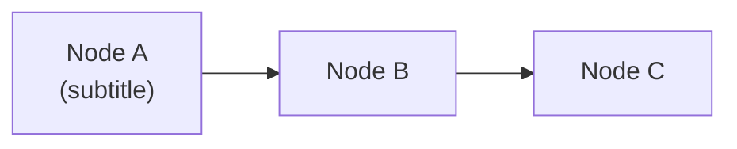

# Slidev Presentation Instructions

When creating or editing Slidev `.slidev.md` files in this repo, follow these conventions exactly.

## Theme Reference

Use the reusable GitHub dark theme at `themes/github/`. Set in frontmatter:

```yaml
---
theme: ../themes/github
title: "Your Title"
info: |
  Description of the presentation.
ghFooterTitle: "Footer Title"
ghFooterLabel: ""
drawings:
  persist: false
mermaid:
  theme: dark
transition: slide-left
mdc: true
layout: cover
---
```

## Available Layouts

| Layout | Purpose | Use For |
|--------|---------|---------|
| `cover` | Opening slide with logo + gradient | First slide only |
| `section` | Section divider with accent bar | Section transitions |
| `default` | Standard content with dot grid + glow | Most content slides |
| `center` | Centered content with radial glow | Single-concept or quote slides |
| `two-cols` | Two-column with gradient divider | Comparisons, side-by-side |
| `demo` | Demo transition with 🖥️ icon | Before live demos |
| `end` | Closing slide with dual glow orbs | Last 1-2 slides |

## Slide Density Classes

ALL content slides MUST have a density class to prevent scrolling. Slidev renders at 980×552px — content must fit in one page with NO scrolling.

| Class | When to Use |
|-------|-------------|
| `text-sm` | Most content slides (table + list, or code block + list) |
| `text-xs` | Very dense slides (table + code block + callout on same slide) |
| *(none)* | Only for slides with minimal content (≤3 short bullets) |

Set the class in the slide frontmatter:

```yaml
---
class: text-sm
---
```

## CSS Utility Classes for Content

### Callout Boxes (key insights, analogies)

```markdown
<div class="gh-callout gh-callout-blue">

**Bold label**: Description text here.

</div>
```

Colors: `gh-callout-blue` (default/info), `gh-callout-purple` (Copilot-related), `gh-callout-green` (success/positive)

### Glass Card Panels (decision frameworks, code examples)

```markdown
<div class="gh-box-accent">

Content inside a blue-accented glass card.

</div>
```

Variants: `gh-box` (neutral), `gh-box-accent` (blue), `gh-box-copilot` (purple), `gh-box-success` (green), `gh-box-attention` (yellow/warning)

### Stat Badges

```html
<div class="gh-stat">
  <span class="gh-stat-value">42%</span>
  <span class="gh-stat-label">Improvement</span>
</div>
```

### Inline Badges

```html
<span class="gh-badge gh-badge-blue">Preview</span>
```

Colors: `gh-badge-blue`, `gh-badge-green`, `gh-badge-purple`, `gh-badge-yellow`, `gh-badge-red`

## Slide Structure Conventions

- **Content slides**: `# Title` → `### Subtitle` → content (table, list, code) → optional callout div
- **Section dividers**: Use `layout: section` — content is just `# Section Title`
- **Demo slides**: Use `layout: demo` — `# 🖥️ LIVE DEMO` → `### Demo Title` → bullet list of what to show
- **Presenter notes**: Use HTML comments `<!-- notes here -->`
- **Progressive reveal**: Use `<v-clicks>` to reveal list items one at a time

## Tables

Tables automatically get glass-morphism treatment (rounded borders, gradient accent bar, alternating row shading). Use bold for emphasis in first column:

```markdown
| Feature | Description |
|---------|-------------|
| **Bold label** | Explanation text |
```

## Mermaid Diagrams

Use `mermaid` fenced code blocks with `{scale: 0.75}` to fit within the slide viewport. They automatically get glass container styling. Keep diagrams simple — 4-6 nodes max for readability at presentation scale.

**Line breaks in node labels**: Use `<br/>` — NOT `\n`. The `\n` escape renders as literal text in Slidev's mermaid.

```markdown

```

**Always include `{scale: 0.75}`** (or smaller like `0.65` / `0.6` for wide `graph LR` diagrams with 5+ nodes) — without it, mermaid diagrams render at full size and get cut off.

The mermaid glass container is set to `width: 100%` so it fills the slide width. The diagram itself is centered inside it.

## Key Rules

1. **No scrolling** — every slide must fit in the viewport. Use `text-sm` or `text-xs` class
2. **One concept per slide** — if content overflows, split into two slides
3. **Callouts at bottom** — place `gh-callout` divs as the last content element
4. **Blank lines around HTML divs** — Slidev needs blank lines before/after `<div>` blocks for markdown parsing
5. **Speaker notes in comments** — use `<!-- -->` not `> **Presenter Note**:` in the slidev file
6. **Cover slide uses layout: cover in frontmatter** — the first slide's layout is set in the document frontmatter, not in a slide separator

## Images

All slide images are stored centrally in `public/images/<workshop-folder-name>/`. Each subfolder contains an `images.yaml` manifest that maps images to slides.

### Manifest format

```yaml
- file: agent-harness.png
  slide: "What is an Agent Harness?"   # exact slide heading
  alt: "Agent harness architecture"
  width: 600
  position: right                      # right (two-cols), center, below
  section: "Agent Architecture"        # logical section (optional)
```

### Referencing images in slides

Use `` tags with absolute paths. Prefer a **two-column layout** with key takeaways on the left and the image on the right:

```markdown
---
layout: two-cols
class: text-sm
---

# Section Recap: Topic Name

::left::

### Key Takeaways

<v-clicks>

- **Point one** — brief explanation
- **Point two** — brief explanation

</v-clicks>

::right::

/image.png" width="420" alt="Description" />
```

For images that need the full slide width, use `layout: center` instead.

### Rules

- Use `` tags (not markdown ``) for `width` and `alt` control
- Always include `width` and `alt` attributes
- Keep images under 500 KB; prefer PNG for diagrams, SVG where possible
- Name files with kebab-case matching the concept shown
- Always update `images.yaml` when adding, renaming, or removing images
- Do **not** place images in per-workshop `assets/` directories

### How image resolution works

Slidev resolves `/images/...` from a `public/` directory relative to the `.slidev.md` file. Each workshop folder has a gitignored `public` symlink (junction on Windows) pointing to the repo-root `public/` directory. The build script creates these automatically. For local preview, create it manually:

```powershell
# Windows
New-Item -ItemType Junction -Path workshops\<folder>\public -Target (Resolve-Path public).Path

# Linux/macOS
ln -s ../../public workshops/<folder>/public
```
