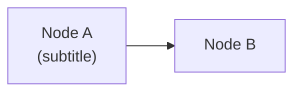

# Generate Slidev Presentation

Convert a workshop markdown file into a Slidev `.slidev.md` presentation using the GitHub dark theme at `themes/github/`.

## Input

The user will specify a workshop file (e.g., `workshops/ghe-governance/ghe-governance-workshop.md`). Read it fully before generating slides.

## Steps

1. **Read the workshop file** to understand all sections, timing, and content
2. **Read the scoped instructions** at `.github/instructions/slidev.instructions.md` for theme conventions
3. **Reference an existing deck** (e.g., `workshops/copilot-dev-foundations/copilot-dev-foundations.slidev.md`) as a structural example
4. **Generate the `.slidev.md` file** following the structure below

## Output Structure

Create a `<topic>.slidev.md` file alongside the workshop file with this structure:

### Frontmatter (first slide is always cover layout)

```yaml
---
theme: ../../themes/github
title: "Workshop Title"
info: |
  Workshop description from the source file.
ghFooterTitle: "Short Footer Title"
ghFooterLabel: ""
drawings:
  persist: false
mermaid:
  theme: dark
transition: slide-left
mdc: true
layout: cover
---
```

### Slide Sequence Pattern

1. **Cover** (layout in frontmatter) — Title + subtitle + tagline
2. **Agenda** (`text-sm` class) — "What We'll Cover Today" table from workshop
3. **Content slides** — One per workshop subsection
4. **Section dividers** (`layout: section`) — Before each major section
5. **Demo slides** (`layout: demo`) — After concept slides, before hands-on
6. **Wrap-up slides** — Key takeaways, action items, resources
7. **End slides** (`layout: end`) — Questions + Thank You

### Content Slide Rules

- Every content slide MUST have `class: text-sm` (or `text-xs` for very dense ones)
- Max content per slide: 1 table + 1 callout, OR 1 code block + 1 list, OR 1 table + 1 list
- If a workshop section has too much content, split across multiple slides
- Use `<div class="gh-callout gh-callout-blue">` for key insights
- Use `<div class="gh-box-accent">` for decision frameworks or code examples
- Use `<v-clicks>` for progressive reveal on important lists
- Add substantive `<!-- presenter notes -->` on every slide — 3-5 sentences of talk-track guidance derived from the workshop file's discussion points, key concepts, and examples. Notes should tell the presenter what to SAY, not repeat slide content. Include concrete examples, audience interaction prompts, safety moments, and transitions. No placeholder comments.

### Tables

Convert workshop tables directly. Bold the first column labels. Tables get automatic glass styling.

### Diagrams

Convert any text-based diagrams to Mermaid `graph LR` or `graph TD` format. Keep simple — max 6 nodes. **Always add `{scale: 0.75}`** to the mermaid fence to prevent cutoff (use `0.65` for wide `graph LR` with 5+ nodes). Use `<br/>` for line breaks in node labels — never `\n`:

````markdown

````

## Quality Checklist

- [ ] Every slide fits in viewport (no scrolling) — use density classes
- [ ] Section dividers before each major topic
- [ ] Demo slides after concept sections
- [ ] Speaker notes on every content slide (substantive talk-track, not placeholders)
- [ ] Frontmatter has correct theme path (`../../themes/github`)
- [ ] Blank lines around all HTML div blocks
- [ ] No bare URLs in tables (use angle brackets)
