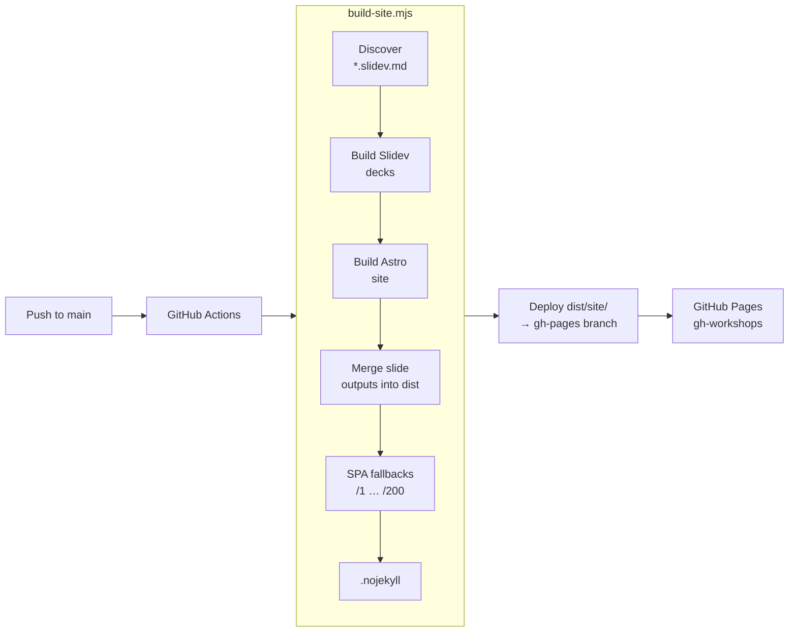

# GH-Hack — GitHub Workshop Content Repo

A **content-only** repository of GitHub workshop/training materials for enterprise customers. Each workshop is a set of Markdown files — paired slide decks (Slidev) and presenter guides — with an optional hands-on lab. The repository includes an Astro static site that serves as a landing page on GitHub Pages with links to all available slide decks and labs.

## Repository Structure

```
workshops/                 # All workshop content lives here
  <topic>/                 # One folder per workshop topic
    *-workshop.md          # Presenter guide (source of truth)
    *.slidev.md            # Slidev slide deck (must stay in sync with workshop)
    *-LAB.md               # Hands-on lab (optional)
    *-demo-scripts.md      # Demo scripts (optional)
    *-slides.md            # DEPRECATED legacy slides — do not create new ones
site/                      # Astro static site (landing page + lab renderer)
  pages/index.astro        # Landing page — auto-discovers workshops
  pages/[workshop]/lab.astro # Renders *-LAB.md files as HTML pages
  layouts/Base.astro       # Shared layout (dark theme, sticky header)
  astro.config.mjs         # Astro config (base path = /GH-Hack/)
themes/github/             # Reusable Slidev theme (GitHub dark style)
scripts/build-site.mjs     # Full build orchestrator (Slidev → Astro → combine)
.github/
  workflows/pages.yml      # GitHub Actions: build & deploy to GitHub Pages
  copilot-instructions.md  # Copilot context for AI-assisted editing
  instructions/            # Auto-loading instruction files for Copilot
```

## Prerequisites

- **Node.js 20+** and **npm**
- Install dependencies once:

```bash
npm install
```

## Quick Reference — npm Scripts

| Command | What It Does |
|---------|--------------|
| `npm run dev:copilot` | Slidev dev server for the Copilot workshop deck |
| `npm run dev:site` | Astro dev server for the landing page |
| `npm run build:all` | Full production build (all decks + Astro site) |

---

## Creating a New Workshop

### 1. Create the Workshop Folder

Create a new folder under `workshops/` with a kebab-case name:

```
workshops/my-new-topic/
```

### 2. Create the Workshop Guide

Create `workshops/my-new-topic/my-new-topic-workshop.md`. This is the **source of truth** for all content. Follow this structure:

```markdown
# My New Topic Workshop

**Duration**: ~3 hours
**Format**: Presentation + Live Demo
**Audience**: Enterprise admins, engineering managers

---

## Workshop Overview

Brief description of what the workshop covers.

### Learning Objectives

- Objective 1
- Objective 2

## 1. First Section (30 min)

### Key Points

- Point 1
- Point 2

### 🖥️ Demo: Demo Title

Demo steps here.

### Discussion Points

- Question 1?
- Question 2?

## 2. Second Section (25 min)

...

## Appendix

Additional resources, key URLs, checklists.

*Workshop guide for My New Topic Workshop*
```

### 3. Create the Slidev Deck

Create `workshops/my-new-topic/my-new-topic.slidev.md`. Reference the shared theme and follow the slide conventions:

```yaml
---
theme: ../../themes/github
title: "My New Topic"
info: |
  Description of the presentation.
ghFooterTitle: "My New Topic"
ghFooterLabel: ""
drawings:
  persist: false
mermaid:
  theme: dark
transition: slide-left
mdc: true
layout: cover
---
```

See [.github/instructions/slidev.instructions.md](.github/instructions/slidev.instructions.md) for the full Slidev authoring guide (layouts, density classes, CSS utilities, mermaid diagrams).

**Key rules for slides:**

- Slides render at **980×552px** — content must fit with **no scrolling**
- Use `class: text-sm` or `text-xs` on content-heavy slides
- Use `<!-- notes -->` for speaker notes (not `> **Presenter Note**:`)
- Separate slides with `---`
- Add `<!-- markdownlint-disable -->` at the top (Slidev syntax conflicts with linting)

### 4. Create a Lab File (Optional)

If the workshop has a hands-on component, create `workshops/my-new-topic/my-new-topic-LAB.md`. The filename **must** end with `-LAB.md` (case-sensitive) for the Astro site to detect and render it.

### 5. Register in the Landing Page

Open [site/pages/index.astro](site/pages/index.astro) and add an entry to the `workshopMeta` object:

```typescript
'my-new-topic': {
  label: 'My New Topic',
  desc: 'One-line description of this workshop.',
  icon: '📘'   // emoji or inline SVG
},
```

The landing page **auto-discovers** workshop folders — it scans `workshops/` for folders containing a `.slidev.md` or `-LAB.md` file. The `workshopMeta` entry provides the display label, description, and icon. Without it the workshop still appears, but with an auto-generated label from the folder name.

---

## Previewing Locally

### Preview a Single Slidev Deck

```bash
npx slidev workshops/my-new-topic/my-new-topic.slidev.md
```

This starts a hot-reloading dev server (default `http://localhost:3030`). Changes to the `.slidev.md` file reflect instantly.

### Preview the Astro Landing Page

```bash
npm run dev:site
```

> **Note**: The Astro dev server handles the base path automatically, so links work at `http://localhost:4321/GH-Hack/`. Lab pages render from the `-LAB.md` files. Slide deck links won't work in dev mode since they require the full build.

### Full Build + Local Preview

```bash
node scripts/build-site.mjs
```

This builds all Slidev decks, Astro site, and combines them into `dist/site/`. To preview, you need to serve with the correct base path:

```powershell
# Create a junction so /GH-Hack/ resolves correctly
New-Item -ItemType Junction -Path dist\local-preview\GH-Hack -Target (Resolve-Path dist\site).Path -Force

# Serve from the wrapper directory
npx http-server dist/local-preview -p 4201 -c-1 --cors -s
```

Then open `http://localhost:4201/GH-Hack/`.

> **Important**: Do **not** change the Astro `base` path to `/` for local testing — it will break the GitHub Pages deployment.

---

## Publishing to GitHub Pages

### Automatic (Recommended)

Push to the `main` branch. The GitHub Actions workflow at [.github/workflows/pages.yml](.github/workflows/pages.yml) automatically:

1. Installs dependencies (`npm ci`)
2. Runs `node scripts/build-site.mjs`
3. Deploys `dist/site/` to the `gh-pages` branch of the `thomasiverson/gh-workshops` external repo

The workflow triggers on pushes that touch `workshops/`, `site/`, `themes/`, `scripts/`, or `package.json`. You can also trigger it manually via `workflow_dispatch`.

### Manual

```bash
node scripts/build-site.mjs
```

Then deploy the contents of `dist/site/` to your hosting target.

---

## How the Build Works

The build script (`scripts/build-site.mjs`) performs these steps:

1. **Discover** — Recursively finds all `*.slidev.md` files under `workshops/`
2. **Build Slidev** — Builds each deck into `dist/<workshop-name>/slides/` with the correct base path
3. **Build Astro** — Builds the landing page and lab pages into `dist/site/`
4. **Merge** — Copies Slidev build outputs into the Astro dist directory
5. **SPA Fallbacks** — Creates `index.html` copies for slide routes `/1` through `/200` (GitHub Pages doesn't support SPA routing)
6. **Marker** — Writes `.nojekyll` to prevent GitHub Pages from processing with Jekyll



---

## Content Conventions

### File Pairing

Every workshop has a **paired set**: the workshop guide (`*-workshop.md`) is the source of truth, and the Slidev deck (`*.slidev.md`) must stay aligned. When editing one, always check the other for consistency — especially:

- Agenda tables (section names, timing, order)
- Pros/Cons/Requirements tables
- Architecture diagrams
- Feature comparison matrices

### Markdown Rules

- No GitHub-flavored admonitions (`[!NOTE]`) — use `> **Note**:` instead
- Fenced code blocks (triple backtick) for all code/commands — never indented blocks
- Blank lines before/after fenced code blocks and lists
- No bare URLs in tables — use `<https://...>` or `[text](url)`
- Run `markdownlint` to check — config is in `.markdownlint.json`

### Slide Theme

All decks use the shared theme at `themes/github/` which provides seven layouts: `cover`, `section`, `default`, `center`, `two-cols`, `demo`, `end`. See the [theme README](themes/github/README.md) for details.

---

## Checklist: Adding a Workshop End-to-End

- [ ] Create `workshops/<topic>/` folder
- [ ] Write `<topic>-workshop.md` (presenter guide)
- [ ] Write `<topic>.slidev.md` (slide deck referencing `../../themes/github`)
- [ ] (Optional) Write `<topic>-LAB.md` (hands-on lab)
- [ ] Add entry to `workshopMeta` in `site/pages/index.astro`
- [ ] Preview deck locally: `npx slidev workshops/<topic>/<topic>.slidev.md`
- [ ] Run full build: `node scripts/build-site.mjs`
- [ ] Push to `main` — workflow deploys automatically
