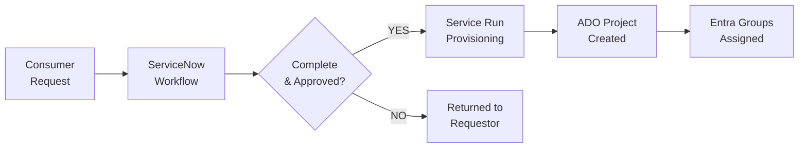
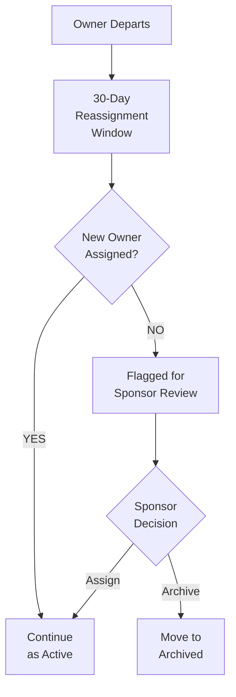
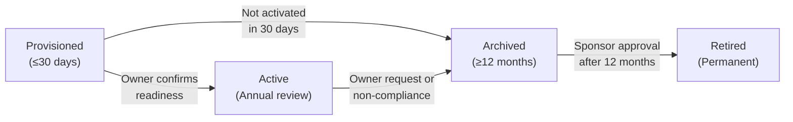

<!-- markdownlint-disable -->

# Azure DevOps Governance

## Establishing ADO as a Curated Managed Service

*Stabilisation · Repeatability · Controls Forward*

<!--
Welcome everyone. This workshop formalises Azure DevOps as a managed service for the BU. We're not doing an enterprise transformation — we're putting controls in place from this point forward so that all new projects follow a consistent, governed model. Existing projects are excluded from mandatory remediation.
-->

---
class: text-sm
---

# What We'll Cover Today

| Time | Topic |
|------|-------|
| 10 min | Opening & Programme Context |
| 15 min | Current State Assessment & Baselining |
| 20 min | Operating Model & Governance Principles |
| 20 min | Role & Permission Framework |
| 10 min | ☕ Break |
| 25 min | Project Provisioning & ServiceNow Integration |
| 15 min | Access Management & Guardrails |
| 15 min | Container & Pipeline Standards |
| 20 min | Project Lifecycle Model |
| 15 min | Chargeback & Consumer Adoption |
| 15 min | Delivery Timeline, Risk & Next Steps |

**Format**: Concepts → Discussion → Agreement (repeat)

<!--
Three hours total — we'll move between presentation, discussion, and working sessions. The goal is to leave this room with alignment on the operating model and a clear plan for Phase 1.
-->

---
layout: section
---

# Opening & Programme Context

---
class: text-sm
---

# Why We're Here

### ADO Has Grown Organically — Now It Needs Governance

<v-clicks>

- Single ADO organisation supporting engineering analytics and development
- Usage grew without formalisation — no consistent ownership, access, or lifecycle model
- This initiative establishes ADO as a **curated managed service**
- **Not** an enterprise transformation — a stabilisation and repeatability programme
- Controls apply **forward only** — new projects from the point of adoption

</v-clicks>

**Key principle**: Governance forward, not retroactive. New projects comply from day one. Existing projects are not disrupted.

<!--
This isn't about disrupting what's working today. It's about making sure everything we create from now on follows a consistent, governed model. Existing projects can voluntarily align, but there's no mandatory brownfield remediation.
-->

---
class: text-sm
---

# Programme Sponsorship

| Role | Name | Accountability |
|------|------|----------------|
| **Sponsor / ADO Org Owner** | Jonathan Lewis | Governance authority, escalation |
| **IT Design – Service Run** | Daniel Walter | Day-to-day operations, provisioning |
| **Enterprise DevOps – Advisory** | Erick Shieve | Technical standards (non-blocking) |
| **Project Manager** | Roberta Solari | Delivery coordination, risk tracking |
| **Microsoft Advisory** | TBC – Week 4 | Platform guidance, ACR validation |
| **ServiceNow Developer** | Sophia Strickler | SNOW automation, AD Group + ADO REST |

**Advisory is non-blocking**: Input will be sought and documented, but does not carry veto authority. Where advisory conflicts with Service Run, the Sponsor resolves.

<!--
Note the advisory role is explicitly non-blocking. This avoids governance deadlocks. The Sponsor is the final decision authority for any conflicts.
-->

---
class: text-sm
---

# Programme Objectives

| # | Objective | Owner |
|---|-----------|-------|
| 1 | Establish a defined ADO operating model for the BU | Sponsor + Service Run |
| 2 | Implement curated provisioning via ServiceNow | SNOW Dev + PM |
| 3 | Enforce 100% group-based access for new projects | Service Run |
| 4 | Define and implement role & permission baseline | PM + Service Run + Advisory |
| 5 | Standardise container build pipelines to approved ACRs | PM + Service Run + Advisory |
| 6 | Implement lifecycle model with retention & enforcement | PM + Service Run + Advisory |
| 7 | Achieve provisioning within 1 business day | SNOW Dev + Service Run + PM |
| 8 | Define and publish chargeback model | Sponsor + PM |

<!--
Eight objectives — all measurable. We'll define success criteria for each and track them against the baseline we capture in Week 1. Every objective has a named owner.
-->

---
layout: section
---

# Current State Assessment & Baselining

---
class: text-sm
---

# Baseline Metrics

### Capture These in Week 1 — They Define Our Starting Point

| Metric | Current | Target |
|--------|:-------:|--------|
| Average provisioning time (days) | *TBD* | < 1 business day |
| Projects with no owner or single owner | *TBD* | 0 (new projects) |
| % direct user vs group-based access | *TBD* | 100% group-based |
| Service connections without governance | *TBD* | 0 (new projects) |
| Projects without defined lifecycle state | *TBD* | 0 (new projects) |

**Baseline ownership**: Service Run Team captures data. Sponsor reviews at Month 1.

<!--
We can't measure success without knowing where we start. These five metrics will be populated in Week 1 using live ADO data. They become our programme baseline.
-->

---
layout: section
---

# Operating Model & Governance Principles

---
class: text-sm
---

# What's In Scope — Phase 1

<v-clicks>

- Role and permission model definition
- Guardrail definition (2-owner rule, group-only access, owner departure handling)
- Manual provisioning SOP and supporting runbook
- ServiceNow workflow design and integration
- Automation via ADO APIs
- Standard container build template
- Approved ACR targeting model (federated)
- Lifecycle state definition with retention periods
- Annual access and ownership review process
- Chargeback model design and approval
- Consumer onboarding communication plan

</v-clicks>

<!--
This is comprehensive but deliberately scoped to what can be delivered in six months. Every item has a named owner and a target phase for delivery.
-->

---
class: text-sm
---

# What's Out of Scope — Phase 1

<v-clicks>

- ❌ Brownfield remediation of existing projects
- ❌ Enterprise GitHub migration
- ❌ Enterprise DevOps transformation
- ❌ ACR or Key Vault consolidation
- ❌ Advanced compliance certification implementation
- ❌ Infrastructure-as-Code platform design

</v-clicks>

**Brownfield boundary**: Existing projects are not required to adopt the new model. Voluntary alignment is supported via a lightweight path. Service Run maintains a register of aligned legacy projects.

<!--
We're deliberately not expanding scope. Brownfield projects can voluntarily align — for example, migrating to group-based access without full reprovisioning — but it's not tracked as a programme deliverable.
-->

---
class: text-sm
---

# Operating Principles

| Principle | In Practice |
|-----------|-------------|
| **Governance forward** | New projects comply from day one. Existing not disrupted. |
| **Definition before automation** | SOPs agreed before any workflow is automated. |
| **Simplicity** | Minimum viable governance, not complex models. |
| **Least privilege** | Project creation is gated. No self-service in Phase 1. |
| **Decisions time-bound** | Named owner + resolution date. All decisions logged. |
| **Escalation defined** | Stalled >5 business days → Sponsor. PM triggers. |

**"Definition before automation"** ensures we don't automate a broken process. Manual SOPs first, then ServiceNow workflow, then ADO API automation.

<!--
These six principles govern every decision in the programme. The most critical one for phase 1 is "definition before automation" — we need the SOP to be right before we automate it.
-->

---
layout: section
---

# Role & Permission Framework

---
class: text-sm
---

# Organisation-Level Roles

| Role | Responsibilities |
|------|------------------|
| **Org Owner** | Governance and structural decisions. Emergency access only. |
| **Platform Administrators** | Provisioning, service connections, automation, guardrails, annual reviews. |

### Project-Level Requirements (at creation)

<v-clicks>

- ✅ Minimum **2 named Project Owners** (≥1 BU FTE)
- ✅ **Project Admin Group** (Entra security group)
- ✅ **Contributors Group** (Entra security group)
- ✅ **Readers Group** (Entra security group)
- ✅ **Declared lifecycle state** (defaults to Provisioned)

</v-clicks>

<!--
Every new project gets these five things at the point of creation — no exceptions. The two-owner rule prevents single points of failure. All access goes through Entra security groups — no direct user assignments.
-->

---
class: text-xs
---

# Decision Rights — RACI Matrix

| Decision / Activity | Sponsor | Service Run | Advisory | PM |
|---------------------|:-------:|:-----------:|:--------:|:--:|
| Approve new project provisioning | A | R | I | I |
| Reject provisioning request | A | R | C | I |
| Define role & permission baseline | A | R | C | I |
| Approve standard pipeline template | A | R | C | I |
| Approve chargeback model | A/R | C | I | C |
| Trigger annual access review | A | R | I | I |
| Enforce review non-compliance (archive) | A | R | I | I |
| Retire a project (delete) | A | R | I | I |
| Resolve stalled/conflicting decisions | A/R | C | C | I |
| Escalate stalled decisions (>5 days) | I | C | I | R |

**R** = Responsible · **A** = Accountable · **C** = Consulted · **I** = Informed

<!--
This matrix defines who does what. Note the last row — the PM is responsible for escalating stalled decisions. This prevents things from getting stuck. The Sponsor is accountable for all governance decisions.
-->

---

# ☕ Break — 10 Minutes

---
layout: section
---

# Project Provisioning & ServiceNow Integration

---
class: text-sm
---

# Provisioning Workflow

**Target SLA**: < 1 business day from complete, approved request

**Key message to consumers**: Incomplete submissions will be returned, not held. Complete requests get provisioned within one business day.

<!--
This is the target state. In Phase 1, provisioning is manual via SOP. Phase 2 adds the ServiceNow workflow. Phase 3 adds ADO API automation. The SLA applies from Phase 2 onwards but we aim to meet it during manual operations as well.
-->

---
class: text-sm
---

# ServiceNow Request Fields

| Field | Required | Description |
|-------|:--------:|-------------|
| Project Name | ✓ | Descriptive name, naming convention |
| Business Justification | ✓ | Why this project is needed |
| Primary Owner (FTE) | ✓ | Must be a BU full-time employee |
| Secondary Owner | ✓ | Backup owner (2-owner rule) |
| Cost Centre | ✓ | BU cost centre for chargeback |
| Requested Services | ✓ | Repos, Pipelines, Boards, Artifacts, Test Plans |
| Initial Contributors | ✗ | Team members for Contributors group |

<!--
Six required fields, one optional. The cost centre field is critical for chargeback attribution when the model goes live. The two-owner requirement is enforced at the form level — you can't submit without both owners.
-->

---
class: text-sm
---

# Phased Automation Approach

| Phase | Weeks | Approach |
|-------|-------|----------|
| **Phase 1** | 1–10 | **Manual SOP** — provisioning via documented runbook |
| **Phase 2** | 11–14 | **ServiceNow Workflow** — form, approval routing, tracking |
| **Phase 3** | 15–24 | **ADO API Automation** — full end-to-end automation |

### Manual SOP Steps (Phase 1)

<v-clicks>

1. Receive approved ServiceNow request
2. Validate completeness (all required fields)
3. Create Entra security groups (Admin, Contributors, Readers)
4. Create ADO project with standard settings
5. Assign Entra groups to project permissions
6. Assign named owners to Project Admin group
7. Set lifecycle state to "Provisioned"
8. Confirm completion in ServiceNow
9. Notify requestor

</v-clicks>

<!--
The manual SOP is step one. We get this right and documented, then we automate it. This follows our "definition before automation" principle.
-->

---
layout: section
---

# Access Management & Guardrails

---
class: text-sm
---

# Group-Based Access Model

| Level | Entra Group | Permissions |
|-------|-------------|-------------|
| **Project Admin** | `ADO-[ProjectName]-Admins` | Full project administration |
| **Contributors** | `ADO-[ProjectName]-Contributors` | Code, work items, pipelines, builds |
| **Readers** | `ADO-[ProjectName]-Readers` | Read-only access |

### Guardrails

| Guardrail | Enforcement |
|-----------|-------------|
| **No direct user assignment** | Audit at provisioning + annual review |
| **Two-owner requirement** | Provisioning validation (cannot submit without) |
| **Service connection governance** | Platform Admin process only |
| **Owner departure** | 30-day reassignment window → Sponsor review |
| **Annual review non-compliance** | Auto-archive after 30 days of notification |

<!--
Group-based access is non-negotiable for new projects. No individual user assignments at the project level. If an owner departs, there's a 30-day window to assign a replacement. After 30 days, it goes to the Sponsor for review.
-->

---
class: text-sm
---

# Owner Departure Handling

**Two-owner rule exists for this reason**: When one owner departs, the second owner remains accountable while reassignment is resolved.

<!--
The two-owner rule isn't bureaucracy — it's risk management. When one owner leaves, the project doesn't become orphaned. There's always someone accountable.
-->

---
layout: section
---

# Container & Pipeline Standards

---
class: text-sm
---

# Phase 1 — Federated ACR Model

| Requirement | Detail |
|-------------|--------|
| **Standard template** | Container build template maintained by Service Run |
| **ACR targeting** | Builds push to platform-approved named ACRs only |
| **Version tagging** | Mandatory on all image builds |
| **Secret management** | No secrets in YAML — Key Vault integration required |
| **Service connections** | Governed centrally by Platform Admins |

**Dependency**: Pipeline template should be validated against Microsoft Advisory guidance before Phase 2. If advisory seat remains unfilled by Week 8, template proceeds with Service Run + Enterprise DevOps review.

<!--
The federated ACR model means each team pushes to platform-approved ACRs. Future direction may include ACR consolidation, but that's explicitly out of scope for Phase 1. Secrets must never be stored in pipeline YAML — Key Vault integration is required.
-->

---
layout: section
---

# Project Lifecycle Model

---
class: text-sm
---

# Four-State Lifecycle

| State | Definition | Retention |
|-------|------------|-----------|
| **Provisioned** | Created, owners assigned, pipelines not enabled | Up to 30 days |
| **Active** | Fully operational, subject to annual review | No maximum |
| **Archived** | Read-only, pipelines disabled, retained for audit | Min 12 months |
| **Retired** | Permanently deleted, logged in permanent register | Irreversible |

<!--
Four states, clear transitions. The key control point is the annual review — every Active project must confirm ownership and access group membership yearly. Non-compliance leads to automatic archiving after 30 days.
-->

---
class: text-sm
---

# Annual Review Process

### Mandatory for All Active Projects

<v-clicks>

1. **Confirm ownership** — are both named owners still appropriate and active?
2. **Review access groups** — is Contributors/Readers membership current?
3. **Lifecycle decision** — remain Active, Archive, or schedule for Retirement?

</v-clicks>

### Non-Compliance Enforcement

| Day | Action |
|-----|--------|
| **0** | Annual review notification sent to owners |
| **14** | Reminder sent if review not completed |
| **30** | Auto-archived by Service Run |
| **Post** | Reactivation requires review completion + Sponsor approval |

**The annual review is not optional.** It's the enforcement mechanism that prevents orphaned projects and permission drift.

<!--
The annual review is the backbone of the lifecycle model. Three questions — are the owners right, is the access right, should this project continue. If teams don't respond within 30 days, the project gets archived automatically. It can be reactivated, but not without completing the review.
-->

---
layout: section
---

# Chargeback & Consumer Adoption

---
class: text-sm
---

# Chargeback Model Design

| Element | Detail |
|---------|--------|
| **Model type** | TBD: flat · consumption-based · hybrid |
| **Data source** | ADO usage reporting + Azure billing |
| **Allocation** | BU cost centre via ServiceNow metadata |
| **Finance engagement** | Required by Month 3 |
| **Approval target** | Sponsor approval before Month 5 |
| **Interim** | ADO usage charged to IT Design cost centre |

**Risk**: If Finance engagement delays beyond Month 3, chargeback slips to Phase 2. Acceptable fallback — but must be flagged to Sponsor.

<!--
We're not trying to implement chargeback immediately. The first five months are about getting the provisioning model right and gathering baseline consumption data. The chargeback model is designed in parallel and goes operational once the processes stabilise.
-->

---
class: text-sm
---

# Consumer Communication Plan

| When | Message | Channel | Owner |
|------|---------|---------|-------|
| **Week 6** | Heads-up: new model coming | Email + Team | Sponsor / PM |
| **Week 10** | How-to guide via ServiceNow KB | ServiceNow KB | Service Run |
| **Week 15** | Go-live. Old process closed. | Email + Team | Sponsor |
| **Ongoing** | FAQ + feedback channel | ServiceNow | Service Run |

**Key consumer message**: Requests fulfilled within **1 business day** of complete, approved submission. Incomplete submissions returned, not held.

<!--
Adoption risk is real — we're taking away ad-hoc project creation and replacing it with a ServiceNow-gated process. The communication plan is structured to give teams advance warning, clear instructions, and a feedback channel. The one-business-day SLA is the carrot.
-->

---
layout: section
---

# Delivery Timeline, Risk & Next Steps

---
class: text-sm
---

# Three-Phase Delivery

| Phase | Weeks | Focus |
|-------|-------|-------|
| **Define** | 1–10 | Baseline, role model, guardrails, SOP, lifecycle, comms plan |
| **Implement** | 11–14 | Role model, ServiceNow workflow, pipeline template, ACR model |
| **Automate & Activate** | 15–24 | ADO API automation, lifecycle mechanism, go-live, chargeback |

### Sponsor Sign-Off Milestones

| Milestone | Target |
|-----------|--------|
| Role model approval | Week 10 |
| Chargeback model approval | Month 5 |
| Programme close → BAU | Month 6 |

<!--
Three phases, six months. Define first, implement second, automate third. Three milestones require Sponsor sign-off — these are the hard checkpoints that keep the programme on track.
-->

---
class: text-xs
---

# Risk Register

| Risk | L | I | Mitigation |
|------|:-:|:-:|------------|
| SNOW dev capacity — Sophia LDP rolloff | M | H | Timeline met + automation defined with lead time |
| Microsoft Advisory unfilled — pipeline decisions lack validation | M | M | Fill by Week 4 or Sponsor escalation |
| Enterprise DevOps advisory creates competing standards | L | M | Advisory non-blocking. Sponsor resolves conflicts. |
| Service Run single-person dependency | M | H | Confirm team composition Week 1. IT Design backup. |
| Brownfield demand before new model live | M | L | Scope boundary communicated. Voluntary alignment only. |
| Adoption resistance to SNOW-gated provisioning | L | M | Communication plan + clear SLA + feedback channel |

**L** = Likelihood · **I** = Impact · **L**ow · **M**edium · **H**igh

<!--
Six identified risks. The two highest impact risks are both Medium likelihood: Sophia's capacity and Daniel being a single point of failure. Both have concrete mitigations that need to be actioned in Week 1.
-->

---
class: text-xs
---

# Success Criteria

All measured against Week 1 baseline.

| Criterion | Target | Measured By |
|-----------|--------|-------------|
| New projects via defined workflow | 100% by Month 4 | Service Run |
| Provisioning time | < 1 business day | ServiceNow data |
| Group-based access control | 100% (new projects) | ADO audit |
| Two-owner rule enforced | 100% (new projects) | Provisioning log |
| Standard container pipeline adopted | All new projects in scope | Service Run |
| Lifecycle review mechanism | Operational by Month 6 | Service Run |
| Chargeback model defined | Approved by Month 5 | PM |
| Consumer communication | Go-live by Week 15 | PM |

<!--
Eight success criteria — all measurable, all with a named measurement owner. These are how we demonstrate programme value at Month 6. The baseline from Week 1 gives us the "before" picture.
-->

---
layout: end
---

# Next Steps

### Immediate Actions

1. **Capture baseline metrics** (Week 1 — Service Run)
2. **Confirm team composition** and backup for Service Run (Week 1)
3. **Fill Microsoft Advisory seat** (target: Week 4)
4. **Define Entra group naming conventions** (Week 2)
5. **Draft manual provisioning SOP** (Weeks 2–4)

**Programme starts now.** Definition before automation. Governance forward, not retroactive.

<!--
Five immediate actions — all owned, all time-bound. The programme starts with baseline capture and team confirmation. Everything else builds from there. Thank you all for your time and engagement today.
-->
