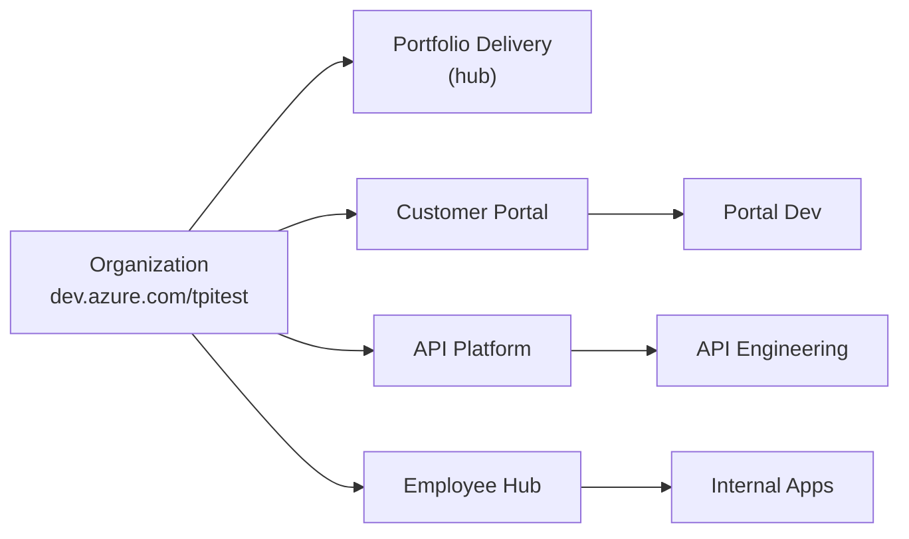
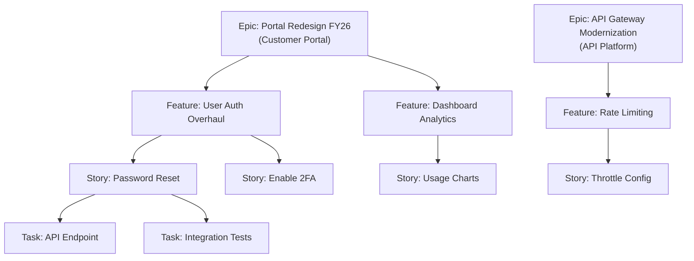
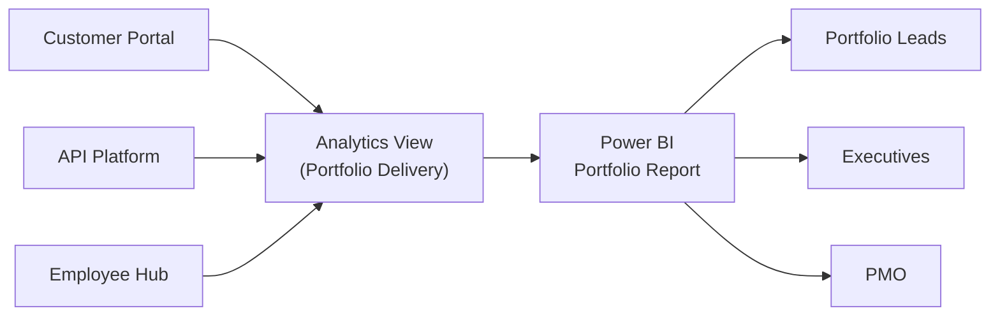
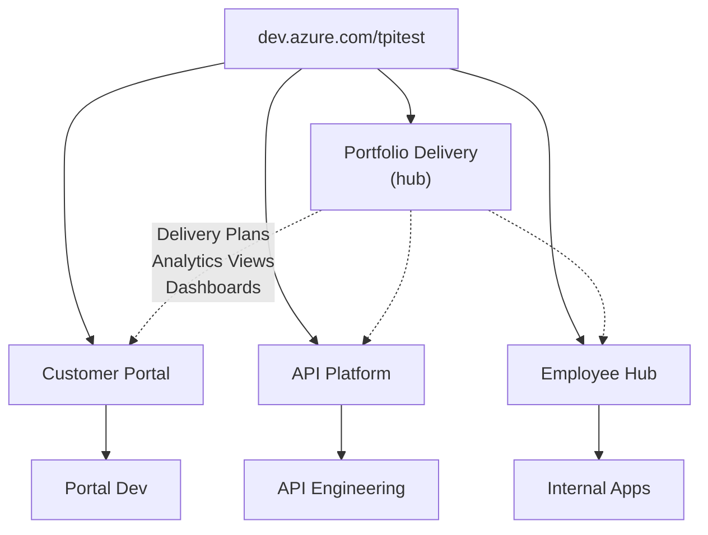

<!-- markdownlint-disable -->

# Azure DevOps Work Management

### Portfolio, Project & Team Delivery — Multi-Project Architecture

<!-- notes
Welcome everyone. Today we'll walk through how Azure DevOps can give you a unified view from
portfolio-level business initiatives all the way down to individual team tasks. We'll use a
live three-project demo environment, show Power BI analytics, Planner integration, UAT management,
and map your existing Jira workflows to ADO.
-->

---
class: text-sm
---

# Agenda

| Time | Topic |
|---|---|
| 10 min | Welcome & Discovery |
| 12 min | ADO Work Management Foundations |
| 18 min | Portfolio, Project & Team Hierarchy |
| 8 min | Delivery Plans & Dashboards |
| 10 min | ☕ Break |
| 15 min | Power BI & Analytics Views |
| 12 min | Microsoft Planner Integration |
| 12 min | Managing UAT in Azure DevOps |
| 8 min | Jira Comparison & Integration Patterns |
| 5 min | Q&A & Next Steps |

<!-- notes
We have just under 2 hours. We'll do live demos in ADO for each major section.
I'll pause for questions throughout — especially if you have "we do this in Jira" questions.
-->

---
layout: section
---

# Welcome & Discovery

---
class: text-sm
---

# What We'll Cover Today

Your team asked to see:

- **Portfolio delivery** — cross-project roadmap, business milestones, executive visibility
- **Project delivery** — backlog management, progress tracking, release planning
- **Team workflow** — sprint boards, kanban, daily task management
- **Power BI analytics** — cross-project portfolio reporting via Analytics Views
- **Microsoft Planner integration** — syncing business tasks with engineering delivery
- **UAT management** — business users running acceptance tests inside ADO
- **Jira mapping** — "we do this in Jira, how does it work in ADO?"

<div class="gh-callout gh-callout-blue">

**Goal**: Leave today with a concrete recommendation for structuring ADO with multi-project portfolios.

</div>

<!-- notes
Let's validate these goals. Are there other specific areas you'd like to dive into?
Take a minute for introductions — name, role, and what you're most hoping to get out of today.
-->

---
layout: section
---

# ADO Work Management Foundations

---
class: text-sm
---

# Multi-Project Architecture



- **Portfolio Delivery** — hub for Delivery Plans, Analytics Views, dashboards, wiki
- **Team Projects** — separate workspaces per delivery stream (repos, boards, pipelines)
- **Teams** — each with their own board, backlog, and sprint cadence

<div class="gh-callout gh-callout-blue">

**4 projects**: Portfolio Delivery (hub) + Customer Portal + API Platform = Digital Products · Employee Hub = Internal Ops

</div>

<!-- notes
This is the fundamental building block. One org, three projects for three delivery streams.
Portfolio grouping happens via Delivery Plans and Power BI — not a native ADO construct.
All projects use the Agile process template for consistency.
-->

---
class: text-sm
---

# Single Project vs. Multiple Projects

| Factor | Single Project | Multiple Projects |
|---|---|---|
| **Cross-team visibility** | Easy — shared backlog | Delivery Plans + Power BI |
| **Access control** | Area Path permissions | Project-level isolation |
| **Repos & pipelines** | Shared | Separated per project |
| **Portfolio rollup** | Backlog levels | Power BI Analytics Views |
| **Scalability** | Can get cluttered at scale | Cleaner separation |
| **Best for** | One product / department | Multiple business units |

<div class="gh-callout gh-callout-green">

**Recommendation**: Multiple projects — one per delivery stream — with cross-project Delivery Plans and Power BI for portfolio rollup.

</div>

<!-- notes
We chose multiple projects because the customer has distinct delivery streams that need
strong boundaries. The tradeoff: portfolio rollup requires Delivery Plans and Power BI
instead of just looking at one backlog. We'll show both in the demos.
-->

---
class: text-sm
---

# Process Templates

| Process | Best For | Hierarchy |
|---|---|---|
| **Basic** | Simple tracking | Epic → Issue → Task |
| **Agile** | Most software teams | Epic → Feature → User Story → Task |
| **Scrum** | Sprint-based delivery | Epic → Feature → PBI → Task |
| **CMMI** | Regulated environments | Epic → Feature → Requirement → Task |

- All three demo projects use **Agile** — required for cross-project Delivery Plans
- **Inherited processes** let you customize without forking the base template
- Consistent iteration naming across projects enables timeline alignment

<!-- notes
Agile and Scrum are the most popular. The main difference is terminology.
The critical point: all projects must use the same process template for cross-project
Delivery Plans to work. We recommend Agile for this customer.
-->

---
class: text-sm
---

# RAID Log via Custom Work Item Types

ADO has no built-in RAID log — but inherited processes let you create one natively.

| RAID Category | Custom WIT | Key Fields | Workflow |
|---|---|---|---|
| **Risks** | Risk | Likelihood, Impact, Mitigation Plan | Identified → Mitigating → Closed |
| **Assumptions** | Assumption | Confidence, Validation Method | Stated → Validating → Confirmed |
| **Issues** | Issue | Severity, Resolution Plan | Open → Investigating → Resolved |
| **Decisions** | Decision | Rationale, Decided By, Date | Proposed → Under Review → Approved |
| **Dependencies** | *(built-in links)* | Predecessor/Successor link type | Visible on Delivery Plans |

**Why custom WITs work better than tags or wiki tables:**

- Board columns with drag-and-drop workflow (Identified → Mitigating → Closed)
- Queries, dashboards, and Power BI — "Open Risks by Impact" chart alongside Epics
- Link Risks/Decisions to the Epic/Feature they impact for end-to-end traceability

<!-- notes
Note that we use RAID with D=Decisions here, not Dependencies. Dependencies are handled
by the built-in Predecessor/Successor link type which renders on Delivery Plans.
Each RAID category becomes a first-class work item with its own board, workflow, and reporting.
-->

---
layout: demo
---

# 🖥️ LIVE DEMO

### Multi-Project Structure Walkthrough

- `dev.azure.com/tpitest/` — three team projects
- Project Settings → Teams, Area Paths, Iteration Paths
- Consistent iterations across all projects
- Agile process template and work item hierarchy

<!-- notes
Demo 1: Walk through the three projects. Show Project Settings in Customer Portal — teams,
area paths, iteration paths. Quick switch to API Platform to show consistent iterations.
Emphasize that consistency across projects is the key to cross-project views.
-->

---
layout: section
---

# Portfolio, Project & Team Hierarchy

---
class: text-sm
---

# Work Item Hierarchy Across Projects



- **Parent-child linking** rolls up effort and completion automatically
- Each project owns its own backlog — teams see only their work
- Cross-project visibility comes from Delivery Plans and Power BI

<!-- notes
This is the core hierarchy. Each project has Epics as the top-level portfolio items.
Features are project deliverables. Stories are team work. Tasks break down the effort.
Rollup works within a project; Delivery Plans bridge across projects.
-->

---
class: text-sm
---

# Unified Team Backlog

Each team manages **one prioritized backlog** with all work sources:

| Work Source | Work Item Type | How It Enters |
|---|---|---|
| **Project work** | User Story | Parent-child from approved Epics/Features |
| **Defects** | Bug | Test Plans, production incidents, manual entry |
| **Enhancements** | User Story (tagged) | Direct backlog entry |
| **Technical debt** | User Story (tagged) | Engineering leads add directly |

- Bugs are **prioritized against stories** — explicit trade-offs, not a separate queue
- Tags or a custom `Work Category` field distinguish work types
- Board **swimlanes** separate defects visually while keeping one priority order

<div class="gh-callout gh-callout-green">

**Key principle**: One backlog, one priority stack. The team decides what ships next — project work, defect, or tech debt.

</div>

<!-- notes
This is critical for the customer's requirement of a unified team backlog.
The team doesn't have separate queues for defects vs. stories. Everything competes
for the same sprint capacity. Tags let you report on work mix without fragmenting the backlog.
-->

---
class: text-sm
---

# Priority & Governance Model

| Level | Who Prioritizes | Mechanism in ADO |
|---|---|---|
| **Epic / Feature** | Business & solution owners | Backlog ordering + Business Priority field |
| **Story / Bug** | Product owner + team | Backlog ordering within sprint |
| **Task** | Team members | Peer-to-peer assignment on taskboard |

### Process Rules (Automated Governance)

| Rule | Trigger | Action |
|---|---|---|
| Require Story Points | State → Resolved | Make Story Points required |
| Auto-assign on Active | State → Active | Set Assigned To = current user |
| Require Mitigation | Risk → Mitigating | Make Mitigation Plan required |
| Default Priority | Work item created | Set Business Priority = Medium |

<div class="gh-callout gh-callout-blue">

**Defects compete with stories** for sprint capacity — business owners prioritize features, teams prioritize the sprint mix.

</div>

<!-- notes
This directly maps to the customer's priority and governance requirements.
Business/solution owners set feature-level priority. Teams own sprint-level sequencing.
Process rules enforce the governance automatically — no manual policing needed.
-->

---
class: text-xs
---

# Traceability & Documentation

End-to-end traceability from approved project through to deployment:

```
Project (Epic) → Feature → Story → Test Case → Defect (Bug)
                     │           │
                     ├─ Risk     ├─ Acceptance Criteria (in Description)
                     ├─ Decision └─ Design Artifacts (link/attachment)
                     └─ Assumption
```

| Artifact | ADO Mechanism |
|---|---|
| **Acceptance criteria** | Built-in field on User Stories |
| **Design documents** | File attachments or Hyperlink to SharePoint |
| **Decisions & Risks** | Custom WIT linked via Related link type |
| **Test cases** | Tests / Tested By link (auto from Test Plans) |
| **Defects** | Bug linked to Test Case and Story |
| **Version history** | History tab: every field change with who/when/old/new |

<!-- notes
This slide maps directly to the customer's traceability requirements.
Every link type is queryable — you can build a query showing
"all Risks linked to Feature X" or "all Test Cases covering Story Y."
The History tab provides a complete audit trail for compliance.
-->

---
class: text-sm
---

# Portfolio View: Cross-Project Delivery Plans

**Delivery Plans** span multiple projects on one timeline.

- Rows = team backlogs from Customer Portal, API Platform, Employee Hub
- Columns = iterations / sprints on a shared timeline
- **Milestones** as diamond markers (business deadlines)
- **Dependencies** drawn between work items across project boundaries

<div class="gh-callout gh-callout-blue">

**Key advantage over Jira**: Delivery Plans are built-in. Jira requires **Advanced Roadmaps** (Premium) or **Jira Align** (separate product) for equivalent cross-project timeline views.

</div>

<!-- notes
This is often the "wow" moment. One view shows every team's planned work across all three
projects on a timeline. Dependencies between Customer Portal and API Platform are visible.
Portfolio leads can replan by dragging cards.
-->

---
class: text-sm
---

# Project & Team Views

### Project View — Backlogs & Boards

- Each project has its own backlog — no noise from other delivery streams
- **Board view** with kanban columns (New → Dev → Review → Test → Done)
- **Swimlanes** by priority, type, or custom field
- **Cumulative Flow Diagram** shows bottlenecks

### Team View — Sprints & Taskboards

- Each team gets its own **Sprint board** within the current iteration
- **Taskboard** cards show assigned-to, remaining work, state
- **Burndown chart** per sprint — actual vs. ideal
- **Velocity widget** — story points per sprint (for planning)

<div class="gh-callout gh-callout-green">

**All views share the same data** — Epics, Features, Stories, Tasks. No duplication. Change it once, reflected everywhere.

</div>

<!-- notes
Emphasize: the portfolio lead, project manager, and team member are all looking at the same
work items — just filtered and visualized differently. That's the power of the model.
-->

---
layout: demo
---

# 🖥️ LIVE DEMO

### Building the Hierarchy Across Projects

1. Customer Portal: Epic → Features → User Stories → Tasks
2. API Platform: Epic → Features (show parent-child rollup)
3. **Cross-project Delivery Plan** — all 3 projects on one timeline
4. Milestone markers + dependency lines across projects
5. Board view → Sprint view for Portal Dev team

<!-- notes
Demo 2 + 3: Start in Customer Portal backlogs. Create a story, link it. Show rollup.
Then open the cross-project Delivery Plan. Point out milestones, dependencies,
drag-drop replanning. Show board and sprint views for Portal Dev.
-->

---
layout: section
---

# Delivery Plans & Dashboards

---
class: text-sm
---

# Capacity & Dashboards

### Capacity Planning (per team, per sprint)

- Set **hours per day** per team member
- Configure **days off** and **activity types** (Design, Dev, QA, DevOps)
- ADO **warns** when over-allocated — broken down by activity type
- **Velocity** + **Forecast toggle** on backlog: shows how many sprints remaining work takes

### Dashboard Widgets

| Widget | Shows |
|---|---|
| **Burndown** | Remaining work vs. ideal trend |
| **Velocity** | Story points per sprint (rolling avg) |
| **Cycle Time** | Start to done duration |
| **Lead Time** | Creation to done duration |
| **CFD** | Bottleneck identification |
| **Query Chart** | Cross-project work items by state |

> **Note**: Per-project dashboards cover team & project views. For portfolio-level cross-project analytics → Power BI (next section).

<!-- notes
Capacity planning is per-team. Dashboards are per-project. Both are useful but limited
to single-project scope. The real portfolio rollup — burndown across all three projects,
velocity trends by portfolio — that's where Power BI and Analytics Views come in.
-->

---
layout: demo
---

# 🖥️ LIVE DEMO

### Delivery Plan & Dashboard

- Cross-project Delivery Plan: milestones, dependencies, drag-drop
- Customer Portal dashboard: burndown, velocity, work by state
- Sprint capacity view for Portal Dev team

<!-- notes
Demo 4: Show the Delivery Plan briefly (callback from earlier). Then switch to the
Customer Portal dashboard. Walk through widgets. Show sprint capacity.
Transition: "For cross-project analytics, let's look at Power BI after the break."
-->

---

# ☕ Break — 10 Minutes

---
layout: section
---

# Power BI & Analytics Views

---
class: text-sm
---

# Why Power BI for Multi-Project Portfolios?

ADO dashboards are **per-project**. Power BI provides the **cross-project consolidated view**.



- **Analytics Views** = curated OData feeds, created in **Portfolio Delivery** project
- Select projects, work item types, fields, and history window
- ADO pre-aggregates the data — clean, fast queries for Power BI

<!-- notes
This is the key slide. ADO dashboards are great for per-project views, but portfolio leads
need to see all three projects in one report. Analytics Views are the bridge — they expose
ADO data as an OData feed that Power BI can consume directly.
-->

---
class: text-sm
---

# Portfolio Report: Key Visuals

| Report Page | Visual Type | What It Shows |
|---|---|---|
| **Story Points by State** | Stacked bar chart | Story points by Closed/Active/Resolved/New per project |
| **Velocity by Sprint** | Clustered column chart | Story points per sprint per project |
| **User Stories by State** | Donut chart | Distribution of user story states across portfolio |
| **Story Points by Area** | Treemap | Story point allocation across projects & areas |

### Key DAX Measures

| Measure | Purpose |
|---|---|
| `% Complete` | Rollup completion from Stories → Features → Epics |
| `Cross-Project Total` | Remove project filter for portfolio-wide sums |
| `Sprint Velocity` | Points completed per sprint, filtered by iteration |
| `Aging Days` | Days since item was created (for stale item detection) |

<!-- notes
Walk through each report page. Story Points by State is the hero chart — immediate snapshot
of where work stands across all projects. Velocity by Sprint shows sprint-over-sprint trends.
The donut gives a quick health check; the treemap shows investment distribution.
-->

---
class: text-sm
---

# Publishing & Security

### Power BI Service

- **Publish** the report to a Power BI workspace
- **Scheduled refresh** — daily or every few hours to keep data current
- **Embed in Teams** — pin as a Teams tab for stakeholder access

### Row-Level Security (RLS)

| Role | Filter | Audience |
|---|---|---|
| **Digital Products** | Project IN (Customer Portal, API Platform) | Digital portfolio leads |
| **Internal Ops** | Project = Employee Hub | Internal Ops leads |
| **Executive** | No filter (sees all) | CxO, PMO, Finance |

<div class="gh-callout gh-callout-green">

**One report, multiple audiences** — row-level security scopes each person's view to their portfolio.

</div>

<!-- notes
RLS is important — you build one report and assign roles. Portfolio leads only see their projects.
Executives see everything. This avoids building separate reports per audience.
Scheduled refresh means the data is always current without manual export.
-->

---
layout: demo
---

# 🖥️ LIVE DEMO

### Power BI Analytics Report

1. ADO → **Portfolio Delivery** → Analytics Views → "Portfolio — All Projects" configuration
2. Power BI Desktop → Azure DevOps connector → data connection
3. Story Points by State, Velocity by Sprint, Stories by State, Points by Area
4. DAX measure: `% Complete` rollup
5. Row-level security for portfolio scoping

<!-- notes
Demo 5: Start in ADO showing the Analytics View config. Switch to Power BI Desktop.
Walk through each report page. Show a DAX measure in the formula bar. Show RLS roles.
Discuss publishing to Power BI Service and embedding in Teams.
-->

---
layout: section
---

# Microsoft Planner Integration

---
class: text-sm
---

# Planner ↔ ADO Integration

**Business stakeholders** use Planner. **Engineering teams** use ADO.

| Approach | Complexity | Best For |
|---|---|---|
| **Power Automate** | 🟡 Medium | Bi-directional sync (recommended) |
| **Azure Logic Apps** | 🟡 Medium | Enterprise governance, Azure-hosted |
| **Microsoft Graph API** | 🔴 High | Custom integration, full control |
| **Manual / Hybrid** | 🟢 Low | URL links between systems (phase 1) |

### Power Automate Flow Pattern

```
Planner → ADO:  Task created → Create Epic in Customer Portal
ADO → Planner:  Epic state = "Closed" → Mark Planner task complete
Shared ID:      ADO Work Item ID stored in Planner task notes
```

<div class="gh-callout gh-callout-blue">

**Standard licensing** covers both ADO and Planner connectors — no Premium required.

</div>

<!-- notes
Power Automate is the sweet spot. No code, standard licensing. The key pattern is storing
the ADO work item ID in Planner task notes for bi-directional linking.
-->

---
layout: demo
---

# 🖥️ LIVE DEMO

### Power Automate: Planner ↔ ADO

1. Pre-built flow walkthrough (trigger, actions, field mappings)
2. Create Planner task → watch it appear as ADO Epic
3. ADO state change → Planner task updates
4. Bucket-to-milestone mapping discussion

<!-- notes
Demo 6: Show the Power Automate flow designer. Walk through field mappings. Create a task
in Planner and show it appearing in ADO. Show the reverse flow. Discuss how Planner buckets
can map to Delivery Plan milestones.
-->

---
layout: section
---

# Managing UAT in Azure DevOps

---
class: text-sm
---

# Azure Test Plans for UAT

| Step | ADO Feature | Who |
|---|---|---|
| Define test plan | Test Plans → New Plan | QA / PM |
| Create test suites | Organize by feature / workflow | QA / PM |
| Author test cases | Step-by-step with expected results | QA / BA |
| Execute tests | Web runner — pass/fail per step | Business users |
| Log bugs | "Create Bug" from failed step | Business users |
| Track progress | Charts: pass/fail/blocked/not-run | PM / Leads |

<div class="gh-callout gh-callout-green">

**Key advantage**: Bugs from failed steps **auto-attach** repro steps, expected vs. actual results, and screenshots.

</div>

<!-- notes
This is the UAT workflow. Business users get a simple web-based test runner.
They step through each test case, mark pass or fail, and if something fails,
they create a bug directly with all context auto-attached.
-->

---
class: text-sm
---

# UAT Licensing & Access

| License | Execute Tests? | Author Plans? | Cost |
|---|---|---|---|
| **Stakeholder** (free) | ✗ | ✗ | Free |
| **Basic** | ✗ | ✗ | ~$6/user/mo |
| **Basic + Test Plans** | ✅ | ✅ | ~$52/user/mo |
| **VS Enterprise** | ✅ | ✅ | Included |

### Cost Management Strategies

- Assign **Basic + Test Plans** only during active UAT sprints, then downgrade
- QA authors test plans; business users run them with Test Plans licenses
- **Test & Feedback** browser extension for lightweight exploratory testing (Basic license)

<!-- notes
Licensing is the main consideration. Basic + Test Plans is required for running tests.
Most cost-effective: temporary license assignment during UAT windows.
-->

---
layout: demo
---

# 🖥️ LIVE DEMO

### UAT Setup & Execution

1. Test Plan: "Q3 Customer Portal UAT" in Customer Portal project
2. Test Suite: "User Login Workflows" → test case with steps
3. Run test → mark one step as failed
4. Create Bug from failed step (auto-attached details)
5. Test Plan progress charts (pass/fail/not run)

<!-- notes
Demo 7: Create or open the test plan. Show the test case steps. Run one test, mark a step
as failed, create a bug. Show how the bug auto-populates. Show the progress chart.
-->

---
layout: section
---

# Jira Comparison & Integration

---
class: text-xs
---

# Jira → ADO Concept Mapping

| Jira Concept | ADO Equivalent | Notes |
|---|---|---|
| Project | Project | 1:1 mapping |
| Epic | Epic | Same concept |
| Story | User Story (Agile) / PBI (Scrum) | Different name, same purpose |
| Task / Sub-task | Task | Child of Story |
| Sprint | Iteration (Sprint) | Via Iteration Paths |
| Board (Kanban/Scrum) | Board (Kanban/Sprint) | Per-team boards |
| JQL | WIQL | Similar syntax |
| Filters / Saved Filters | Shared Queries | Folder-organized |
| Dashboard + Gadgets | Dashboard + Widgets | Similar capability |
| Components | Area Paths | Hierarchical in ADO |
| Versions / Releases | Iterations / Delivery Plans | Richer timeline views |
| Jira Automation | Power Automate / Service Hooks | Event-driven workflows |
| Confluence | Azure DevOps Wiki | Built-in per project |
| Advanced Roadmaps / Jira Align | Delivery Plans + Power BI | Built-in, no extra product |

<!-- notes
Demo 8: Walk through this table for "we do this in Jira" questions. Show live ADO equivalents
for Boards, Queries, Area Paths, Wiki. The biggest wins: built-in Delivery Plans (vs. Jira Align),
native Test Plans (vs. Zephyr), and four-level hierarchy without plugins.
-->

---
class: text-sm
---

# Integration Patterns

### Jira ↔ ADO (coexistence)

| Tool | What It Does | Complexity |
|---|---|---|
| **Exalate** | Bi-directional sync with scripted mapping | 🟡 Medium |
| **Getint** | Low-code sync with visual field mapper | 🟡 Medium |
| **OpsHub** | Enterprise migration and sync platform | 🟡 Medium |

### ServiceNow Incident → ADO Defect Flow

```
ServiceNow Incident → Power Automate → ADO Bug (team backlog)
        ADO Bug Resolved → Power Automate → ServiceNow Incident Updated
```

- Production incidents that reveal code defects flow into ADO as Bugs
- Bug links back to ServiceNow incident via Hyperlink for traceability
- Defects are prioritized alongside stories in the team backlog

<div class="gh-callout gh-callout-blue">

**Coexistence tip**: Agree on a **system of record** per work item type. Sync status and key fields only.

</div>

<!-- notes
ServiceNow is their ITSM tool. The key flow: production incident reveals a defect,
Power Automate creates a Bug in ADO, the team prioritizes it alongside stories.
When resolved, a reverse flow updates the ServiceNow incident.
No custom code needed — standard Power Automate connectors.
-->

---
layout: section
---

# Q&A & Next Steps

---
class: text-sm
---

# Recommended Structure



- **Portfolio Delivery** — neutral hub for Delivery Plans, Analytics Views, dashboards
- Multiple team projects — one per delivery stream
- Agile - Portfolio process template (consistent across all projects)

<!-- notes
Summarize the recommendation. Three projects, two portfolios. Delivery Plans for the roadmap,
Power BI for the analytics. Planner integration for business stakeholders. Test Plans for UAT.
-->

---
class: text-sm
---

# Suggested Next Steps

| Step | Action | Timeline |
|---|---|---|
| 1 | Choose process template (Agile or Scrum) | Week 1 |
| 2 | Create team projects, configure iterations | Week 1–2 |
| 3 | Pilot with 1–2 projects and their teams | Week 2–3 |
| 4 | Create cross-project Delivery Plan | Week 3 |
| 5 | Build Power BI report from Analytics Views | Week 3–4 |
| 6 | Build Power Automate flows for Planner | Week 4–5 |
| 7 | Configure Test Plans for UAT pilot | Week 5–6 |
| 8 | Evaluate Jira coexistence tool | Week 5–7 |
| 9 | Roll out to remaining teams | Week 7+ |

<div class="gh-callout gh-callout-green">

**Start with the pilot** — a small deployment with real work items validates the structure before broad rollout.

</div>

<!-- notes
Encourage starting small. A pilot with one or two projects lets them validate the structure,
Delivery Plans, and Power BI report before committing to a full rollout.
-->

---
layout: end
---

# Thank You

### Questions?

*Azure DevOps Work Management Workshop*
