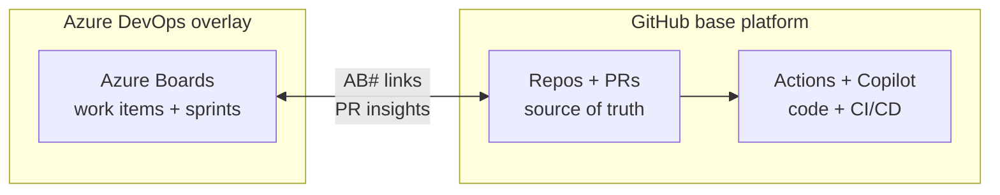

<!-- markdownlint-disable -->

# Copilot Developer Training

## Module 4: GitHub + ADO Integration

*15-minute module · AB# linking · Copilot from Boards · decision points*

<!-- notes
Open by positioning this as the shortest module in the day. The goal is not to teach every Azure DevOps capability; it is to show the smallest set of integration points that matter for GitHub-first teams.
-->

---
class: text-sm
---

# ADO layers on top of GitHub

### GitHub stays the code platform; Azure Boards stays the work-management layer



<v-clicks>

- Developers stay in **GitHub** for code, reviews, and automation.
- Project managers stay in **Azure Boards** for work items, planning, and dashboards.
- Boards can also reference GitHub PRs with `!{org/repo}/pull/{pr-number}`.

</v-clicks>

<div class="gh-callout gh-callout-blue">

**Key point**: This is **not** a migration pattern. ADO adds a coordination layer on top of a GitHub-centered workflow.

</div>

<!-- notes
Keep the architecture simple: GitHub is still the developer system of action, while Boards remains the project-management surface. Mention PR Insights and ! mentions as visibility features, but do not drift into a full ADO product tour.
-->

---
class: text-xs
---

# AB# linking is the core integration

### Put the Azure Boards work item ID inside GitHub text that gets parsed

<div class="gh-box-accent">

<v-clicks>

- ✅ Commit messages
- ✅ PR descriptions
- ✅ Issue descriptions
- ✗ PR titles
- ✗ PR comments

</v-clicks>

</div>

```bash
git commit -m "Add webhook retry logic AB#48321"
```

```md
## Summary

Implements AB#48321 for retry-safe webhook delivery.
```

<div class="gh-callout gh-callout-blue">

**Remember**: Only the initial PR description is parsed for AB# linking.

</div>

<!-- notes
This is the feature to remember. If learners walk away with only one integration detail, it should be where AB# works and where it does not. Call out the PR title limitation explicitly because teams often assume the title is enough.
-->

---
class: text-sm
---

# `Fixes AB#` closes the loop

### Use the keyword in the merged PR description to drive the work item state change

| Text in GitHub | ADO result |
|---|---|
| `AB#48321` | Links the commit, issue, or PR to the work item |
| `Fixes AB#48321` | On merge, moves the linked item to **Done/Resolved** |

```md
## Why

Release readiness fix for webhook retries.

Fixes AB#48321
```

<div class="gh-callout gh-callout-blue">

**PR Insights**: Azure Boards can show linked PR draft, review, and check status in the work item's **Development** section.

</div>

<!-- notes
Explain that plain AB# gives traceability, while Fixes AB# adds workflow automation. The instructor point here is reduced manual status management: the merge event can update the work item for the team.
-->

---
class: text-xs
---

# Copilot can start from the work item

### This workflow begins in Azure Boards and finishes in GitHub

<v-clicks>

- Connect **Azure Boards** to a **GitHub repository**.
- Open the work item and use **Copilot** to generate implementation help or code.
- Copilot uses the work item title, description, and comments as context.
- The output lands in **GitHub** as code and a PR for review.
- In ADO text fields, use `!{org/repo}/pull/{pr-number}` to point discussion at the GitHub PR.

</v-clicks>

| Requirement | Why it matters |
|---|---|
| **GitHub repos** | Required for Copilot from Azure Boards |
| **Azure Repos** | Not supported for this generation flow |

<div class="gh-callout gh-callout-purple">

**Important**: Copilot from Azure Boards is a **GitHub-repos** integration, not a generic Azure Repos feature.

</div>

<!-- notes
The critical caveat is repository type. If the audience remembers nothing else from this slide, they should remember that Copilot from Boards requires GitHub repos and does not unlock the same flow for Azure Repos.
-->

---
class: text-xs
---

# When to integrate vs. skip

### Keep the integration only when the two-platform model still saves time

| ✅ Add ADO integration when... | ⚠️ Skip when... |
|---|---|
| Significant **Azure Boards** investment | Starting fresh and can go all-in on GitHub |
| Need **Copilot + GHAS** before a full migration | **GitHub Projects V2** can replace Boards |
| Gradual **Azure Repos → GitHub** migration | Two-platform cost exceeds migration cost |
| PMs and stakeholders live in **ADO** | Team wants one platform with less admin overhead |

<div class="gh-callout gh-callout-blue">

**Rule of thumb**: Integrate to preserve existing ADO value; skip it when GitHub can already be the full destination state.

</div>

<!-- notes
Frame this as a business decision, not a technical purity test. Enterprises with heavy Boards investment often want GitHub for developers without forcing an immediate PM workflow migration.
-->

---
class: text-sm
layout: demo
---

# 🧪 LAB CUE

### Quick exercise — AB# linking

<v-clicks>

- Pick an Azure Boards work item such as `AB#48321`.
- Create a commit or draft PR description that includes the reference.
- Watch the work item show linked GitHub activity in **Development**.
- No ADO access? Run it as an instructor demo with sample text only.

</v-clicks>

<div class="gh-callout gh-callout-green">

**Outcome**: Learners see the smallest useful integration in under five minutes.

</div>

<!-- notes
If the room does not have Azure DevOps access, keep this as a show-and-tell using prepared screenshots or sample text. The goal is simply to make the AB# syntax feel concrete.
-->

---
class: text-sm
layout: end
---

# Q&A / Wrap-up

<v-clicks>

- **ADO integration is a layer** on top of GitHub, not a migration pattern.
- **AB# linking** is the fastest win for cross-platform traceability.
- **Copilot from Boards requires GitHub repos**.

</v-clicks>

*Slide deck for Copilot Developer Training — Module 4: GitHub + ADO Integration*

<!-- notes
Close by restating the three takeaways on the slide. Invite questions about whether the audience is trying to preserve Azure Boards investment or move fully into GitHub over time.
-->
