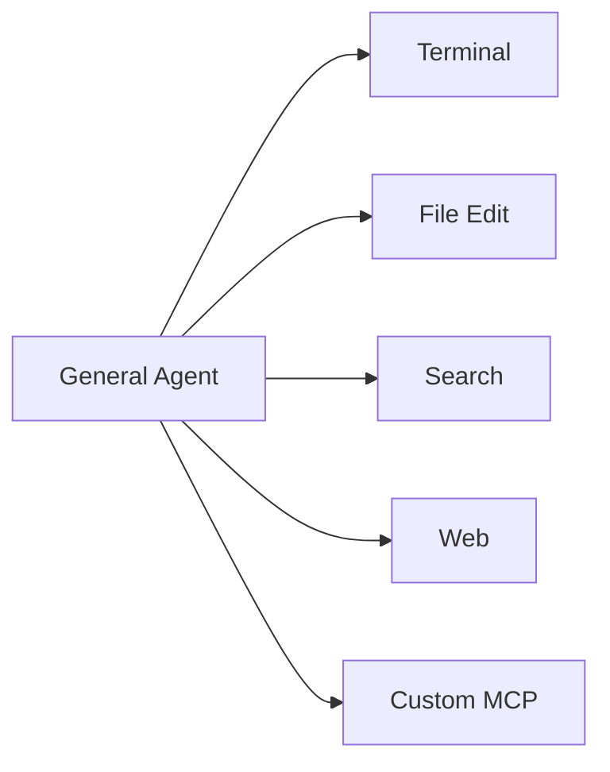
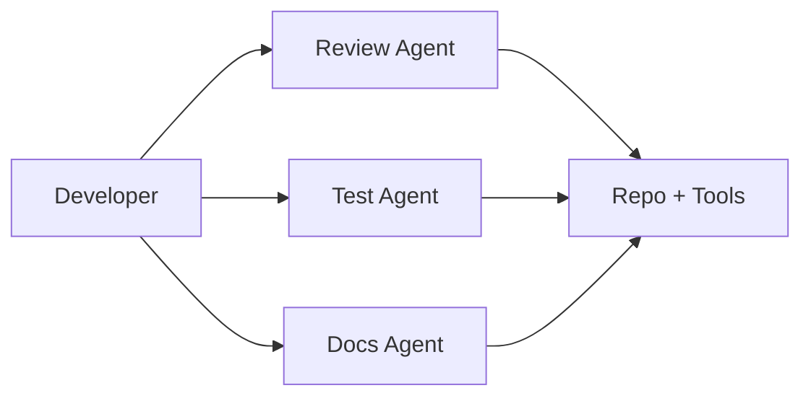
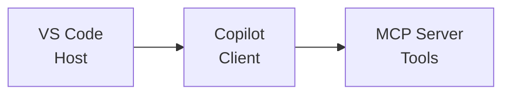
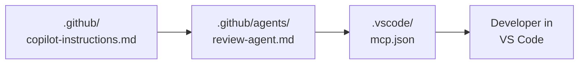

<!-- markdownlint-disable -->

# Copilot Developer Training

## Module 3 — Advanced Topics

*Agent architecture patterns · MCP · Debugging · Full-stack agents*

`github.com/microsoft/GitHubCopilot_Customized`

<!--
Welcome to Module 3. This module assumes attendees already understand chat modes, instructions, and the plan → act → observe → reflect loop from Modules 1 and 2. Today is about putting those ideas into production-friendly patterns.
-->

---
class: text-sm
---

# Agenda

### 90-minute roadmap

| Time | Topic |
|------|-------|
| 18 min | Agent architecture patterns + decision framework |
| 7 min | 🧪 Exercise 1 — Agent architecture |
| 22 min | MCP overview, installation, and VS Code configuration |
| 7 min | 🧪 Exercise 2 — MCP setup |
| 11 min | Debugging and diagnostics |
| 7 min | 🧪 Exercise 3 — Debugging |
| 8 min | Putting it all together |
| 10 min | 🧪 Exercise 4 + module recap |

<div class="gh-callout gh-callout-blue">

**Flow**: ~62 minutes of presentation, then ~28 minutes of guided lab time split across four short exercises.

</div>

<!--
Set expectations early: four content blocks, each followed by a lab cue. That keeps the session moving and helps attendees apply each concept immediately.
-->

---
layout: section
---

# Agent Architecture Patterns

<!--
This first section connects directly to Module 2. We are moving from “how agents loop” to “how to structure agents for real developer workflows.”
-->

---
class: text-sm
---

# Single agent with multiple skills

### One planner, one context window, many tools



<v-clicks>

- Best for **most day-to-day coding tasks**
- Shared context means fewer handoffs and less repeated prompting
- One agent can plan, inspect files, edit code, and validate with tests in one loop
- Easier to debug because there is only one reasoning path to inspect

</v-clicks>

<div class="gh-callout gh-callout-green">

**Use this by default**: start with one capable agent, then split only when the task or governance needs clearly demand it.

</div>

<!--
The key teaching point: single-agent is the baseline architecture. It is simpler, easier to explain, and usually good enough until there is a real reason to add orchestration.
-->

---
layout: two-cols
class: text-sm
---

# Single-agent example

### A feature task with shared context

::left::

| Step | What the agent does |
|------|---------------------|
| **1** | Reads route, model, and tests |
| **2** | Updates implementation across files |
| **3** | Runs lint or tests |
| **4** | Fixes errors in the same loop |

::right::

<div class="gh-box-accent">

**Example prompt**

Add pagination to the orders endpoint, update the tests, and explain any API contract changes.

</div>

<v-clicks>

- Same context for code, tests, and validation
- No need to explain the task to three different agents
- Strong fit when one person would naturally do the work end to end

</v-clicks>

<!--
Make this feel familiar: it is how many developers already use Agent mode today. One task, one agent, one shared mental model.
-->

---
class: text-sm
---

# Multi-agent with multiple skills

### Break work apart when specialization matters



<v-clicks>

- Use when tasks are **truly independent**
- Give each agent different instructions, goals, or approval boundaries
- Helpful when teams want stronger separation of concerns
- Useful when one agent should never have the same tool access as another

</v-clicks>

<!--
This is not “more advanced therefore always better.” It is an organizational pattern for specialization, not a default setting.
-->

---
class: text-sm
---

# Multi-agent example

### Specialized agents in `.github/agents/`

| Agent file | Primary job | Typical tools |
|------------|-------------|---------------|
| **`review-agent.md`** | Code review and risk spotting | Search, diff, comments |
| **`test-agent.md`** | Generate or harden tests | File edit, terminal, test runner |
| **`docs-agent.md`** | Update guides and examples | File edit, search |

<div class="gh-callout gh-callout-blue">

**Why split them?** Each agent can have different instructions, success criteria, and tool access without overloading a single general-purpose prompt.

</div>

<!--
Tie this back to the real feature: custom agents are markdown files in `.github/agents/`. Each one becomes a reusable role with its own boundaries.
-->

---
class: text-sm
---

# AI Safety: Designing Responsible Agents

<div class="gh-callout gh-callout-purple">

**More agents = more autonomy**. Every agent should have a clear scope, clear success criteria, and an explicit list of what it should **not** do.

</div>

<v-clicks>

- Define boundaries in the agent instructions
- Avoid overlapping responsibilities when possible
- Keep write access and external-tool access intentionally scoped

</v-clicks>

<!--
This is the moment to emphasize safety as design, not just review. Good agent architecture is partly a governance decision.
-->

---
class: text-xs
---

# Decision framework: single vs. multi-agent

| Question | If **yes** | Lean toward |
|----------|------------|-------------|
| Does one task need shared context across code, tests, and docs? | One loop should keep the full picture | **Single agent** |
| Are the subtasks independent enough to run separately? | Different work can proceed without constant handoff | **Multi-agent** |
| Do different roles need different instructions or tone? | Reviewer ≠ implementer ≠ documenter | **Multi-agent** |
| Do you want one general-purpose helper for quick work? | Simpler onboarding and simpler debugging | **Single agent** |
| Do you need tighter permission or tool boundaries? | Some roles should stay read-only or domain-specific | **Multi-agent** |

<div class="gh-callout gh-callout-green">

**Rule of thumb**: start single for simplicity, split later for specialization, governance, or parallelism.

</div>

<!--
Encourage pragmatism. Architecture follows workload and risk, not fashion.
-->

---
layout: center
class: text-sm
---

# 🧪 Exercise 1 — Agent Architecture

- Pick one realistic task from your project
- Sketch a **single-agent** version of the workflow
- Sketch a **multi-agent** version with role boundaries
- Decide which design is easier to manage and safer to review

<!--
Keep this short and practical. The goal is not to implement yet—just to develop pattern intuition.
-->

---
layout: section
---

# Model Context Protocol

<!--
Now move from internal architecture to external capability: how Copilot connects to tools and data that live outside the base editor experience.
-->

---
class: text-sm
---

# What is MCP?

### Open protocol for external tools and data



| Layer | Role |
|-------|------|
| **Host** | VS Code manages the connection lifecycle |
| **Client** | Copilot discovers and calls tools |
| **Server** | Exposes capabilities such as tools or resources |

<div class="gh-callout gh-callout-blue">

**Think of MCP as a standard connector**: instead of teaching every assistant every API, tools expose a shared protocol.

</div>

<!--
Keep the explanation simple: host, client, server. That mental model is enough for most developers to start using MCP confidently.
-->

---
class: text-sm
---

# What MCP adds to Copilot

### Servers expose tools Copilot can call

<v-clicks>

- **Database tools** for queries or schema lookup
- **API tools** for calling internal services
- **Filesystem tools** for constrained file operations
- **Cloud tools** for platform tasks and diagnostics
- **Custom enterprise tools** that package internal workflows

</v-clicks>

<div class="gh-callout gh-callout-green">

**Practical framing**: MCP does not replace instructions or agents. It expands what those agents can actually do.

</div>

<!--
This is the bridge to the next section: MCP is capability, not behavior. Instructions shape behavior; MCP adds reachable tools.
-->

---
class: text-sm
---

# AI Safety: Third-Party Trust

<div class="gh-callout gh-callout-purple">

**MCP servers run code on your machine**. Only install servers from trusted sources, and review the tools they expose before enabling them.

</div>

<v-clicks>

- Check the publisher, repository, and maintenance activity
- Prefer the smallest tool surface that solves the problem
- Treat server configuration like any other executable dependency

</v-clicks>

<!--
This safety note matters because MCP feels abstract until attendees realize it can execute real processes locally.
-->

---
class: text-sm
---

# Installing an MCP server

### Start with discovery and trust review

<v-clicks>

1. Find a server on a registry such as **mcp.so** or **npm**
2. Review what the server does and whether it is actively maintained
3. Decide whether it belongs at **user scope** or **project scope**
4. Add the configuration in VS Code, then reload the window

</v-clicks>

<div class="gh-box-copilot">

**Common first server**: a filesystem server is easy to understand because the tool surface is visible and local.

</div>

<!--
Walk slowly here. The goal is to make installation feel operational and reviewable, not magical.
-->

---
class: text-xs
---

# Installing an MCP server

### Example `.vscode/mcp.json` configuration

```json
{
  "servers": {
    "filesystem": {
      "type": "stdio",
      "command": "npx",
      "args": [
        "-y",
        "@modelcontextprotocol/server-filesystem",
        "${workspaceFolder}"
      ],
      "env": {
        "MCP_LOG_LEVEL": "info"
      }
    }
  }
}
```

<div class="gh-callout gh-callout-blue">

**What this means**: VS Code starts a local process, Copilot discovers its tools, and those tools become available in chat or agent workflows.

</div>

<!--
This is a real pattern attendees can copy. Emphasize that the command, args, and optional env values are the core building blocks.
-->

---
layout: two-cols
class: text-xs
---

# Configuring MCP in VS Code

### User-level vs. project-level

::left::

**User settings** — personal tools in `settings.json`

```json
{
  "mcp": {
    "servers": {
      "filesystem": {
        "type": "stdio",
        "command": "npx",
        "args": ["-y", "@modelcontextprotocol/server-filesystem", "C:\\repos"]
      }
    }
  }
}
```

::right::

**Workspace settings** — shared tools in `.vscode/mcp.json`

```json
{
  "servers": {
    "filesystem": {
      "type": "stdio",
      "command": "npx",
      "args": ["-y", "@modelcontextprotocol/server-filesystem", "${workspaceFolder}"]
    }
  }
}
```

<div class="gh-callout gh-callout-green">

**Same server shape, different scope**: user settings wrap entries under `mcp`; workspace files start directly with `servers`.

</div>

<!--
This distinction is easy to forget, so call it out explicitly. It is often the first configuration mistake people make.
-->

---
layout: center
class: text-sm
---

# 🧪 Exercise 2 — MCP Setup

- Add a simple MCP server to `.vscode/mcp.json`
- Reload VS Code so Copilot re-discovers tools
- Ask Copilot to use the new tool in a small task
- Confirm you understand whether the server is project-level or personal

<!--
Attendees should leave this exercise with one working server, not a pile of theory.
-->

---
layout: section
---

# Debugging & Diagnostics

<!--
Now switch from setup to troubleshooting. This section is about making agent behavior visible enough to inspect and improve.
-->

---
layout: two-cols
class: text-sm
---

# Chat Debug Mode

### Use the Output panel to inspect what Copilot received

::left::

<v-clicks>

- Open **View → Output**
- Select **GitHub Copilot Chat** from the channel dropdown
- Turn on debug logging if you need more detail
- Re-run the prompt you want to inspect

</v-clicks>

::right::

| What to look for | Why it matters |
|------------------|----------------|
| **Context sent** | Shows what the model actually received |
| **Model used** | Explains output style and latency |
| **Token counts** | Reveals bloated prompts or attachments |
| **Timing** | Helps diagnose slow requests |

<!--
Make the practical point: when the answer feels wrong, debug the context first.
-->

---
class: text-sm
---

# Agent debug logs

### Trace the agentic loop step by step

| Signal | What it tells you |
|--------|-------------------|
| **Tool calls made** | Which capabilities the agent actually used |
| **Terminal commands executed** | How the agent validated or explored |
| **File edits proposed** | What changed and in what order |
| **Iteration count** | Whether the agent is progressing or getting stuck |
| **Warnings** | Context truncation, unexpected failures, or retries |

<div class="gh-callout gh-callout-green">

**Use the logs to inspect Plan → Act → Observe → Reflect in real time.** If the agent loops too long or calls the wrong tool, the trace usually shows why.

</div>

<!--
Avoid fake logs here. Stay conceptual and focus on what people should read, not on pretending there is a single canonical log format.
-->

---
class: text-sm
---

# AI Safety: Debugging the Black Box

<div class="gh-callout gh-callout-blue">

**Debug logs make AI behavior more transparent**. When output seems wrong, inspect the logs to see what context the model got and what tools it actually used.

</div>

<v-clicks>

- Wrong answer can mean wrong context
- Wrong tool choice can mean unclear instructions
- Too many iterations can mean the task boundary is too vague

</v-clicks>

<!--
This is a safety slide, but it is also a confidence slide: visibility makes teams more willing to adopt agent workflows responsibly.
-->

---
layout: center
class: text-sm
---

# 🧪 Exercise 3 — Debugging

- Run one prompt in Ask or Agent mode
- Open the Output panel and inspect the Copilot logs
- Identify one useful clue: context, model, timing, or tool usage
- Share what changed in your understanding after reading the logs

<!--
The goal is simply to form the habit: if the result surprises you, inspect before you re-prompt blindly.
-->

---
layout: section
---

# Putting It All Together

<!--
This final section connects the layers: instructions, custom agents, and MCP are not separate topics—they stack.
-->

---
class: text-sm
---

# The full stack: Instructions + Agents + MCP

### How the layers work together in VS Code



<v-clicks>

- **Repo instructions** set the shared baseline for the whole codebase
- **Custom agents** specialize the behavior for a specific role
- **MCP configuration** adds external tools those agents can call
- **The developer** still reviews outputs and decides what ships

</v-clicks>

<!--
This is the architecture summary slide. If attendees remember one diagram from the module, make it this one.
-->

---
class: text-xs
---

# Best practices & common pitfalls

| Do | Don't |
|----|-------|
| **Keep instructions focused** on stable repo conventions | **Overload context** with every file you can attach |
| **Test agents iteratively** on small tasks first | **Skip reviewing agent output** because it “looks right” |
| **Use debug logs** when behavior surprises you | **Install untrusted MCP servers** just because they are convenient |
| **Separate roles** when agents need different goals or permissions | **Create overlapping agents** that compete for the same responsibility |

<div class="gh-callout gh-callout-purple">

**Healthy pattern**: clear instructions, scoped agents, trusted tools, and deliberate human review.

</div>

<!--
End on practical discipline. Advanced usage is not about maximum autonomy; it is about repeatable, reviewable systems.
-->

---
layout: center
class: text-sm
---

# 🧪 Exercise 4 — Full Stack Agent

- Choose one custom agent from `.github/agents/`
- Decide what repo instructions it should inherit
- Add or identify one MCP tool that would genuinely help it
- Explain the review boundary a human should keep

<!--
This final lab cue makes attendees synthesize the whole module into one design exercise.
-->

---
layout: end
class: text-sm
---

# Module 3 Recap

<v-clicks>

- Start with **single-agent** designs unless specialization is clearly worth the complexity
- Use **MCP** to connect Copilot to trusted external tools and data
- Read **debug and agent logs** to understand what the model saw and did
- Think in layers: **instructions → agents → MCP → human review**

</v-clicks>

<div class="gh-callout gh-callout-green">

**Next step**: use the lab to design one practical agent workflow you would actually keep in your daily development environment.

</div>

*Slide deck for Copilot Developer Training — Module 3: Advanced Topics*

<!--
Close by reinforcing that advanced usage is about system design, not just prompt tricks. The lab should feel like the natural continuation of the slide deck.
-->

