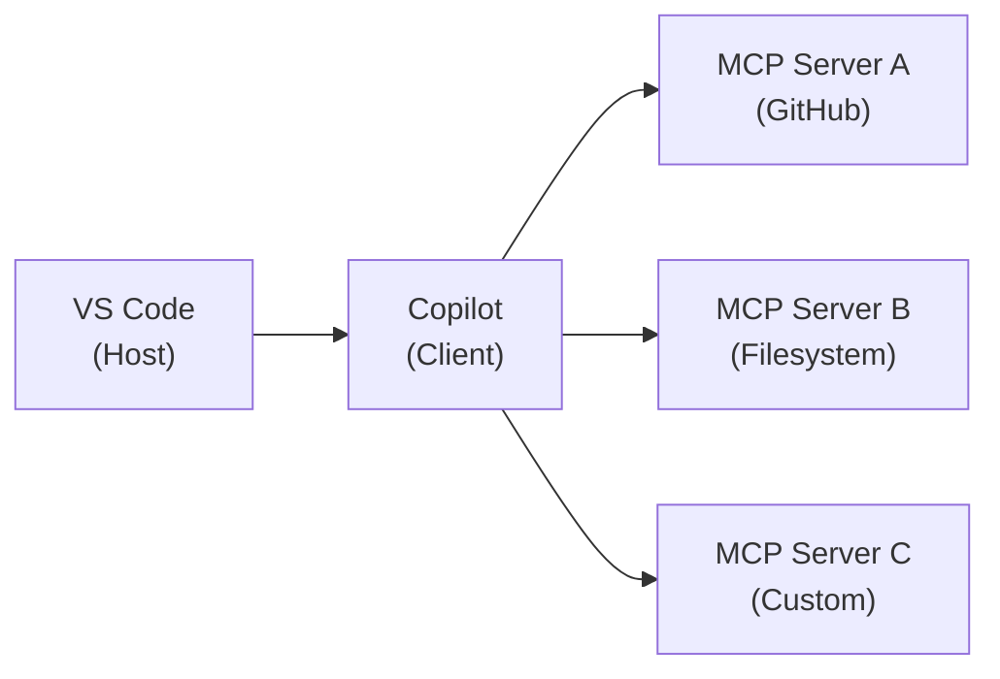
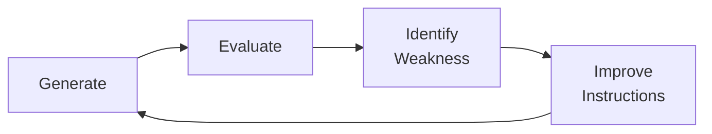

<!-- markdownlint-disable -->

# Copilot Developer Training

## Module 3 — Advanced Topics

*Extensions & MCP · Evaluating Output · Troubleshooting*

`github.com/microsoft/GitHubCopilot_Customized`

<!--
Welcome attendees. "This is Module 3 — Advanced Topics. We'll extend Copilot with external tools via MCP, build evaluation frameworks for AI output quality, and master the diagnostic tools for when things go wrong."
-->

---
class: text-xs
---

# What We'll Cover Today (1/2)

| Time | Topic |
|------|-------|
| **Session 6** | **Extensions & MCP (60 min)** |
| 5 min | AI Safety: "Third-Party Trust" |
| 10 min | VS Code Chat Participants |
| 15 min | GitHub Copilot Extensions |
| 15 min | MCP Architecture |
| 10 min | MCP Configuration |
| | ☕ *Break — 10 min* |
| **Session 7** | **Evaluating Agentic Output (70 min)** |
| 5 min | AI Safety: "When to Trust, When to Verify" |
| 15 min | Defining Success Criteria |
| 15 min | Output Quality Rubrics |
| 15 min | Evaluation Methods |
| 15 min | Tracking & Improvement |

<!--
"Three sessions, two breaks. This module rounds out the full curriculum."
-->

---
class: text-xs
---

# What We'll Cover Today (2/2)

| Time | Topic |
|------|-------|
| | ☕ *Break — 10 min* |
| **Session 8** | **Troubleshooting & Diagnostics (60 min)** |
| 15 min | Output Log Channels |
| 15 min | Chat Debug Mode |
| 15 min | Agent Debug Logs |
| 10 min | Diagnostics Collection & Curriculum Wrap-Up |

**Total: ~190 min (~3h 10min) including breaks**

<div class="gh-callout gh-callout-blue">

**Format**: Slides → live demo → hands-on time. After today you'll have every tool to use, evaluate, and debug Copilot.

</div>

<!--
"After today you'll have every tool you need to use, evaluate, and debug Copilot effectively."
-->

---
class: text-sm
---

# Quick Recap — Modules 1 & 2

### Concepts you should know

| Module | Core Concepts |
|--------|-------------|
| **Module 1** | Chat modes, instructions, custom agents, context targeting, token management |
| **Module 2** | Agentic loops (plan-act-observe-reflect), Ralph loop, rubber duck pattern, 8 antipatterns |

<div class="gh-callout gh-callout-blue">

**If you attended Modules 1–2**, this is a quick refresher. Joining fresh? These are the building blocks.

</div>

<!--
"30-second recap. Module 1 was about interacting with Copilot and controlling context. Module 2 was about how agents iterate and how to design them. Module 3 builds on both — extending, evaluating, and debugging."
-->

---
layout: section
---

# Session 6

## Extensions & MCP

<!--
"Let's extend Copilot beyond its built-in capabilities — connecting it to external tools and services."
-->

---
class: text-sm
---

# AI Safety: Third-Party Trust

### Extensions and MCP servers are third-party code

| Question | What to Check |
|----------|--------------|
| **Who built it?** | Verified publisher, known vendor |
| **What does it access?** | File system, network, terminal, tokens |
| **What can it do?** | Read-only vs. write; can it execute commands? |
| **Is it maintained?** | Recent updates, active issues |
| **Is it scoped?** | Minimum necessary permissions? |

<div class="gh-callout gh-callout-purple">

**Evaluate before installing**: Read permissions, check the publisher, review community feedback.

</div>

<!--
"Extensions and MCP servers run alongside Copilot with access to your code and environment. Treat them like any dependency — vet the source, check permissions, review what data flows where."
-->

---
class: text-sm
---

# VS Code Chat Participants

### Built-in specialized handlers

| Participant | Accesses | Capabilities |
|-------------|---------|-------------|
| `@workspace` | File tree, contents, symbols | Project search, cross-file understanding |
| `@vscode` | Settings, extensions, commands | Editor configuration help |
| `@terminal` | Terminal output, command history | Error diagnosis, command suggestions |

### How they work under the hood

1. You type `@workspace How is auth implemented?`
2. VS Code routes to the `@workspace` handler
3. Handler searches your project (files, symbols, content)
4. Relevant snippets injected into the context
5. Augmented context sent to the model

<div class="gh-callout gh-callout-green">

**Participants add context the model can't get from just reading files.** They actively search and analyze.

</div>

<!--
"Participants are more than shortcuts — they actively search and process your codebase. @workspace doesn't just read the file you're looking at, it searches the entire project for relevant code."
-->

---
class: text-sm
---

# GitHub Copilot Extensions

### GitHub Apps that add chat capabilities

- Appear as `@extension-name` participants in chat
- Access external services: Docker, Azure, Sentry, etc.
- Browse at <https://github.com/marketplace?type=apps&copilot_app=true>

| Capability | Description | Example |
|-----------|-------------|---------|
| **Chat responses** | Domain-specific answers | `@docker Optimize this Dockerfile` |
| **Code actions** | Generate/modify code | `@azure Generate Bicep template` |
| **Tool invocation** | Call external APIs | `@sentry Top errors this week?` |

<div class="gh-callout gh-callout-blue">

**Extensions vs. MCP**: Extensions are polished third-party integrations via GitHub. MCP is the open standard for custom tool connections.

</div>

<!--
"Extensions are the easy path — install from the marketplace, use with @mention. MCP is the flexible path — connect anything you want. We'll cover MCP next."
-->

---
layout: demo
---

# 🖥️ LIVE DEMO

### Using a Copilot Extension

- Show the Copilot Extensions marketplace
- Install an extension (Docker, GitHub Models, or Azure)
- Use it in chat: `@extension-name [question]`
- Show domain-specific knowledge in the response

<!--
Quick demo — install and use an extension. The point is how easy it is to add domain-specific AI capabilities.
-->

---
class: text-sm
---

# MCP: Model Context Protocol

### The open standard for tool integration

**MCP** connects AI models to external tools and data sources — "USB for AI."



| Role | What It Does |
|------|-------------|
| **Host** | VS Code — manages connections |
| **Client** | Copilot — sends requests to servers |
| **Server** | Tool provider — exposes tools, resources, prompts |

<!--
"MCP is an open protocol — not GitHub-specific. Any AI tool can be an MCP client, and any service can be an MCP server. VS Code and Copilot implement the client side. You configure which servers to connect to."
-->

---
class: text-sm
---

# MCP Capabilities & Transport

### What MCP servers can provide

| Capability | Description | Example |
|-----------|-------------|---------|
| **Tools** | Functions the model calls | `create_issue`, `run_query` |
| **Resources** | Data the model reads | DB schemas, API specs |
| **Prompts** | Reusable templates | "Summarize this PR" |

### Transport types

| Transport | How It Works | Best For |
|-----------|-------------|----------|
| **stdio** | Local process, stdin/stdout | Local tools, CLIs |
| **SSE** | Server-sent events over HTTP | Remote services |
| **Streamable HTTP** | HTTP with streaming | Modern remote servers |

<div class="gh-callout gh-callout-green">

**stdio** is the most common for local development. It's simple — the server is just a process that reads stdin and writes stdout.

</div>

<!--
"Three types of capabilities, three types of transport. For local development, you'll mostly use stdio servers — they run as a local process on your machine. Remote servers use HTTP-based transports."
-->

---
class: text-sm
---

# MCP Configuration

### `.vscode/mcp.json` — connect servers to your workspace

```json
{
  "servers": {
    "github": {
      "command": "npx",
      "args": ["-y", "@modelcontextprotocol/server-github"],
      "env": {
        "GITHUB_PERSONAL_ACCESS_TOKEN": "${input:github-token}"
      }
    },
    "filesystem": {
      "command": "npx",
      "args": ["-y", "@modelcontextprotocol/server-filesystem",
               "./src"]
    }
  }
}
```

<div class="gh-callout gh-callout-purple">

**Security**: Use `${input:name}` for secrets — VS Code prompts at runtime. Never hardcode tokens.

</div>

<!--
"This is the config file. Each server entry specifies how to start it and what environment to give it. The ${input:} syntax is critical — it keeps your tokens out of version control."
-->

---
layout: demo
---

# 🖥️ LIVE DEMO

### MCP Server Setup

- Create `.vscode/mcp.json` with a filesystem server
- Open chat — show MCP tools appearing in the tool list
- Ask Copilot to use the tool: "List TypeScript files in the API directory"
- Add a GitHub MCP server — show it pulling issue data into context

<!--
Live-create the config. Show the tools appearing in chat. Use them in a conversation. This is the "aha moment" for MCP.
-->

---
class: text-sm
---

# Session 6 Recap & Discussion

### Key Takeaways

- **Participants** (`@workspace`, `@vscode`, `@terminal`) route to specialized handlers
- **Extensions** bring third-party knowledge into chat via GitHub Apps
- **MCP** is the open standard — configure in `.vscode/mcp.json`
- Always evaluate trust, permissions, and security before adding integrations

### Discussion

- What's the first MCP server you'll set up?
- What governance process would your org need for MCP servers?
- How does MCP change what's possible with Copilot in your workflow?

<!--
5-minute wrap-up. MCP is usually the most exciting topic for attendees — expect engagement.
-->

---
class: text-sm
---

# ☕ Break — 10 Minutes

Session 7: How to evaluate what AI gives you.

---
layout: section
---

# Session 7

## Evaluating Agentic Output

<!--
"We've learned how to USE Copilot. Now let's learn how to JUDGE what it produces."
-->

---
class: text-sm
---

# AI Safety: When to Trust, When to Verify

### Risk should drive verification effort

| Risk Level | Code Type | Verification |
|-----------|-----------|-------------|
| 🟢 **Low** | Boilerplate, scaffolding, docs | Quick scan |
| 🟡 **Medium** | Business logic, API routes | Code review + tests |
| 🔴 **High** | Auth, security, financial, infra | Deep review + security scan |

<div class="gh-callout gh-callout-blue">

**The goal**: Trust calibration — not "trust everything" or "verify everything." Match effort to risk.

</div>

<!--
"Not all code deserves the same scrutiny. A boilerplate Express route? Quick glance. Authentication middleware? Full review. The rubric we'll build today helps you make these decisions consistently."
-->

---
class: text-xs
---

# Defining Success Criteria

### What does "good output" look like?

Define before you ask Copilot — prevents accepting the first thing that compiles.

| Task Type | Correctness | Style | Security |
|-----------|------------|-------|----------|
| **Bug fix** | Resolves issue, no regressions | Matches existing style | No new vulnerabilities |
| **New feature** | Meets requirements, edge cases | Follows patterns | Input validation, auth |
| **Refactoring** | Same behavior, tests pass | Improved readability | No regression |
| **Tests** | Meaningful, cover edges | Consistent structure | No data leaks |

```
Task: [what you're asking Copilot to do]
Success: Functional [what it does], Quality [how it looks],
         Constraints [perf, security], Not acceptable [avoid]
```

<!--
"The single biggest quality improvement: define success BEFORE you start. Without criteria, you evaluate against vibes. With criteria, you evaluate against a specification."
-->

---
layout: demo
---

# 🖥️ LIVE DEMO

### Criteria-Driven Prompting

- Define criteria: "Add pagination — cursor-based, max 100, no offset, Link headers"
- Include criteria in the prompt
- Evaluate output against each criterion
- Compare to asking without criteria: "Add pagination to products"

<!--
Show the dramatic quality difference between a criteria-driven prompt and a vague one. The with-criteria output should be measurably better.
-->

---
class: text-xs
---

# Output Quality Rubric

| Dimension | 1 (Poor) | 2 (OK) | 3 (Good) | 4 (Excellent) |
|-----------|----------|--------|----------|---------------|
| **Correctness** | Doesn't work | Happy path | Common edges | All edges, robust |
| **Completeness** | Missing parts | Core present | Full requirements | Exceeds |
| **Code Style** | Inconsistent | Mostly OK | Follows patterns | Clean, idiomatic |
| **Security** | Vulnerabilities | No obvious issues | Validates input | Defense in depth |
| **Performance** | Unacceptable | Adequate | Efficient | Optimized |

```
Example: Correctness 3, Completeness 2 (missing Link headers),
Style 3, Security 2 (no input validation), Performance 3.
Overall: 2.6 → Needs fixes.
```

<!--
"A rubric makes evaluation consistent and shareable. Instead of 'this looks okay,' you score each dimension. The team agrees on what 3 means, and reviews become more objective."
-->

---
layout: demo
---

# 🖥️ LIVE DEMO

### Applying a Rubric

- Ask Agent mode to add a search feature to the products API
- Score the output: correctness, completeness, style, security, performance
- Identify weaknesses → ask Copilot to fix specific issues
- Re-score → show the improvement

<!--
Walk through scoring in real-time. Score each dimension out loud. Then fix the weak points and re-score. The improvement should be visible.
-->

---
class: text-sm
---

# Evaluation Methods

### Automated + human — the verification pipeline


| Level | Checks | Catches |
|-------|--------|---------|
| **Automated** | Lint, types, tests, security scan | Syntax, types, regressions, known vulns |
| **Human** | Logic, architecture, edge cases | Subtle issues, over-engineering |

<div class="gh-callout gh-callout-green">

**Automated gates catch the obvious. Human review catches the subtle.** You need both.

</div>

<!--
"The pipeline is simple: automated checks first — they're fast and catch the easy stuff. Then human review for the things machines miss: does this actually solve the problem? Is the approach right? Will someone understand this in 6 months?"
-->

---
layout: demo
---

# 🖥️ LIVE DEMO

### Automated Evaluation Pipeline

- Generate code with Agent mode
- Run lint + type check + test pipeline
- Show a failure — automated gate catches it
- Fix and re-run — show pipeline passing

<!--
Show the full flow: generate, validate, fail, fix, pass. The key insight is that automated checks give you a safety net for AI output.
-->

---
class: text-sm
---

# Tracking & Improvement

### The feedback loop



### Metrics to Track

| Metric | What It Tells You |
|--------|-------------------|
| **First-pass acceptance rate** | How well your prompts/instructions work |
| **Iteration count** | Prompt quality + task complexity alignment |
| **Rubric scores over time** | Where Copilot consistently over/under-performs |
| **Time savings** | ROI of AI-assisted development |

<div class="gh-callout gh-callout-purple">

**Evaluation without tracking is a one-time exercise. Tracking creates a continuous improvement loop.**

</div>

<!--
"The feedback loop is where real improvement happens. Evaluate, find weaknesses, improve your instructions, evaluate again. Over time, your rubric scores go up because your prompts and instructions get better."
-->

---
class: text-sm
---

# Trust Calibration

### Match trust level to task type

| Task Type | Trust | Verification |
|-----------|-------|-------------|
| Boilerplate / scaffolding | High | Quick scan |
| CRUD endpoints | High | Test coverage check |
| Business logic | Medium | Code review + tests |
| Algorithm implementation | Medium-Low | Deep review + benchmarks |
| Security-critical code | Low | Full security review |
| Infrastructure / IaC | Low | Plan review + dry run |

<div class="gh-callout gh-callout-blue">

**Build your team's trust calibration table.** Make it explicit so everyone evaluates consistently.

</div>

<!--
"This is the practical output of the evaluation framework — a table your team agrees on. When you get a Copilot-generated auth middleware, everyone knows it gets a full security review."
-->

---
class: text-sm
---

# Session 7 Recap & Discussion

### Key Takeaways

- Define success criteria **before** asking Copilot to generate code
- Use rubrics for consistent, repeatable evaluation
- Combine automated checks + human review in a pipeline
- Track metrics over time — the feedback loop drives improvement

### Discussion

- What quality metric will you start tracking first?
- How would you introduce rubric-based evaluation to your team?
- What's the biggest quality challenge with AI-generated code?

<!--
5-minute discussion. Evaluation is often the most thought-provoking session — attendees realize they've been "vibes-checking" AI output.
-->

---
class: text-sm
---

# ☕ Break — 10 Minutes

Final session: what to do when things go wrong.

---
layout: section
---

# Session 8

## Troubleshooting & Diagnostics

<!--
"The last session — and arguably the most practical. When Copilot gives you something unexpected, here's how to figure out why."
-->

---
class: text-sm
---

# AI Safety: Debugging the Black Box

### Transparency builds trust

- AI models are often treated as black boxes — input in, output out
- Copilot provides transparency tools: **logs, debug mode, traces**
- When you can see the context, you can understand the output
- **Debugging AI ≠ debugging code**: You're debugging the **context and instructions**, not an algorithm

<div class="gh-callout gh-callout-blue">

**Key insight**: Most Copilot "bugs" are actually context problems — wrong files, stale instructions, or truncated history.

</div>

<!--
"When Copilot gives a bad answer, your first instinct might be 'the model is bad.' But 9 times out of 10, the issue is what the model SAW — not what it IS. Wrong context, missing instructions, truncated history. The tools we cover today help you see what the model sees."
-->

---
class: text-xs
---

# Output Log Channels

### Your first diagnostic tool

| Channel | What It Logs | When to Check |
|---------|-------------|--------------|
| **GitHub Copilot** | Completion events, model selection | Completions not appearing |
| **GitHub Copilot Chat** | Request/response, tool calls | Chat wrong or slow |
| **Language Server** | Symbols, analysis | Navigation issues |

Access: `Ctrl+Shift+U` → Output panel → select channel → look for errors (red), warnings (yellow)

<!--
"Output logs are step 1 of any troubleshooting. Open the panel, select the channel, and look for red."
-->

---
class: text-xs
---

# Common Log Patterns

### What to look for in the output logs

| Pattern | Meaning | Action |
|---------|---------|--------|
| `401` | Auth expired | Re-sign in |
| `429` | Rate limited | Wait or switch model |
| `Context truncated` | Window overflow | Reduce context |
| `Model not available` | Model down/restricted | Switch model |

<div class="gh-callout gh-callout-blue">

**Most common issues**: 401 (re-sign in), 429 (rate limited), or context truncated (reduce attached files).

</div>

<!--
"Output logs are step 1 of any troubleshooting. Open the panel, select the channel, and look for red. Most common issues: 401 (re-sign in), 429 (rate limited), or context truncated."
-->

---
layout: demo
---

# 🖥️ LIVE DEMO

### Reading Output Logs

- Open Copilot output channel — show the log stream
- Trigger a completion — identify the log entry
- Show an error scenario — identify the error pattern
- Show the Chat channel — trace a request through logs

<!--
Walk through the output panel live. Show a normal event, then an error. The key is building familiarity with what the logs look like so attendees know where to look.
-->

---
class: text-xs
---

# Chat Debug Mode

### See exactly what Copilot sees

Enable: `"github.copilot.chat.debugMode": true` in VS Code settings

| Information | Why It Matters |
|------------|---------------|
| **Full context sent** | Exactly what the model received |
| **Token counts** | Input, output, total — identify bloat |
| **Model used** | Which model handled the request |
| **Timing** | Context assembly, model call, rendering |
| **Tool calls** | Which tools invoked and their results |

```
[DEBUG] System prompt:        1,247 tokens
[DEBUG] Repo instructions:      312 tokens
[DEBUG] Attached context:     3,891 tokens
[DEBUG] History:              2,104 tokens
[DEBUG] Total input:          7,641 tokens
[DEBUG] Model: gpt-4o | Response: 342 tokens (1.2s)
```

<!--
"Debug mode is the single most useful diagnostic tool. It shows you the FULL context — every instruction, every file, every history message — and the token counts. When Copilot gives a weird answer, debug mode tells you why."
-->

---
layout: demo
---

# 🖥️ LIVE DEMO

### Chat Debug Mode Walkthrough

- Enable `github.copilot.chat.debugMode` in settings
- Send a chat message — open output channel for debug dump
- Point out: instructions loaded, context composition, token counts
- Send with large `#file` → show token count jump
- Show different models in the debug output

<!--
Enable debug mode live. Send a message and walk through every line of the debug output. Then show how adding a #file reference dramatically increases the token count. This builds intuition.
-->

---
class: text-xs
---

# Agent Debug Logs

### Iteration traces for Agent mode

Access: Command Palette → "GitHub Copilot: Open Agent Debug Log"

```
[Iteration 1] Plan: Add validation to orders route
  Tool: file.read → api/routes/orders.ts (2,341 tokens)
  Tool: file.write → api/middleware/validate-order.ts
  Tool: terminal.run → npm run lint (exit: 1)
  Result: FAIL — 'Request' is not defined

[Iteration 2] Fix: Add missing import
  Tool: file.edit → api/middleware/validate-order.ts
  Tool: terminal.run → npm run lint (exit: 0)
  Tool: terminal.run → npm test (exit: 0)
  Result: PASS ✅
```

Each entry shows: tool calls, arguments, results, and the agent's next decision.

<!--
"Agent debug logs are your forensic tool. Every iteration is logged — what the agent planned, what tools it called, what results it got, and what it decided to do next. When the agent goes wrong, this is where you find out why."
-->

---
layout: demo
---

# 🖥️ LIVE DEMO

### Tracing an Agent Failure

- Give Agent mode a task that will fail on first attempt
- Open the agent debug log — trace through iterations
- Show where the agent detected failure (observe phase)
- Show how it adjusted (reflect phase)
- Point out tool call trace: reads, writes, commands

<!--
Pick a task that triggers a self-correction cycle. Walk through the debug log line by line. Show the connection between what we learned in Module 2 (plan-act-observe-reflect) and what appears in the logs.
-->

---
class: text-xs
---

# Diagnostic Toolkit Cheat Sheet

### Everything in one place

| Tool | Access | What You Get |
|------|--------|-------------|
| **Output logs** | `Ctrl+Shift+U` → channel | Real-time log stream |
| **Debug mode** | `debugMode: true` in settings | Context, tokens, timing |
| **Agent debug log** | Command Palette → "Open Agent Debug Log" | Iteration traces, tool calls |
| **Diagnostics export** | Command Palette → "Collect Diagnostics" | Full bundle for support |
| **Extension version** | Extensions panel → Copilot | Confirm latest version |
| **Network check** | Output logs → 401/429/timeout | Connection & auth issues |

### Troubleshooting Flowchart

| Symptom | First Check | Second Check |
|---------|------------|-------------|
| No completions | Output logs (auth?) | Extension version |
| Wrong chat response | Debug mode (context?) | Instructions file |
| Agent stuck in loop | Agent debug log | Task complexity |
| Slow responses | Debug mode (tokens?) | Model selection |

<!--
"This is your cheat sheet. Print it, bookmark it, pin it. When something goes wrong, start from the top: output logs for connection issues, debug mode for context issues, agent logs for iteration issues."
-->

---
class: text-sm
---

# Curriculum Complete — All 8 Sessions

| Module | Sessions | Core Themes |
|--------|----------|-------------|
| **Foundations** | 1–3 | Chat interface, context, models & tokens |
| **Agentic Patterns** | 4–5 | Loops, self-correction, rubber duck, patterns |
| **Advanced Topics** | 6–8 | Extensions, MCP, evaluation, troubleshooting |

### What to Do Next

1. Set up `.github/copilot-instructions.md` in your primary repo
2. Create 1-2 custom agents for your team's workflows
3. Configure MCP servers for your internal tools
4. Build an evaluation rubric and start tracking quality metrics
5. Enable debug mode for a week to build diagnostic intuition

<div class="gh-callout gh-callout-purple">

**The best way to learn is to teach** — share what you learned with your team.

</div>

<!--
"That's all 8 sessions complete. You now have a comprehensive toolkit: how to interact, how to customize, how agents work, how to extend, how to evaluate, and how to debug. The next step is to apply all of this in your daily work."
-->

---
class: text-sm
---

# Further Learning

| Resource | Link |
|----------|------|
| **Copilot Docs** | <https://docs.github.com/en/copilot> |
| **MCP Specification** | <https://modelcontextprotocol.io> |
| **Demo Repo** | <https://github.com/microsoft/GitHubCopilot_Customized> |
| **VS Code Copilot** | <https://code.visualstudio.com/docs/copilot/overview> |

<div class="gh-callout gh-callout-blue">

**Questions?** Reach out to your GitHub account team or open a discussion in the demo repo.

</div>

<!--
"These are the four resources you'll reference most. The demo repo is yours to keep — fork it, experiment with it, use it as a sandbox for trying new Copilot features."
-->

---
layout: end
---

# Curriculum Complete

## Copilot Developer Training

*8 Sessions · 3 Modules · ~8.5 Hours*

<div class="gh-callout gh-callout-green">

**Thank you!** Now go build something amazing with your AI copilot.

</div>

<!--
Thank attendees. Remind them of the lab guides for hands-on practice. Collect feedback if applicable.
-->
