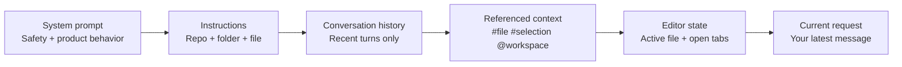
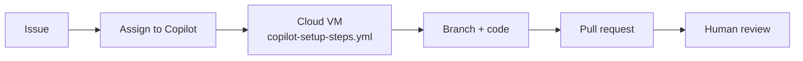
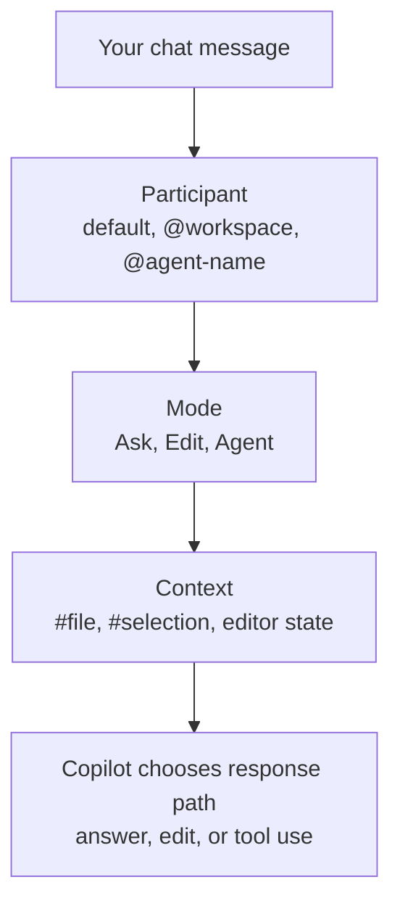
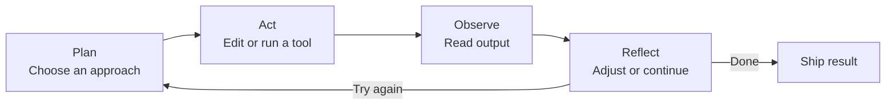

<!-- markdownlint-disable -->

# Copilot Developer Training

## Module 2: Agentic Patterns

*Context Windows · Project Bootstrap · Agents & Skills · Agentic Loops*

`90 minutes · ~64 min presentation + ~26 min lab`

<!-- notes
Open by connecting back to Module 1: attendees already know chat modes, instructions, and models. Explain that this module is about getting practical with Agent mode: controlling context, bootstrapping projects, using agents deliberately, and understanding the loop behind autonomous work.
-->

---
class: text-sm
---

# Agenda

| Time | Topic |
|------|-------|
| 14 min | **Context window management** — what Copilot sees and how to keep it focused |
| 10 min | **Starting a project with Copilot** — scaffold from a prompt and hand off to Agent mode |
| 15 min | **Agents & skills** — built-in vs. custom agents, tools, and routing |
| 18 min | **Agentic loops** — plan, act, observe, reflect, self-correct, review |
| 26 min | **Guided labs** — four short exercises woven through the module |
| 7 min | **Agenda, transitions, and recap** |

<div class="gh-callout gh-callout-blue">

**Module flow**: Narrow the context first, then bootstrap a project, then hand work to agents, then understand how they iterate.

</div>

<!-- notes
Set expectations: this is a hands-on module. Each section introduces one practical concept, then pauses for a short exercise so attendees can immediately try it.
-->

---
layout: section
---

# Context Window Management

<!-- notes
This section is about what actually reaches the model and why prompt quality depends on what fits.
-->

---
class: text-xs
---

# What actually gets sent to the model



<v-clicks>

- Every model call is a **composition problem**: instructions, context, history, and output share one finite token budget.
- Explicit references like `#file` usually beat ambient context because they are more targeted.
- When the request is large, Copilot keeps the most relevant layers and drops lower-value context.

</v-clicks>

<!-- notes
Build on Module 1. Stress that Copilot is not reading the whole repo on every turn. It composes a prompt from multiple sources, and the more precise you are, the better the composition.
-->

---
class: text-sm
---

# How Copilot prioritizes what fits

| Priority | Context layer | Why it tends to stay |
|----------|---------------|----------------------|
| **Highest** | System + safety prompt | Required for safe, consistent behavior |
| **High** | Current request + mode | Defines the task Copilot is solving now |
| **High** | Repo, folder, and file instructions | Encodes team rules and local conventions |
| **Medium** | Explicit references and current selection | Usually the most relevant task context |
| **Lower** | Recent conversation history | Helpful, but older turns fade first |
| **Lowest** | Broad workspace/editor context | Useful hints, but easiest to trim |

<div class="gh-callout gh-callout-blue">

**Token budgeting rule of thumb**: More pasted context means less room for reasoning and less room for the answer.

</div>

<!-- notes
Avoid overclaiming exact internals. Say “roughly” or “in practice.” The important lesson is that current task and explicit context matter more than old history or lots of open files.
-->

---
class: text-xs
---

# Managing context effectively

| Practice | Why it helps |
|----------|--------------|
| **Start fresh sessions for new tasks** | Unrelated history stops consuming budget and steering the answer |
| **Use `#file` for targeted work** | Specific files beat broad repo context for edits and reviews |
| **Keep instructions lean** | Short, useful rules survive context pressure better than long prose |
| **Close unrelated tabs** | Open editors can become noisy ambient context |
| **Use `@workspace` to search, then switch to `#file`** | Broad discovery first, precise execution second |

<div class="gh-box-accent">

**Good workflow**: `@workspace` to find the right area → `#file` to focus the task → fresh chat when you pivot.

</div>

<!-- notes
These are the habits attendees can use immediately after the workshop. Keep it practical and connect each tip to token budget and relevance.
-->

---
class: text-sm
---

# AI Safety aside: Autonomy vs. Oversight

<div class="gh-callout gh-callout-purple">

**More autonomy = more power, less control**: Agent mode can edit files and run commands. Review the proposed changes, command output, and final diff before you accept or commit.

</div>

<v-clicks>

- Ask mode is conversation.
- Agent mode is action.
- Human review is still the control point.

</v-clicks>

<!-- notes
Keep this short. The point is not fear; it is trust calibration. More autonomous workflows save time only when the human still reviews the outcome.
-->

---
layout: center
---

# 🧪 Exercise 1 — Context Management

Compare `@workspace` with `#file`, trim unrelated history, and notice how response quality changes.

<!-- notes
Have attendees try the same question two ways: broad context first, then targeted context. Ask what changed in specificity, speed, and correctness.
-->

---
layout: section
---

# Starting a Project with Copilot

<!-- notes
Move from controlling context to generating structure. This is the “blank page to working scaffold” part of the module.
-->

---
class: text-xs
---

# Scaffolding with Copilot

<div class="gh-box-accent">

**`@workspace /new`**

```text
@workspace /new Create a Node.js REST API with Express, TypeScript, tests, and Docker support.
```

</div>

<v-clicks>

- Copilot proposes a **workspace structure**, starter files, and next steps.
- You review the structure before creating it — this is a fast way to get from idea to skeleton.
- For deeper setup, switch to **Agent mode** and say: `Create a Node.js REST API with Express`.
- Agent mode can then fill in folders, files, and validation commands from that description.

</v-clicks>

<!-- notes
Explain the difference: `/new` is a scaffold-first workflow; Agent mode is a task-first workflow. Both are useful, but both still need review.
-->

---
class: text-sm
---

# Copilot coding agent — from issue to PR



<v-clicks>

- The coding agent runs **in a cloud environment**, not in your local editor.
- `copilot-setup-steps.yml` defines the setup steps, dependencies, and checks the agent needs.
- The output is a PR: branch, commits, and agent notes for you to review before merge.

</v-clicks>

<!-- notes
Position this as a higher-autonomy workflow than local Agent mode. It is ideal for well-scoped issues with clear acceptance criteria.
-->

---
layout: center
---

# 🧪 Exercise 2 — Project Bootstrap

Use `@workspace /new` or Agent mode to scaffold a small service from one sentence, then review the generated structure.

<!-- notes
Encourage attendees to focus on the structure Copilot creates: folders, tests, config, and README. The goal is not perfection; it is a strong starting point.
-->

---
layout: section
---

# Agents & Skills

<!-- notes
Now that attendees can bootstrap work, show them how requests are routed and how specialized agents fit in.
-->

---
class: text-sm
---

# What are agents? Built-in vs. custom

| Type | What it is | Best for | Where it lives |
|------|------------|----------|----------------|
| **Built-in agent** | Copilot's default autonomous assistant with tool access | General coding, search, edits, command execution | Built into Copilot |
| **Custom agent** | A specialized assistant defined by your instructions | Repeated workflows, domain rules, team-specific behavior | `.github/agents/*.md` |

<v-clicks>

- Custom agents show up in chat as `@agent-name`.
- Use the built-in agent for broad work; create custom agents when a workflow repeats.
- The value of a custom agent is **focus**, not just a new persona.

</v-clicks>

<!-- notes
Make the custom-agent point concrete: a security reviewer, API designer, or docs maintainer agent is useful because it narrows the job and the instructions.
-->

---
class: text-sm
---

# Skills & tools — what agents can use

| Tool | What it enables | Typical use |
|------|-----------------|-------------|
| **File editing** | Create and modify files | Implement code, refactor, update docs |
| **Terminal commands** | Run build, test, and setup commands | Validate changes, inspect project state |
| **Codebase search** | Find files, symbols, and usage | Discover where to change code |
| **Web search** | Pull in current external information | Check docs, errors, or APIs |

<div class="gh-callout gh-callout-blue">

**Mental model**: Tools do the work. Agent instructions shape *when* and *why* those tools get used.

</div>

<!-- notes
This is the key to Agent mode: it is not just “better autocomplete.” It can decide to inspect files, run tests, or search the codebase as part of solving the task.
-->

---
class: text-sm
---

# How requests get routed



<v-clicks>

- `@mention` decides **who** should handle the request.
- Mode decides **how much action** Copilot can take.
- `#file` and `#selection` decide **what context** gets emphasized.

</v-clicks>

<!-- notes
This is a simple routing model attendees can remember. If the answer feels wrong, the fix is usually one of these three knobs: participant, mode, or context.
-->

---
layout: center
---

# 🧪 Exercise 3 — Agents & Skills

Try the same request in Ask and Agent mode, then compare what changed in tool use, file edits, and confidence.

<!-- notes
Give them a small prompt like “add input validation to this route.” In Ask mode they get advice; in Agent mode they should see actual actions.
-->

---
layout: section
---

# Agentic Loops

<!-- notes
This final section explains why Agent mode feels different: it is not one answer, it is an iterative loop.
-->

---
class: text-sm
---

# Plan → Act → Observe → Reflect



<v-clicks>

- Agent mode runs this loop automatically on multi-step tasks.
- You usually see the loop through plan summaries, edits, commands, and retries.
- This loop is why Agent mode can recover from first-draft mistakes.

</v-clicks>

<!-- notes
Explain that the loop is the difference between “generate code” and “work the task.” The agent is iterating, not just answering once.
-->

---
class: text-sm
---

# Real-world loop example

| Loop step | Example: “Add request validation to `POST /orders`” |
|-----------|----------------------------------------------------|
| **Plan** | Inspect existing routes, pick the validation pattern, list files to touch |
| **Act** | Update route, add validation helper, create tests |
| **Observe** | Read lint output and failing test messages |
| **Reflect** | Fix the middleware order, rerun checks, then summarize the result |

<div class="gh-box-accent">

**Prompting tip**: Tell the agent what success looks like — route updated, tests added, checks passing.

</div>

<!-- notes
Make this tangible. Attendees should hear a realistic task and immediately imagine the files, commands, and feedback loop that follow.
-->

---
class: text-sm
---

# Self-correction & iteration

| Step | What happens | What the agent does next |
|------|---------------|--------------------------|
| **1** | Writes the first implementation | Runs tests or lint |
| **2** | A check fails | Reads the exact error output |
| **3** | Diagnoses the likely cause | Edits the relevant file |
| **4** | Re-runs validation | Compares new output to the goal |
| **5** | Checks pass | Stops iterating and reports success |

<div class="gh-callout gh-callout-green">

**The loop matters**: good agents do not hide failure — they use failure signals to improve the next attempt.

</div>

<!-- notes
Call out the difference from manual chat. In non-agentic chat, the developer has to paste the error back. In Agent mode, the agent reads it directly and tries again.
-->

---
class: text-sm
---

# The Rubber Duck Pattern

| Step | Example workflow |
|------|------------------|
| **1. Generate** | Use **Claude Sonnet** to write a function or draft the implementation |
| **2. Review** | Switch to **GPT-4o** and ask: `Review this for bugs, edge cases, and missing tests.` |
| **3. Refine** | Apply the best suggestions, then rerun checks |

<v-clicks>

- Different models often catch different blind spots.
- This works especially well for tricky business logic, parsing, validation, and test review.
- Think of it as a fast second opinion before you merge or hand work to a teammate.

</v-clicks>

<!-- notes
Keep this practical. This is not a separate product feature; it is a workflow pattern. One model writes, another critiques, and the developer decides what to keep.
-->

---
layout: center
---

# 🧪 Exercise 4 — Agentic Loops & Rubber Duck

Watch one agent run a full loop, then switch models and ask for a critique before you accept the final answer.

<!-- notes
If time is tight, make this a paired discussion instead of a full hands-on task. The goal is to reinforce the idea of iteration plus independent review.
-->

---
layout: end
class: text-sm
---

# Module 2 Recap

<v-clicks>

- Manage the context window intentionally: fresh chats, lean instructions, precise file references.
- Use Copilot to bootstrap projects quickly, but review the generated structure before you commit.
- Reach for custom agents when a workflow repeats and deserves focused instructions.
- Remember that Agent mode is a loop: **plan → act → observe → reflect**.
- Use a second model as a rubber duck when the logic is important or the risk is high.

</v-clicks>

<div class="gh-callout gh-callout-purple">

**Next up**: Module 3 goes deeper into advanced patterns, MCP, evaluation, and troubleshooting.

</div>

*Slide deck for Copilot Developer Training — Module 2: Agentic Patterns*

<!-- notes
Close by tying the module together: better context leads to better scaffolds, better scaffolds make agents more effective, and understanding the loop helps attendees trust — and verify — autonomous behavior.
-->