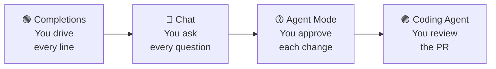
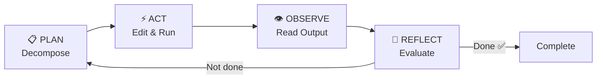
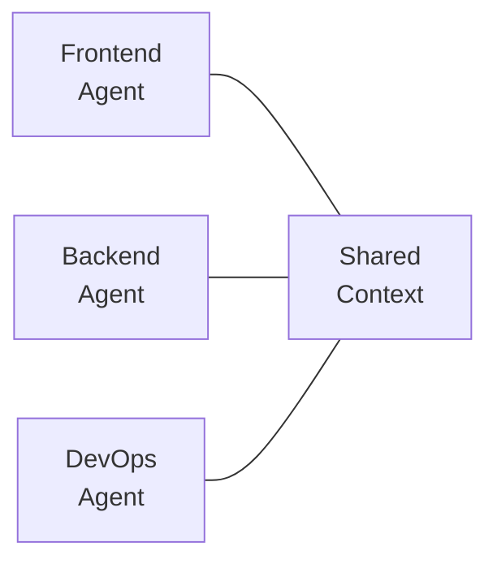
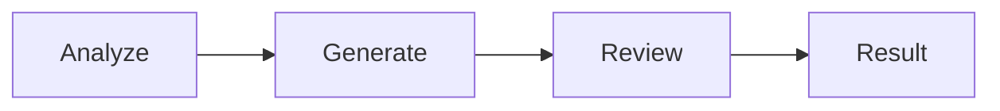
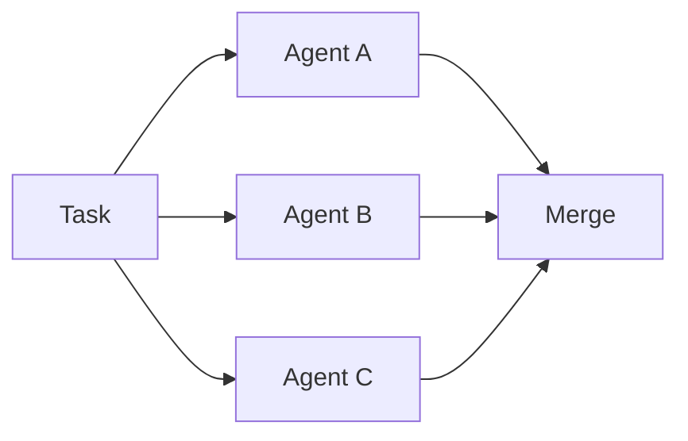
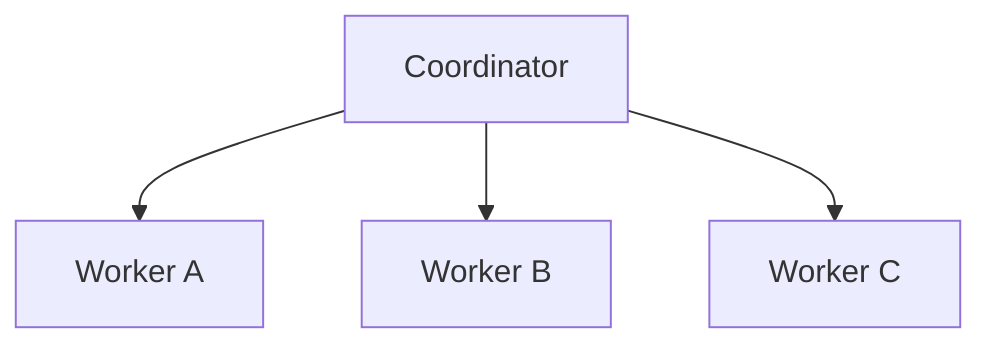

<!-- markdownlint-disable -->

# Copilot Developer Training

## Module 2 — Agentic Patterns

*Agentic Loops · Rubber Duck Debugging · Patterns & Antipatterns*

`github.com/microsoft/GitHubCopilot_Customized`

<!--
Welcome attendees. "This is Module 2 — Agentic Patterns. We'll explore how Copilot's Agent mode actually works under the hood, learn to use AI as a reasoning partner, and build a practical pattern library for agent architecture."
-->

---
class: text-xs
---

# What We'll Cover Today

| Time | Topic |
|------|-------|
| **Session 4** | **Agentic Loops & the Rubber Duck Pattern (75 min)** |
| 5 min | AI Safety: "Autonomy vs. Oversight" |
| 15 min | What Are Agentic Loops? |
| 15 min | Plan-Act-Observe-Reflect Cycle |
| 15 min | The Ralph Loop Deep Dive |
| 15 min | Rubber Duck: Cross-Model Review |
| 10 min | Summary & Discussion |
| | ☕ *Break — 10 min* |
| **Session 5** | **Agent Patterns & Antipatterns (60 min)** |
| 5 min | AI Safety: "Designing Responsible Agents" |
| 15 min | Agent Architecture Patterns |
| 15 min | Orchestration Topologies |
| 15 min | Antipatterns Reference |
| 10 min | Summary & Discussion |

<!--
"Two sessions, one break. Session 4 is about HOW agents work. Session 5 is about HOW TO DESIGN them well — and what to avoid."
-->

---
class: text-sm
---

# Quick Recap — Module 1 Foundations

### Concepts you should know

| Concept | Summary |
|---------|---------|
| **Chat Modes** | Ask (read-only), Agent (edits files), Plan (proposes changes) |
| **Instructions** | `.github/copilot-instructions.md` always loaded; file-targeted use `applyTo` |
| **Custom Agents** | `.github/agents/*.md` — personas with tools and model preferences |
| **Context** | `@workspace`, `#file`, `#selection` — precision beats volume |
| **Token Window** | Finite budget shared by instructions, context, history, and output |

<div class="gh-callout gh-callout-blue">

**If you attended Module 1**, this is review. If you're joining fresh, these are the building blocks for today.

</div>

<!--
"Quick recap from Module 1 for anyone joining fresh. If you were in Module 1, this is a 30-second refresher. Everyone should be comfortable with these five concepts before we proceed."
-->

---
layout: section
---

# Session 4

## Agentic Loops & the Rubber Duck Pattern

<!--
"Let's go under the hood. How does Agent mode actually iterate through tasks?"
-->

---
class: text-sm
---

# AI Safety: Autonomy vs. Oversight

### Where should the human checkpoint be?

| Level | What It Does | Human Role |
|-------|-------------|------------|
| **Completions** | Suggests inline text | Accept/reject each suggestion |
| **Chat (Ask)** | Answers questions | Read and evaluate |
| **Chat (Agent)** | Edits files, runs commands | Review changes before commit |
| **Coding Agent** | Creates PRs autonomously | Review the PR before merge |

<div class="gh-callout gh-callout-purple">

**Key question**: More autonomy = more productivity, but also more risk. Where's the right balance for your team?

</div>

<!--
"Autonomy is a spectrum. Completions are low-risk — you see every character. The Coding Agent is high-autonomy — it works independently and you review the PR. Today we'll understand what happens at each level so you can make informed decisions."
-->

---
class: text-sm
---

# Agentic vs. Non-Agentic

### The fundamental difference

| Characteristic | Non-Agentic (Chat) | Agentic (Agent Mode) |
|---------------|--------------------|--------------------|
| **Turns** | Single prompt → single response | Multiple internal iterations |
| **File changes** | Suggests code in chat | Creates/edits files directly |
| **Tool use** | None (text only) | Terminal, file system, search |
| **Self-correction** | You paste the error back | Agent reads the error and fixes it |
| **Scope** | One question at a time | Multi-step tasks across files |

<div class="gh-callout gh-callout-green">

**The shift**: Non-agentic = you do the loop. Agentic = the AI does the loop.

</div>

<!--
"In chat, if something fails, YOU have to copy the error, paste it back, and say 'fix this.' In Agent mode, the agent reads the error itself and tries again. That's the fundamental difference — who drives the iteration."
-->

---
class: text-sm
---

# The Autonomy Spectrum

### From passive to autonomous



Each step to the right gives the AI more autonomy — and requires more trust.

<div class="gh-callout gh-callout-blue">

**Your progression today**: We'll focus on the yellow and purple zones — Agent Mode and Coding Agent.

</div>

<!--
"Think of this as a trust ladder. You start at completions where you control everything. By the time you reach Coding Agent, the AI is working independently and you're reviewing the output. Today's sessions help you understand the mechanics so you can decide where on this spectrum your team should operate."
-->

---
layout: demo
---

# 🖥️ LIVE DEMO

### Agentic vs. Non-Agentic

- **Ask mode**: "How should I add input validation to the orders endpoint?" — text explanation
- **Agent mode**: "Add input validation to the orders endpoint" — watch file edits, lint runs, fixes
- Point out: Ask mode talks about it. Agent mode does it.

<!--
Keep this demo quick — 3 minutes max. The contrast is the point. Same question, dramatically different behavior.
-->

---
class: text-xs
---

# Plan → Act → Observe → Reflect

### The four phases of every agentic loop

| Phase | What the Agent Does | What You See |
|-------|-------------------|-------------|
| **Plan** | Decompose task, identify files, select strategy | Agent describes approach |
| **Act** | Edit files, run commands, call tools | File changes, commands execute |
| **Observe** | Read output: errors, test results, warnings | Agent processes tool output |
| **Reflect** | Evaluate: did it work? Adjust strategy | Agent pivots or reports success |



<!--
"Every agentic loop follows this cycle. Plan what to do. Do it. Check the result. Decide if you're done. If not, go back to planning. The agent may go through this cycle 3, 5, 10 times for a single task."
-->

---
class: text-xs
---

# Inside Each Phase

**Plan**: "I need to add validation. I'll check existing patterns in `products.ts`, create a validation middleware, and update the orders route."

**Act**: Creates `api/middleware/validation.ts`, edits `api/routes/orders.ts`, runs `npm run lint`

**Observe**: Lint reports `unused import on line 4` and `missing type for parameter`

**Reflect**: "Lint failed — I need to fix the import and add types. Let me try again."

→ Back to **Act** → fixes import → runs lint → **Observe**: passes → **Reflect**: "running tests..." → continues

<div class="gh-callout gh-callout-green">

**Why this matters**: Understanding the cycle helps you write prompts that give the agent a better **plan** from the start.

</div>

<!--
"Notice how the agent's first attempt often isn't perfect. That's normal — the power is in the iteration. The key to better results is giving the agent a better starting plan through a clear, well-structured prompt."
-->

---
layout: demo
---

# 🖥️ LIVE DEMO

### Watching the Cycle in Real-Time

- Give Agent mode a multi-step task: "Add a delivery tracking feature with a new endpoint, service layer, and tests"
- Watch the agent: plan (describes approach) → act (edits files) → observe (runs tests) → reflect (fixes failures)
- Point out each phase as it happens

<!--
This should be a 5-minute demo with a task complex enough to trigger at least one self-correction cycle. The delivery tracking feature is a good choice because it requires multiple files.
-->

---
class: text-sm
---

# The Ralph Loop

### The iterative pattern behind Copilot's Coding Agent

The **Ralph loop** is the iterative cycle the Coding Agent uses: edit → validate → fix → repeat until all checks pass. It's a specialized agentic loop with built-in validation gates.

```
  1. PLAN ──► Read issue → decompose task
  2. EDIT ──► Create/modify files
  3. VALIDATE ──► Lint + Type Check + Tests
  4. PASS? ── Yes ──► Commit → Create PR
     │
     No
     │
  5. FIX ──► Read errors → adjust code
     └─────── Back to step 3
```

<div class="gh-callout gh-callout-purple">

**Key difference from Agent mode**: The Coding Agent runs in a sandboxed environment and iterates until tests pass — or hits a retry limit.

</div>

<!--
"The Ralph loop is the iteration pattern behind the Coding Agent. Where Agent mode asks you to review each step, the Coding Agent runs this loop autonomously — plan, edit, validate, fix — until all checks pass. Then it opens a PR for you to review."
-->

---
class: text-sm
---

# Validation Gates

### What the Ralph loop checks before committing

| Gate | What It Checks | Why It Matters |
|------|---------------|----------------|
| **Lint** | Code style, syntax, unused variables | Catches surface-level issues first |
| **Type check** | TypeScript/type errors | Ensures structural correctness |
| **Tests** | Unit and integration tests | Verifies functional correctness |
| **Build** | Compilation success | Confirms nothing is broken |

### Self-Correction Example

1. **Attempt 1**: Writes validation code → test fails ("expected 400, got 200")
2. **Diagnose**: Reads test failure → "validation middleware isn't being applied"
3. **Attempt 2**: Adds `app.use(validate)` to the route → test passes ✅
4. **All gates pass** → PR created

<!--
"The validation gates are what make the Ralph loop reliable. It's not just generating code — it's running your project's actual lint, type checker, and tests against its own output. This is why copilot-setup-steps.yml matters — without it, the Coding Agent can't run your checks."
-->

---
class: text-sm
---

# When Self-Correction Fails

### Recognizing the failure modes

| Failure Mode | What Happens | Intervention |
|-------------|-------------|-------------|
| **Infinite fix loop** | Fixes one error, introduces another | Clarify the requirement |
| **Wrong approach** | Entire strategy is misguided | Close PR, provide guidance |
| **Missing context** | Can't find necessary info | Add context to issue or instructions |
| **Retry limit** | Gives up after max retries | Review partial progress, complete manually |

<div class="gh-callout gh-callout-blue">

**Pro tip**: Well-written issues with clear acceptance criteria dramatically reduce Coding Agent failures.

</div>

<!--
"The Ralph loop isn't magic. It fails when the task is under-specified, when it picks the wrong approach, or when it gets stuck in a fix loop. The fix is almost always better input — clearer issues, better instructions, more specific acceptance criteria."
-->

---
layout: demo
---

# 🖥️ LIVE DEMO

### The Ralph Loop in Action

- Show a GitHub issue assigned to Copilot Coding Agent
- Watch the process: plan → edit → validate → fix → validate → commit
- Open the PR — show iteration history in the agent's comments
- Point out where self-correction happened

<!--
If you can't demo the Ralph loop live (requires Coding Agent access), show a recorded example or walk through a completed PR that shows the iteration history. The key is seeing the validation gates in action.
-->

---
class: text-xs
---

# Rubber Duck: Cross-Model Review

### A Copilot CLI feature — different model family provides independent review

| Review Approach | Limitation | Rubber Duck Advantage |
|----------------|-----------|----------------------|
| **Self-reflection** | Same training biases, same blind spots | Different model family = different biases |
| **Human review** | Slow, doesn't scale | Fast, automated, catches systematic patterns |
| **Same-family model** | Correlated blind spots | Cross-family = uncorrelated blind spots |

When your orchestrator is **Claude**, Rubber Duck uses **GPT-5.4** — and vice versa.

<div class="gh-callout gh-callout-purple">

**Copilot CLI only** (experimental mode via `/experimental`). Not yet available in VS Code Copilot Chat.

</div>

<!--
"Rubber Duck is a specific GitHub Copilot feature — not just a concept. It uses a second model from a DIFFERENT AI family to review the primary agent's work. Different training data, different blind spots, genuinely independent perspective."
-->

---
class: text-xs
---

# When Rubber Duck Activates

### Three checkpoints where feedback has the highest return

1. **After drafting a plan** — Catching a suboptimal decision early avoids compounding errors downstream
2. **After a complex implementation** — Second set of eyes catches edge cases in complex code
3. **After writing tests, before executing** — Catches gaps in coverage or flawed assertions

Also activates **reactively** if the agent gets stuck in a loop. You can **request a critique at any time**.

### Real-World Catches (SWE-Bench Pro)

| Catch | What Rubber Duck Found |
|-------|----------------------|
| **Architectural** | Scheduler would start and immediately exit, running zero jobs |
| **One-liner bug** | Loop silently overwrote same dict key — dropped 3 of 4 search facets |
| **Cross-file conflict** | 3 files read a Redis key the new code stopped writing |

**Result**: Sonnet + Rubber Duck closes **74.7%** of the gap to Opus alone.

<!--
"Rubber Duck activates at the moments where a second opinion has the highest return. After planning — because a bad plan compounds. After complex code — because edge cases hide. After tests — because false confidence is worse than no tests."
-->

---
layout: demo
---

# 🖥️ LIVE DEMO

### Rubber Duck in Action

- Open **GitHub Copilot CLI** and run `/experimental` to enable Rubber Duck
- Select a Claude model from the model picker
- Give a complex task — show the agent planning
- Point out when Rubber Duck activates (after plan, after implementation)
- Show the critique: what did the second model catch?
- Show the agent incorporating feedback

<!--
Show the cross-family review in action. The key moment is when the second model catches something the primary model missed — that's the value of different training biases.
-->

---
class: text-sm
---

# Session 4 Recap & Discussion

### Key Takeaways

- Agentic loops follow **plan → act → observe → reflect**
- The Ralph loop adds **validation gates** (lint, types, tests) that force self-correction
- **Rubber Duck** provides cross-model-family review at key checkpoints — plan, implementation, tests
- Cross-family critique catches errors that self-reflection misses

### Discussion

- How does understanding the loop change how you interact with Agent mode?
- What tasks in your current sprint would benefit from the rubber duck pattern?
- Where on the autonomy spectrum is your team comfortable?

<!--
10-minute discussion. This is the longest discussion in the module — attendees should have lots of observations from the demos.
-->

---
class: text-sm
---

# ☕ Break — 10 Minutes

Session 5 covers agent architecture patterns and antipatterns.

---
layout: section
---

# Session 5

## Agent Patterns & Antipatterns

<!--
"Now that we understand how agents work, let's learn how to DESIGN them well — and avoid common mistakes."
-->

---
class: text-sm
---

# AI Safety: Designing Responsible Agents

### Guardrails for autonomous systems

| Principle | Description |
|-----------|-------------|
| **Least privilege** | Give agents only the tools they need |
| **Explicit scope** | Define what the agent should and shouldn't do |
| **Human checkpoints** | Require approval for destructive actions |
| **Graceful failure** | Report when stuck, don't silently produce bad output |
| **Auditability** | Every action should be traceable |

<div class="gh-callout gh-callout-blue">

**An agent without guardrails is a liability. An agent with well-designed guardrails is a force multiplier.**

</div>

<!--
"The more autonomy you give an agent, the more important the guardrails become. Least privilege, explicit scope, human checkpoints — these aren't restrictions, they're what make agents trustworthy."
-->

---
class: text-sm
---

# Pattern 1: Single-Agent / Single-Skill

### The simplest agent architecture

One agent, one job. Clear scope, easy to debug.

- **When to use**: Simple, well-defined tasks
- **Pros**: Easy to build, predictable, easy to debug
- **Cons**: Limited capability, can't handle cross-domain tasks
- **Example**: "Fix lint errors in this file"

### Pattern 2: Single-Agent / Multi-Skill

One agent, multiple capabilities. **This is Copilot's Agent mode.**

- **When to use**: Tasks requiring multiple capabilities but one decision-maker
- **Pros**: Single context, consistent reasoning, simpler orchestration
- **Cons**: Instructions can get complex, context window fills faster
- **Example**: "Add a feature with endpoint, service, and tests"

<!--
"Pattern 1 is a specialist — one thing, done well. Pattern 2 is a generalist — this is what Agent mode IS. One agent with file editing, terminal, search, and more. Most of your daily work fits Pattern 2."
-->

---
class: text-sm
---

# Pattern 3: Multi-Agent / Multi-Skill

### Specialized agents collaborating



- **When to use**: Complex, cross-domain tasks where specialization matters
- **Pros**: Deep expertise per domain, cleaner context, parallel potential
- **Cons**: Orchestration overhead, agents may conflict, debugging is harder

### Pattern Comparison

| Aspect | Single/Single | Single/Multi | Multi/Multi |
|--------|--------------|--------------|-------------|
| **Complexity** | 🟢 Low | 🟡 Medium | 🔴 High |
| **Debugging** | 🟢 Easy | 🟡 Moderate | 🔴 Hard |
| **Task scope** | Narrow | Broad | Very broad |

<!--
"Pattern 3 is for when you need deep specialization. A frontend expert, a backend expert, and a DevOps expert — each with focused instructions and tools. The trade-off is orchestration complexity."
-->

---
layout: demo
---

# 🖥️ LIVE DEMO

### Single-Agent with Multiple Skills

- Create a custom agent with 3 tools: `codebase`, `githubRepo`, `fetch`
- Give it a cross-cutting task: "Review orders API for security issues and suggest test improvements"
- Watch it use multiple skills in one conversation
- Discuss when this would break down

<!--
Show the power of a well-configured single agent with multiple tools. Then discuss the limits — when would you need to split into multiple agents?
-->

---
class: text-xs
---

# Orchestration Topologies

### How multiple agents coordinate

**Sequential** — each agent feeds the next:



**Parallel** — independent work, then merge:



**Hierarchical** — coordinator delegates:



<!--
"Three ways to wire agents together. Sequential is a pipeline — review processes. Parallel is fan-out — independent sub-tasks done simultaneously. Hierarchical is the most complex — a boss agent delegates to specialists."
-->

---
class: text-sm
---

# Topology Comparison

### Matching topology to task

| Topology | Latency | Complexity | When to Use |
|----------|---------|------------|-------------|
| **Sequential** | High (stages add up) | 🟢 Low | Clear step-by-step workflows |
| **Parallel** | Low (concurrent) | 🟡 Medium | Independent sub-tasks |
| **Hierarchical** | Medium | 🔴 High | Dynamic, complex decomposition |

### Examples

| Topology | Real-World Example |
|----------|-------------------|
| **Sequential** | Code review pipeline: analyze → fix → validate |
| **Parallel** | Full-stack feature: frontend + backend + tests simultaneously |
| **Hierarchical** | "Implement feature X" — coordinator plans, delegates to domain workers |

<div class="gh-callout gh-callout-green">

**Start simple**: Most teams should start with sequential before attempting parallel or hierarchical.

</div>

<!--
"Don't jump to hierarchical because it sounds cool. Start with sequential pipelines — they're easy to debug and understand. Graduate to parallel when you have genuinely independent sub-tasks."
-->

---
layout: demo
---

# 🖥️ LIVE DEMO

### Multi-Agent Concept

- Show two custom agents: `frontend-expert.md` and `api-expert.md`
- Use one for a frontend question, the other for an API question
- Discuss how a coordinator could delegate between them
- Show the conceptual flow (full orchestration is outside Copilot's current scope)

<!--
This is a conceptual demo — we're showing how you'd DESIGN a multi-agent system, not implementing full orchestration. The key point is that each agent has focused context and expertise.
-->

---
class: text-xs
---

# The 8 Agent Antipatterns

### Common mistakes to avoid (1–4)

| # | Antipattern | Symptom | Fix |
|---|-------------|---------|-----|
| 1 | **God Agent** | One agent handles everything; unfocused output | Split into specialized agents |
| 2 | **Context Stuffing** | Slow responses, truncated context | Attach only relevant files |
| 3 | **Missing Guardrails** | Agent modifies wrong files, runs destructive commands | Add "do not" rules + tool restrictions |
| 4 | **Over-Delegation** | Incorrect output on complex tasks | Match task to agent capability |

### (5–8)

| # | Antipattern | Symptom | Fix |
|---|-------------|---------|-----|
| 5 | **Tool Sprawl** | Wrong tool selection, wasted tokens | Limit tools per agent |
| 6 | **No Validation Loop** | Unverified output accepted | Require lint/test/build pass |
| 7 | **Prompt Injection Blind Spot** | Malicious content from tool outputs | Validate external input |
| 8 | **Stale Instructions** | Generates deprecated patterns | Review instructions quarterly |

<!--
"These are the 8 most common mistakes we see. Most teams hit at least 3 of these when they start building agents. The fix is almost always about being more intentional — focused agents, limited tools, explicit guardrails."
-->

---
class: text-xs
---

# Antipattern Case Studies

**Case 1 — God Agent**: One agent for frontend, backend, database, AND DevOps. Asked to "add a feature" → modified Dockerfiles, API routes, React components, and migrations simultaneously → tangled PR.

**Fix**: Three specialized agents (frontend, backend, infrastructure) with focused instructions.

**Case 2 — Context Stuffing**: 15 files attached to a code review. Context window overflowed → superficial summary of the first 3 files, rest ignored.

**Fix**: Review one module at a time with targeted `#file` references.

<div class="gh-callout gh-callout-blue">

**Detection checklist**: Focused purpose? Limited tools? Explicit scope? Validation step? Current instructions?

</div>

<!--
"These aren't hypothetical — we've seen both of these in real teams. The God Agent is the most common. Teams get excited, give one agent everything, and wonder why it produces unfocused output. Specialization wins."
-->

---
class: text-sm
---

# Module 2 Complete — Key Takeaways

| Session | Core Concept |
|---------|-------------|
| **Session 4: Agentic Loops** | Plan → act → observe → reflect cycle; Ralph adds validation gates; Copilot is a rubber duck that talks back |
| **Session 5: Patterns** | Choose the right pattern (single vs. multi); select matching topology; avoid the 8 antipatterns |

### What to Do Next

1. Watch Agent mode's loop in action — identify the phases
2. Try the rubber duck pattern before your next implementation
3. Audit your custom agents against the antipattern checklist
4. Design specialized agents for your team's top 2-3 workflows

<div class="gh-callout gh-callout-purple">

**Next**: Module 3 covers Extensions, MCP, evaluation frameworks, and troubleshooting.

</div>

<!--
"That's Module 2 complete. You now understand how agents work and how to design them well. Module 3 takes you further — extending Copilot with MCP, evaluating output quality, and debugging when things go wrong."
-->

---
layout: end
---

# Module 2 Complete

## Agentic Patterns

*Continue to Module 3: Advanced Topics →*

<div class="gh-callout gh-callout-blue">

**Copilot Developer Training** · Module 2 of 3

</div>

<!--
Thank attendees. Point to the lab guide for hands-on practice. Announce Module 3 timing.
-->
