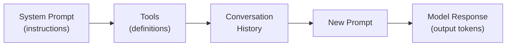
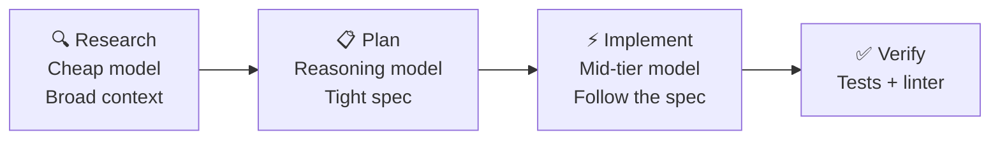

<!-- Welcome the group to Module 2 and frame the shift from foundations to autonomy. In Module 1 we learned how to drive Copilot intentionally; now we explore what happens when Copilot drives itself. Set the expectation that higher autonomy is powerful but demands proportionally stronger guardrails: review gates, scope boundaries, and clear off-ramps. Ask who has already tried agent mode or the coding agent so you can gauge the room's comfort level before diving into definitions. -->

---
layout: image-full
background: /images/copilot-dev-agentic/slide-02-def618f2.png
---

<!-- Define the agent loop: Plan, Act, Observe, Adjust. Stress that this loop is not unique to AI — it mirrors how experienced engineers already work — but Copilot can now execute it autonomously within a session. Distinguish an agent from a skill: a skill is a single-shot capability like code completion or test generation, while an agent orchestrates multiple skills across steps. Use a kitchen analogy — a skill is a knife, an agent is the chef who sequences knife work, heat, plating, and timing. Ask the audience to think of a recent task that required more than one tool or step and whether they delegated it or did each step manually. -->

---
layout: image-full
background: /images/copilot-dev-agentic/slide-03-d007efee.png
---

<!-- Walk through the decision tree on the slide: Does the task require multiple steps? Does it need judgment between alternatives? Does it need to adapt based on intermediate results? If all three answers are yes, you want an agent. If the task is a single well-defined action, a skill is simpler, faster, and easier to review. Give two concrete examples: generating a unit test file is a skill; migrating a codebase from one ORM to another across dozens of files is an agent-level task. Emphasize that choosing the wrong level is not just inefficient — an agent on a skill-level task wastes tokens and review time, while a skill on an agent-level task produces incomplete results. -->

---
layout: image-full
background: /images/copilot-dev-agentic/slide-04-a45cb249.png
---

<!-- Introduce background agents as the first step toward async AI collaboration. The key value proposition is that the developer can continue working on something else while the agent handles a bounded task in the background. Walk through the lifecycle shown on the slide: launch an agent with a clear scope, monitor its progress through status updates, then review and approve or reject the result. Stress the review gate — background work does not merge itself. Compare it to assigning a task to a junior teammate: you define scope, check in periodically, and review the deliverable before it ships. Mention that background agents run in a sandboxed session, so they cannot affect the working tree until the developer accepts changes. -->

---
layout: image-full
background: /images/copilot-dev-agentic/slide-05-d7a70617.png
---

<!-- Explain cloud agents, specifically the Coding Agent, as the most autonomous Copilot surface: it runs on a remote runner, creates a branch, implements changes, and opens a pull request. Walk through the flow on the slide: assign an issue, the agent picks it up, works in its own environment, and delivers a PR for human review. Highlight copilot-setup-steps.yml as the configuration file that defines the agent's environment — dependencies, build commands, and test scripts it should run. Emphasize that every PR from the coding agent goes through normal code review, CI, and approval gates. The human stays in control of what merges. Ask the audience what kinds of issues they would feel comfortable assigning to a coding agent today versus what feels too risky. -->

---
layout: image-full
background: /images/copilot-dev-agentic/slide-06-e46ee6ed.png
---

<!-- Position /init as a scaffolding accelerator, not a replacement for architecture decisions. It generates project structure, config files, and boilerplate based on a natural-language description. The safety moment here is critical: always review what /init produces before building on top of it. Scaffolded output may include dependency versions, folder structures, or patterns that do not match your team's standards. Encourage the audience to treat /init output the same way they would treat a Stack Overflow answer — useful starting material that needs verification and adaptation. -->

---
layout: image-full
background: /images/copilot-dev-agentic/slide-07-a3ce305d.png
---

<!-- Walk through the five-layer instruction stack from broadest to narrowest: organization policies, repository-level copilot-instructions.md, file-scoped instruction headers, user settings, and session context. Explain that narrower layers override broader ones, which lets teams set guardrails at the org level while individual repos and files can add precision. Give a concrete example: an org rule says "always write tests," a repo instruction says "use pytest with fixtures," and a file instruction says "mock the database layer." Stress the safety principle that individual developers should not override organizational guardrails — the layering exists to protect consistency and compliance. If you are demoing, preview that the lab will have them create a repo-level and file-scoped instruction and observe how Copilot behavior changes. -->

---
layout: image-full
background: /images/copilot-dev-agentic/slide-08-80808a32.png
---

<!-- Introduce the Squad pattern as a worked example of multi-agent collaboration. In the Squad model, you assign different agents to different roles: one implements, one reviews, and one tests. Each agent works independently and the results converge through normal review processes. Explain why this works: specialization reduces context pollution, and separation of concerns mirrors how human teams already operate. The key tradeoff is coordination overhead — launching three agents is only worthwhile when the task is large enough to justify the setup cost. For small tasks, a single agent session is simpler and faster. Ask the room whether they have tried using Copilot to review its own output and what they noticed about blind spots. -->

---
layout: image-full
background: /images/copilot-dev-agentic/slide-09-efa443df.png
---

<!-- This is one of the most important safety concepts in the module. An off-ramp is a deliberate exit point where the agent stops, escalates, or returns partial results rather than continuing to iterate on a failing path. Explain the three scenarios on the slide: knowing when to stop because the task is complete, when to escalate because the task exceeds the agent's capability, and when to return partial results because full completion is blocked. Draw the parallel to human engineering — we do not let a stuck build loop forever; we set timeouts and alerts. The same discipline applies to agentic workflows. Encourage the audience to design off-ramps before launching agents, not after something goes wrong. -->

---
layout: image-full
background: /images/copilot-dev-agentic/slide-10-201c664c.png
---

<!-- Rubber duck debugging with Copilot means using the model as a sounding board to validate your reasoning, not just to generate code. Encourage developers to explain their approach to Copilot and ask it to find flaws, edge cases, or alternative interpretations. A second powerful technique is cross-model review: if you generated code with one model, ask a different model to review it, since different models have different blind spots. The key principle is to validate independently — do not ask the same session that generated the code whether the code is correct, because it will tend to confirm its own output. Start a fresh session or switch models for genuine review. -->

---
layout: image-full
background: /images/copilot-dev-agentic/slide-11-aae4574e.png
---

<!-- Use this synthesis slide to connect the topics into one coherent mental model. Trace the arc: we defined what agents and skills are, learned when to use each, explored the spectrum from background agents to fully autonomous cloud agents, layered instructions to control behavior, designed multi-agent workflows with Squad, and built in safety with off-ramps and rubber duck validation. Ask the audience which concept surprised them most or which one they plan to try first. This is a good moment to take a few questions before transitioning to token optimization. -->

---
layout: section
---

# Agent Quality & Token Optimization

<!-- Transition into optimization. Frame this shift: we've learned how agents work — now let's learn how to use them efficiently. The key message is "make every token count" rather than "count every token." Quality-first thinking is counterintuitive because people assume better output costs more. In reality, higher-quality agent interactions often use fewer total tokens by avoiding retries, misses, and wasted sessions. -->

---
class: text-sm
---

# Why Quality Over Cost

<v-clicks>

- **ROI formula**: If agent output value = 0, even 90% cost savings is just toil
- **Compounding error**: 99% single-step accuracy → ~60% over 50 steps
- **95% accuracy** → only ~8% success over 50 steps
- Every agent miss = wasted tokens (discarded work + fix sessions + review cycles)

</v-clicks>

**Key insight**: Improving quality often *decreases* cost — they're aligned, not opposed.

<!-- Open with the rocket analogy from the reference presentation: the current state is like launching 20 rockets hoping one lands on the moon. We want precision, not volume. Walk through the compounding error math — if each individual step in a 50-step agent workflow is 99% accurate, the end-to-end probability is 0.99^50 ≈ 60%. At 95% per step it drops to 8%. This is why quality per step is the dominant lever. Ask: "How many steps does your typical agent task take?" Even 10 steps at 95% is only 60%. -->

---
class: text-sm
---

# Context Windows — How Tokens Accumulate

<v-clicks>

- LLMs are **word-probability machines** — more irrelevant context shifts probabilities away from your goal
- Agents are **stateless** — entire conversation re-sent every loop iteration
- Input tokens accumulate linearly; output tokens cost more (require compute)
- **Golden rule**: As little context as possible, but as much as required

</v-clicks>

<!-- Explain that context windows are not memory — they're the full input sent on every call. Draw the analogy: it's like re-reading an entire book from page 1 every time you want to look up a fact on page 200. That's expensive. Show the mermaid diagram and explain how each section competes for space. System prompt and tools are "fixed cost" — they're always there. Conversation history grows over time. This is why agents get worse as sessions get longer. -->

---
class: text-sm
---

# Context Rot

**Warning signs that your context is degrading:**

<v-clicks>

- **Lost in the middle** (~50% window fill): Model biases toward beginning and end tokens, forgets middle content
- **Recency bias** (~60–70% fill): Model forgets system prompt, instructions, and original goal
- **Symptom**: Agent starts ignoring your constraints or repeating earlier mistakes

</v-clicks>

**Rule of thumb**: Start worrying at 60–70% context window usage. Use `/clear` for new tasks.

<!-- This is one of the most practical concepts to internalize. Ask: "Have you ever noticed Copilot ignoring your instructions deep into a long session?" That's recency bias — the model has pushed your system prompt out of its effective attention window. The fix is simple: start fresh sessions for new tasks. Don't stack unrelated work. Compaction (automatic summarization) can help but risks losing important context. The safest approach is deliberate session hygiene. -->

---
class: text-sm
---

# Control 1: Model Selection

| Task Type | Recommended Tier | Examples |
|-----------|-----------------|----------|
| **Planning & architecture** | Reasoning (Opus, o-series) | Design docs, migration plans, root-cause analysis |
| **Implementation** | Mid-tier (Sonnet, GPT-4.5) | Code with a clear spec, refactoring |
| **Simple edits** | Low-tier (Haiku, GPT-mini) | Typo fixes, formatting, rename variables |

<v-clicks>

- **Auto mode** performs intent detection — use as default
- Up to **24× cost difference** between highest and lowest tier
- Match model capability to task complexity

</v-clicks>

<!-- Model selection is the single biggest cost lever. Most developers use one model for everything — that's like using a semi-truck for grocery runs AND cross-country hauls. Auto mode is a great default because it does intent detection, but for known task types you can be explicit. When you're doing a research/plan/implement split, you can use reasoning models for the plan step and mid-tier for implementation. The 24× price difference means getting this right is worth more than all other optimizations combined. -->

---
class: text-sm
---

# Control 2: Precise Prompts with Stop Signals

**Bad**: "Fix the bug"

**Good**: "Fix Issue #45 — the cache invalidation race in `src/cache.ts` line 42. The write completes after invalidation. Stop when the failing test in `cache.test.ts` passes."

<v-clicks>

- Include file paths and issue numbers you already know
- Add explicit **stop conditions** to prevent over-execution
- Provide known context upfront — don't pay tokens for the agent to discover what you know
- "Be concise" in instructions trims output tokens on every response

</v-clicks>

<!-- Walk through the before/after. The bad prompt forces the agent to discover which bug, which file, what the symptom is, and when to stop. That's potentially dozens of tool calls just to orient. The good prompt gives all known context upfront and a clear success criterion. This saves discovery tokens and prevents the agent from going off on tangents. The stop signal is critical — without it, agents often over-engineer or start "improving" adjacent code they weren't asked to touch. -->

---
class: text-sm
---

# Control 3: Split Tasks — Research → Plan → Implement

<v-clicks>

- **Research**: Discover files, understand patterns (OK to be loose)
- **Plan**: Create airtight spec with reasoning model (invest here)
- **Implement**: Execute spec with mid-tier model (parallelizable)
- **Verify**: Deterministic checks catch drift

</v-clicks>

<!-- This is the divide-and-conquer pattern for agent work. Most people throw everything at one session — research, planning, AND implementation — which means the cheapest work (discovery) uses expensive reasoning tokens, and the implementation step has a polluted context full of research artifacts. Splitting lets you match model tier to task type AND keep each context window clean. The plan becomes the handoff artifact between phases. Ask: "What's a real task you could split this way?" -->

---
class: text-sm
---

# Control 4: Deterministic Guardrails

<v-clicks>

- **Tests** are the single most powerful guardrail
- A failing test resets agent accuracy from a 40% drift back to 99%
- Tests cost less than: shipped bugs + incidents + debug sessions + customer trust
- Reference: GitHub Copilot CLI team's codebase is **50%+ tests**

</v-clicks>

**Also effective**: Linters, type checkers, security scanners, build gates — anything deterministic that catches drift before it compounds.

<!-- This is David's key point from the reference presentation: tests are not just quality assurance, they're the error-correction mechanism for probabilistic agents. Without tests, a small drift in step 3 compounds through steps 4-50 and the entire session is wasted. With tests, the agent gets immediate feedback and self-corrects. The analogy is GPS navigation — without it you drift off course gradually; with it you get "recalculating" and course-correct immediately. Challenge the room: "What percentage of your codebase is tests?" -->

---
class: text-sm
---

# Control 5: Persistent Instructions

<v-clicks>

- Keep `copilot-instructions.md` **small and precise** — non-negotiables only
- Use as an **"agent miss log"**: recurring failures become instructions
- Do not generate instructions with AI — they should capture what AI cannot figure out independently
- "Be concise" → trims output tokens on every single response
- Review and refresh every ~3 months (treat like a living runbook)

</v-clicks>

**Anti-pattern**: Stuffing instructions with framework tutorials the model already knows from training data.

<!-- Instructions are always-on context — every token in copilot-instructions.md is sent on every single call. So they must earn their place. The best instructions capture things that are unique to YOUR project and that agents repeatedly get wrong. Think of it like an incident retrospective: when an agent fails in a patterned way, add a one-line instruction to prevent that class of failure. Don't duplicate framework documentation that's already in training data. Ask: "What's one instruction that would have prevented your last agent miss?" -->

---
layout: statement
---

# Top 5 Agent Optimization Actions

<!-- Pause here for effect before revealing the summary. This is the memorable takeaway slide that the audience should be able to recite tomorrow. Frame it as: "If you remember nothing else from this section, remember these five." -->

---
class: text-sm
---

# Your Optimization Checklist

<v-clicks>

1. 🎯 **Choose the right model** for the task (Auto mode as default, explicit for known patterns)
2. 📝 **Write precise prompts** with stop signals and known context upfront
3. ✂️ **Split tasks**: Research → Plan → Implement (match model tier to phase)
4. 🧪 **Use deterministic guardrails** — tests, linters, type checkers as error-correction
5. 📋 **Maintain concise instructions** — human-written, non-negotiables only, refreshed quarterly

</v-clicks>

**Remember**: Quality and cost optimization are aligned — better agents use fewer tokens.

<!-- Walk through each item briefly. Emphasize that these are ordered by impact — model selection saves the most, followed by prompt precision, then task splitting, then guardrails, then instructions. But all five together create a compound effect. The audience should leave this section with at least one action they can implement tomorrow. Ask for a quick show of hands: "Which of these five are you already doing? Which will you start this week?" -->

---
layout: image-full
background: /images/copilot-dev-agentic/slide-12-76082005.png
---

<!-- Preview the three lab exercises: exploring agent vs. skill behavior, setting up instruction layering at repo and file scope, and building a custom agent with background execution. Remind participants of the safety principles from the module — especially review gates and off-ramp design — and encourage them to apply those habits during the exercises. Mention that Module 3 will go deeper into MCP, debugging agent behavior, and designing complex agentic loops, so this lab is a bridge between understanding patterns and building real workflows. -->
