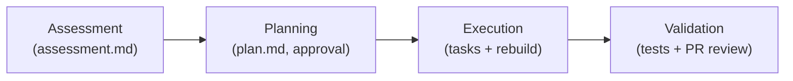

# Module 4: C++ for Hardware Developers

### GitHub Copilot Developer Training — C++ / Hardware Edition

<!-- Welcome hardware, firmware, and embedded developers. This module adapts the shared Copilot curriculum for low-level C++ work — the kind that controls real devices. The goal is to use GitHub Copilot as a precise, accountable acceleration layer on firmware and drivers, not as an autopilot. Calibrate the room: ask who works on embedded targets, vendor SDKs, or real-time systems so you can tune examples to the audience. -->

---
layout: section
---

# 1. Framing: Copilot for Embedded C++

<!-- This opening section sets the mental model. Hardware codebases stack vendor SDKs, HAL layers, and conditional compilation on top of already-hard C++ semantics. Make the point early that Copilot accelerates discovery, drafting, and modernization, but correctness, timing, and hardware safety stay with the developer. Keep this short — it frames the three concrete skills that follow. -->

---
layout: default
class: text-sm
---

# Why C++ Is Hard for Tools

### Text search returns noisy, misleading results

<v-clicks>

- **Includes & macros** — meaning depends on the preprocessor
- **Templates & overloads** — one name, many real symbols
- **Build-dependent config** — flags and defines change everything
- **Hardware layers** — vendor SDKs, HAL, conditional compilation

</v-clicks>

**Low-level reality**: code controls real devices — every suggestion is draft until build, static analysis, and on-target testing pass.

<!-- Walk through why grep is unreliable on C++: the same identifier can resolve to different symbols depending on preprocessor state and overload resolution. On hardware codebases this is worse because of vendor SDKs and heavy conditional compilation. Land the safety point firmly — a defect in firmware can damage hardware or create a safety hazard, so the human review gate is non-negotiable. Tee up that the next section fixes the noise problem with semantic understanding. -->

---
layout: statement
---

# Copilot accelerates the work — you stay accountable for the device

<!-- This is the memorable one-liner for the module. Say it plainly: Copilot is an acceleration layer for discovery, drafting, and modernization, but the developer owns correctness, real-time constraints, and hardware safety. Use it to transition from framing into the first hands-on capability. -->

---
layout: demo
---

# 🖥️ LAB: Exercise 1

### Validate the C++ Workspace (5 min)

- Confirm the toolchain builds the sample project
- Verify the Copilot CLI is installed
- Run one `#file`-scoped understanding query
- Spot a construct text search would misread

<!-- Send students into Exercise 1. The aim is a baseline: confirm the environment works and feel where Copilot is vague because it lacks build context. Ask them to note one low-level construct — a register access, macro, or template — that a text-only tool would likely misread. That observation motivates the Language Server setup in the next section. -->

---
layout: section
---

# 2. C++ Code Intelligence: LSP vs. grep

<!-- This is the core capability section. The Microsoft C++ Language Server gives Copilot the same IntelliSense engine that powers Visual Studio and VS Code — precise symbols, references, call hierarchies, and types. Emphasize that this is now available in the CLI, enabling agentic C++ workflows outside the editor. -->

---
layout: two-cols
class: text-sm
---

# Semantic vs. Text Search

### With the C++ Language Server

- Workspace symbol search — exact matches
- Go-to-definition — the precise declaration
- References & call hierarchy — real edges

::right::

### With grep only

- Iterative, multi-pass searching
- Every textual mention, relevant or not
- Noisy, often misleading results

<!-- Contrast the two columns directly. The LSP returns precise, single-pass results because it understands the code the way the compiler does; grep returns every textual mention and forces multiple noisy passes. Reinforce the safety nuance: a correct symbol match is not a correct design decision — precision reduces noise, it does not remove the need to review correctness and safety. -->

---
layout: default
class: text-sm
---

# The Compilation Database

### `compile_commands.json` is the key C++ context enabler

<v-clicks>

- Tells Copilot **how your code is actually built** — includes, defines, standard, target
- **CMake**: `-DCMAKE_EXPORT_COMPILE_COMMANDS=ON` (or the setup skill)
- **MSBuild**: use the MSBuild extractor sample until integrated support ships
- Install `@microsoft/cpp-language-server`, then append **"Use the C++ LSP"**

</v-clicks>

**Keep it current**: regenerate after build-config changes so the LSP never reasons about stale flags.

<!-- This is the most practical slide of the section. Make sure everyone understands that compile_commands.json is what unlocks semantic results — without it the LSP cannot reason accurately. Show the CMake one-liner and mention the MSBuild extractor sample for vcxproj projects. Note the two activation paths in the CLI: append "Use the C++ LSP" to queries, or add a custom instruction telling Copilot to prefer the LSP. Flag the local-but-exposes-build-config privacy point for the safety moment. -->

---
layout: demo
---

# 🖥️ Demo: LSP vs. grep

### Same query, two engines

- Ask "find all formatter classes and their base classes" with grep only
- Note the noisy, multi-pass output
- Re-run with **"Use the C++ LSP"** appended
- Compare: precise, single-pass symbol results

<!-- Run this live on a real codebase such as {fmt} or a sample HAL. The contrast is the whole point — the grep pass is noisy and iterative, the LSP pass is precise and immediate. Then show a go-to-definition style query jumping to the exact declaration rather than every mention. Tie it to the optimization tip: front-load the compilation database once and every later query is cheaper and more accurate. -->

---
layout: demo
---

# 🖥️ LAB: Exercise 2

### Set Up and Query with the C++ LSP (5 min)

- Generate `compile_commands.json`
- Install `@microsoft/cpp-language-server`
- Run the same query with and without the LSP
- Document the difference in precision

<!-- Send students into Exercise 2. They will generate the compilation database, install the Language Server, and compare an LSP-backed query against a grep-backed one on the same code. The deliverable is a documented difference in result precision and awareness of what build context is being shared. This setup carries forward into the rest of the module and the hack. -->

---
layout: section
---

# 3. Context & Instructions for Embedded C++

<!-- Shift from understanding code to steering generation. Instruction files encode durable embedded constraints so every suggestion respects house style without repeating rules in each prompt. This is where generic C++ suggestions most often go wrong on hardware, so it pays off quickly. -->

---
layout: default
class: text-sm
---

# Instruction Files for Firmware

### Encode embedded constraints once

<v-clicks>

- Fixed-width `<cstdint>` types — `uint32_t`, not `unsigned int`
- No dynamic allocation after init — `std::array`, fixed buffers
- RAII for handles; avoid exceptions in ISR / real-time paths
- Mark memory-mapped registers `volatile` — verify vs. datasheet

</v-clicks>

**Steer, don't repeat**: durable rules live in `.github/copilot-instructions.md`, not in every prompt.

<!-- These rules are exactly where generic suggestions fail on embedded targets. Show that an instruction file moves these constraints out of prompts and into a single source of truth, lowering token use and raising consistency. Stress the safety nuance: instruction files reduce unsafe defaults but never replace review of timing-critical or memory-mapped code. Memory-mapped and volatile accesses have semantics Copilot can miss — always verify generated register code against the datasheet. -->

---
layout: demo
---

# 🖥️ Demo: Steering with Embedded Instructions

### Before and after the instruction file

- Generate a register-write helper with no instructions
- Add `copilot-instructions.md` with embedded rules
- Re-generate — note fixed-width types and `volatile`
- Scope a follow-up with `#selection` on the register map

<!-- Run the before/after live. The first helper, generated with no instruction file, often makes generic and possibly unsafe choices; the second respects the platform conventions. Use #selection on a register map to keep the context tight and show how scoping reduces noise. Connect to the optimization tip: every constraint stated inline costs tokens on every request — encode it once instead. -->

---
layout: demo
---

# 🖥️ LAB: Exercise 3

### Author Embedded C++ Instructions (5 min)

- Write `.github/copilot-instructions.md` for embedded rules
- Generate a register/HAL helper before and after
- Confirm fixed-width types and `volatile` access
- Save the setup for the Day 2 hack

<!-- Send students into Exercise 3. They author an embedded instruction file and re-run a register/HAL prompt to compare before-and-after suggestions. The goal is a reusable Copilot-ready C++ project setup — compilation database plus instruction file — that they will bring to the hack. Remind them the safety checkpoint still applies: verify generated register and ISR code against the datasheet and timing requirements. -->

---
layout: section
---

# 4. Agentic Modernization: `@Modernize`

<!-- The final capability section makes the agent loop concrete for C++ developers. @Modernize is an agentic Visual Studio workflow that upgrades C++ projects to newer MSVC Build Tools and iteratively fixes the resulting build issues with approval. This gives the audience an immediate "this is relevant to me" anchor for agentic patterns. -->

---
layout: default
class: text-sm
---

# The Four-Stage Loop

### Assess → Plan → Execute → Validate

**Good off-ramp design**: the agent proposes and stops for approval at each stage — it never silently applies fixes.

<!-- Walk the four stages. Assessment upgrades settings, builds, and writes assessment.md describing problems and severity. Planning produces plan.md and requires approval before proceeding. Execution breaks the plan into tasks, can branch and commit, and rebuilds to verify each change. Post-upgrade validation routes the result through tests and a peer PR review. Emphasize the off-ramp design: this approval-gated, assessment-first pattern is worth copying in your own agent workflows. -->

---
layout: default
class: text-sm
---

# Running It Safely

<v-clicks>

- **Approve before execution** — review `plan.md`, then let it run
- **Scope the work** — tell it to skip pre-existing warnings and strategic exceptions
- **Cloud variants** — `copilot-setup-steps.yml` installs compilers and build tooling
- **Always validate** — tests plus peer PR review before release

</v-clicks>

**Scope = savings**: a narrower scope means fewer assessment items, a shorter plan, and fewer iterations.

<!-- This slide is the practical how-to. Reinforce that modernization changes build flags and code, so the plan.md review is the critical gate before approving execution. The scoping point doubles as the optimization tip — skipping pre-existing warnings keeps the agent focused on upgrade-relevant issues, reducing agent time and token cost. For cloud agents on C++ projects, the environment must be buildable, which is what copilot-setup-steps.yml provides. -->

---
layout: demo
---

# 🖥️ Demo: Modernize Walkthrough

### Assess, approve, execute, validate

- Retarget a sample solution to newer MSVC Build Tools
- Launch `@Modernize` from Solution Explorer
- Review `assessment.md`, then approve `plan.md`
- Watch it execute and rebuild, then route to tests + PR

<!-- Run the walkthrough end to end if you have a sample solution ready, or narrate it from screenshots. The key beats are the human approval gates: review the assessment, then the plan, then approve execution. Point out the rebuild-to-verify loop after each change. Close by routing the result into the team's test infrastructure and a pull-request review — never let modernization land on firmware without on-target validation. -->

---
layout: section
---

# 5. Wrap-up & Hack Handoff

<!-- Bring the three capabilities together and point them at the hack. Students can now set up semantic C++ intelligence, steer Copilot with embedded instructions, and run agentic modernization with human approval gates. The strongest learning happens when they apply this to a real codebase on Day 2. -->

---
layout: default
class: text-sm
---

# What You Can Now Do

<v-clicks>

- **Semantic C++ intelligence** — LSP + `compile_commands.json`
- **Embedded steering** — instruction files for firmware conventions
- **Agentic modernization** — `@Modernize` with approval gates
- **Carry it forward** — bring a real codebase to the Day 2 hack

</v-clicks>

**Build trust ≠ blind trust**: precision tools earn confidence, but verify on hardware.

<!-- Summarize the three skills and connect them: the compilation database powers the LSP, instruction files steer generation, and the agent loop modernizes legacy code with human gates. Encourage teams to bring a real firmware, driver, or embedded codebase to the hack and apply these on production-shaped problems. End on accountability — Copilot is a precise acceleration layer, but correctness, timing, and hardware safety remain the developer's responsibility. -->

---
layout: end
---

# Thank You

### Bring your firmware to the hack

<!-- Close the module. Invite questions and remind the room of the single most important rule: keep the human review gate explicit for every low-level change that ships. Point them to the lab setup they saved — compilation database plus instruction file — as the starting point for Day 2. -->
