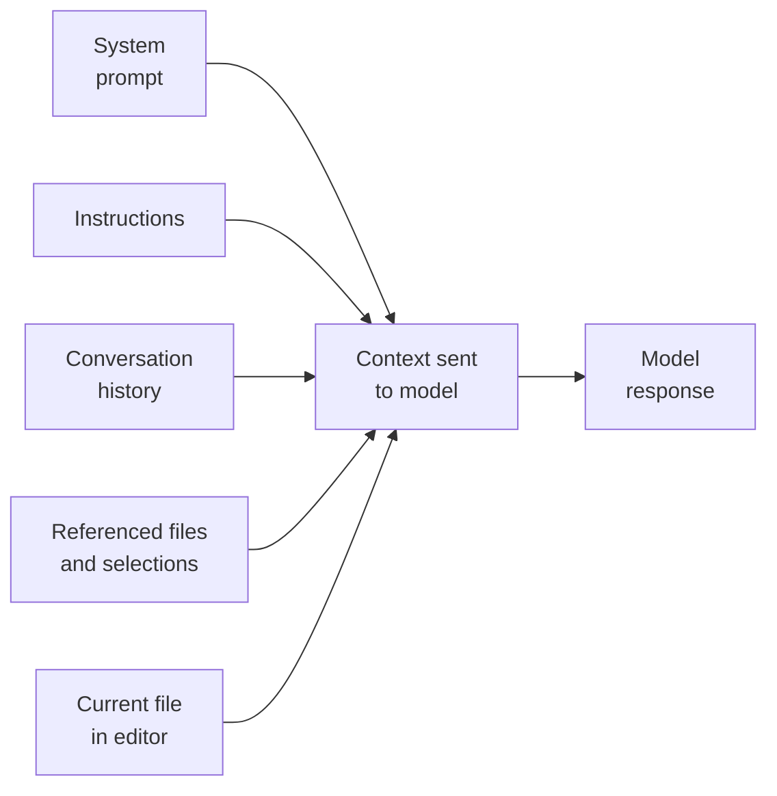
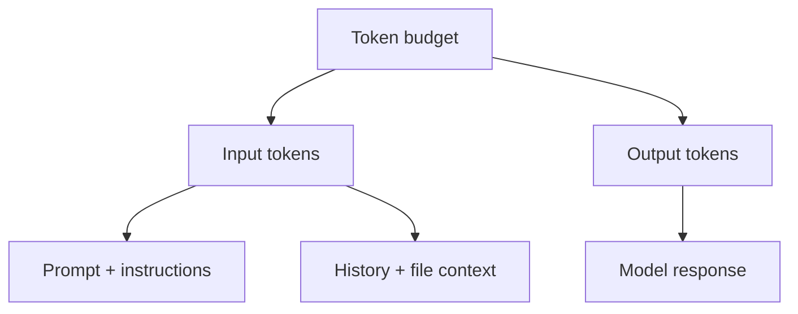

<!-- markdownlint-disable -->

# Copilot Developer Training

## Module 1: Foundations

*VS Code Chat · GitHub CLI · Context & Instructions · Models & Tokens*

<div class="gh-callout gh-callout-purple">

**90-minute module**: ~58 minutes of presentation and ~32 minutes of hands-on lab time.

</div>

<!-- notes
Welcome the group. Set the expectation that this module is practical: learn the core Copilot surfaces, then reinforce each section with a short lab exercise.
-->

---
class: text-sm
---

# Agenda

### Four sections, four lab checkpoints

| Section | Presentation | Lab | Focus |
|---------|--------------|-----|-------|
| **1. Copilot Chat Tour** | 14 min | 8 min | Interface, modes, commands |
| **2. GitHub CLI** | 8 min | 5 min | `gh copilot`, extensions |
| **3. Context & Instructions** | 17 min | 9 min | Context window, layering, sessions |
| **4. Models & Tokens** | 19 min | 10 min | Model picker, token budgeting |
| **Total** | **58 min** | **32 min** | **90 min** |

<div class="gh-callout gh-callout-blue">

**Flow**: Learn a concept, see the workflow, then try it in the lab while it is still fresh.

</div>

<!-- notes
Walk the room through the pacing. The goal is not to memorize every feature, but to leave with a reliable operating model for daily Copilot use.
-->

---
layout: section
---

# Copilot Chat Tour

<!-- notes
Transition from the module roadmap into the first section. This section is about basic interaction surfaces and choosing the right level of autonomy.
-->

---
class: text-sm
---

# AI Safety: AI as Partner, Not Replacement

<div class="gh-callout gh-callout-purple">

**Mindset**: Copilot suggests, you decide. Treat every answer, diff, and command as a draft that still needs human review.

</div>

<v-clicks>

- Use Copilot to accelerate exploration, boilerplate, and first drafts.
- Keep human judgment on correctness, security, edge cases, and business rules.
- Review output with the same care you expect in peer review.

</v-clicks>

<!-- notes
Keep this short. The point is to establish a healthy trust model early: useful assistant, never unreviewed authority.
-->

---
class: text-sm
---

# VS Code Chat Interface

### Three entry points, three interaction styles

| Surface | How to open it | Best for |
|---------|----------------|----------|
| **Chat panel** | Sidebar or `Ctrl+Shift+I` | Longer conversations, planning, repo-wide questions |
| **Inline chat** | `Ctrl+I` in the editor | Focused edits in the current file or selection |
| **Quick chat** | `Ctrl+Shift+Alt+L` | Fast one-off questions without changing your main thread |

<v-clicks>

- The **panel** is your main workspace for multi-turn conversations.
- **Inline chat** stays close to the code when you want surgical changes.
- **Quick chat** is ideal for “help me right now” questions.

</v-clicks>

<!-- notes
Demo the three surfaces in sequence if possible. Emphasize that the best interface depends on the shape of the work, not on personal preference alone.
-->

---
class: text-sm
---

# Chat Modes: Ask, Edit, Agent

| Mode | What it does | Best when |
|------|---------------|-----------|
| **Ask** | Read-only Q&A. Explains, compares, and reasons, but never modifies files. | You want understanding, options, or a plan first |
| **Edit** | Modifies targeted file content with a focused scope. | You know where the change belongs and want help applying it |
| **Agent** | Works autonomously across steps, can search the repo, edit multiple files, run terminal commands, and self-correct. | The task spans files, tools, and iterative validation |

<div class="gh-callout gh-callout-blue">

**Rule of thumb**: Ask to learn, Edit to change one area, Agent to drive a multi-step task.

</div>

<!-- notes
Explain that these modes form a spectrum of autonomy. As autonomy increases, review responsibility also increases.
-->

---
layout: two-cols
class: text-xs
---

# Slash Commands & Participants

::left::

### Fast command shortcuts

| Command | Use it to |
|---------|-----------|
| `/explain` | Break down unfamiliar code |
| `/fix` | Diagnose and repair an issue |
| `/tests` | Generate or extend test coverage |
| `/doc` | Draft docs or inline comments |
| `/new` | Scaffold a new file or starting point |

::right::

### Context helpers

| Helper | What it adds |
|--------|--------------|
| `@workspace` | Codebase-wide understanding |
| `@vscode` | Editor settings and commands |
| `@terminal` | Shell output and recent commands |
| `#file` | A specific file |
| `#selection` | The current selection |
| `#codebase` | Broader repo search |
| `#editor` | The active editor state |

<div class="gh-callout gh-callout-green">

**Composable**: `@workspace #file:src/auth.ts /tests` is far more precise than “write tests for auth.”

</div>

<!-- notes
Show that slash commands are shortcuts, participants route the request, and hash variables tighten the context. Precision is the theme.
-->

---
layout: center
---

# 🧪 Exercise 1 — Chat Tour

Open VS Code and try the chat panel, inline chat, and quick chat.

**See Lab Exercise 1** in `copilot-dev-foundations-LAB.md`.

<!-- notes
Keep the handoff simple. Encourage attendees to try at least one Ask, one Edit, and one Agent workflow.
-->

---
layout: section
---

# GitHub CLI

<!-- notes
Move from editor-based workflows to terminal-based assistance. The theme here is faster comprehension and command discovery.
-->

---
layout: two-cols
class: text-sm
---

# `gh copilot`: explain & suggest

::left::

<div class="gh-box-accent">

**Explain a command**

```bash
gh copilot explain "git rebase -i HEAD~3"
```

Turns opaque shell syntax into plain-English intent and steps.

</div>

::right::

<div class="gh-box-copilot">

**Suggest a command**

```bash
gh copilot suggest "find large files in repo"
```

Proposes shell commands you can inspect, adapt, and then run yourself.

</div>

<div class="gh-callout gh-callout-blue">

**Safety reminder**: CLI suggestions are still suggestions — read commands before running them.

</div>

<!-- notes
These two verbs map well to common developer pain: “What does this command do?” and “What command should I run?”
-->

---
class: text-sm
---

# `gh` Extensions

### Discover and install workflow helpers

```bash
gh extension search
gh extension install <owner/repo>
```

<v-clicks>

- Use extensions to add PR dashboards, release helpers, org-specific tooling, or extra Copilot workflows.
- Prefer trusted owners, active maintenance, and small, well-understood permissions.
- Standardize required extensions in onboarding docs or your dev environment setup.

</v-clicks>

<div class="gh-callout gh-callout-purple">

**Practical tip**: If a team repeats the same GitHub workflow every day, check whether an extension already exists.

</div>

<!-- notes
Position extensions as “workflow glue” for recurring tasks. This is a good moment to mention that teams can curate a small recommended extension set.
-->

---
layout: center
---

# 🧪 Exercise 2 — GitHub CLI

Try `gh copilot explain` and `gh copilot suggest`, then explore available `gh` extensions.

**See Lab Exercise 2** in `copilot-dev-foundations-LAB.md`.

<!-- notes
Encourage attendees to start with a real command they already use so the comparison feels practical.
-->

---
layout: image-right
class: text-sm
---

# Section Recap: VS Code & CLI

<v-clicks>

- **Three chat surfaces** — Panel for planning, Inline for edits, Quick Chat for one-off questions
- **Pick the right mode** — Ask to understand, Edit to modify, Agent for multi-step autonomy
- **`gh copilot`** bridges the terminal gap — explain opaque syntax or get command suggestions
- **Extensions** add workflow glue for recurring GitHub tasks

</v-clicks>

::image::


<!-- notes
Use this recap to reinforce the mental model: surfaces control where you work, modes control how much autonomy you give Copilot, and the CLI extends that to the terminal.
-->

---
layout: section
---

# Context & Instructions

<!-- notes
This section explains why Copilot quality changes so much from one prompt to the next: context composition and instruction layering.
-->

---
class: text-sm
---

# Context Window

### What gets sent to the model in a single turn



<div class="gh-callout gh-callout-blue">

**Token limit**: Each model has a finite context window, so Copilot has to decide what fits and trim what does not.

</div>

<!-- notes
This is the core mental model: every turn is a token budget problem. More history or more files means less room for something else.
-->

---
class: text-sm
---

# Instruction Layering (1/2)

### Start broad, then get more specific

| Level | Location | Applies to | Best use |
|-------|----------|------------|----------|
| **Repo-level** | `.github/copilot-instructions.md` | Every Copilot chat in the repo | Shared coding standards and defaults |
| **Folder / pattern-targeted** | `.github/instructions/*.instructions.md` with `applyTo` | Matching files only | Rules for tests, API routes, UI files, docs |
| **File-targeted** | In-file guidance or explicit `#file` references | One file or one task | Local patterns, special constraints, focused reuse |

<div class="gh-callout gh-callout-green">

**Design principle**: Put stable team rules at the repo level. Push specialized rules down to targeted layers.

</div>

<!-- notes
Stress that layering is about signal quality. Overloading the repo-wide file with every possible rule is expensive and noisy.
-->

---
layout: two-cols
class: text-xs
---

# Instruction Layering (2/2)

::left::

### Example structure

```text
.github/
  copilot-instructions.md
  instructions/
    tests.instructions.md
    api.instructions.md
src/
  services/
    orders.ts
```

### Repo-wide example

```text
Prefer TypeScript strict mode.
Use named exports.
Keep route handlers thin.
```

::right::

### Pattern-targeted example

```yaml
---
applyTo: "**/*.test.ts"
---
Use Vitest with describe / it / expect.
Mock network calls.
```

### File-targeted example

```text
#file:src/services/orders.ts
Follow the existing validation pattern.
Preserve current error response shape.
```

<!-- notes
Talk through the tree from top to bottom. The example shows how rules move from general, to conditional, to precise task-level guidance.
-->

---
class: text-sm
---

# Sessions & Chat History

| Situation | Best move |
|-----------|-----------|
| Same problem, next step | Continue the current chat |
| New feature or different subsystem | Start a fresh session |
| Responses are drifting or forgetting | Reset and restate the task |
| You need a clean audit trail | Use a new session per task |

<v-clicks>

- Chat history is useful context until it becomes clutter.
- Fresh sessions reduce history bloat and make intent clearer.
- Continue only when earlier turns still help the current task.

</v-clicks>

<!-- notes
Developers often keep one chat open too long. Encourage them to treat sessions like branches: cheap to start, useful to isolate work.
-->

---
layout: center
---

# 🧪 Exercise 3 — Custom Instructions

Create or inspect repo instructions, then try a targeted instruction with `applyTo`.

**See Lab Exercise 3** in `copilot-dev-foundations-LAB.md`.

<!-- notes
Have attendees compare a prompt before and after instructions are added so the effect is visible.
-->

---
layout: section
---

# Models & Tokens

<!-- notes
Now connect capability choice to cost and context limits. This is where quality, speed, and budget come together.
-->

---
class: text-xs
---

# Model Landscape

### Pick the model to match the task

| Option | Pace | Strength | Reach for it when |
|--------|------|----------|-------------------|
| **Auto-select** | Adapts | Good default routing | You want a sensible starting point fast |
| **GPT-4o** | Fast | Fast, general-purpose | Routine chat, quick edits, everyday coding |
| **GPT-4.1** | Medium | Balanced with strong larger-context work | Multi-file changes and repo understanding |
| **Claude Sonnet** | Medium | Strong reasoning and review quality | Design trade-offs, explanations, code review |
| **Premium reasoning / Opus-class models** | Slowest | Deepest analysis | Hard debugging, architecture, complex planning |

<div class="gh-callout gh-callout-blue">

**In VS Code**: Use the model picker dropdown in chat. Available models depend on your license, plan, and org controls.

</div>

<!-- notes
The right takeaway is not brand loyalty. It is matching speed, reasoning depth, and context needs to the job at hand.
-->

---
class: text-sm
---

# Token Mechanics

### Input tokens + output tokens share one budget



<v-clicks>

- **Input tokens** include your prompt, instructions, chat history, and attached context.
- **Output tokens** are the model's answer, diff, or generated text.
- Larger files and longer chats consume more of the same shared window.

</v-clicks>

<!-- notes
Keep the explanation practical. Developers do not need tokenizer theory; they need to understand the budget trade-off.
-->

---
class: text-xs
---

# What's Changing: PRUs → AI Credits

| | PRU (legacy) | AI Credits (new) |
|--|--|--|
| **Unit** | 1 Premium Request per interaction | Actual tokens × per-model rate |
| **Granularity** | Size-agnostic — 10-token question = 10K-token agentic workflow | Pay for what you use (input + output + cached) |
| **Transparency** | Opaque multipliers (e.g., Opus = 3×) | Visible token counts, clear rates |
| **Code completions** | Counted as a PRU | ✅ **Free and unlimited** |
| **Budget** | Monthly PRU cap | 1 AI Credit = $0.01 · Business: 1,900/seat/mo · Enterprise: 3,900/seat/mo |

<div class="gh-callout gh-callout-green">

**Key takeaway**: Code completions are now free — lean into Tab completions. Chat and agent usage consumes AI Credits based on actual token volume.

</div>

<!-- notes
Emphasize the paradigm shift: PRUs were opaque and per-request; AI Credits are transparent and proportional. Code completions going free is the biggest behavioral change — developers should use them aggressively. Credit allocation: Business plans get 1,900 credits/seat/month ($19 plan), Enterprise gets 3,900 ($39 plan). Promotional period Jun–Aug 2026 offers elevated credits (3,000 Biz / 7,000 Ent).
-->

---
class: text-sm
---

# Developer Monitoring Toolkit

<v-clicks>

- **VS Code**: Copilot status bar → credit usage indicator
- **CLI**: `gh copilot` shows session token awareness
- **Chat**: ask "how many tokens did that use?" or check the Output panel → GitHub Copilot
- **Org-level**: CSV usage reports, budget alerts (75% / 90% / 100%), weekly token limits

</v-clicks>

<div class="gh-callout gh-callout-purple">

**Set alerts before you need them**: budget thresholds at 75% and 90% give you time to adjust habits before hitting your cap.

</div>

<!-- notes
This is the practical "what can I do right now?" slide. Show the VS Code status bar if possible. Emphasize that budget alerts are proactive — you get notified before the cap, not after. Org admins can pull CSV reports and set per-user weekly limits as guardrails.
-->

---
class: text-sm
---

# Token Management: 5 Strategies

| Strategy | Why it helps |
|----------|--------------|
| **1. Use included / free models for routine work** | Save premium capacity for harder tasks |
| **2. Target context with `#file` instead of `#codebase`** | Reduces irrelevant input tokens |
| **3. Start fresh sessions for new work** | Prevents history from crowding out useful context |
| **4. Keep instructions lean** | Always-on instructions consume tokens every turn |
| **5. Reserve premium models for complexity** | Match cost and capability to the real need |

<div class="gh-callout gh-callout-purple">

**Better prompting is cheaper prompting**: precise context usually improves output and lowers token waste at the same time.

</div>

<!-- notes
Close the section with behavior changes people can adopt immediately. These are the habits that scale well across a team.
-->

---
layout: center
---

# 🧪 Exercise 4 — Models & Tokens

Switch models, compare response style, and observe how context choices affect token usage.

**See Lab Exercise 4** in `copilot-dev-foundations-LAB.md`.

<!-- notes
Invite attendees to compare the same prompt across at least two models so the trade-offs are concrete.
-->

---
layout: image-right
class: text-sm
---

# Section Recap: Context & Models

<v-clicks>

- **Layered instructions** — repo-level standards → folder-level patterns → file-level constraints
- **Token budgeting** — start fresh sessions, target context with `#file`, keep instructions lean
- **Model selection** — GPT-4o for speed, Claude Sonnet for reasoning, Premium for complex architecture
- **Better prompting is cheaper prompting** — precise context improves quality AND reduces waste

</v-clicks>

::image::


<!-- notes
This recap ties together the two halves of the section: how to structure what Copilot sees (instructions and context) and how to choose the model that processes it.
-->

---
layout: end
---

# Module 1 Recap

<v-clicks>

- Use the right **chat surface** for the job: panel, inline, or quick chat.
- Choose **Ask, Edit, or Agent** based on the level of autonomy you need.
- Reach for **`gh copilot`** when the terminal is faster than the editor.
- Improve output with **precise context** and layered instructions.
- Manage **models and tokens** intentionally to balance quality, speed, and cost.

</v-clicks>

<div class="gh-callout gh-callout-green">

**Next step**: Continue with the lab and practice each workflow in a real repository.

</div>

<!-- notes
Summarize the operating model: choose the right interface, provide the right context, and spend the right level of capability.
-->
