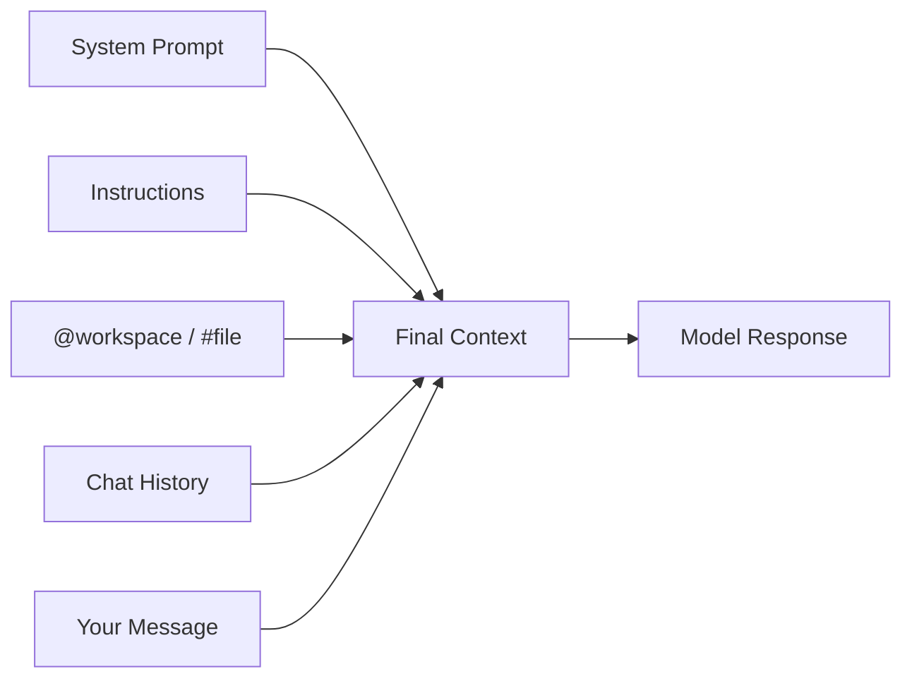
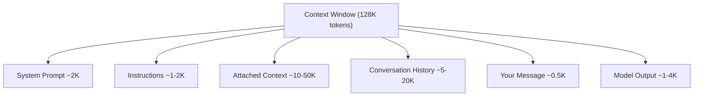

<!-- markdownlint-disable -->

# Copilot Developer Training

## Module 1 — Foundations

*Chat Tour · Memory & Context · Models & Token Management*

`github.com/microsoft/GitHubCopilot_Customized`

<!--
Welcome attendees. "This is Module 1 of the Copilot Developer Training — Foundations. Over the next three sessions we'll build a solid understanding of how Copilot works, how to control what it sees, and how to pick the right model for each task."
-->

---
class: text-xs
---

# What We'll Cover Today (1/2)

| Time | Topic |
|------|-------|
| **Session 1** | **Copilot Chat Tour (60 min)** |
| 10 min | AI Safety: "AI as Partner, Not Replacement" |
| 10 min | Inline Completions |
| 10 min | Chat Interface & Slash Commands |
| 15 min | Context: @ Participants & # Variables |
| 10 min | Multi-Session Management |
| | ☕ *Break — 10 min* |
| **Session 2** | **Memory & Context (60 min)** |
| 10 min | Context Window Fundamentals |
| 15 min | Repository-Level Instructions |
| 10 min | Instruction Layering |
| 15 min | Context Quality & Prompt Crafting |

<!--
"Three sessions, two breaks. Each session opens with an AI safety discussion."
-->

---
class: text-xs
---

# What We'll Cover Today (2/2)

| Time | Topic |
|------|-------|
| | ☕ *Break — 10 min* |
| **Session 3** | **Models, Agents & Token Management (75 min)** |
| 15 min | Model Landscape |
| 15 min | Token Mechanics |
| 15 min | Built-in vs Custom Agents |
| 15 min | Token Management & Budgeting |

**Total: ~195 min (~3h 15min) including breaks**

<div class="gh-callout gh-callout-blue">

**Format**: Slides → live demo → hands-on time. Each session opens with an AI safety discussion.

</div>

<!--
"We'll alternate between slides, live demos, and your own hands-on time."
-->

---
layout: section
---

# Session 1

## Copilot Chat Tour

<!--
"Let's start with the fundamentals — every surface Copilot gives you to interact with code."
-->

---
class: text-xs
---

# AI Safety: AI as Partner, Not Replacement

### Every session starts with a human-machine partnership discussion

- AI-assisted development is a **partnership** — Copilot suggests, you decide
- **Human-in-the-loop**: Every suggestion passes through human judgment before shipping

| Concept | Description |
|---------|-------------|
| **Trust calibration** | Low-risk tasks → more trust. High-risk → more verification |
| **Augmentation** | AI handles the routine; you handle the creative and critical |
| **Feedback loop** | Correcting AI makes the next interaction better |

<div class="gh-callout gh-callout-blue">

**Key principle**: AI output requires human review. The goal is amplification, not replacement.

</div>

<!--
"This is a theme throughout the entire curriculum. Every session we'll talk about the human side of working with AI. The question isn't 'will AI replace developers?' — it's 'how do we work together effectively?'"
-->

---
class: text-sm
---

# Discussion: Trust Boundaries

### When should you trust AI suggestions vs. verify them?

- What types of code would you let Copilot write without close review?
- Where would you draw the line on AI autonomy in your current projects?
- How does your team currently handle code review — and how might AI fit in?

<div class="gh-callout gh-callout-purple">

**Think about this**: Where is the line between productive acceleration and dangerous over-reliance?

</div>

<!--
Pause for 2-3 minutes of open discussion. Let attendees share their current experiences and comfort levels. No right answer — this sets the stage for the rest of the curriculum.
-->

---
class: text-sm
---

# Inline Completions

### Ghost text that appears as you type

- **Tab** to accept the full suggestion, **Esc** to dismiss
- **Ctrl+Right** (Win) / **Cmd+Right** (Mac) for word-by-word partial accept
- Copilot uses the current file, open tabs, and recent edits as context

| Strategy | Technique |
|----------|-----------|
| **Comment-driven** | Write a descriptive comment → Copilot completes the code |
| **Signature-first** | Write the function signature with types → Copilot infers the body |
| **Test-driven** | Write test names/assertions → Copilot generates the implementation |
| **Pattern continuation** | Start a pattern (e.g., first array element) → Copilot continues |

<div class="gh-callout gh-callout-green">

**Pro tip**: Clear variable names and descriptive comments trigger the best completions.

</div>

<!--
"Completions are the original Copilot feature. Most of you have used these. The key insight is that HOW you write code changes WHAT Copilot suggests. Comments, signatures, and patterns are all hints."
-->

---
class: text-xs
---

# Completion Triggers & Acceptance

### What improves completions

- Descriptive function names and typed parameters
- JSDoc/docstring comments before the function
- Consistent coding patterns in the file
- Open tabs with related code (Copilot reads neighboring tabs)

### What hurts completions

- Ambiguous variable names (`temp`, `data`, `x`)
- No comments or documentation
- Inconsistent code style
- Very large files (context gets diluted)

<!--
"Think of completions as a mirror — they reflect the quality of the code around them. If you write clean code, you get clean suggestions."
-->

---
layout: demo
---

# 🖥️ LIVE DEMO

### Inline Completions in Action

- Write a comment: `// Validate that the order total matches the sum of line items`
- Show ghost text appearing — accept with Tab
- Write a function signature with typed params — Copilot completes the body
- Demonstrate partial accept with Ctrl+Right
- Show how changing the comment changes the suggestion

<!--
Open a TypeScript file in OctoCAT Supply. Walk through each bullet live. Emphasize the comment-driven and signature-first patterns.
-->

---
class: text-sm
---

# Chat Interface

### Three ways to interact with Copilot Chat

| Interface | Shortcut | Best For |
|-----------|----------|----------|
| **Chat panel** (sidebar) | `Ctrl+Shift+I` | Extended conversations, multi-step tasks |
| **Inline chat** | `Ctrl+I` | Quick edits to selected code |
| **Quick chat** | `Ctrl+Shift+Alt+L` | Fast one-off questions |

### Slash Commands

| Command | Purpose | Example |
|---------|---------|---------|
| `/explain` | Explain selected code | Understanding unfamiliar code |
| `/fix` | Fix errors in selection | Quick bug fixes |
| `/tests` | Generate tests | Adding test coverage |
| `/doc` | Generate documentation | Adding JSDoc/docstrings |
| `/new` | Create a new file | Scaffolding |
| `/clear` | Clear conversation | Starting fresh |

<!--
"Three surfaces, each for a different workflow. Panel is for deep conversations. Inline is surgical — select code, ask a question. Quick is for drive-by questions you don't want to track."
-->

---
layout: demo
---

# 🖥️ LIVE DEMO

### Slash Commands Walkthrough

- Select a complex function → `/explain` — show the explanation
- Introduce a deliberate bug → `/fix` — show the correction
- Select a utility function → `/tests` — show generated test cases
- Undocumented function → `/doc` — show the generated JSDoc

<!--
Walk through each slash command live in the OctoCAT Supply codebase. Emphasize that these are shortcuts — you can also just ask in natural language.
-->

---
class: text-xs
---

# @ Participants

### Route your question to a specialized handler

| Participant | Domain | What It Knows |
|-------------|--------|---------------|
| `@workspace` | Your codebase | Project structure, file contents, dependencies |
| `@vscode` | VS Code editor | Settings, extensions, keybindings, editor state |
| `@terminal` | Terminal output | Recent command results, error messages |

```
@workspace What testing framework does this project use?
@vscode How do I configure format on save for TypeScript?
@terminal Why did the last build fail?
```

<div class="gh-callout gh-callout-blue">

**Key insight**: Participants give Copilot access to context it can't get from just reading files.

</div>

<!--
"Think of participants as domain experts. @workspace knows your code. @vscode knows the editor. @terminal knows what just happened in your terminal. Each one adds context the model wouldn't otherwise have."
-->

---
class: text-xs
---

# \# Context Variables

### Attach specific context to your prompt

| Variable | Attaches | When to Use |
|----------|----------|-------------|
| `#file` | A specific file's contents | "Look at this file specifically" |
| `#selection` | Current text selection | "Focus on this code block" |
| `#editor` | Currently active editor | "Consider what I'm looking at" |
| `#codebase` | Full project search | "Search the whole repo" |

### Combining @ + \#

```
@workspace #file:api/routes/orders.ts Add error handling to the POST handler
```

<div class="gh-callout gh-callout-purple">

**Precision over volume**: One targeted `#file` reference beats attaching 10 files.

</div>

<!--
"The hash variables are your precision tools. Instead of hoping Copilot finds the right file, you TELL it which file to look at. This is the single biggest quality improvement most developers can make."
-->

---
class: text-xs
---

# Context Composition

### How Copilot assembles the prompt



<div class="gh-callout gh-callout-green">

**Everything competes for the same context window.** More `#file` attachments = less room for conversation history.

</div>

<!--
"This is the mental model for the whole curriculum. Everything — your instructions, the files you attach, your conversation history — all goes into one bucket. The model sees ALL of it and generates based on ALL of it. If the bucket is full of noise, the output is noisy."
-->

---
layout: demo
---

# 🖥️ LIVE DEMO

### Precise Context Targeting

- Ask vaguely: "How does authentication work?" — note the generic response
- Ask precisely: `@workspace #file:api/middleware/auth.ts How does authentication work?`
- Compare the quality difference side-by-side
- Show `@terminal` after a failed build — Copilot reads the error output
- Demonstrate `#selection` for inline code questions

<!--
This is the key demo for Session 1. The before/after comparison of vague vs. precise prompts is dramatic. Make sure attendees see the quality difference.
-->

---
class: text-sm
---

# Multi-Session Management

### When to continue vs. start fresh

| Scenario | Recommendation |
|----------|----------------|
| Related follow-up questions | Continue the current session |
| New feature in a different area | Start a new session |
| Confused or degraded responses | Clear with `/clear` or start fresh |
| Exploring vs. implementing | Separate sessions for each |
| Context window is full | Start a new session to reclaim space |

### Key Insight

Session history contributes to the context window. Old messages can push out relevant code context. Long conversations ≠ better conversations.

<div class="gh-callout gh-callout-blue">

**Rule of thumb**: New task, new session. Continued task, same session.

</div>

<!--
"Most developers leave one chat session open all day. That works — until the session gets so long that Copilot starts 'forgetting' your earlier context. Fresh sessions are free — use them liberally."
-->

---
class: text-sm
---

# Session 1 Recap & Discussion

### Key Takeaways

- Multiple interaction surfaces: completions, chat panel, inline chat, quick chat
- Slash commands are shortcuts for common tasks (`/explain`, `/fix`, `/tests`, `/doc`)
- `@` participants route to specialized domain handlers
- `#` variables attach specific context — precision beats volume
- Session management prevents context pollution

### Discussion

- What was the most surprising capability you saw?
- Which interaction mode fits your workflow best?
- How would you introduce these features to a teammate?

<!--
5-minute wrap-up. Quick recap, then open the floor. Transition to break after.
-->

---
class: text-sm
---

# ☕ Break — 10 Minutes

Take a stretch. We'll dive into memory and context management next.

---
layout: section
---

# Session 2

## Memory & Context

<!--
"Now that you know HOW to talk to Copilot, let's learn how to control WHAT it knows."
-->

---
class: text-sm
---

# AI Safety: What Gets Shared?

### Understanding data flow in Copilot

| Data Type | Sent? | Retained? | Training? |
|-----------|-------|-----------|-----------|
| **Code context** | Yes (for suggestions) | No (Business/Enterprise) | No |
| **Chat messages** | Yes (for responses) | No (Business/Enterprise) | No |
| **Usage telemetry** | Yes | Yes (aggregated) | No |
| **Content exclusions** | Never sent | N/A | N/A |

<div class="gh-callout gh-callout-blue">

**Copilot Business/Enterprise**: Your code and prompts are NOT retained or used for training. Period.

</div>

- Content exclusions let orgs prevent specific files/repos from being used as context
- Telemetry (feature usage, acceptance rates) is separate from code context

<!--
"This is the most common question from enterprise teams. Your code stays private on Business and Enterprise plans. Content exclusions give you additional control."
-->

---
class: text-xs
---

# Context Window Fundamentals

### The finite budget everything competes for



**When the window fills**, items are removed (most expendable first):

1. Old conversation messages (earliest turns)
2. Distant file content (not directly referenced)
3. Large attached files (trimmed)
4. Active editor content (prioritized)
5. Instructions + system prompt (preserved longest)

<!--
"Think of the context window as a fixed-size container. Everything goes in — instructions, files, conversation, your question. When it fills up, the oldest and least relevant items fall out. This is why long sessions degrade."
-->

---
class: text-xs
---

# Repository-Level Instructions

### `.github/copilot-instructions.md` — always loaded

Injected into **every** Copilot interaction in the repository.

```markdown
# Copilot Instructions
## Coding Standards
- Use TypeScript strict mode for all new files
- Prefer `const` over `let`; never use `var`
- All functions must have JSDoc with @param and @return
## Testing
- Use Vitest for all unit tests
- Test files in `__tests__/` alongside source
```

<div class="gh-callout gh-callout-green">

**Keep it concise** — every token here reduces space for code context. Aim for < 100 lines.

</div>

<!--
"This is the single most impactful file you can create. It tells Copilot about YOUR team's standards. Without it, Copilot guesses. With it, Copilot follows your rules."
-->

---
layout: demo
---

# 🖥️ LIVE DEMO

### Creating copilot-instructions.md

- Create `.github/copilot-instructions.md` in OctoCAT Supply
- Add coding standards specific to the project
- Ask Copilot to generate a new API endpoint — observe it following instructions
- Change an instruction (Vitest → Jest) — regenerate and compare

<!--
Live-create the file. Show the before/after difference. This is the "aha moment" for most attendees.
-->

---
class: text-xs
---

# Instruction Layering

### Multiple levels, increasing specificity

| Layer | Location | Scope | When Loaded |
|-------|----------|-------|-------------|
| **User** | VS Code `settings.json` | All repos (this user) | Always |
| **Workspace** | `.vscode/settings.json` | This workspace | Always |
| **Repository** | `.github/copilot-instructions.md` | This repo (all users) | Always |
| **File-targeted** | `.github/instructions/*.instructions.md` | Matching files only | When active |

```yaml
---
applyTo: "**/*.test.ts"
---
# Test File Instructions
- Use Vitest describe / it / expect pattern
- Mock external deps with vi.mock()
```

<div class="gh-callout gh-callout-purple">

**Layering strategy**: General rules in repo instructions, specific overrides in file-targeted instructions.

</div>

<!--
"This is where it gets powerful. Repo instructions are the baseline. File-targeted instructions override for specific file types. You can have different rules for tests, API routes, React components — all automatically applied."
-->

---
layout: demo
---

# 🖥️ LIVE DEMO

### Layered Instructions in Action

- Create `.github/instructions/tests.instructions.md` with `applyTo: "**/*.test.*"`
- Create `.github/instructions/api.instructions.md` with `applyTo: "api/**/*.ts"`
- Open a test file → generate tests → observe test-specific rules
- Open an API route → add a feature → observe API-specific rules

<!--
Show the automatic switching. When you're in a test file, test instructions load. When you're in an API file, API instructions load. This is the layering in action.
-->

---
class: text-xs
---

# Context Quality & Prompt Crafting

| Pattern | Example |
|---------|---------|
| **Specific reference** | `@workspace #file:api/routes/orders.ts Add input validation` |
| **Constraint-driven** | `Pagination: cursor-based, max 100, no offset` |
| **Example-guided** | `Create a service like #file:api/services/products.ts but for Suppliers` |
| **Negative constraint** | `Refactor without third-party libraries` |

| Anti-Pattern | Problem | Fix |
|-------------|---------|-----|
| "Make it better" | Too vague | Specify: faster, more readable |
| Attaching 10 files | Context overflow | Attach only 1-2 relevant files |
| Long session, new topic | Context pollution | Start a fresh session |
| No constraints | Arbitrary patterns | State framework, style |

<!--
"The quality of output is directly proportional to the quality of input. Vague in, vague out. Precise in, precise out."
-->

---
layout: demo
---

# 🖥️ LIVE DEMO

### Context Quality Comparison

- Without context: "Create a new API endpoint for suppliers"
- With context: `@workspace #file:api/routes/products.ts #file:api/services/products.ts Create a supplier endpoint following the same pattern`
- Compare side-by-side — precision, accuracy, pattern adherence

<!--
This is the payoff demo for Session 2. The difference between vague and precise is dramatic. Let attendees see both outputs and compare.
-->

---
class: text-sm
---

# Session 2 Recap & Discussion

### Key Takeaways

- Context window is finite — everything competes for space
- `.github/copilot-instructions.md` is your team's always-on rules
- Instruction layering: user → workspace → repo → file-targeted
- Quality prompts with explicit `#file` references beat vague questions

### Discussion

- How would you structure instructions for your team's primary repo?
- What file patterns would benefit from targeted instructions?
- What's the biggest context quality improvement you can make right now?

<!--
5-minute wrap-up. Reinforce the key message: instructions + precise context = dramatically better output.
-->

---
class: text-sm
---

# ☕ Break — 10 Minutes

Grab a coffee. Session 3 covers models, agents, and tokens.

---
layout: section
---

# Session 3

## Models, Agents & Token Management

<!--
"Now we go deeper — which model should you use, how to create specialized agents, and how to manage the cost of all this."
-->

---
class: text-sm
---

# AI Safety: Capability vs. Risk

### Different models, different guardrails

- More capable models aren't always better — they may be slower, pricier, or overkill
- Model selection should be **intentional**: match the model to the task
- Some models excel at reasoning, others at speed, others at instruction-following

<div class="gh-callout gh-callout-blue">

**Principle**: The best model is the cheapest one that gets the job done well.

</div>

<!--
"Not every task needs the most powerful model. A quick completion doesn't need Claude Opus. A complex architecture decision doesn't need the fastest model. Match the tool to the job."
-->

---
class: text-xs
---

# Model Comparison

### Available models in GitHub Copilot

| Model | Speed | Reasoning | Context Window | Best For |
|-------|-------|-----------|----------------|----------|
| **GPT-4o** | Fast | Strong | 128K tokens | General-purpose, good balance |
| **GPT-4.1** | Fast | Very strong | 1M tokens | Large codebase, complex multi-file |
| **Claude Sonnet** | Fast | Strong | 200K tokens | Nuanced review, detailed explanations |
| **Claude Opus** | Slower | Excellent | 200K tokens | Complex architecture, deep reasoning |
| **Gemini** | Fast | Good | 1M+ tokens | Very large context tasks |
| **o1 / o3-mini** | Slower | Exceptional | 200K tokens | Algorithmic, mathematical reasoning |

### Task → Model Guide

| Task Type | Recommended | Why |
|-----------|-------------|-----|
| Quick completions | GPT-4o | Fast, good enough |
| Multi-file refactoring | GPT-4.1 / Claude Sonnet | Large context + reasoning |
| Architecture decisions | Claude Opus / o3 | Deep reasoning |
| Code review | Claude Sonnet | Detailed, catches subtle issues |

<!--
"This table is your cheat sheet. Start with GPT-4o for most things. Switch to Sonnet for reviews. Pull out Opus or o3 for the hard problems."
-->

---
layout: demo
---

# 🖥️ LIVE DEMO

### Model Switching

- Open VS Code chat — show the model picker dropdown
- Same question to GPT-4o and Claude Sonnet — compare style and speed
- Complex reasoning task with o3-mini — show "thinking" time vs. quality
- Discuss when the speed-quality trade-off matters

<!--
Pick a question that shows clear differences between models. A code review question works well — Sonnet tends to give more detailed feedback than GPT-4o.
-->

---
class: text-xs
---

# Token Fundamentals

| Concept | Details |
|---------|---------|
| **1 token ≈** | ~4 English characters, ~¾ of a word |
| **Code tokenization** | Varies by language — Python more efficient than Java |
| **Input tokens** | Everything you send (lower cost per token) |
| **Output tokens** | What the model generates (higher cost per token) |
| **Context window** | Maximum input + output tokens combined |

<div class="gh-callout gh-callout-blue">

**Key insight**: A 1000-line TypeScript file ≈ 4000–6000 tokens. Every `#file` costs thousands of tokens from your budget.

</div>

<!--
"A token is roughly 4 characters. When you attach a file with #file, that's 4000+ tokens. That's why being selective matters."
-->

---
class: text-xs
---

# Where Tokens Go

```
┌─────────────────────────────────────────┐
│       Context Window (128K)             │
├─────────────────────────────────────────┤
│ System Prompt                    ~2K    │
│ Instructions                     ~1K    │
│ Attached Context (#file)       ~10-50K  │
│ Conversation History           ~5-20K   │
│ Model Output                    ~1-4K   │
└─────────────────────────────────────────┘
```

<div class="gh-callout gh-callout-purple">

**Truncation order**: Old conversation messages drop first. Instructions + system prompt are preserved longest.

</div>

---
class: text-xs
---

# Token Usage Visibility

### Where to see your consumption

- **Chat debug mode**: `github.copilot.chat.debugMode: true`
- **GitHub Dashboard**: Org settings → Copilot → Usage
- **Premium requests**: Some models (o1, Opus) consume premium allocation

```
[DEBUG] Context assembly:
  System prompt:          1,247 tokens
  Repository instructions:  312 tokens
  Attached context:       3,891 tokens
  Conversation history:   2,104 tokens
  Total input:            7,641 tokens
[DEBUG] Model: gpt-4o | Response: 342 tokens (1.2s)
```

<div class="gh-callout gh-callout-green">

**Enable debug mode** to build intuition about token costs.

</div>

<!--
"I recommend everyone enables debug mode for at least a week. You'll develop a gut feel for how much context costs and start optimizing naturally."
-->

---
class: text-xs
---

# Built-in vs Custom Agents

### Agents that come with Copilot

| Agent | Accesses | Use Case |
|-------|----------|----------|
| `@workspace` | File tree, contents, symbols | Project-wide questions |
| `@vscode` | Settings, extensions, keybindings | Editor configuration |
| `@terminal` | Terminal output, command history | Build errors, runtime issues |

### Custom Agents — `.github/agents/*.md`

```yaml
---
description: "Reviews code for security vulnerabilities"
tools:
  - codebase
  - githubRepo
model: claude-sonnet-4
---
# Security Reviewer
Check for OWASP Top 10, injection risks, input validation.
Always explain WHY and provide corrected code.
```

Custom agents appear in the **chat mode picker** alongside Ask/Agent/Plan.

<!--
"Built-in agents are general-purpose. Custom agents let you create specialists. A security reviewer, a performance analyst, a documentation writer — each with their own instructions and tool access."
-->

---
class: text-xs
---

# Agent Anatomy & Decision Guide

### Full agent file structure

```yaml
---
description: "Short description for the mode picker"
tools:
  - codebase        # Search and read project files
  - githubRepo      # Access GitHub API (issues, PRs)
  - terminal        # Run commands
model: claude-sonnet-4  # Optional: pin a specific model
---
# Agent Name
Detailed instructions for the agent's behavior.
```

### When to use what

| Question | Yes → | No → |
|----------|-------|------|
| Quick question, no code changes? | **Ask mode** | ↓ |
| Need a plan first? | **Plan mode** | ↓ |
| Need files edited? | **Agent mode** | ↓ |
| Need a specialized persona? | **Custom agent** | Agent mode |

<!--
"The decision guide is simple. Most of the time you'll be in Agent mode. Custom agents are for when you want consistent behavior for a specific type of task — like always reviewing for security, or always following a specific architecture pattern."
-->

---
layout: demo
---

# 🖥️ LIVE DEMO

### Creating a Custom Agent

- Create `.github/agents/reviewer.md` with security review instructions
- Open the chat mode picker — show the new agent appearing
- Select the agent → ask it to review an API route
- Compare to asking the same question in default Agent mode

<!--
Create the file live. Show it appearing in the mode picker. The difference in response focus is the key takeaway — custom agents give consistent, specialized output.
-->

---
class: text-xs
---

# Token Management Strategies

### Keep your context lean and your responses sharp

| Strategy | Technique | Impact |
|----------|-----------|--------|
| **Prune instructions** | Keep `copilot-instructions.md` < 100 lines | Saves ~500-1000 tokens |
| **Use file-targeted** | Move specific rules to `applyTo` files | Loads only when relevant |
| **Fresh sessions** | New session for new tasks | Eliminates history bloat |
| **Right model** | GPT-4o for simple, Opus for complex | Matches cost to complexity |
| **Be specific** | `#file` reference vs. `#codebase` | Reduces irrelevant context |

| Tier | Models | Multiplier |
|------|--------|------------|
| **Base** | GPT-4o | 1x |
| **Mid** | Claude Sonnet | 1x |
| **Premium** | Claude Opus, o1/o3 | Higher multiplier |

<!--
"Token management is both a cost issue and a quality issue. Bloated context means the model's attention is spread thin. Lean context means focused, high-quality output."
-->

---
layout: demo
---

# 🖥️ LIVE DEMO

### Token-Conscious Prompting

- Show a bloated prompt (10 files, long history) — note token count in debug mode
- Refactor to focused prompt (1 file, clear question) — note the drop
- Switch models: GPT-4o for simple task → Opus for complex task
- Show the premium request dashboard (screenshot)

<!--
The debug mode numbers tell the story. Show the dramatic difference between a bloated and a focused prompt.
-->

---
class: text-sm
---

# copilot-setup-steps.yml

### Onboarding script for the Coding Agent

When Copilot's Coding Agent starts on your repo, it runs these steps first:

```yaml
steps:
  - name: Install dependencies
    run: npm install
  - name: Build the project
    run: npm run build
  - name: Run linting
    run: npm run lint
  - name: Run tests
    run: npm test
```

<div class="gh-callout gh-callout-blue">

**Think of it as**: The "first day onboarding script" for an AI developer joining your project.

</div>

<!--
"Without this file, the Coding Agent can't build, test, or lint your project. It's the bridge between your project's setup requirements and the autonomous agent. We'll see the Coding Agent in action in Module 2."
-->

---
class: text-sm
---

# Module 1 Complete — Key Takeaways

| Session | Core Concept |
|---------|-------------|
| **Session 1: Chat Tour** | Multiple interaction modes — completions, chat, inline, slash commands, context targeting |
| **Session 2: Memory & Context** | Context is finite and layered — instructions, files, history all compete for space |
| **Session 3: Models & Tokens** | Models vary in capability/cost — match the model to the task; manage tokens intentionally |

### What to Do First

1. Create `.github/copilot-instructions.md` in your primary repo
2. Add file-targeted instructions for your test files and main code paths
3. Enable `github.copilot.chat.debugMode` for a week to build token intuition
4. Try at least two different models this week

<div class="gh-callout gh-callout-purple">

**Next**: Module 2 covers agentic loops, the rubber duck pattern, and agent architecture patterns.

</div>

<!--
"That's Module 1 complete. You now have the foundations — how to interact, how to control context, and how to pick the right model. In Module 2 we go agentic — loops, self-correction, and architecture patterns."
-->

---
layout: end
---

# Module 1 Complete

## Foundations

*Continue to Module 2: Agentic Patterns →*

<div class="gh-callout gh-callout-blue">

**Copilot Developer Training** · Module 1 of 3

</div>

<!--
Thank attendees. Point to the lab guide for hands-on practice. Announce the next module session date/time if applicable.
-->
