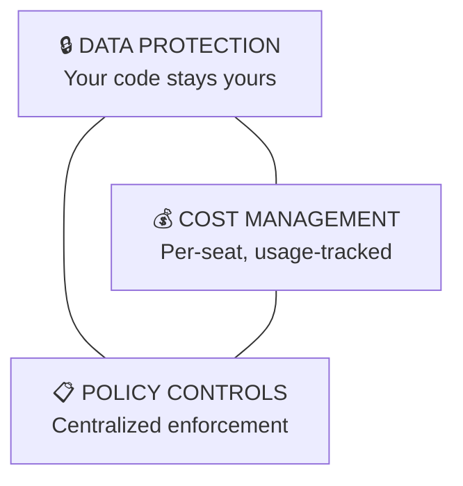
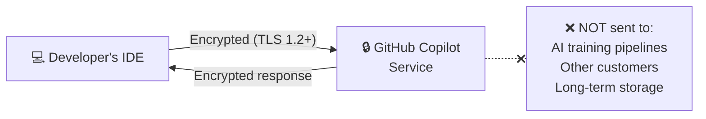
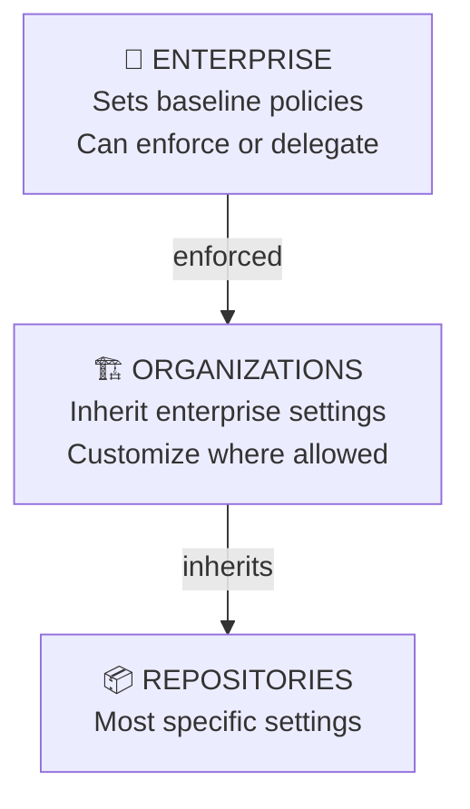
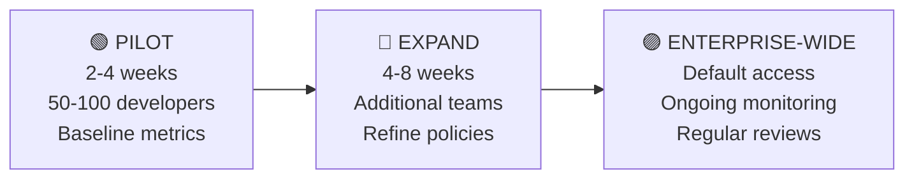

<!-- markdownlint-disable -->

# GitHub Copilot

## AI Governance for Leaders

*Data Protection, Security Controls & Enterprise Confidence*

<!--
"Thank you for joining. This session is designed for leaders — we'll focus on the governance posture, risk mitigation, and confidence factors that matter for executive decision-making. No deep technical dives, just the information you need to feel confident in how Copilot is managed across your organization."
-->

---
class: text-sm
---

# What We'll Cover Today

| Time | Topic |
|------|-------|
| 5 min | The AI Landscape & Why Governance Matters |
| 10 min | Data Protection & Trust Guarantees |
| 5 min | Security Controls at Your Disposal |
| 5 min | Compliance & Audit Readiness |
| 5 min | Cost Management & Adoption Metrics |
| 5 min | Enterprise Rollout Strategy |
| 5 min | Q&A |

<!--
"We'll keep this focused and outcome-oriented. Each section answers a specific leadership question — 'Is our data safe?', 'Are we compliant?', 'Are we getting ROI?' — and gives you the evidence to back it up."
-->

---
layout: section
---

# The AI Landscape

---

# The Opportunity — and the Risk

### AI-Assisted Development Is Here

<v-clicks>

- **92%** of developers are already using AI coding tools (GitHub/Stack Overflow '25 Survey)
- The question isn't *whether* to adopt — it's **how to govern it**
- Ungoverned AI usage creates **shadow AI** risk — developers finding their own tools with no oversight

</v-clicks>

**The leadership decision**: Give developers a governed, enterprise-grade AI assistant — or risk them using ungoverned alternatives with no data protection guarantees.

<!--
"Developers are already using AI tools. If you don't provide a governed option, they'll find their own — and those won't have the data protections, audit trails, or policy controls we're about to discuss. This is about channeling inevitable adoption into a safe, managed tool."
-->

---
class: text-sm
---

# What is GitHub Copilot?

### AI Pair Programming — Governed at Enterprise Scale

- **Code completions**: Suggests code as developers type (like advanced autocomplete)
- **Chat assistant**: Answers questions about codebases, explains code, generates tests
- **Enterprise controls**: Centralized policies, audit logging, content exclusions

### Why GitHub Copilot vs. Alternatives?

| Factor | GitHub Copilot Enterprise |
|--------|---------------------------|
| **Integration** | Native to GitHub — where your code already lives |
| **Data protection** | Zero retention, no training on your code |
| **Governance** | Enterprise-wide policy enforcement |
| **Compliance** | SOC 2 Type II, ISO 27001, CSA STAR |
| **IP protection** | Public code filter + indemnification |

<!--
"Copilot isn't a separate tool developers have to context-switch into. It's embedded in the IDE and in GitHub itself. And critically, it comes with the enterprise governance layer that alternatives lack."
-->

---
class: text-sm
---

# The Governance Framework

### Three Pillars of Copilot Governance

Each pillar gives you **evidence-based confidence** to present to your board, CISO, and stakeholders

**Bottom line**: Copilot Enterprise was built for organizations that need to prove governance — not just promise it.

<!--
"Everything we'll cover maps to one of these three pillars. Data protection answers 'Is our code safe?' Cost management answers 'Are we getting value?' Policy controls answer 'Are we consistent and compliant?'"
-->

---
layout: section
---

# Data Protection & Trust

---
class: text-sm
---

# The #1 Question: "Is Our Code Safe?"

### Yes — Here's the Evidence

### Enterprise Data Guarantees

| Guarantee | What It Means |
|-----------|---------------|
| **Zero retention** | Prompts and suggestions are discarded after each request |
| **No training** | Your code is never used to train AI models — contractual guarantee |
| **Tenant isolation** | Your data is never shared with other customers |
| **Encryption** | All data encrypted in transit (TLS 1.2+) and at rest |

<!--
"This is the slide your CISO needs. When a developer types code and Copilot makes a suggestion, that interaction is encrypted, processed, and discarded. Nothing persists. Nothing trains. Nothing leaks. This is a contractual guarantee, not just a policy."
-->

---
class: text-sm
---

# Multi-Model — Same Protections

### What Happens When Developers Choose Different AI Models?

Copilot supports multiple models (GPT, Claude, Gemini). Regardless of which model a developer selects:

<v-clicks>

- **Same data protections** apply — zero retention, no training
- Third-party providers are **contractually bound** to GitHub's data handling rules
- GitHub remains the **single data processor** — one governance relationship, not many
- **Agentic features** (autonomous coding, MCP integrations) inherit identical protections

</v-clicks>

**For leadership**: You don't need separate risk assessments per model. GitHub is the processor. One vendor relationship. One set of data commitments.

<!--
"A common question from risk teams: 'If a developer switches to Claude or Gemini, does our data go somewhere new?' No. GitHub is always the processor. The model providers are contractually bound to the same rules. One vendor, one risk assessment, one set of protections."
-->

---
class: text-sm
---

# Data Handling at a Glance

### Four Categories — Zero Training

| What Copilot Touches | Retained? | Used for Training? |
|----------------------|:---------:|:------------------:|
| **Code context & prompts** | ✗ | ✗ |
| **AI-generated suggestions** | ✗ | ✗ |
| **Feedback** (thumbs up/down) | Limited | ✗ |
| **Usage metrics** (aggregated) | Yes | ✗ |

**The answer to "What happens to my code?"** — It's processed and immediately discarded. No persistent storage. No training. No exceptions for Business & Enterprise plans.

<!--
"When a board member or regulator asks 'what happens to our proprietary code?' — this is the answer. Processed, discarded, never trained on. The usage metrics are aggregated and anonymized — they tell you adoption rates, not what anyone typed."
-->

---
layout: section
---

# Security Controls

---
class: text-sm
---

# Controls You Have Today

### Enterprise-Grade Guardrails

| Control | What It Does | Why It Matters |
|---------|-------------|----------------|
| **Content exclusions** | Blocks Copilot from reading sensitive file paths | Protects trade secrets, crypto, compliance-restricted code |
| **Public code filter** | Filters out suggestions matching open source | Reduces IP and licensing risk |
| **Policy hierarchy** | Enterprise → Org → Repo enforcement | Consistent controls, no rogue configurations |
| **Audit logging** | Every policy change, seat change, exclusion logged | Compliance evidence, incident investigation |
| **Kill switch** | Disable Copilot enterprise-wide instantly | Immediate response capability |

**Key message**: These aren't aspirational — they're deployed today. Your admins configure them in the GitHub Enterprise portal.

<!--
"These are not future features. They're available now and configurable by your enterprise admins. Content exclusions let you draw lines around sensitive code. The public code filter protects against IP risk. And the kill switch gives you instant response capability if an incident occurs."
-->

---
class: text-sm
---

# Policy Hierarchy — Centralized Control

### How Enterprise Policies Flow

**Three policy states for each control**:

- **Enabled** — Enforced for all orgs (no override)
- **Disabled** — Blocked for all orgs (no override)
- **No Policy** — Delegated to each org to decide

<!--
"This is how you maintain consistency at scale. Security-critical settings like the public code filter? Enforce at enterprise level — no org can turn it off. Productivity features like CLI access? Delegate to orgs, let teams decide. You control the dial."
-->

---
layout: section
---

# Compliance & Audit Readiness

---
class: text-sm
---

# Compliance Posture

### Certifications & Evidence

| Certification | What It Covers |
|---------------|----------------|
| **SOC 1 & 2 Type II** | Financial controls, security, availability — full audit reports |
| **SOC 3** | Public-facing summary of SOC 2 |
| **ISO 27001:2013** | Information security management system |
| **CSA STAR Level 2** | Cloud security assurance |
| **TISAX** | Automotive industry information security |

### Trust Center: <https://copilot.github.trust.page/>

- **Download** SOC audit reports for your vendor assessment
- **Review** FAQ sections that map to common security questionnaire items
- **Subscribe** to the Updates feed for ongoing compliance transparency

<!--
"Bookmark this Trust Center URL and share it with your security team. It has downloadable SOC 2 reports, bridge letters for inter-audit periods, and an FAQ that directly answers the questions in most vendor security questionnaires. This is your one-stop shop for compliance evidence."
-->

---
class: text-sm
---

# IP Indemnification & GDPR

### Intellectual Property Protection

GitHub provides **IP indemnification** for Copilot Business & Enterprise customers:

- Covers code generated by Copilot when public code filter is enabled
- Protects against IP infringement claims on AI-generated code
- Additional layer of legal confidence for enterprise adoption

### GDPR & Data Processing

| Aspect | Commitment |
|--------|------------|
| GitHub's role | **Data Processor** (not controller) |
| DPA coverage | Copilot processing explicitly included |
| Subprocessors | Disclosed, contractually bound |
| EU Data Boundary | Available for European regulatory requirements |

<!--
"Two important items for legal and risk teams. First, IP indemnification — GitHub stands behind the code Copilot generates when the public code filter is on. Second, for GDPR — GitHub operates as a data processor, not a controller. Your DPA covers Copilot processing, and EU data boundary options are available."
-->

---
class: text-sm
---

# Audit Trail — Proof of Governance

### Every Governance Action is Logged

| Event | What's Captured |
|-------|-----------------|
| Seat added/removed | Who was granted or revoked Copilot access |
| Policy updated | Which setting changed, by whom, when |
| Content exclusion created | New protection pattern added |
| Feature toggled | Copilot capabilities enabled/disabled |

- Exportable in **JSON/CSV** for SIEM integration
- Supports **SOC 2, GDPR, and internal audit** requirements
- Full attribution: **who**, **what**, **when** for every change

**For auditors**: Every governance decision has a paper trail. No gaps, no guesswork.

<!--
"When your auditors ask 'How do you prove governance of your AI tools?' — this is the answer. Every policy change, every seat assignment, every content exclusion is logged with full attribution. Exportable to your SIEM. Ready for SOC 2 or internal audit."
-->

---
layout: section
---

# Cost & Adoption

---
class: text-sm
---

# Cost Management

### Per-Seat Model — You Control the Spend

- **Per-seat licensing** — only active developers need seats
- **Three allocation strategies**:

| Strategy | Best For | Trade-off |
|----------|----------|-----------|
| **All members** | Maximize adoption | Higher cost |
| **Org-based** | Team-by-team rollout | Medium complexity |
| **Request-based** | Tight cost control | Slower adoption |

### Key Metric: Utilization Rate

  >80%
  Target Utilization

Monitor **assigned vs. active seats** — reclaim inactive seats, reinvest in training

<!--
"You're not paying for a blanket license — every seat is trackable. The dashboard shows who's actually using Copilot. If utilization drops below 80%, either reassign those seats or invest in training. Don't pay for shelf-ware."
-->

---
class: text-sm
---

# Measuring ROI

### Metrics Your Teams Can Track

| Metric | What It Tells You | Where to Find It |
|--------|-------------------|-------------------|
| **Active users / seats** | Adoption rate | Enterprise usage dashboard |
| **Acceptance rate** | Suggestion quality & relevance | Enterprise usage dashboard |
| **Language breakdown** | Which teams get most value | Enterprise usage dashboard |
| **Developer surveys** | Perceived time savings | Internal pulse surveys |

### Industry Benchmarks

**GitHub research shows**: Developers using Copilot complete tasks **55% faster** and report **higher job satisfaction**. Organizations typically see fastest adoption in teams writing TypeScript, Python, and JavaScript.

<!--
"The usage dashboard gives you hard numbers — adoption rate, suggestion acceptance, language breakdown. Pair that with developer surveys on perceived time savings and satisfaction. Most organizations see measurable productivity gains within the first month of adoption."
-->

---
layout: section
---

# Rollout Strategy

---
class: text-sm
---

# Phased Rollout — Proven Approach

### Build Confidence at Each Stage

| Phase | Leadership Focus |
|-------|-----------------|
| **Pilot** | Validate security posture, establish baseline metrics, gather feedback |
| **Expand** | Confirm ROI, address edge cases, train team leads |
| **Enterprise** | Ongoing monitoring, quarterly policy reviews, report to stakeholders |

<!--
"Don't flip the switch for everyone on day one. Start with 2-3 teams, prove the governance model works, measure initial ROI, then expand. Each phase builds evidence and confidence for the next. By the time you go enterprise-wide, you have data to back the decision."
-->

---
class: text-sm
---

# Common Executive Concerns

### Questions We Hear — and the Answers

| Concern | Answer |
|---------|--------|
| "Is our code training AI?" | **No** — contractual guarantee for Enterprise |
| "What if there's an incident?" | **Kill switch** — disable enterprise-wide instantly |
| "How do we prove governance?" | **Audit log** — every action tracked and exportable |
| "What about IP risk?" | **Public code filter** + IP indemnification |
| "Can teams bypass controls?" | **Policy hierarchy** — enterprise settings can't be overridden |
| "What about EU data rules?" | **GDPR processor** + EU Data Boundary options |

**The confidence message**: Copilot Enterprise isn't just an AI tool — it's a governed AI platform with the controls, evidence, and guarantees that enterprise leaders require.

<!--
"These are the six questions I hear most from executives and board members. Every one has a concrete, evidence-backed answer. This isn't 'trust us' — it's 'here's the proof.'"
-->

---
class: text-sm
---

# Recommended Next Steps

### Your Path Forward

<v-clicks>

- [ ] **Security review** — Share Trust Center with CISO/security team
- [ ] **Policy alignment** — Define which controls to enforce at enterprise level
- [ ] **Pilot selection** — Identify 2-3 teams for initial rollout
- [ ] **Baseline metrics** — Establish adoption and productivity benchmarks
- [ ] **Enablement plan** — Training investment drives adoption (access alone isn't enough)
- [ ] **Stakeholder cadence** — Quarterly governance reviews with leadership

</v-clicks>

### Resources

| Resource | Link |
|----------|------|
| **Trust Center** | <https://copilot.github.trust.page/> |
| **Copilot Docs** | <https://docs.github.com/en/copilot> |
| **GitHub Skills** | <https://skills.github.com/> |

<!--
"These are the concrete actions to move forward. Start with the security review — share the Trust Center with your CISO. Then align on policies, pick pilot teams, and invest in training. The organizations that see the best results are the ones that pair access with enablement."
-->

---

# Q&A

### Common Follow-Up Topics

- Cost justification and budget planning
- Integration with existing security and compliance tools
- Industry-specific regulatory requirements
- Developer enablement and change management
- Comparison with alternative AI coding tools

**We're happy to schedule a deeper technical session** with your engineering and security teams for hands-on policy configuration.

<!--
"I'll keep this open for questions. If we run short on time, I'm happy to schedule a follow-up — either a deeper technical session with your engineering team or a focused conversation with your CISO on security controls."
-->

---
layout: end
---

# Thank You

**Next step**: Share the Trust Center with your security team

<https://copilot.github.trust.page/>

<!--
Thank attendees. Remind them the Trust Center is the single best resource to share with their security and compliance teams. Offer to schedule a deeper technical session for engineering leads.
-->
