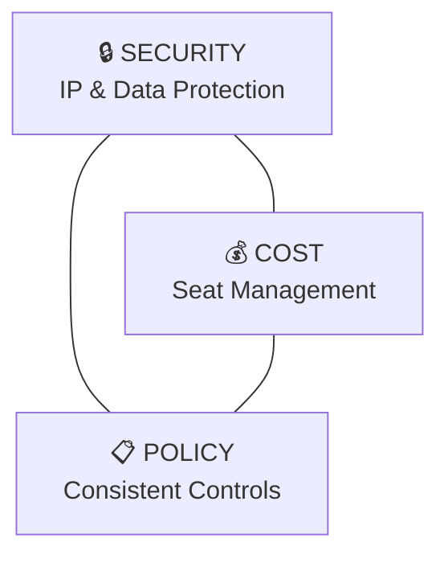
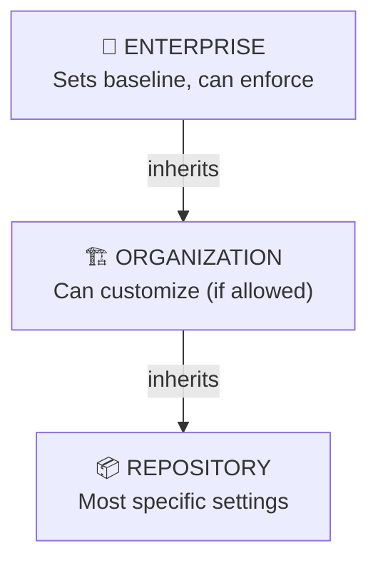
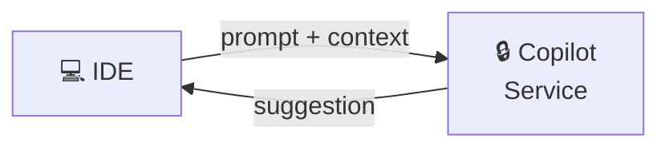
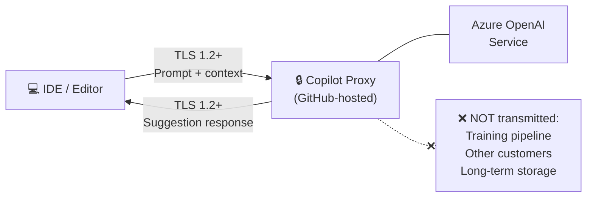
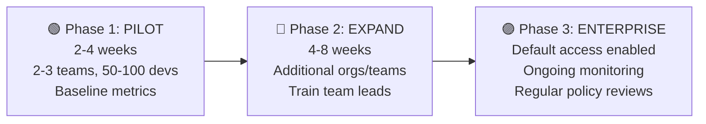

<!-- markdownlint-disable -->

# GitHub Copilot

## Admin, Licensing & Governance

*Operationalizing AI-Assisted Development at Enterprise Scale*

<!--
Welcome attendees. Set expectations: "This is a practical session — we'll cover concepts briefly then I'll show you exactly where to configure these settings in the admin portal. We'll move between slides and the live GitHub admin portal throughout."
-->

---
class: text-sm
---

# What We'll Cover Today

| Time | Topic |
|------|-------|
| 5 min | Opening & Context Setting |
| 10 min | Licensing & Seat Management |
| 15 min | Security Controls & IP Protection |
| 20 min | Data Protection & Trust Architecture |
| 15 min | Policy Configuration |
| 10 min | Operational Governance |
| 5 min | Rollout Best Practices & Wrap-up |

**Format**: Concepts → Live Demo → Discussion (repeat)

<!--
"We'll move between slides and the live GitHub admin portal. Feel free to stop me with questions — but I'll also leave time at the end."
-->

---
layout: section
---

# Opening & Context Setting

---
class: text-sm
---

# Why This Matters

### AI Coding Assistants Are Different

<v-clicks>

- Traditional tools: Install → Configure → Done
- AI Assistants require **ongoing governance**:
  - **Data flows** through external services
  - **Code context** is analyzed in real-time
  - **Suggestions** may reflect training data patterns
  - **Adoption** varies wildly without enablement

</v-clicks>

<div class="gh-callout gh-callout-blue">

**Key insight**: Copilot isn't just another IDE plugin. It's processing your code context continuously. That's powerful — but it means we need intentional governance.

</div>

<!--
"Copilot isn't just another IDE plugin. It's processing your code context continuously. That's powerful — but it means we need intentional governance around data, security, and cost."
-->

---
class: text-sm
---

# The Governance Triangle



**Balance all three** for successful enterprise adoption

<div class="gh-callout gh-callout-purple">

**Think of governance as balancing these three**: Security (protecting IP), Cost (managing seats), and Policy (consistent controls). We'll touch all three today.

</div>

<!--
"Think of governance as balancing these three: Security — protecting IP and data, Cost — managing seats efficiently, and Policy — maintaining consistent controls. We'll touch all three today."
-->

---
class: text-sm
---

# Copilot Enterprise vs. Business

### Why Enterprise for Governance?

| Capability | Business | Enterprise |
|------------|:--------:|:----------:|
| Code completions | ✓ | ✓ |
| Chat in IDE | ✓ | ✓ |
| Chat on github.com (PR summaries) | ✗ | ✓ |
| **Enterprise-level policies** | ✗ | ✓ |
| **Knowledge bases** | ✗ | ✓ |
| **Content exclusions** | Org only | Enterprise |
| **Centralized seat management** | ✗ | ✓ |

<div class="gh-callout gh-callout-green">

**You're on Enterprise** — which gives you the full governance toolkit. The key differentiators are enterprise-level policy enforcement and EMU integration for identity management.

</div>

<!--
"You're on Enterprise, which gives you the full governance toolkit. The key differentiators are highlighted — enterprise-level policy enforcement, knowledge bases, and EMU integration for identity management."
-->

---
class: text-sm
---

# Policy Hierarchy

### How Policies Flow Down



**Key principle**: Higher levels can **enforce** or **delegate**

- **Enabled / Disabled** → Enforced across all orgs
- **No Policy** → Lower levels decide independently

<!--
"This hierarchy is critical. When you set something at enterprise level to 'Enabled' or 'Disabled', it's enforced everywhere. 'No Policy' lets lower levels decide. We'll see this live in a moment."
-->

---
layout: section
---

# Licensing & Seat Management

---
class: text-sm
---

# How Copilot Seats Work

### Licensing Model

<v-clicks>

- **Per-seat licensing**: Each user needs an assigned seat
- **Monthly billing**: Seats billed per calendar month
- **Assignment options**:
  - Enterprise-wide (all members)
  - Organization-level (per org)
  - Individual assignment (granular)

</v-clicks>

<div class="gh-callout gh-callout-blue">

**Unlike some tools that are org-wide licenses**, Copilot is per-seat. This gives you control but also means you need a strategy for who gets access.

</div>

<!--
"Unlike some tools that are org-wide licenses, Copilot is per-seat. This gives you control but also means you need a strategy for who gets access."
-->

---
class: text-sm
---

# Seat Allocation Strategies

### Three Approaches

| Strategy | Best For | Trade-off |
|----------|----------|-----------|
| **All members** | Max adoption | Higher cost, less control |
| **Org-based** | Team alignment | Medium complexity |
| **Request-based** | Cost control | Slower adoption, admin overhead |

### Recommendation

Start with **org-based** for pilot teams, expand based on usage data

- High-leverage roles first (senior engineers, architects)
- Pilot teams for initial validation
- Teams with highest code velocity

<!--
"Most enterprises start with org-based — enable specific teams first, measure adoption, then expand. Pure request-based creates too much friction and kills adoption momentum."
-->

---
class: text-sm
---

# Cost Optimization

### Managing Seat Utilization

**Watch for**:

- Assigned but inactive seats (no usage in 30+ days)
- Duplicate assignments across orgs
- Seats for service accounts (not needed)

**Metrics to track**:

- Active users / Total seats = Utilization rate
- Target: **>80% utilization**

<div class="gh-callout gh-callout-purple">

**If utilization is low**, either reassign seats or invest in training — don't just pay for shelf-ware. The usage dashboard will show you who's actually using Copilot.

</div>

<!--
"The usage dashboard will show you who's actually using Copilot. If utilization is low, either reassign seats or invest in training — don't just pay for shelf-ware."
-->

---
layout: demo
---

# 🖥️ LIVE DEMO

### Seat Assignment & Policy Inheritance

- Enterprise Copilot settings → AI Controls tab
- Seat management interface
- Policy inheritance visualization (Enterprise → Org)
- Usage metrics for cost optimization

<!--
🖥️ SWITCH TO DEMO 1 in your browser. Walk through seat assignment at enterprise level, then show how it appears at org level. ~3-4 minutes.
-->

---
layout: section
---

# Security Controls & IP Protection

---
class: text-sm
---

# Security Architecture

### How Data Flows



**What's transmitted**:

- Current file context + open file snippets
- Prompt/chat messages

**What's NOT used for training** (Enterprise guarantee):

- ✗ Your code
- ✗ Your prompts
- ✗ Any suggestion responses

<!--
"The #1 question from security teams: 'Is our code being used to train AI?' With Enterprise, the answer is definitively no. Your code and prompts are processed but not retained for training."
-->

---
class: text-sm
---

# Content Exclusions

### Protecting Sensitive Code

**Use cases**:

- Proprietary algorithms
- Security implementations
- Compliance-restricted code
- Third-party licensed code

**How it works**:

- Define path patterns (glob syntax)
- Copilot ignores these files completely
- No suggestions from or about excluded code
- **Scope**: Set at Organization or Repository level

<!--
"Content exclusions are your scalpel for protecting specific code. Think about what your security team would never want analyzed by an external service."
-->

---
class: text-sm
---

# Exclusion Patterns

### Common Patterns

```
**/secrets/**        → Any secrets folder
**/*.env             → All .env files
**/internal-api/**   → Internal API code
src/crypto/**        → Cryptography implementations
**/vendor/**         → Third-party code
```

| Pattern | What it Excludes |
|---------|------------------|
| `**/secrets/**` | Any `secrets` folder at any depth |
| `**/*.env` | All `.env` files anywhere |
| `src/auth/*` | Everything directly in `src/auth/` |
| `*.key` | All `.key` files in repo root |

<!--
"Patterns use glob syntax. Double asterisk means 'any depth'. These are additive — you can set org-wide patterns plus repo-specific ones."
-->

---
class: text-sm
---

# Public Code Filter

### IP Protection Layer

| Setting | Pros | Cons |
|---------|------|------|
| **Blocked** | Reduces IP/license risk | Fewer suggestions, ~100ms latency |
| **Allowed** | More suggestions | Requires developer judgment |

<v-clicks>

- When enabled, suggestions are checked against a public code index
- Matching suggestions are filtered out in real-time
- Not 100% foolproof — catches exact and near matches
- Developers should still review suggestions for licensing concerns

</v-clicks>

<div class="gh-callout gh-callout-green">

**Recommendation**: Start with **Blocked** for regulated industries. Legal/compliance teams often require this as a baseline control.

</div>

<!--
"This is your insurance policy against accidentally including GPL or other licensed code. Most regulated industries require this to be blocked."
-->

---
class: text-sm
---

# Audit Logging & Network Controls

### Audit Trail Coverage

| Event Type | What's Captured |
|------------|-----------------|
| Policy changes | Who changed what, when |
| Seat assignment | User additions/removals |
| Feature enablement | Copilot features toggled |
| Content exclusions | Patterns added/removed |

### Network Controls

- Proxy configuration for enterprise networks
- IP allowlisting considerations
- Firewall rules for Copilot endpoints
- Export options: JSON, CSV for SIEM integration

<!--
"For SOC 2, GDPR, or internal audits, you need evidence of controls. The audit log captures every governance-relevant action with who, what, and when."
-->

---
layout: demo
---

# 🖥️ LIVE DEMO

### Security Controls

- Configure content exclusions (Org → Copilot → Content Exclusion)
- Enable public code filter (Enterprise → AI Controls → Copilot)
- Show policy enforcement and pattern syntax

<!--
🖥️ SWITCH TO DEMOS 2 & 3. Show content exclusion configuration first, then public code filter toggle. ~5-6 minutes total.
-->

---
layout: section
---

# Data Protection & Trust Architecture

---
class: text-sm
---

# Copilot Data Flow Architecture

### How Your Data Is Protected End-to-End



**Enterprise Guarantees**:

- **Encrypted** in transit (TLS 1.2+) and at rest
- **NOT retained** beyond the request lifecycle
- **NOT used for training** — contractual guarantee
- **Isolated tenant boundaries** — no cross-customer sharing

<!--
"This is the slide your CISO cares about most. Prompt leaves the IDE encrypted, hits the Copilot proxy, processed by Azure OpenAI, response comes back encrypted. Nothing persists. Nothing trains. Nothing leaks to other customers."
-->

---
class: text-xs
---

# Data Categories & Retention

### What Copilot Collects and How It's Handled

| Data Category | What It Includes | Retained? | Used for Training? |
|---------------|------------------|:---------:|:------------------:|
| **Prompts** | Code context, chat messages | ✗ | ✗ |
| **Suggestions** | Generated completions, chat responses | ✗ | ✗ |
| **Feedback** | Thumbs up/down, comments | Limited | ✗ |
| **Engagement** | Accepted/dismissed metrics, errors | Aggregated | ✗ |

> **Note**: Individual (Free/Pro) plans may retain prompts up to 28 days. Business & Enterprise have **zero retention**.

### Data Residency

- Processed in **Microsoft Azure data centers**
- EU Data Boundary options available for European regulatory requirements
- Data processing locations documented in the Trust Center

<!--
"Four categories of data, zero training usage across all of them. The key differentiator for Business and Enterprise is zero retention on prompts and suggestions. This is the answer to 'what happens to my code?' — it's processed and discarded."
-->

---
class: text-xs
---

# Trust Center & Compliance

### Your Security Review Toolkit

| Certification | Scope |
|---------------|-------|
| SOC 1/2/3 Type II | Financial controls, security, availability |
| ISO 27001:2013 | Information security management |
| CSA STAR Level 2 | Cloud security assurance |
| TISAX | Automotive industry security |

**Trust Center**: <https://copilot.github.trust.page/>

- Downloadable SOC 1 & 2 Type II audit reports
- Bridge letters covering inter-audit periods
- Security, Privacy, IP & Commercial FAQs
- Ongoing updates feed for transparency

<div class="gh-callout gh-callout-blue">

**Bookmark the Trust Center** — it has everything your security team needs for vendor assessments.

</div>

<!--
"Bookmark the Trust Center URL — it's powered by Vanta and has everything your security team needs for vendor assessments. SOC 2 reports are downloadable, the FAQ covers the most common security questionnaire items."
-->

---
class: text-sm
---

# Multi-Model Data Guarantees

### Third-Party Models Follow the Same Rules

When users select Claude (Anthropic) or Gemini (Google):

<v-clicks>

- Providers are **contractually bound** to not train on customer data
- **No code or prompt retention** beyond the request
- GitHub remains the **single data processor** — unified governance
- **IP indemnification** covers Business & Enterprise (with public code filter enabled)

</v-clicks>

### GitHub's Processing Role

| Aspect | Commitment |
|--------|------------|
| GDPR role | **Processor** (not controller) |
| DPA coverage | Includes Copilot processing |
| Subprocessors | Disclosed, contractually bound |
| Agentic features | Same protections (Coding Agent, MCP, extensions) |

<!--
"Common concern: 'If I switch to Claude or Gemini, does my data go somewhere new with different rules?' No. GitHub is always the processor. Third-party providers have the same contractual obligations. And agentic features — Coding Agent, MCP servers — inherit identical protections."
-->

---
layout: demo
---

# 🖥️ LIVE DEMO

### Trust Center Walkthrough

- Navigate <https://copilot.github.trust.page/>
- Show compliance certifications and SOC reports
- Tour FAQ sections (Security, Privacy)
- Highlight the Updates feed

<!--
🖥️ SWITCH TO DEMO — Open the Trust Center in your browser. Tour the main page, click into Resources to show downloadable reports, then open the FAQ and expand 2-3 questions from the Security and Privacy sections. ~3 minutes.
-->

---
layout: section
---

# Policy Configuration

---
class: text-sm
---

# Available Policy Controls

### What You Can Configure

| Policy | What It Controls | Scope |
|--------|------------------|-------|
| **Copilot in IDE** | Code completions in editors | Enterprise, Org |
| **Copilot Chat** | Conversational AI interface | Enterprise, Org |
| **Copilot in CLI** | Terminal/shell integration | Enterprise, Org |
| **Public code filter** | Suggestion filtering | Enterprise, Org |
| **Knowledge bases** | Internal doc references | Enterprise |
| **Vision / image uploads** | Image analysis in Chat | Enterprise, Org |
| **Content exclusions** | Path-based restrictions | Org, Repo |

<!--
"These are your main levers. Each can be Enabled, Disabled, or delegated via 'No Policy'. Think about which you want to standardize vs. let teams decide."
-->

---
class: text-sm
---

# Policy Decision Framework

### When to Enforce vs. Delegate

| | Enforce at Enterprise | Delegate to Orgs |
|---|---|---|
| **When** | Security/compliance requirement | Teams have different needs |
| **When** | Consistent experience needed | Piloting new features |
| **When** | Preventing shadow IT | Low-risk setting |

<div class="gh-callout gh-callout-purple">

**Rule of thumb**: Security settings enforced at enterprise, productivity features delegated to orgs. You don't want one team's experiment to become a compliance issue.

</div>

<!--
"My rule of thumb: security settings enforced at enterprise, productivity features delegated to orgs. You don't want one team's experiment to become a compliance issue."
-->

---
class: text-sm
---

# Knowledge Bases & Custom Instructions

### Knowledge Bases (Enterprise-Only)

- Connect internal repos as reference sources
- Copilot Chat can search your documentation
- Grounded answers from your codebase
- Great for: internal APIs, coding standards, architecture decision records

### Custom Instructions

Create `.github/copilot-instructions.md` in your org:

```markdown
# Coding Standards
- Use TypeScript strict mode
- All functions require JSDoc
- No console.log in production code
- Prefer async/await over .then()
```

Copilot incorporates these into **every suggestion** — invisible context for all interactions

<!--
"Knowledge bases turn Copilot Chat into an expert on YOUR systems. Custom instructions enforce your coding standards without nagging developers. Both are powerful and often overlooked."
-->

---
layout: demo
---

# 🖥️ LIVE DEMO

### Policy Configuration

- Walk through all policy settings (Enterprise → AI Controls → Copilot)
- Show enforce vs. delegate (Enabled / Disabled / No Policy)
- Knowledge base overview
- Toggle a setting live to show the flow

<!--
🖥️ SWITCH TO DEMO 4. Tour all policy settings, toggle one live to show the flow, show knowledge base UI if time permits. ~5 minutes.
-->

---
layout: section
---

# Operational Governance

---
class: text-sm
---

# Roles & Responsibilities

### Who Manages What

| Role | Scope | Key Actions |
|------|-------|-------------|
| **Enterprise Owner** | All orgs | Policies, billing, audit |
| **Org Admin** | Single org | Seats, org policies |
| **Billing Manager** | Financial | Usage reports, cost |
| **Security Manager** | Compliance | Audit logs, exclusions |

<div class="gh-callout gh-callout-blue">

**Governance is a team sport.** Make sure you have the right people in the right roles. Enterprise Owners should be limited — they have significant power.

</div>

<!--
"Governance is a team sport. Make sure you have the right people in the right roles. Enterprise Owners should be limited — they have significant power."
-->

---
class: text-sm
---

# Usage Analytics

### Metrics That Matter

| Category | Metrics | Action If Low |
|----------|---------|---------------|
| **Adoption** | Active users / Assigned seats, trends | Training, awareness |
| **Effectiveness** | Acceptance rate (% suggestions kept) | Refine custom instructions |
| **ROI** | Lines suggested, time in Chat | Calculate time savings |

### ROI Tracking

- Time saved per developer (survey-based)
- Code review cycle time changes
- Onboarding time for new team members
- Developer satisfaction scores

<!--
"The dashboard gives you data to justify the investment and identify training needs. Low acceptance rates? Maybe developers need coaching on better prompts."
-->

---
class: text-sm
---

# Compliance & Incident Response

### Audit Readiness

- Export usage reports in JSON/CSV for SIEM integration
- Document policy configurations for compliance evidence
- Maintain change log for policy updates

### Incident Response Plan

| Step | Action |
|------|--------|
| **1. Immediate** | Disable Copilot at enterprise level (kills all access) |
| **2. Investigate** | Review audit logs for affected timeframe |
| **3. Scope** | Identify affected users/repos via usage data |
| **4. Remediate** | Update policies, re-enable with restrictions |
| **5. Document** | Create incident report for compliance |

<!--
"If a security concern arises, step one is the kill switch at enterprise level. Then investigate, scope, remediate, and document. The audit log gives you everything you need for the incident report."
-->

---
layout: demo
---

# 🖥️ LIVE DEMO

### Operational Governance

- Usage analytics dashboard (Enterprise → Copilot → Usage)
- Audit log filtering (`action:copilot`)
- Export capabilities for compliance

<!--
🖥️ SWITCH TO DEMOS 5 & 6. Show usage dashboard metrics (active users, acceptance rate, language breakdown), then filter audit log for Copilot events. ~4 minutes.
-->

---
layout: section
---

# Rollout Best Practices

---
class: text-sm
---

# Phased Approach

### Don't Boil the Ocean



<v-clicks>

- **Phase 1**: Establish baseline metrics, gather feedback weekly, refine policies
- **Phase 2**: Address edge cases, monitor usage and security metrics
- **Phase 3**: Maintain exceptions list, ongoing optimization, regular reviews

</v-clicks>

<!--
"Resist the urge to flip the switch for everyone on day one. Phased rollout lets you learn and adjust before scaling."
-->

---
class: text-sm
---

# Common Pitfalls

### What Goes Wrong

| Pitfall | Consequence | Prevention |
|---------|-------------|------------|
| No training | Low adoption | Enablement sessions |
| Too restrictive | Developer frustration | Start moderate, tighten if needed |
| No metrics | Can't prove ROI | Track from day one |
| No ownership | Drift, inconsistency | Assign governance owner |

<div class="gh-callout gh-callout-purple">

**Most common pitfall**: Deploying without training. Developers don't know how to use it effectively, adoption stalls, and leadership questions the investment.

</div>

<!--
"I've seen all of these. The most common is deploying without training — developers don't know how to use it effectively, adoption stalls, and leadership questions the investment."
-->

---
class: text-sm
---

# Success Factors

### What Works

<v-clicks>

- ✓ **Executive sponsorship** — Visible support from leadership
- ✓ **Clear policies** — Documented, communicated, enforced
- ✓ **Training investment** — Not just access, but enablement
- ✓ **Feedback loops** — Regular check-ins with pilot teams
- ✓ **Metrics discipline** — Track and report adoption/ROI

</v-clicks>

### Security FAQ for Developers

| Question | Answer |
|----------|--------|
| "Is my code training AI?" | No — Enterprise guarantee |
| "Can Copilot access private repos?" | Only repos you have access to |
| "What happens to my prompts?" | Processed, not retained |

<!--
"If I had to pick one: training investment. The difference between a team that gets 2 hours of enablement vs. none is dramatic in adoption rates."
-->

---
class: text-sm
---

# Your Action Items

### What to Do Next

- [ ] Audit current Copilot configuration against best practices
- [ ] Define content exclusion requirements with security team
- [ ] Identify pilot teams (if not deployed)
- [ ] Establish baseline metrics from day one
- [ ] Create internal governance policy document
- [ ] Schedule enablement sessions for developers

### Resources

- [GitHub Copilot Documentation](https://docs.github.com/en/copilot)
- [Managing Copilot in Enterprise](https://docs.github.com/en/copilot/managing-copilot/managing-github-copilot-in-your-organization)
- [Copilot Trust Center](https://copilot.github.trust.page/)
- [GitHub Skills](https://skills.github.com/)

<!--
"These are your homework items. I'm happy to do a follow-up session after you've done an initial configuration review."
-->

---
class: text-sm
---

# Q&A

### Common Topics

- Cost justification strategies
- Integration with existing security tools (SIEM, DLP)
- Handling developer resistance or over-reliance
- Industry-specific compliance requirements

<div class="gh-callout gh-callout-blue">

**Have the admin portal open** in case questions require showing specific settings.

</div>

<!--
Leave 5 minutes for Q&A. Have the admin portal open in case questions require showing specific settings. If no questions, offer to do a deeper dive on any section.
-->

---
layout: end
---

# Thank You

**Follow-up**: Happy to schedule a deeper dive on any topic

<!--
Thank attendees, remind them of the action items, offer follow-up support.
-->
