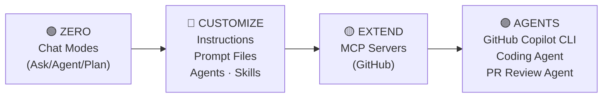
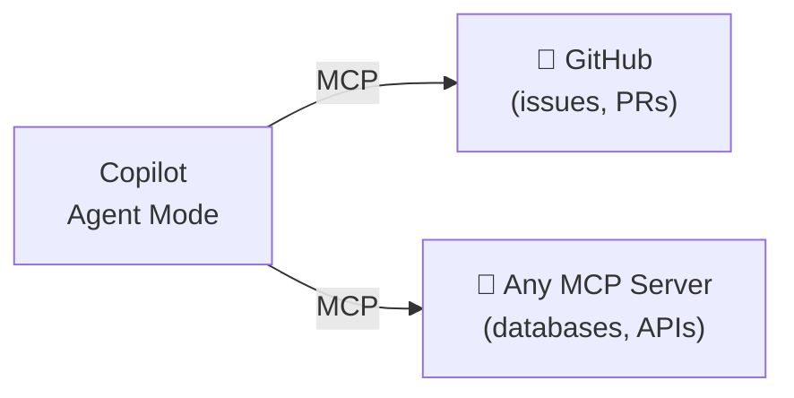
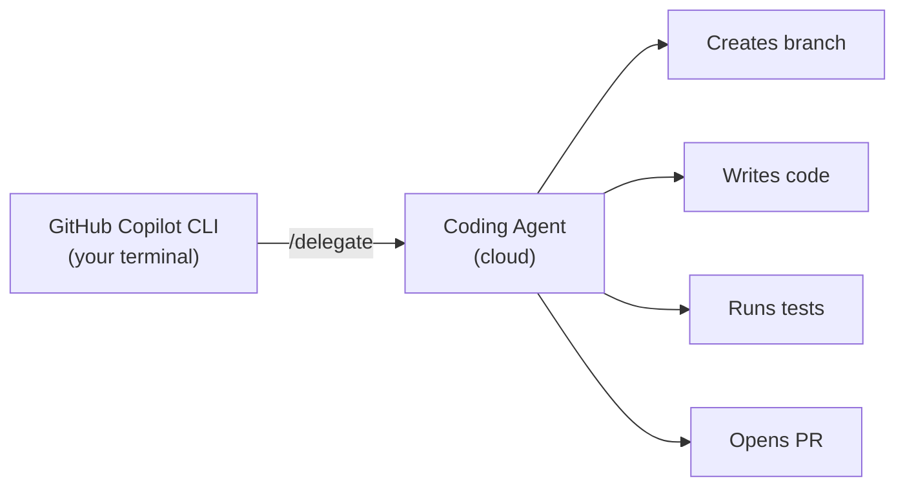
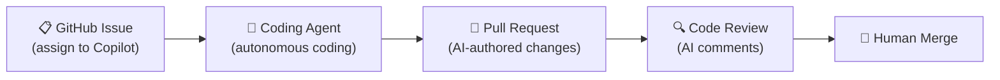

<!-- markdownlint-disable -->

# GitHub Copilot

## Zero to Agents — ODrive C++ Edition

*From casual usage to fully customized, agentic AI development for embedded firmware*

`github.com/thomasiverson/ODrive-Custom`

<!--
Welcome attendees. "Today we're going from zero — basic Copilot usage — all the way to autonomous agents writing embedded firmware code and reviewing PRs. Everything we build uses real ODrive motor controller firmware and real customization files you'll take home."
-->

---
class: text-xs
---

# What We'll Cover Today

| Time | Topic |
|------|-------|
| 20 min | Welcome & Environment Setup |
| 25 min | Copilot Chat Modes (Ask, Agent, Plan) |
| 25 min | Custom Instructions |
| 25 min | Custom Prompt Files |
| 25 min | Agent Skills |
| 25 min | Custom Agents (Chat Modes) |
| 30 min | MCP Servers (GitHub) |
| 30 min | GitHub Copilot CLI: The Agentic Terminal |
| 20 min | Cloud Agents: Coding Agent + PR Review Agent |
| 10 min | Wrap-Up & Q&A |

<!--
"We'll alternate between slides, live demos, and your own hands-on time. Each section I'll show you the concept, demo it live, then give you time to try it. No ARM toolchain or hardware needed — all exercises focus on code analysis, generation, and review."
-->

---
class: text-sm
---

# The Journey — Zero to Agents

### Your Progression Today



**Each layer builds on the last.**

<!--
"Think of this as a stack. We start with the basics — how to interact with Copilot. Then we customize it for embedded C++ firmware. Then we extend it to touch GitHub's API. Then we step into the terminal with the standalone GitHub Copilot CLI. Finally, we let it loose as an autonomous cloud agent. By the end, you'll have seen every layer."
-->

---
class: text-sm
---

# The Customization Hierarchy

### Files You'll Create Today

| Layer | File Location | When Active |
|-------|---------------|-------------|
| Instructions | `.github/copilot-instructions.md` | Always loaded |
| Scoped Instructions | `.github/instructions/*.instructions.md` | When matching files open |
| Prompt Files | `.github/prompts/*.prompt.md` | On-demand (you invoke) |
| Agents | `.github/agents/*.agent.md` | Selected in chat mode picker |
| Skills | `.github/skills/*/SKILL.md` | Auto-selected by relevance |
| MCP Servers | `.vscode/mcp.json` | When server is running |

<div class="gh-callout gh-callout-blue">

**Key insight**: Instructions are always-on. Everything else is selective.

</div>

<!--
"This is the cheat sheet for the whole day. Keep this mental model — instructions are always listening, prompts are on-demand, skills are auto-selected. We'll cover each one in depth."
-->

---
class: text-sm
---

# The Demo Repo — ODrive Motor Controller

### What We're Working With

- **MCU**: STM32F405 (ARM Cortex-M4F) with FreeRTOS
- **Core firmware**: `Firmware/MotorControl/` — FOC, PID, encoder, trajectory
- **HAL layer**: `Firmware/Drivers/STM32/` — GPIO, timers, SPI, DMA
- **Communication**: `Firmware/communication/` — USB CDC, CAN, UART
- **Python tools**: `tools/odrive/` — CLI, DFU flashing, tests

### Getting Started

```bash
git clone https://github.com/<YOUR-FORK>/ODrive-Custom.git
cd ODrive-Custom && code .
```

> No ARM toolchain or hardware required — all exercises focus on code analysis and review.

<!--
🖥️ SWITCH TO SETUP. Have attendees fork, clone, and open the project. Walk around and help with any issues. Budget 10 minutes for this. Key files to show: motor.cpp, axis.cpp, encoder.cpp, foc.cpp, controller.cpp.
-->

---
layout: section
---

# Chat Modes

---
class: text-sm
---

# Three Ways to Talk to Copilot

### Ask, Agent, Plan

| Mode | Purpose | Scope | Changes Files? |
|------|---------|-------|:--------------:|
| **Ask** | Explore, learn, understand | Entire codebase | No |
| **Agent** | Build features, edit code, run commands | Full codebase + terminal | Yes |
| **Plan** | Analyze, plan, propose changes | Entire codebase + images | No |

### Decision Framework

<div class="gh-box-accent">

```
"I need to understand this FOC algorithm"        → Ask
"I need to add a new CAN message handler"         → Agent
"I need to plan a motor diagnostics module"       → Plan
```

</div>

<!--
"Most of you have probably used completions. Some of you have used chat. But the mode you select dramatically affects what Copilot can do. Let me show you the difference."
-->

---
class: text-sm
---

# Ask Mode — Your Firmware Expert

### What Ask Mode Does

- Reads your entire codebase (with `@workspace`)
- Answers questions with file and line references
- Explains architecture, patterns, and design decisions
- **Never modifies** any files

### Try These Prompts

```
Explain the motor control architecture — how does the control loop
work from the main task through FOC?
What communication protocols does this firmware support?
What are the key mathematical transformations in foc.cpp?
```

<!--
"Ask mode is your senior embedded engineer who's read the entire codebase. It won't touch anything — it just explains. Perfect for onboarding to unfamiliar firmware or understanding control algorithms."
-->

---
class: text-sm
---

# Plan Mode — Think Before You Build

### What Plan Mode Does

- Analyzes your codebase, images, and context
- Proposes implementation plans and architectural approaches
- Identifies which files need to change and what steps to take
- **Never modifies** any files — planning only

### Great For

- Planning complex firmware features before implementation
- Getting architectural guidance for safety-critical changes
- Evaluating ISR impact, memory footprint, and timing constraints

<!--
"Plan mode is your architect. Before modifying safety-critical firmware, you plan first. It reads your codebase, analyzes embedded constraints, and proposes a plan — without touching any code."
-->

---
class: text-xs
---

# Agent Mode — Your Pair Programmer

### What Agent Mode Does

- Reads and writes multiple files
- Runs terminal commands (build, test, lint)
- Iterates until the task works (self-healing)
- Uses tools: file search, web fetch, code analysis

### Agent Sub-Types

| Type | Where It Runs | Best For |
|------|---------------|----------|
| **Local** | Your IDE, interactive | Day-to-day coding, building features |
| **Background** | Your IDE, non-blocking | Longer tasks while you continue working |
| **Cloud** | GitHub servers | Autonomous coding from Issues (Section 9) |

### The Power Move

<div class="gh-box-copilot">

```
Add Doxygen documentation to the Motor class in motor.hpp.
Include @brief, @param, and @return for each public method.
```

Copilot will: read motor.hpp → understand the interface → generate docs → edit the file.

</div>

<!--
"Agent mode is where the magic happens. It's not just autocomplete — it's a programmable collaborator that can build features across your entire embedded firmware codebase."
-->

---
layout: demo
---

# 🖥️ LIVE DEMO

### Copilot Chat Modes

- Ask: Explore the motor control architecture
- Plan: Plan a motor diagnostics module
- Agent: Add Doxygen documentation to motor.hpp

*Then: Your turn to try all three (8 min)*

<!--
🖥️ SWITCH TO DEMO 1. Run through Ask → Plan → Agent demos using ODrive firmware. Then give attendees 8 minutes to try each mode. Walk around and help. ~15 min total for demo + hands-on.
-->

---
layout: section
---

# Custom Instructions

---
class: text-sm
---

# Why Custom Instructions?

### The Problem

Copilot is trained on the entire internet — but it doesn't know:

<v-clicks>

- Your embedded constraints (no heap, no exceptions)
- Your team's naming conventions (camelCase, PascalCase)
- Your ISR safety rules (volatile, atomics, critical sections)
- Your hardware register patterns and HAL conventions

</v-clicks>

### The Solution

<div class="gh-box-accent">

`.github/copilot-instructions.md` — a file that tells Copilot **how your firmware team works**.

Loaded into **every single interaction**, invisibly.

</div>

<!--
"Ask the audience: Raise your hand if Copilot has ever suggested heap allocation in real-time code. Or exceptions in firmware. Custom instructions fix that."
-->

---
class: text-sm
---

# Two Types of Instructions

### Project-Wide vs Scoped

| Type | File | When Active |
|------|------|-------------|
| **Project-wide** | `.github/copilot-instructions.md` | Every interaction |
| **Scoped** | `.github/instructions/*.instructions.md` | Only when matching files open |

### Scoped Instructions Use Glob Patterns

```yaml
---
applyTo: "**/*.cpp,**/*.c,**/*.h,**/*.hpp"
---
# Only active when working with C/C++ files
```

### What to Include

✅ Naming conventions, embedded constraints, ISR safety rules, hardware patterns

❌ Full documentation, step-by-step tutorials, lengthy prose (wastes context window)

<!--
"Keep instructions concise. They're loaded on every interaction, so they consume your context window. Think bullet points, not essays."
-->

---
class: text-sm
---

# The Power of Internal Frameworks

### Teaching Copilot About Things It's Never Seen

**ODrive telemetry macros** are fictional internal macros.

They don't exist on the internet. No training data. Zero public code.

Yet with custom instructions, Copilot generates perfect telemetry code:

```cpp
#include "telemetry.h"
ODRIVE_TRACE_BEGIN("Motor::update");
ODRIVE_METRIC("current_amps", motor_current);
ODRIVE_TRACE_END();
```

<div class="gh-callout gh-callout-purple">

**How?** One section in custom instructions: *"Use ODRIVE_TRACE_BEGIN/END and ODRIVE_METRIC macros from telemetry.h"*

</div>

<!--
"This is usually the 'aha moment'. When they see Copilot generating code for macros that literally don't exist, they get why instructions matter. Every embedded team has their own internal patterns. After showing this, revert the telemetry changes — this is just a demo."
-->

---
layout: demo
---

# 🖥️ LIVE DEMO

### Custom Instructions

- Generate `copilot-instructions.md` using the Gear icon
- Create scoped C++ coding standards
- Telemetry macro example (internal framework)

*Then: Create your own instructions (12 min)*

<!--
🖥️ SWITCH TO DEMO 2. Generate instructions → create scoped instructions → telemetry macro demo → revert. Then 12 min hands-on. ~20 min total.
-->

---
layout: section
---

# Custom Prompt Files

---
class: text-sm
---

# Prompts vs Instructions

### Different Tools for Different Jobs

| Feature | Instructions | Prompt Files |
|---------|-------------|-------------|
| **Loaded** | Automatically, always | On-demand (you invoke) |
| **Purpose** | Set rules and standards | Execute specific tasks |
| **Reusable** | Yes (passive) | Yes (active) |
| **Has frontmatter** | No (scoped ones do) | Yes (mode, tools, description) |

<div class="gh-callout gh-callout-blue">

**Analogy**: Instructions = your team's embedded coding standard (always applies). Prompts = your team's safety audit runbook (run when needed).

</div>

<!--
"If instructions are the rules, prompts are the playbooks. 'When you need a safety audit, run this prompt. When you need Doxygen docs, run that prompt.' Consistency across the team."
-->

---
class: text-sm
---

# Anatomy of a Prompt File

### `.github/prompts/my-prompt.prompt.md`

```yaml
---
mode: 'agent'
description: 'What this does'
tools: ['codebase', 'editFiles', 'runCommands', 'search']
---

# Prompt Title

Markdown instructions for what Copilot should do.

## Requirements
- Specific patterns to follow
- Files to reference
- Quality standards
```

### How to Run

- **Run button** in the `.prompt.md` file header
- **Command Palette** → "Prompts: Run Prompt"
- **Type** `/prompt-name` in Copilot Chat

<!--
"The YAML frontmatter is key. It tells Copilot which mode to use and which tools to enable. The Markdown body is your instructions. Think of it as a recipe — YAML is the ingredients list, Markdown is the steps."
-->

---
class: text-sm
---

# Prompts in This Repo

### Ready-to-Run Prompts

| Prompt | Purpose |
|--------|---------|
| `review-code.prompt.md` | Code review for embedded C++ best practices |
| `debug-firmware.prompt.md` | Firmware debugging workflow |
| `check-safety.prompt.md` | Safety validation for motor control code |
| `add-doxygen.prompt.md` | Add Doxygen docs to undocumented APIs |
| `toolchain.prompt.md` | Build firmware, search symbols, toolchain ops |
| `optimize-critical.prompt.md` | Optimize performance-critical code paths |
| `explain-foc.prompt.md` | Explain FOC algorithm concepts |
| `tune-motor-controller.prompt.md` | Tune motor control parameters |

### Safety Audit Prompt Highlights

- Checks for ISR safety violations, volatile misuse, heap allocation
- Structured output with severity levels and fix suggestions
- Respects embedded timing constraints

<!--
"Walk through the review-code prompt file on screen. Point out: the tools list, the embedded-specific review criteria, and the structured output format."
-->

---
layout: demo
---

# 🖥️ LIVE DEMO

### Custom Prompt Files

- Walk through existing prompts (review-code, debug-firmware, check-safety)
- Run the review-code prompt live
- Show structured code review output

*Then: Create your own prompt file (12 min)*

<!--
🖥️ SWITCH TO DEMO 3. Walk through prompts → run review-code prompt → show results. Then 12 min hands-on to create a safety-audit prompt. ~18 min total.
-->

---
layout: section
---

# Agent Skills

---
class: text-sm
---

# Skills — The Auto-Pilot Layer

### How Skills Differ from Everything Else

| Aspect | Instructions | Prompts | Agents | Skills |
|--------|-------------|---------|--------|--------|
| **Loaded** | Always | Manual | Manual | **Auto** |
| **Trigger** | Every interaction | You invoke | You select | **Copilot decides** |
| **Best for** | Simple rules | Specific tasks | Personas | **Specialized procedures** |
| **Includes** | Text only | Text only | Text only | **Text + scripts + files** |

<div class="gh-callout gh-callout-blue">

**The key insight**: Skills are instructions that Copilot loads ONLY when it recognizes they're relevant to your prompt.

</div>

<!--
"Skills are the most 'intelligent' customization layer. You don't invoke them — Copilot reads the description and decides when they're relevant. It's like having an expert on call who only chimes in when their expertise is needed."
-->

---
class: text-sm
---

# Skill Structure

### `.github/skills/my-skill/SKILL.md`

```yaml
---
name: code-review-checklist
description: Checklist for reviewing embedded C++ code.
  Use this when asked to review code or audit code quality.
---

Step-by-step instructions that Copilot follows
when this skill is activated.

Can reference scripts and files in the same directory.
```

### Skill Scope

| Type | Location | Shared |
|------|----------|--------|
| **Project** | `.github/skills/` | Via git (team-wide) |
| **Personal** | `~/.copilot/skills/` | Your machine only |

`~` = OS home directory (`C:\Users\<username>` on Windows, `/Users/<username>` on macOS).

<!--
"The description field is critical — it's how Copilot decides whether to load the skill. Be specific about WHEN this skill should be used. Vague descriptions = skills that never get loaded."
-->

---
class: text-sm
---

# Skills vs Instructions — When to Use Each

### The Decision

| Use Case | Use This |
|----------|----------|
| "Always use `camelCase` for variables" | **Instruction** |
| "When reviewing firmware, follow this checklist..." | **Skill** |
| "Never use heap allocation" | **Instruction** |
| "When building firmware, use these build scripts..." | **Skill** |
| "Our team uses doctest for testing" | **Instruction** |
| "When debugging hard faults, check these registers..." | **Skill** |

<div class="gh-callout gh-callout-green">

**Rule of thumb**: If it's a simple rule → instruction. If it's a detailed procedure → skill.

</div>

<!--
"Common mistake: putting detailed procedures in instructions. That wastes context window on every interaction. Skills only load when needed — they're more efficient for complex, specialized knowledge."
-->

---
layout: demo
---

# 🖥️ LIVE DEMO

### Agent Skills

- Explore the existing `odrive-toolchain` skill
- Create a code-review-checklist skill from scratch
- Show auto-selection in action

*Then: Create a skill for ODrive firmware (12 min)*

<!--
🖥️ SWITCH TO DEMO 4. Explore odrive-toolchain skill → create code-review-checklist skill → trigger it with a prompt → show auto-selection. Then 12 min hands-on. ~18 min total.
-->

---
layout: section
---

# Custom Agents (Chat Modes)

---
class: text-sm
---

# Agents — Persistent Personas

### What Makes Agents Different

| Feature | Prompt Files | Custom Agents |
|---------|-------------|---------------|
| **Duration** | Single execution | Entire chat session |
| **Behavior** | "Do this task" | "Be this persona" |
| **Model** | Uses current model | Can specify its own model |
| **Appears in** | Prompt picker | Chat mode selector |
| **File** | `.prompt.md` | `.agent.md` |

<div class="gh-callout gh-callout-blue">

**Analogy**: Prompt = a safety audit checklist. Agent = a senior embedded engineer who knows all the checklists.

</div>

<!--
"The key difference: prompts are one-shot tasks, agents are ongoing personas. When you select an agent, it stays active for your whole session. It changes HOW Copilot thinks, not just WHAT it does."
-->

---
class: text-sm
---

# Anatomy of an Agent

### `.github/agents/MyAgent.agent.md`

```yaml
---
tools: ['codebase', 'search', 'editFiles', 'runCommands', 'problems']
description: Firmware development orchestrator for ODrive
model: Claude Sonnet 4
---

Your persona and behavior instructions go here.
This text defines WHO the agent IS, not just what it does.
```

### Agent Progression (Simple → Advanced)

| Agent | Tools | Model | Pattern |
|-------|-------|-------|---------|
| **ODrive Engineer** | Local read/write + skills | Default | Worker — builds features |
| **ODrive Toolchain** | Local read/write | Default | Builder — builds, tests, searches |
| **ODrive Reviewer** (you create) | Local read-only | Claude Sonnet 4 | Reviewer — analyzes, doesn't edit |

<!--
"We'll look at three agents in this section, from simple to advanced. The ODrive Engineer uses local tools with skills. ODrive Toolchain is specialized for build operations. ODrive Reviewer is read-only with a custom model. Same file format, wildly different capabilities."
-->

---
class: text-sm
---

# The Tool List Controls Everything

### Same Format, Different Behavior

**ODrive Engineer** — full access:

```yaml
tools: ['codebase', 'search', 'editFiles', 'runCommands', 'problems']
```

**ODrive Reviewer** (you'll create) — read-only:

```yaml
tools: ['codebase', 'search', 'usages', 'problems']
```

<div class="gh-callout gh-callout-purple">

**No `editFiles` or `runCommands`** → the Reviewer agent **can't** change your code. It can only analyze and report. The tool list is your safety boundary.

</div>

<!--
"This is the key insight for agents: the tool list controls what they can do. Same YAML format, completely different capabilities. An agent without editFiles literally cannot modify your firmware."
-->

---
layout: demo
---

# 🖥️ LIVE DEMO

### Custom Agents (Chat Modes)

- Use the ODrive Engineer agent (existing worker)
- Create an ODrive Reviewer agent live (read-only)
- Compare tools and behavior

*Then: Use and create your own agents (10 min)*

<!--
🖥️ SWITCH TO DEMO 5. Show existing Engineer agent → create Reviewer agent → compare mode picker. Then 10 min hands-on. ~17 min total.
-->

---
layout: section
---

# MCP Servers

---
class: text-sm
---

# What is MCP?

### Model Context Protocol — Copilot's Extension Layer



<div class="gh-callout gh-callout-blue">

**MCP = USB for AI.** Plug in any tool and Copilot can use it. For embedded projects, the GitHub MCP server is the most immediately useful.

</div>

<!--
"MCP stands for Model Context Protocol. It's an open standard for connecting AI models to external tools. Think of it like USB — before USB, every device had its own connector. MCP is the universal connector for AI tools."
-->

---
class: text-xs
---

# MCP Configuration

### `.vscode/mcp.json`

```json
{
  "servers": {
    "github": {
      "type": "http",
      "url": "https://api.githubcopilot.com/mcp/"
    }
  }
}
```

### Server Configuration

| Type | How It Runs | Auth | Example |
|------|-------------|------|---------|
| **HTTP** | Remote service | OAuth | GitHub MCP |
| **stdio** | Local process | None | Playwright, custom tools |

MCP servers auto-start when Copilot needs them. Verify: `Ctrl+Shift+P` → `MCP: List servers`

<div class="gh-box-attention">

**Important**: Ensure VS Code setting `chat.mcp.discovery.enabled` is `true`.

</div>

<!--
"The config lives in your repo — .vscode/mcp.json. When someone clones your repo, they get the MCP configuration too. Team-wide extensibility. When Copilot first calls an MCP tool, VS Code will prompt you to approve it. Click the dropdown arrow next to 'Allow' for session-wide options."
-->

---
class: text-sm
---

# GitHub MCP — GitHub from Chat

### What You Can Do

- List and search issues and PRs
- Create issues with labels and assignees
- Read file contents and repo metadata
- Create pull requests
- Assign issues to Copilot (Coding Agent trigger!)

### Example Prompts

```
Check which issues are currently open in this repo.
Create an Issue titled "Add motor temperature monitoring to CAN protocol"
  with acceptance criteria.
Scan MotorControl/ for TODO comments and create issues for each.
```

<!--
"GitHub MCP is the bridge between your IDE and your project management. No more switching between VS Code and the browser to create issues. And here's the key: you can use it to assign issues to Coding Agent, which we'll see next."
-->

---
layout: demo
---

# 🖥️ LIVE DEMO

### MCP Servers

- Verify GitHub MCP server
- List open issues from chat
- Create issues from code analysis

*Then: Use GitHub MCP to manage issues (15 min)*

<!--
🖥️ SWITCH TO DEMO 6. Start GitHub MCP → list issues → create issue with acceptance criteria → scan for TODOs and create issues. Then 15 min hands-on. ~22 min total.
-->

---
layout: section
---

# GitHub Copilot CLI

---
class: text-sm
---

# GitHub Copilot CLI — The Agentic Terminal

| Capability | Command / Key | What It Does |
|------------|--------------|--------------|
| **Interactive TUI** | `copilot` | Full-screen agentic terminal with streaming responses |
| **Plan mode** | `Shift+Tab` | Preview multi-step plan before execution |
| **File context** | `@filename` | Attach files directly into your prompt |
| **Delegate to cloud** | `/delegate` | Hand task to Coding Agent (creates branch + PR) |
| **Code review** | `/review` | AI reviews staged or working-tree changes |
| **Shell escape** | `!command` | Run any shell command without leaving the session |
| **Session resume** | `--resume` | Pick up where you left off |

<!--
"We've been working inside VS Code — now let's step outside. I'm going to minimize VS Code and open a standalone terminal. The standalone GitHub Copilot CLI is a full agentic experience — an interactive TUI where the AI can read your files, run commands, build plans, and even delegate work to Coding Agent. No editor required."
-->

---
class: text-xs
---

# The TUI Experience — AI Meets Terminal

```
┌─────────────────────────────────────────────────────────┐
│  copilot                                                │
│  You: @Firmware/MotorControl/motor.hpp add a            │
│       getTemperature() method to the Motor class        │
│                                                         │
│  ┌─ Plan ──────────────────────────────────────────┐    │
│  │ 1. Read Firmware/MotorControl/motor.hpp         │    │
│  │ 2. Add getTemperature() declaration             │    │
│  │ 3. Read motor.cpp for implementation patterns   │    │
│  │ 4. Add implementation to motor.cpp               │    │
│  └─────────────────────────────────────────────────┘    │
│                                                         │
│  [Allow tool: edit_file] (Y)es / (N)o / Yes (A)lways   │
│  Shift+Tab → plan mode · /review · /delegate · !cmd    │
└─────────────────────────────────────────────────────────┘
```

<!--
"This is what it looks like. You type a natural-language prompt, optionally attach files with @, and the CLI builds a plan. You see every tool call before it runs — edit_file, run_command — and you approve each one. Shift+Tab toggles plan mode so you can preview before committing."
-->

---
class: text-sm
---

# From Terminal to Cloud — The /delegate Bridge



<div class="gh-callout gh-callout-purple">

**One command bridges local → cloud.** Your context, your prompt — executed autonomously as a full PR workflow.

</div>

<!--
"Here's the bridge to Section 9. When you're in the CLI and realize a task is bigger than a quick fix, type /delegate. It takes your prompt and context, hands it to Coding Agent in the cloud. You go from terminal to autonomous cloud agent in one keystroke."
-->

---
layout: demo
---

# 🖥️ LIVE DEMO

### GitHub Copilot CLI — Agentic Terminal

**SWITCH TO STANDALONE TERMINAL** (Windows Terminal / Terminal.app / iTerm2)

1. Open a **standalone terminal** — minimize the IDE
2. `cd` to the project root and launch `copilot`
3. `Shift+Tab` — toggle plan mode, review the plan
4. Build a feature — watch tool approvals in action
5. `/review` — AI reviews the changes just made
6. `/delegate` — hand a task to Coding Agent

<!--
"This is the centerpiece demo. I'll launch the CLI, show the TUI, build a real feature with plan mode and tool approvals, then use /delegate to bridge into Coding Agent. Take your time — this is the 'wow' moment."
-->

---
layout: section
---

# Cloud Agents

---
class: text-sm
---

# The Autonomous Development Loop

### From Issue to Merged PR — AI-Assisted at Every Step



<!--
"This is the full loop. An issue gets created, Coding Agent writes the code, creates a PR, Copilot reviews the PR, and a human makes the final call. Every step is AI-assisted."
-->

---
class: text-xs
---

# Coding Agent — Autonomous PRs

| Step | What Happens |
|------|-------------|
| 1. Create Issue | Write a GitHub Issue describing the firmware task |
| 2. Assign to Copilot | Copilot picks it up automatically |
| 3. Autonomous coding | Creates branch, reads your instructions & skills, implements solution |
| 4. Tests & PR | Runs tests (if configured), opens a Pull Request |

### Requirements

- ✅ Actions enabled on the repo · ✅ Branch protection on `main` · ✅ Coding Agent enabled in settings

<div class="gh-callout gh-callout-blue">

**Timing**: Simple tasks ~5-10 min · Complex features ~15-30 min. Copilot reads ALL your customization files — instructions, skills, everything — even when coding autonomously.

</div>

<!--
"Coding Agent reads ALL of your customization files — instructions, skills, everything we built today. It follows your team's embedded standards even when coding autonomously. That's why the customization layers matter."
-->

---
class: text-sm
---

# Making Coding Agent Smarter

### Your Customization Files Work in the Cloud Too

Coding Agent reads ALL of your customization files:

| File | Purpose | Used By |
|------|---------|---------|
| `.github/copilot-instructions.md` | Embedded coding standards, safety rules | IDE Agent + Coding Agent |
| `.github/skills/*/SKILL.md` | Specialized procedures (auto-selected) | IDE Agent + Coding Agent |

<div class="gh-callout gh-callout-purple">

**Key insight**: Everything you built today — instructions, skills, agents — Coding Agent uses all of it. Your embedded safety standards apply even when AI codes autonomously.

</div>

<!--
"This slide connects back to everything we built today. Instructions, skills, agents — Coding Agent reads all of them. Your team's embedded standards are enforced even when AI is coding autonomously in the cloud."
-->

---
class: text-xs
---

# PR Review Agent — AI Code Review

### How It Works

1. Open any Pull Request
2. Add **Copilot** as a reviewer
3. Copilot reviews for:
   - ☑️ Correctness (logic errors, bugs)
   - 🔒 Security (buffer overflows, ISR safety)
   - ⚡ Performance (blocking in control loop, unbounded execution)
   - 📝 Style (naming, Doxygen docs, volatile correctness)
4. Provides inline comments with suggested fixes

### Copilot + Human Review

| Copilot Catches | Humans Catch |
|-----------------|--------------|
| Missing volatile on ISR-shared vars | Motor control algorithm correctness |
| Heap allocation in real-time paths | Architecture and design decisions |
| Unbounded loops in control loop | Hardware-specific timing concerns |
| Style and naming inconsistencies | Domain knowledge and intent |

<div class="gh-callout gh-callout-green">

**Best together. Not a replacement.**

</div>

<!--
"Copilot Review is a force multiplier for your human reviewers. It catches the mechanical stuff — missing volatile, heap in ISR context — so humans can focus on motor control correctness and architecture."
-->

---
class: text-sm
---

# Agent Mode vs Coding Agent

### When to Use Each

| Aspect | Agent Mode (IDE) | Coding Agent (Cloud) |
|--------|-----------------|---------------------|
| **Where** | Your IDE | GitHub servers |
| **How** | Interactive chat | Assign a GitHub Issue |
| **Sync** | Real-time | Async (5-30 min) |
| **Best for** | Iterative, exploratory | Well-defined tasks |
| **Output** | Files in your workspace | A Pull Request |

<div class="gh-callout gh-callout-blue">

**Rule of thumb**: If you want to watch and steer → Agent Mode. If you want to delegate and do other work → Coding Agent.

</div>

<!--
"Don't use Coding Agent for everything. It's best for well-defined tasks with clear acceptance criteria. Use Agent Mode when you need to iterate and explore. They're complementary, not competing."
-->

---
layout: demo
---

# 🖥️ LIVE DEMO

### Cloud Agents

- Create a GitHub Issue in the browser
- Assign the issue to Copilot (Coding Agent)
- Show the autonomous session starting
- Request Copilot Code Review on a PR
- Walk through AI review comments

<!--
🖥️ SWITCH TO DEMO 8. Navigate to Issues tab → New issue → fill in title and body → Submit → assign to Copilot → show session starting → open a PR → add Copilot as reviewer → walk through review comments. ~15 min total (observe-only — no hands-on for cloud agents).
-->

---
layout: section
---

# Wrap-Up

---
class: text-sm
---

# What You Built Today

### Your Customization Stack

| File | Section |
|------|---------|
| `.github/copilot-instructions.md` | Custom Instructions |
| `.github/instructions/cpp_coding_standards.instructions.md` | Scoped Instructions |
| `.github/prompts/safety-audit.prompt.md` | Custom Prompt Files |
| `.github/skills/*/SKILL.md` | Agent Skills |
| `.github/agents/ODrive-Reviewer.agent.md` | Custom Agents |
| `.vscode/mcp.json` (GitHub MCP) | MCP Servers |
| GitHub Copilot CLI agentic terminal session | GitHub Copilot CLI |

<div class="gh-callout gh-callout-green">

**All of these are portable** — commit them to any repo and your team gets them too.

</div>

<!--
"Look at what you built in one session. Every file in this list makes Copilot smarter for your embedded team. Commit these to your real repos tonight."
-->

---
class: text-sm
---

# The Full Customization Stack

### Each layer builds on the one below

| | Layer | What |
|--|-------|------|
| ☁️ | **Cloud Agents** | Coding Agent + PR Review |
| 🔌 | **MCP Servers** | GitHub |
| 🧠🤖 | **Skills + Agents** | `.github/skills/` · `.github/agents/` |
| 📄 | **Prompt Files** | `.github/prompts/*.prompt.md` |
| 📋 | **Instructions** | `.github/copilot-instructions.md` |
| 💬 | **Chat Modes** | Ask → Plan → Agent |

<div class="gh-callout gh-callout-purple">

**⌨️ GitHub Copilot CLI** connects from the terminal to every layer — including cloud agents via `/delegate`.

</div>

<!--
"This is the full stack. Every layer builds on the one below. And the GitHub Copilot CLI connects you from the terminal to every layer — including cloud agents via /delegate."
-->

---
class: text-sm
---

# Key Takeaways

### Seven Things to Remember

<v-clicks>

1. **Modes** → Ask to understand firmware, Plan to design features, Agent to build
2. **Instructions** → Encode embedded constraints (no heap, no exceptions, ISR safety)
3. **Prompt Files** → Reusable task templates for safety audits, documentation
4. **Agents** → Persistent personas that change Copilot's behavior
5. **Skills** → Auto-selected expertise loaded when relevant
6. **MCP** → Connect Copilot to any external tool
7. **Cloud Agents** → Issue → Code → PR → Review — all AI-assisted

</v-clicks>

<!--
"If you remember nothing else: the customization files live in .github/ and they follow your code. Share them like you share code — via git."
-->

---
class: text-sm
---

# Your Action Items

### What to Do Next

<v-clicks>

- [ ] Commit today's customization files to your real repo
- [ ] Identify 3-5 internal frameworks and HAL patterns to encode as instructions
- [ ] Create prompt files for your most repetitive firmware tasks
- [ ] Build a skill for your team's most specialized workflow
- [ ] Enable Copilot Code Review on your repositories
- [ ] Share this approach with your embedded team

</v-clicks>

<!--
"These are your homework items. The biggest ROI comes from custom instructions and prompt files — start there. Skills and agents are the next level."
-->

---
class: text-xs
---

# Resources

### Learn More

| Resource | URL |
|----------|-----|
| GitHub Copilot Docs | docs.github.com/en/copilot |
| Copilot in the CLI | docs.github.com/en/copilot/github-copilot-in-the-cli |
| Custom Instructions | docs.github.com/en/copilot/how-tos/configure-custom-instructions |
| Prompt Files | docs.github.com/en/copilot/how-tos/copilot-prompts |
| Agent Skills | docs.github.com/en/copilot/concepts/agents/about-agent-skills |
| MCP Servers | docs.github.com/en/copilot/how-tos/using-extensions/using-mcp-in-copilot |
| Copilot Coding Agent | docs.github.com/en/copilot/using-github-copilot/using-copilot-coding-agent |
| Copilot Code Review | docs.github.com/en/copilot/using-github-copilot/code-review |
| Copilot Trust Center | resources.github.com/copilot-trust-center/ |
| ODrive Documentation | docs.odriverobotics.com/ |
| Workshop Repo | github.com/thomasiverson/ODrive-Custom |
| Community Skills | github.com/github/awesome-copilot |

<!--
"The workshop repo has everything — instructions, skills, agents, prompts — already set up. Fork it, customize it, learn from it."
-->

---
layout: end
---

# Questions?

### Common Topics

- How do customization files propagate across forks?
- Can we restrict which MCP servers developers use?
- How do skills interact with instructions?
- Does Coding Agent respect branch protection?
- Is Copilot safe for safety-critical firmware? (AI-assisted, human-verified)

<!--
Leave 10 minutes for Q&A. Have the ODrive repo and demo ready in case questions need live answers. If no questions, offer to deep-dive on any section.
-->

---
layout: end
---

# Thank You

**Workshop Repo**: `github.com/thomasiverson/ODrive-Custom`

**Follow-up**: Happy to schedule a deeper dive on any topic

<!--
Thank attendees, remind them about the action items, and offer follow-up support. Point them to the repo — everything they need is there.
-->

---
class: text-xs
---

# Appendix: Presenter Quick Reference

## Backup URLs

- Workshop Repo: <https://github.com/thomasiverson/ODrive-Custom>
- ODrive Docs: <https://docs.odriverobotics.com/>
- GitHub Copilot CLI Docs: <https://docs.github.com/en/copilot/github-copilot-in-the-cli>
- Agent Skills Docs: <https://docs.github.com/en/copilot/concepts/agents/about-agent-skills>
- MCP Docs: <https://docs.github.com/en/copilot/how-tos/using-extensions/using-mcp-in-copilot>
