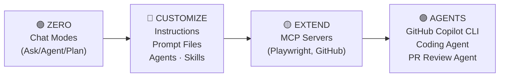
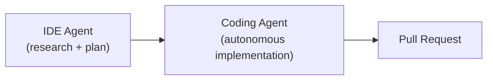
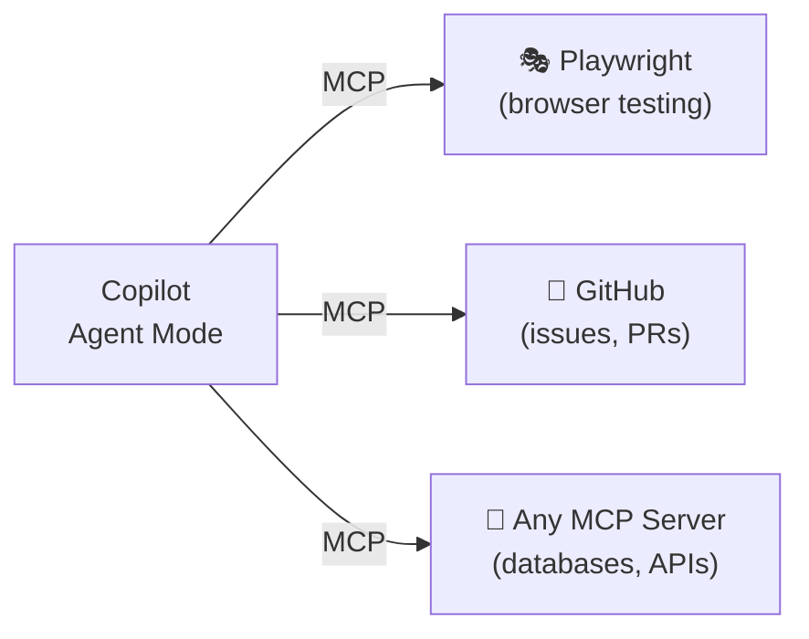
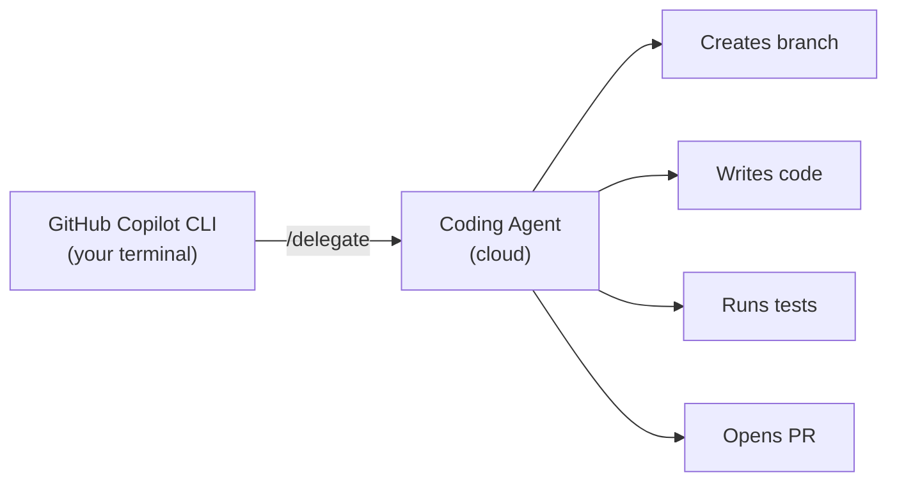
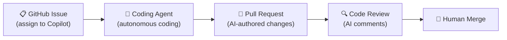

<!-- markdownlint-disable -->

# GitHub Copilot

## Zero to Agents

*From casual usage to fully customized, agentic AI development*

`github.com/microsoft/GitHubCopilot_Customized`

<!--
Welcome attendees. "Today we're going from zero — basic Copilot usage — all the way to autonomous agents writing code and reviewing PRs. Everything we build uses real files in a real repo that you'll take home."
-->

---
class: text-xs
---

# What We'll Cover Today

| Time | Topic |
|------|-------|
| 20 min | Welcome & Environment Setup |
| 25 min | Copilot Chat Modes (Ask, Agent, Plan) |
| 25 min | Custom Instructions |
| 25 min | Custom Prompt Files |
| 25 min | Agent Skills |
| 25 min | Custom Agents (Chat Modes) |
| 30 min | MCP Servers (Playwright + GitHub) |
| 30 min | GitHub Copilot CLI: The Agentic Terminal |
| 20 min | Cloud Agents: Coding Agent + PR Review Agent |
| 10 min | Wrap-Up & Q&A |

<!--
"We'll alternate between slides, live demos, and your own hands-on time. Each section I'll show you the concept, demo it live, then give you time to try it. Feel free to stop me with questions."
-->

---
class: text-sm
---

# The Journey — Zero to Agents

### Your Progression Today



**Each layer builds on the last.**

<!--
"Think of this as a stack. We start with the basics — how to interact with Copilot. Then we customize it for YOUR team. Then we extend it to touch external tools. Then we step into the terminal with the standalone GitHub Copilot CLI — a full agentic experience. Finally, we let it loose as an autonomous cloud agent. By the end, you'll have seen every layer."
-->

---
class: text-sm
---

# The Customization Hierarchy

### Files You'll Create Today

| Layer | File Location | When Active |
|-------|---------------|-------------|
| Instructions | `.github/copilot-instructions.md` | Always loaded |
| Scoped Instructions | `.github/instructions/*.instructions.md` | When matching files open |
| Prompt Files | `.github/prompts/*.prompt.md` | On-demand (you invoke) |
| Agents | `.github/agents/*.agent.md` | Selected in chat mode picker |
| Skills | `.github/skills/*/SKILL.md` | Auto-selected by relevance |
| MCP Servers | `.vscode/mcp.json` | When server is running |

<div class="gh-callout gh-callout-blue">

**Key insight**: Instructions are always-on. Everything else is selective.

</div>

<!--
"This is the cheat sheet for the whole day. Keep this mental model — instructions are always listening, prompts are on-demand, skills are auto-selected. We'll cover each one in depth."
-->

---
class: text-sm
---

# The Demo App — OctoCAT Supply

### What We're Working With

- **App**: OctoCAT Supply — a supply chain management web app
- **Frontend**: React 18+, TypeScript, Tailwind CSS, Vite
- **Backend**: Express.js, TypeScript, OpenAPI/Swagger
- **Entities**: Headquarters, Branches, Products, Suppliers, Orders, Deliveries
- **Created entirely with Copilot** — including the hero image

### Getting Started

```bash
git clone https://github.com/<YOUR-FORK>/GitHubCopilot_Customized.git
cd GitHubCopilot_Customized
npm install && npm run dev
```

- API: `http://localhost:3000` · Frontend: `http://localhost:5137`

<!--
🖥️ SWITCH TO SETUP. Have attendees fork, clone, and run the app. Walk around and help with any issues. Budget 10 minutes for this. Common issues: Node version too old, port conflicts, Codespaces CORS.
-->

---
layout: section
---

# Chat Modes

---
class: text-sm
---

# Three Ways to Talk to Copilot

### Ask, Agent, Plan

| Mode | Purpose | Scope | Changes Files? |
|------|---------|-------|:--------------:|
| **Ask** | Explore, learn, understand | Entire codebase | No |
| **Agent** | Build features, edit code, run commands | Full codebase + terminal | Yes |
| **Plan** | Analyze, plan, propose changes | Entire codebase + images | No |

### Decision Framework

<div class="gh-box-accent">

```
"I need to understand something"     → Ask
"I need to build/fix/change"         → Agent
"I need to plan before building"     → Plan
```

</div>

<!--
"Most of you have probably used completions. Some of you have used chat. But the mode you select dramatically affects what Copilot can do. Let me show you the difference. Note that Agent mode now also has sub-types — Local, Background, and Cloud — which control where and how the agent runs."
-->

---
class: text-sm
---

# Ask Mode — Your Codebase Expert

### What Ask Mode Does

- Reads your entire codebase (with `@workspace`)
- Answers questions with file and line references
- Explains architecture, patterns, and design decisions
- **Never modifies** any files

### Try These Prompts

```
Please give me details about the API of this project.
What testing framework does this project use?
Are there any core features missing?
```

<!--
"Ask mode is your senior engineer who's read the entire codebase. It won't touch anything — it just explains. Perfect for onboarding or before you start coding."
-->

---
class: text-sm
---

# Plan Mode — Think Before You Build

### What Plan Mode Does

- Analyzes your codebase, images, and context
- Proposes implementation plans and architectural approaches
- Identifies which files need to change and what steps to take
- **Never modifies** any files — planning only

### Great For

- Planning complex features before implementation
- Getting architectural guidance before writing code
- Creating implementation roadmaps for multi-step tasks

<!--
"Plan mode is your architect. It reads your codebase, analyzes the problem, and proposes a plan — without touching any code. Use this before tackling complex features — think first, then build."
-->

---
class: text-xs
---

# Agent Mode — Your Pair Programmer

### What Agent Mode Does

- Reads and writes multiple files
- Runs terminal commands (build, test, lint)
- Iterates until the task works (self-healing)
- Uses tools: file search, web fetch, code analysis

### Agent Sub-Types

| Type | Where It Runs | Best For |
|------|---------------|----------|
| **Local** | Your IDE, interactive | Day-to-day coding, building features |
| **Background** | Your IDE, non-blocking | Longer tasks while you continue working |
| **Cloud** | GitHub servers | Autonomous coding from Issues (Section 9) |

### The Power Move

<div class="gh-box-copilot">

```
Build and run my project so I can see its existing state.
```

Copilot will: read config → install deps → build → start → verify.

</div>

<!--
"Agent mode is where the magic happens. It's not just autocomplete — it's a programmable collaborator that can build features across your entire codebase."
-->

---
layout: demo
---

# 🖥️ LIVE DEMO

### Copilot Chat Modes

- Ask: Explore the API architecture
- Plan: Plan how to add input validation
- Agent: Build and run the project

*Then: Your turn to try all three (8 min)*

<!--
🖥️ SWITCH TO DEMO 1. Run through Ask → Plan → Agent demos. Then give attendees 8 minutes to try each mode. Walk around and help. ~15 min total for demo + hands-on.
-->

---
layout: section
---

# Custom Instructions

---
class: text-sm
---

# Why Custom Instructions?

### The Problem

Copilot is trained on the entire internet — but it doesn't know:

<v-clicks>

- Your internal frameworks
- Your team's coding standards
- Your architecture decisions
- Your company's naming conventions

</v-clicks>

### The Solution

<div class="gh-box-accent">

`.github/copilot-instructions.md` — a file that tells Copilot **how your team works**.

Loaded into **every single interaction**, invisibly.

</div>

<!--
"Ask the audience: Raise your hand if Copilot has ever suggested something that doesn't follow your team's standards. Every hand should go up. Custom instructions fix that."
-->

---
class: text-sm
---

# Two Types of Instructions

### Project-Wide vs Scoped

| Type | File | When Active |
|------|------|-------------|
| **Project-wide** | `.github/copilot-instructions.md` | Every interaction |
| **Scoped** | `.github/instructions/API.instructions.md` | Only when matching files open |

### Scoped Instructions Use Glob Patterns

```yaml
---
applyTo: "api/**"
---
# Only active when working in the api/ directory
```

### What to Include

✅ Coding standards, naming conventions, internal framework references, architecture patterns, security requirements

❌ Full documentation, step-by-step tutorials, lengthy prose (wastes context window)

<!--
"Keep instructions concise. They're loaded on every interaction, so they consume your context window. Think bullet points, not essays."
-->

---
class: text-sm
---

# The Power of Internal Frameworks

### TAO: Teaching Copilot About Things It's Never Seen

**TAO** (TypeScript API Observability) is a fictional internal framework.

It doesn't exist on the internet. No training data. Zero public code.

Yet with custom instructions, Copilot generates perfect TAO code:

```typescript
import { initTAO, observe } from '@tao/core';
import { Measure, Trace, Log } from '@tao/core';
```

<div class="gh-callout gh-callout-purple">

**How?** One line in custom instructions: *"Implement logging using TAO. Reference: docs/tao.md"*

</div>

<!--
"This is usually the 'aha moment'. When they see Copilot generating code for a framework that literally doesn't exist, they get why instructions matter. Every company has their own TAO. After showing this, use Agent mode to revert the TAO changes and remove the Observability Requirements section from copilot-instructions.md — this shows Copilot can clean up its own work, and ensures the codebase compiles for the remaining exercises."
-->

---
layout: demo
---

# 🖥️ LIVE DEMO

### Custom Instructions

- Generate `copilot-instructions.md` using the Gear icon
- Create scoped `API.instructions.md`
- TAO observability example

*Then: Create your own instructions (12 min)*

<!--
🖥️ SWITCH TO DEMO 2. Generate instructions → create scoped instructions → TAO demo. Then 12 min hands-on. ~20 min total.
-->

---
layout: section
---

# Custom Prompt Files

---
class: text-sm
---

# Prompts vs Instructions

### Different Tools for Different Jobs

| Feature | Instructions | Prompt Files |
|---------|-------------|-------------|
| **Loaded** | Automatically, always | On-demand (you invoke) |
| **Purpose** | Set rules and standards | Execute specific tasks |
| **Reusable** | Yes (passive) | Yes (active) |
| **Has frontmatter** | No (scoped ones do) | Yes (mode, tools, description) |

<div class="gh-callout gh-callout-blue">

**Analogy**: Instructions = your team's style guide (always applies). Prompts = your team's runbooks (run when needed).

</div>

<!--
"If instructions are the rules, prompts are the playbooks. 'When you need to generate tests, run this prompt. When you need a security review, run that prompt.' Consistency across the team."
-->

---
class: text-sm
---

# Anatomy of a Prompt File

### `.github/prompts/my-prompt.prompt.md`

```yaml
---
mode: 'agent'
description: 'What this does'
tools: ['codebase', 'editFiles', 'runCommands', 'search']
---

# Prompt Title

Markdown instructions for what Copilot should do.

## Requirements
- Specific patterns to follow
- Files to reference
- Quality standards
```

### How to Run

- **Run button** in the `.prompt.md` file header
- **Command Palette** → "Prompts: Run Prompt"
- **Type** `/prompt-name` in Copilot Chat

<!--
"The YAML frontmatter is key. It tells Copilot which mode to use and which tools to enable. The Markdown body is your instructions. Think of it as a recipe — YAML is the ingredients list, Markdown is the steps."
-->

---
class: text-sm
---

# Prompts in This Repo

### Three Ready-to-Run Prompts

| Prompt | Mode | Purpose |
|--------|------|---------|
| `Unit-Test-Coverage.prompt.md` | Agent | Generate tests for Product + Supplier routes |
| `plan.prompt.md` | Agent | Create implementation plans (no code!) |
| `model.prompt.md` | Agent | Compare AI models with live doc fetching |

### Unit Test Prompt Highlights

- Specifies exact test patterns to follow (`branch.test.ts`)
- Lists CRUD + error scenarios as requirements
- Includes `npm run test:api` commands for validation
- Agent self-heals when tests fail

<!--
"Walk through the unit test prompt file on screen. Point out: the tools list (runCommands lets it execute tests), the pattern reference (follow branch.test.ts), and the success criteria (all tests passing)."
-->

---
layout: demo
---

# 🖥️ LIVE DEMO

### Custom Prompt Files

- Walk through 3 existing prompts
- Run the unit test prompt live
- Show self-healing on test failures

*Then: Create your own prompt file (12 min)*

<!--
🖥️ SWITCH TO DEMO 3. Walk through prompts → run unit test prompt → show self-healing. Then 12 min hands-on to create a security-review prompt. ~18 min total.
-->

---
layout: section
---

# Agent Skills

---
class: text-sm
---

# Skills — The Auto-Pilot Layer

### How Skills Differ from Everything Else

| Aspect | Instructions | Prompts | Agents | Skills |
|--------|-------------|---------|--------|--------|
| **Loaded** | Always | Manual | Manual | **Auto** |
| **Trigger** | Every interaction | You invoke | You select | **Copilot decides** |
| **Best for** | Simple rules | Specific tasks | Personas | **Specialized procedures** |
| **Includes** | Text only | Text only | Text only | **Text + scripts + files** |

<div class="gh-callout gh-callout-blue">

**The key insight**: Skills are instructions that Copilot loads ONLY when it recognizes they're relevant to your prompt.

</div>

<!--
"Skills are the most 'intelligent' customization layer. You don't invoke them — Copilot reads the description and decides when they're relevant. It's like having an expert on call who only chimes in when their expertise is needed."
-->

---
class: text-sm
---

# Skill Structure

### `.github/skills/my-skill/SKILL.md`

```yaml
---
name: code-review-checklist
description: Checklist for reviewing TypeScript and Express.js code.
  Use this when asked to review code or audit code quality.
---

Step-by-step instructions that Copilot follows
when this skill is activated.

Can reference scripts and files in the same directory.
```

### Skill Scope

| Type | Location | Shared |
|------|----------|--------|
| **Project** | `.github/skills/` | Via git (team-wide) |
| **Personal** | `~/.copilot/skills/` | Your machine only |

`~` = OS home directory (`C:\Users\<username>` on Windows, `/Users/<username>` on macOS, `/home/<username>` on Linux).

<!--
"The description field is critical — it's how Copilot decides whether to load the skill. Be specific about WHEN this skill should be used. Vague descriptions = skills that never get loaded."
-->

---
class: text-sm
---

# Skills vs Instructions — When to Use Each

### The Decision

| Use Case | Use This |
|----------|----------|
| "Always use TypeScript strict mode" | **Instruction** |
| "When reviewing code, follow this checklist..." | **Skill** |
| "Never hardcode credentials" | **Instruction** |
| "When creating API routes, use this pattern..." | **Skill** |
| "Our team uses Vitest for testing" | **Instruction** |
| "When generating tests, include these scenarios..." | **Skill** |

<div class="gh-callout gh-callout-green">

**Rule of thumb**: If it's a simple rule → instruction. If it's a detailed procedure → skill.

</div>

<!--
"Common mistake: putting detailed procedures in instructions. That wastes context window on every interaction. Skills only load when needed — they're more efficient for complex, specialized knowledge."
-->

---
layout: demo
---

# 🖥️ LIVE DEMO

### Agent Skills

- Create a skill from scratch
- Show auto-selection in action
- Reference community skill collections

*Then: Create a skill for OctoCAT Supply (12 min)*

<!--
🖥️ SWITCH TO DEMO 4. Create code-review-checklist skill → trigger it with a prompt → show auto-selection. Then 12 min hands-on. ~18 min total.
-->

---
layout: section
---

# Custom Agents (Chat Modes)

---
class: text-sm
---

# Agents — Persistent Personas

### What Makes Agents Different

| Feature | Prompt Files | Custom Agents |
|---------|-------------|---------------|
| **Duration** | Single execution | Entire chat session |
| **Behavior** | "Do this task" | "Be this persona" |
| **Model** | Uses current model | Can specify its own model |
| **Appears in** | Prompt picker | Chat mode selector |
| **File** | `.prompt.md` | `.agent.md` |

<div class="gh-callout gh-callout-blue">

**Analogy**: Prompt = a recipe. Agent = a chef who knows many recipes.

</div>

<!--
"The key difference: prompts are one-shot tasks, agents are ongoing personas. When you select an agent, it stays active for your whole session. It changes HOW Copilot thinks, not just WHAT it does."
-->

---
class: text-sm
---

# Anatomy of an Agent

### `.github/agents/MyAgent.agent.md`

```yaml
---
tools: ['codebase', 'search', 'editFiles', 'runCommands', 'problems']
description: Full-stack engineer for the OctoCAT Supply app
model: Claude Sonnet 4
---

Your persona and behavior instructions go here.
This text defines WHO the agent IS, not just what it does.
```

### Agent Progression (Simple → Advanced)

| Agent | Tools | Model | Pattern |
|-------|-------|-------|---------|
| **OctoCATEngineer** | Local read/write | Default | Simple worker — builds features |
| **CodeReviewer** | Local read-only | Claude Sonnet 4 | Reviewer — analyzes, doesn't edit |
| **ImplementationIdeas** | MCP wildcards + cloud | Claude Sonnet 4.5 | Advanced — delegates to Coding Agent |

<!--
"We'll look at three agents in this section, from simple to advanced. The OctoCATEngineer uses basic local tools — no MCP, no custom model. CodeReviewer is read-only with a custom model. ImplementationIdeas uses MCP wildcards and delegates to the cloud Coding Agent. Same file format, wildly different capabilities."
-->

---
class: text-sm
---

# Agents Can Delegate — Advanced Pattern

### The ImplementationIdeas Agent

This agent demonstrates multi-level agentic behavior:

1. **Research** — Searches codebase in parallel
2. **Plan** — Creates a todo list of variations
3. **Delegate** — Calls `create_pull_request_with_copilot` to hand off to Coding Agent



**Agents calling agents.** This is the agentic pattern.

<div class="gh-callout gh-callout-purple">

We'll cover the Coding Agent in detail in Section 9.

</div>

<!--
"This is the advanced pattern — don't worry if it feels like a leap. An agent in your IDE can research a problem, create a plan, and then delegate the actual coding to GitHub's Coding Agent. We'll see the Coding Agent up close in the Cloud Agents section."
-->

---
layout: demo
---

# 🖥️ LIVE DEMO

### Custom Agents (Chat Modes)

- Use the OctoCATEngineer agent (simple local worker)
- Create a CodeReviewer agent live (read-only)
- Review the ImplementationIdeas agent (advanced delegation)

*Then: Use and create your own agents (10 min)*

<!--
🖥️ SWITCH TO DEMO 5. Review existing agent → show mode picker → create CodeReviewer agent. Then 10 min hands-on. ~17 min total.
-->

---
layout: section
---

# MCP Servers

---
class: text-sm
---

# What is MCP?

### Model Context Protocol — Copilot's Extension Layer



<div class="gh-callout gh-callout-blue">

**MCP = USB for AI.** Plug in any tool and Copilot can use it.

</div>

<!--
"MCP stands for Model Context Protocol. It's an open standard for connecting AI models to external tools. Think of it like USB — before USB, every device had its own connector. MCP is the universal connector for AI tools."
-->

---
class: text-xs
---

# MCP Configuration

### `.vscode/mcp.json`

```json
{
  "servers": {
    "github": {
      "type": "http",
      "url": "https://api.githubcopilot.com/mcp/"
    },
    "playwright": {
      "command": "npx",
      "args": ["@playwright/mcp@latest"]
    }
  }
}
```

### Two Server Types

| Type | How It Runs | Auth | Example |
|------|-------------|------|---------|
| **HTTP** | Remote service | OAuth | GitHub MCP |
| **stdio** | Local process | None | Playwright MCP |

MCP servers auto-start when Copilot needs them. Verify: `Ctrl+Shift+P` → `MCP: List servers`

<div class="gh-box-attention">

**Important**: Ensure VS Code setting `chat.mcp.discovery.enabled` is `true`.

</div>

<!--
"The config lives in your repo — .vscode/mcp.json. When someone clones your repo, they get the MCP configuration too. Team-wide extensibility. One thing to call out before the demo: when Copilot first calls an MCP tool, VS Code will prompt you to approve it with an 'Allow' button. Click the dropdown arrow next to 'Allow' for session-wide and workspace-wide options. For the workshop, recommend 'Allow Tools from [Server] Without Review in this Session' — it's scoped to one server and resets on restart."
-->

---
class: text-sm
---

# Playwright MCP — Browser Testing from Chat

### What You Can Do

- Navigate to any URL from chat
- Interact with pages (click, type, scroll)
- Take screenshots and describe UI
- Execute BDD-style test scenarios from natural language

### Example Prompts

```
Browse to http://localhost:5137 and navigate to Products.
Click on the first product and check if details display correctly.
Run BDD test scenarios for the Products page.
```

> ⚠️ Playwright MCP requires local VS Code (not Codespaces)

<!--
"This is usually the biggest 'wow' moment. When they see Copilot driving a real browser from a chat prompt, the possibilities click. Testing, QA, accessibility auditing — all from natural language."
-->

---
class: text-sm
---

# GitHub MCP — GitHub from Chat

### What You Can Do

- List and search issues and PRs
- Create issues with labels and assignees
- Read file contents and repo metadata
- Create pull requests
- Assign issues to Copilot (Coding Agent trigger!)

### Example Prompts

```
Check which issues are assigned to me in this repo.
Create an Issue to improve test coverage and assign it to me.
List open PRs and summarize their status.
```

<!--
"GitHub MCP is the bridge between your IDE and your project management. No more switching between VS Code and the browser to create issues. And here's the key: you can use it to assign issues to Coding Agent, which we'll see next."
-->

---
layout: demo
---

# 🖥️ LIVE DEMO

### MCP Servers

- Start both servers
- Playwright: Browse and test the app
- GitHub: Create and manage issues from chat

*Then: Use Playwright MCP to test the app (15 min)*

<!--
🖥️ SWITCH TO DEMOS 6 & 7. Start servers → Playwright browser test → GitHub issue creation. Then 15 min hands-on with Playwright. ~24 min total.
-->

---
layout: section
---

# GitHub Copilot CLI

---
class: text-sm
---

# GitHub Copilot CLI — The Agentic Terminal

| Capability | Command / Key | What It Does |
|------------|--------------|--------------|
| **Interactive TUI** | `copilot` | Full-screen agentic terminal with streaming responses |
| **Plan mode** | `Shift+Tab` | Preview multi-step plan before execution |
| **File context** | `@filename` | Attach files directly into your prompt |
| **Delegate to cloud** | `/delegate` | Hand task to Coding Agent (creates branch + PR) |
| **Code review** | `/review` | AI reviews staged or working-tree changes |
| **Shell escape** | `!command` | Run any shell command without leaving the session |
| **Session resume** | `--resume` / `--continue` | Pick up where you left off |
| **Tool approval** | `--allow-tool` | Granular control over which tools the agent can use |

<!--
"We've been working inside VS Code — now let's step outside. I'm going to minimize VS Code and open a standalone terminal — Windows Terminal, Terminal.app, iTerm2, whatever you use. This isn't a VS Code extension. The standalone GitHub Copilot CLI is a full agentic experience — an interactive TUI where the AI can read your files, run commands, build plans, and even delegate work to Coding Agent. No editor required. This is the moment the workshop goes from 'cool' to 'wow.'"
-->

---
class: text-xs
---

# The TUI Experience — AI Meets Terminal

```
┌─────────────────────────────────────────────────────────┐
│  copilot                                                │
│  You: @src/api/routes.ts add input validation to        │
│       the POST /orders endpoint                         │
│                                                         │
│  ┌─ Plan ──────────────────────────────────────────┐    │
│  │ 1. Read src/api/routes.ts                       │    │
│  │ 2. Add zod schema for order validation          │    │
│  │ 3. Add middleware to POST /orders route          │    │
│  │ 4. Run existing tests to verify no regressions   │    │
│  └─────────────────────────────────────────────────┘    │
│                                                         │
│  [Allow tool: edit_file] (Y)es / (N)o / Yes (A)lways   │
│  Shift+Tab → plan mode · /review · /delegate · !cmd    │
└─────────────────────────────────────────────────────────┘
```

<!--
"This is what it looks like. You type a natural-language prompt, optionally attach files with @, and the CLI builds a plan. You see every tool call before it runs — edit_file, run_command — and you approve each one. Shift+Tab toggles plan mode so you can preview before committing. It's the same agentic experience as VS Code, but entirely in your terminal."
-->

---
class: text-sm
---

# From Terminal to Cloud — The /delegate Bridge



<div class="gh-callout gh-callout-purple">

**One command bridges local → cloud.** Your context, your prompt — executed autonomously as a full PR workflow.

</div>

<!--
"Here's the bridge to Section 9. When you're in the CLI and realize a task is bigger than a quick fix, type /delegate. It takes your prompt and context, hands it to Coding Agent in the cloud, which creates a branch, writes the code, runs tests, and opens a PR. You go from terminal to autonomous cloud agent in one keystroke."
-->

---
layout: demo
---

# 🖥️ LIVE DEMO

### GitHub Copilot CLI — Agentic Terminal

**SWITCH TO STANDALONE TERMINAL** (Windows Terminal / Terminal.app / iTerm2)

1. Open a **standalone terminal** — minimize the IDE
2. `cd` to the project root and launch `copilot`
3. `Shift+Tab` — toggle plan mode, review the plan
4. Build a feature — watch tool approvals in action
5. `/review` — AI reviews the changes just made
6. `/delegate` — hand a task to Coding Agent

<!--
"This is the centerpiece demo. I'll launch the CLI, show the TUI, build a real feature with plan mode and tool approvals, then use /delegate to bridge into Coding Agent. Everything after this slide flows from what we show here. Take your time — this is the 'wow' moment."
-->

---
layout: section
---

# Cloud Agents

---
class: text-sm
---

# The Autonomous Development Loop

### From Issue to Merged PR — AI-Assisted at Every Step



<!--
"This is the full loop. An issue gets created, Coding Agent writes the code, creates a PR, Copilot reviews the PR, and a human makes the final call. Every step is AI-assisted."
-->

---
class: text-xs
---

# Coding Agent — Autonomous PRs

| Step | What Happens |
|------|-------------|
| 1. Create Issue | Write a GitHub Issue describing the task |
| 2. Assign to Copilot | Copilot picks it up automatically |
| 3. Autonomous coding | Creates branch, reads your instructions & skills, implements solution |
| 4. Tests & PR | Runs tests (if configured), opens a Pull Request |

### Requirements

- ✅ Actions enabled on the repo · ✅ Branch protection on `main` · ✅ Coding Agent enabled in settings

<div class="gh-callout gh-callout-blue">

**Timing**: Simple tasks ~5-10 min · Complex features ~15-30 min. Copilot reads ALL your customization files — instructions, skills, everything — even when coding autonomously.

</div>

<!--
"Coding Agent reads ALL of your customization files — instructions, skills, everything we built today. It follows your team's standards even when coding autonomously. That's why the customization layers matter."
-->

---
class: text-sm
---

# Making Coding Agent Smarter

### Your Customization Files Work in the Cloud Too

Coding Agent reads ALL of your customization files:

| File | Purpose | Used By |
|------|---------|---------|
| `.github/copilot-instructions.md` | Coding standards, architecture rules | IDE Agent + Coding Agent |
| `.github/skills/*/SKILL.md` | Specialized procedures (auto-selected) | IDE Agent + Coding Agent |

<div class="gh-callout gh-callout-purple">

**Key insight**: Everything you built today — instructions, skills, agents — Coding Agent uses all of it. Your team's standards apply even when AI codes autonomously.

</div>

<!--
"This slide connects back to everything we built today. Instructions, skills, agents — Coding Agent reads all of them. Your team's standards are enforced even when AI is coding autonomously in the cloud."
-->

---
class: text-xs
---

# PR Review Agent — AI Code Review

### How It Works

1. Open any Pull Request
2. Add **Copilot** as a reviewer
3. Copilot reviews for:
   - ☑️ Correctness (logic errors, bugs)
   - 🔒 Security (vulnerabilities, injection risks)
   - ⚡ Performance (N+1 queries, memory leaks)
   - 📝 Style (naming, patterns, best practices)
4. Provides inline comments with suggested fixes

### Copilot + Human Review

| Copilot Catches | Humans Catch |
|-----------------|--------------|
| Pattern-based bugs | Business logic correctness |
| Security vulnerabilities | Architectural alignment |
| Performance anti-patterns | Team context and intent |
| Style inconsistencies | UX and product decisions |

<div class="gh-callout gh-callout-green">

**Best together. Not a replacement.**

</div>

<!--
"Copilot Review is a force multiplier for your human reviewers. It catches the mechanical stuff so humans can focus on the important stuff — does this change make sense for our product?"
-->

---
class: text-sm
---

# Agent Mode vs Coding Agent

### When to Use Each

| Aspect | Agent Mode (IDE) | Coding Agent (Cloud) |
|--------|-----------------|---------------------|
| **Where** | Your IDE | GitHub servers |
| **How** | Interactive chat | Assign a GitHub Issue |
| **Sync** | Real-time | Async (5-30 min) |
| **Best for** | Iterative, exploratory | Well-defined tasks |
| **Output** | Files in your workspace | A Pull Request |

<div class="gh-callout gh-callout-blue">

**Rule of thumb**: If you want to watch and steer → Agent Mode. If you want to delegate and do other work → Coding Agent.

</div>

<!--
"Don't use Coding Agent for everything. It's best for well-defined tasks with clear acceptance criteria. Use Agent Mode when you need to iterate and explore. They're complementary, not competing."
-->

---
layout: demo
---

# 🖥️ LIVE DEMO

### Cloud Agents

- Create a GitHub Issue in the browser
- Assign the issue to Copilot (Coding Agent)
- Show the autonomous session starting
- Request Copilot Code Review on a PR
- Walk through AI review comments

<!--
🖥️ SWITCH TO DEMO 9. Navigate to the Issues tab → New issue → fill in title and body → Submit → assign to Copilot → show session starting → open a PR → add Copilot as reviewer → walk through review comments. ~15 min total (no hands-on for this section — cloud agents are observe-only).
-->

---
layout: section
---

# Wrap-Up

---
class: text-sm
---

# What You Built Today

### Your Customization Stack

| File | Section |
|------|---------|
| `.github/copilot-instructions.md` | Custom Instructions |
| `.github/instructions/API.instructions.md` | Scoped Instructions |
| `.github/prompts/security-review.prompt.md` | Custom Prompt Files |
| `.github/agents/CodeReviewer.agent.md` | Custom Agents |
| `.github/skills/*/SKILL.md` | Agent Skills |
| GitHub Copilot CLI agentic terminal session | GitHub Copilot CLI |

<div class="gh-callout gh-callout-green">

**All of these are portable** — commit them to any repo and your team gets them too.

</div>

<!--
"Look at what you built in one session. Every file in this list makes Copilot smarter for your team. Commit these to your real repos tonight."
-->

---
class: text-sm
---

# The Full Customization Stack

### Each layer builds on the one below

| | Layer | What |
|--|-------|------|
| ☁️ | **Cloud Agents** | Coding Agent + PR Review |
| 🔌 | **MCP Servers** | Playwright + GitHub |
| 🧠🤖 | **Skills + Agents** | `.github/skills/` · `.github/agents/` |
| 📄 | **Prompt Files** | `.github/prompts/*.prompt.md` |
| 📋 | **Instructions** | `.github/copilot-instructions.md` |
| 💬 | **Chat Modes** | Ask → Plan → Agent |

<div class="gh-callout gh-callout-purple">

**⌨️ GitHub Copilot CLI** connects from the terminal to every layer — including cloud agents via `/delegate`.

</div>

<!--
"This is the full stack. Every layer builds on the one below. And the GitHub Copilot CLI connects you from the terminal to every layer — including cloud agents via /delegate."
-->

---
class: text-sm
---

# Key Takeaways

### Seven Things to Remember

<v-clicks>

1. **Modes** → Ask to understand, Plan to design, Agent to build
2. **Instructions** → Encode tribal knowledge (internal frameworks, standards)
3. **Prompt Files** → Reusable task templates for consistency
4. **Agents** → Persistent personas that change Copilot's behavior
5. **Skills** → Auto-selected expertise loaded when relevant
6. **MCP** → Connect Copilot to any external tool
7. **Cloud Agents** → Issue → Code → PR → Review — all AI-assisted

</v-clicks>

<!--
"If you remember nothing else: the customization files live in .github/ and they follow your code. Share them like you share code — via git."
-->

---
class: text-sm
---

# Your Action Items

### What to Do Next

<v-clicks>

- [ ] Commit today's customization files to your real repo
- [ ] Identify 3-5 internal frameworks to encode as instructions
- [ ] Create prompt files for your most repetitive tasks
- [ ] Build a skill for your team's most specialized workflow
- [ ] Enable Copilot Code Review on your repositories
- [ ] Share this approach with your team

</v-clicks>

<!--
"These are your homework items. The biggest ROI comes from custom instructions and prompt files — start there. Skills and agents are the next level."
-->

---
class: text-xs
---

# Resources

### Learn More

| Resource | URL |
|----------|-----|
| GitHub Copilot Docs | docs.github.com/en/copilot |
| Copilot in the CLI | docs.github.com/en/copilot/github-copilot-in-the-cli |
| Custom Instructions | docs.github.com/en/copilot/how-tos/configure-custom-instructions |
| Prompt Files | docs.github.com/en/copilot/how-tos/copilot-prompts |
| Agent Skills | docs.github.com/en/copilot/concepts/agents/about-agent-skills |
| MCP Servers | docs.github.com/en/copilot/how-tos/using-extensions/using-mcp-in-copilot |
| Copilot Coding Agent | docs.github.com/en/copilot/using-github-copilot/using-copilot-coding-agent |
| Copilot Code Review | docs.github.com/en/copilot/using-github-copilot/code-review |
| Copilot Trust Center | resources.github.com/copilot-trust-center/ |
| Copilot SDK | github.com/github/copilot-sdk |
| Community Skills | github.com/github/awesome-copilot |
| OctoCAT Supply Repo | github.com/microsoft/GitHubCopilot_Customized |

<!--
"The demo repo is a public template — share it with anyone who missed this session. Everything we did today is reproducible."
-->

---
layout: end
---

# Questions?

### Common Topics

- How do customization files propagate across forks?
- Can we restrict which MCP servers developers use?
- How do skills interact with instructions?
- Does Coding Agent respect branch protection?
- How do we measure ROI on customization?
- Can we use custom instructions with Copilot in github.com?

<!--
Leave 10 minutes for Q&A. Have the demo app and GitHub repo open in case questions need live answers. If no questions, offer to deep-dive on any section.
-->

---
layout: end
---

# Thank You

**Demo Repo**: `github.com/microsoft/GitHubCopilot_Customized`

**Follow-up**: Happy to schedule a deeper dive on any topic

<!--
Thank attendees, remind them about the action items, and offer follow-up support. Point them to the repo — everything they need is there.
-->

---
class: text-xs
---

# Appendix: Presenter Quick Reference

## Backup URLs

- Demo Repo: <https://github.com/microsoft/GitHubCopilot_Customized>
- API Swagger: <http://localhost:3000/api-docs>
- Frontend: <http://localhost:5137>
- GitHub Copilot CLI Docs: <https://docs.github.com/en/copilot/github-copilot-in-the-cli>
- Agent Skills Docs: <https://docs.github.com/en/copilot/concepts/agents/about-agent-skills>
- MCP Docs: <https://docs.github.com/en/copilot/how-tos/using-extensions/using-mcp-in-copilot>
