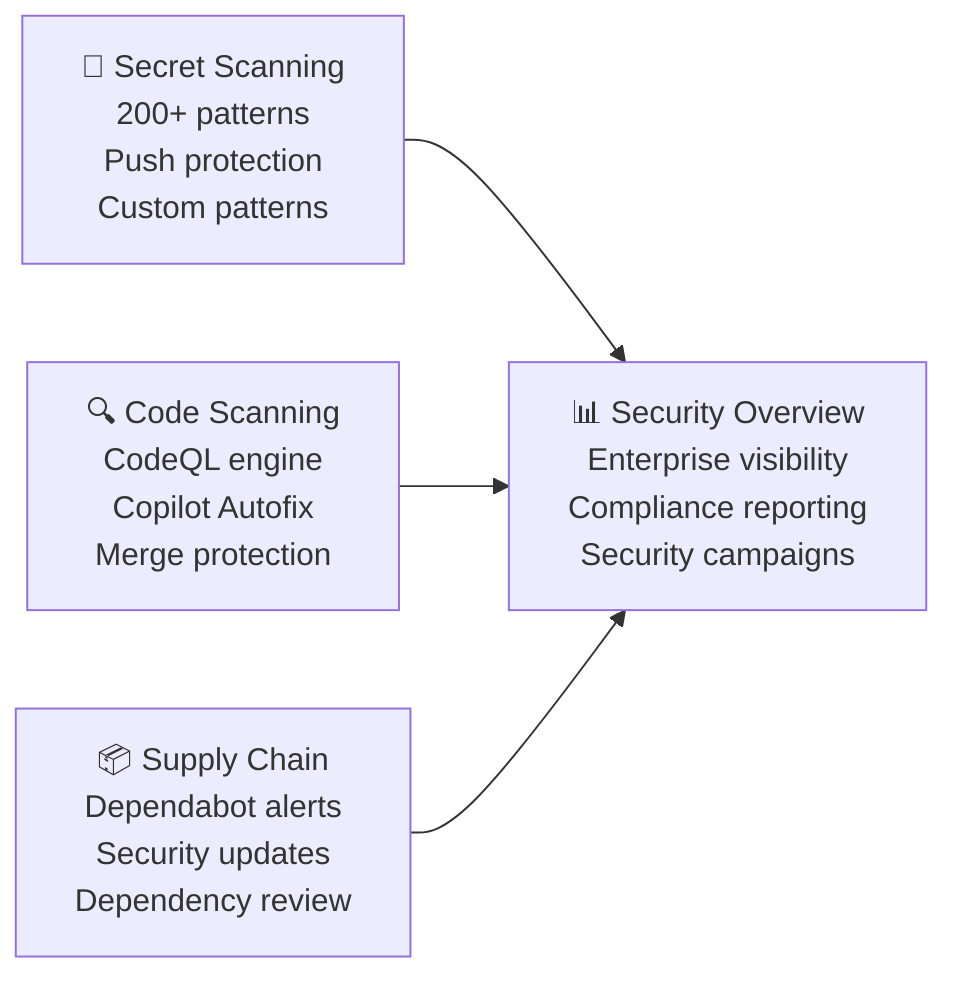
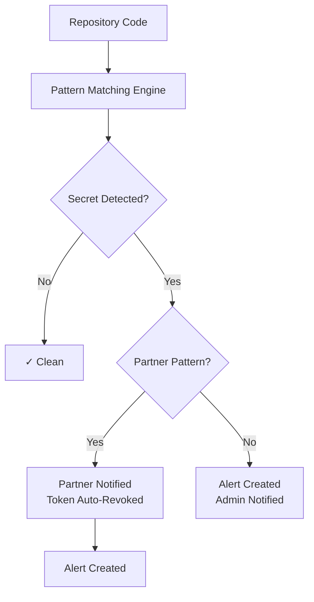
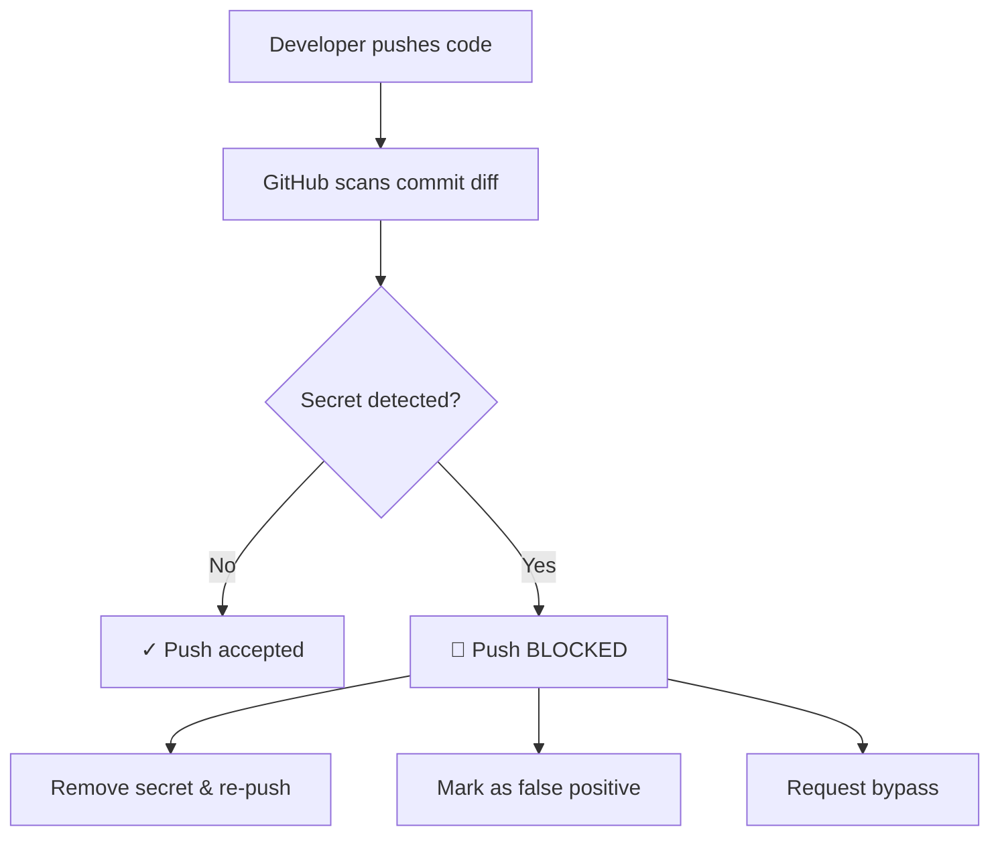
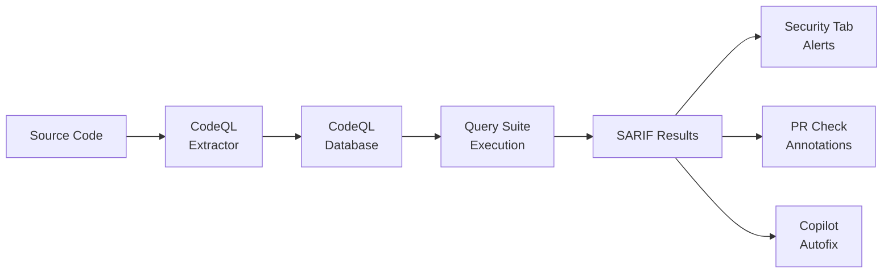
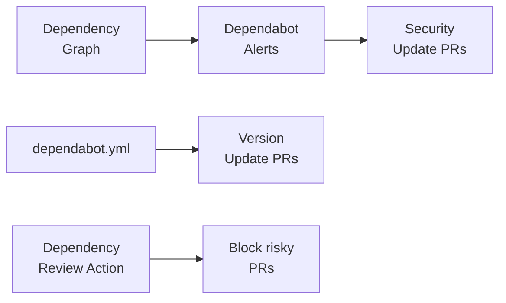
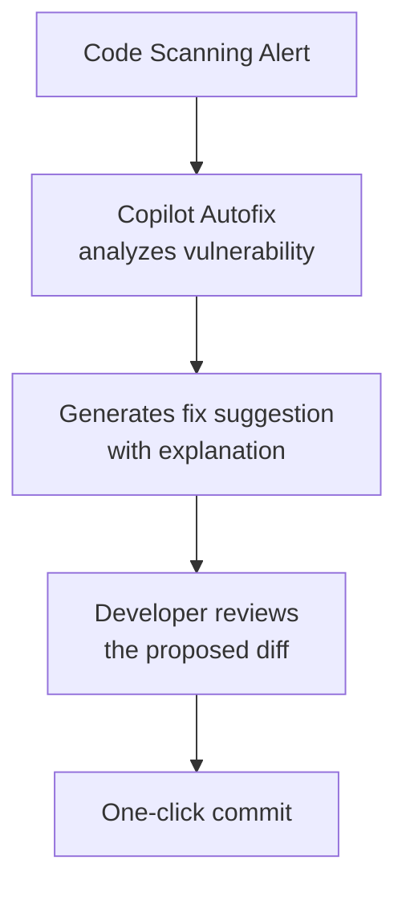
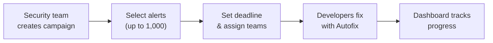
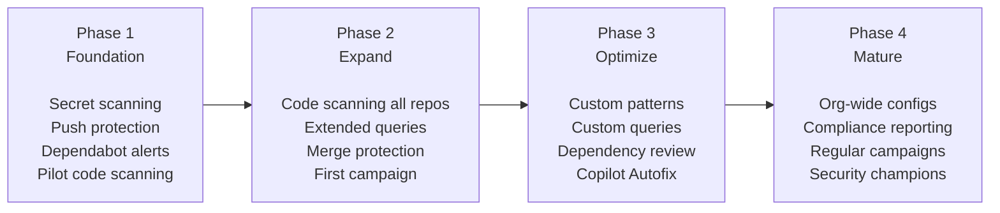

<!-- markdownlint-disable -->

# GitHub Advanced Security

## Comprehensive Security Workshop

*Secret Scanning · Code Scanning · Dependabot · Copilot Autofix*

<!--
Welcome attendees. "Today we're covering the full GitHub Advanced Security platform — from preventing secret leaks to finding code vulnerabilities, securing your supply chain, and using AI to fix what we find. By the end, you'll have a clear plan for rolling GHAS out across your enterprise."
-->

---
class: text-sm
---

# What We'll Cover Today

| Time | Topic |
|------|-------|
| 10 min | Opening & GHAS Architecture Overview |
| 20 min | Secret Scanning & Push Protection |
| 25 min | Code Scanning with CodeQL |
| 10 min | ☕ Break |
| 20 min | Dependabot & Supply Chain Security |
| 15 min | Copilot Autofix & Security Campaigns |
| 15 min | Security Overview & Reporting |
| 10 min | GHAS Rollout Strategy & Wrap-Up |

<!--
"We'll alternate between slides and live demos in the GitHub UI. Each section covers the concepts, then I'll show you how it works in practice. Ask questions anytime."
-->

---
layout: section
---

# GHAS Architecture Overview

---
class: text-sm
---

# Why GHAS?

### Security Integrated Into the Developer Workflow

<v-clicks>

- Vulnerabilities caught in development are **100× cheaper** to fix than in production
- Bolt-on security tools create context switching — GHAS is **native to GitHub**
- Developers fix issues where they already work — in **pull requests**
- Three pillars: **prevent secret leaks**, **find code vulnerabilities**, **secure the supply chain**

</v-clicks>

<div class="gh-callout gh-callout-blue">

**Shift left**: GHAS moves security from a gate at the end of the pipeline to a guardrail throughout development.

</div>

<!--
"The fundamental value proposition of GHAS is that security is not a separate workflow. It's embedded in the same PRs, pushes, and dependency updates your developers already do every day. No separate dashboard, no context switching."
-->

---
class: text-sm
---

# GHAS Feature Architecture

### Three Pillars + Unified Visibility



<div class="gh-callout gh-callout-green">

**All three pillars** feed into the Security Overview dashboard for enterprise-wide visibility and compliance reporting.

</div>

<!--
"Think of GHAS as three specialized scanners feeding into one unified dashboard. Secret scanning catches credentials. Code scanning finds vulnerabilities in YOUR code. Dependabot watches your dependencies. And Security Overview gives you the enterprise-wide picture."
-->

---
class: text-xs
---

# GHAS Licensing Model

### What's Free vs. What Requires a GHAS License

| Feature | Free (GHEC) | GHAS License |
|---------|:-----------:|:------------:|
| Dependency graph | ✓ | |
| Dependabot alerts | ✓ | |
| Dependabot security updates | ✓ | |
| Dependabot version updates | ✓ | |
| Secret scanning (public repos) | ✓ | |
| Secret scanning (private/internal) | | ✓ |
| Push protection | | ✓ |
| Custom secret patterns | | ✓ |
| Code scanning (CodeQL) | | ✓ |
| Copilot Autofix | | ✓ |
| Security campaigns | | ✓ |
| Security Overview (enterprise) | | ✓ |

<!--
"Key takeaway — Dependabot is free for everyone. Secret scanning on public repos is also free. But for private and internal repos, you need the GHAS license. That license also unlocks CodeQL, push protection, Autofix, and enterprise-level features."
-->

---
class: text-sm
---

# Where Security Lives in the GitHub UI

### Three Levels of Configuration

| Level | Key Locations |
|-------|---------------|
| **Enterprise** | Settings → Code security · Policies → Code security · Code Security tab |
| **Organization** | Settings → Security configurations · Security tab → Overview |
| **Repository** | Settings → Code security · Security tab → Alerts · Pull Requests |

<div class="gh-callout gh-callout-blue">

**Recommended approach**: Use organization-level **Security configurations** to manage settings at scale, then customize at the repository level only where needed.

</div>

<!--
"Security configuration happens at three levels. Enterprise sets the floor — what must be enabled everywhere. Organization is where you manage day-to-day — Security configurations are the recommended approach. Repository level is for exceptions and fine-tuning."
-->

---
layout: section
---

# Secret Scanning & Push Protection

---
class: text-sm
---

# The #1 Repository Risk

### Secrets in Source Code

<v-clicks>

- Exposed credentials are the **most common** attack vector from code repositories
- GitHub scans for **200+ secret patterns** from partners (AWS, Azure, GCP, Slack, Stripe...)
- Partner notification enables **automatic token revocation**
- Push protection stops secrets **before** they enter the repository

</v-clicks>

<!--
"Let me be direct — leaked secrets are the single biggest risk in your repositories. Not code vulnerabilities, not dependency issues. A leaked AWS key can cost you six figures in hours. GHAS addresses this at every stage."
-->

---
class: text-sm
---

# How Secret Scanning Works

### Detection → Notification → Remediation



<div class="gh-callout gh-callout-green">

**Partner patterns**: When GitHub detects a partner secret (e.g., AWS key), the partner is notified and can automatically revoke the token — often within seconds.

</div>

<!--
"The flow is elegant. GitHub scans your code against 200+ known patterns. If it finds a partner secret — say an AWS access key — it notifies AWS directly, and AWS can revoke that key automatically. For non-partner patterns, you get an alert with validity status."
-->

---
class: text-sm
---

# Secret Scanning Alert Types

### Three Categories of Detection

| Alert Type | Description | Action Taken |
|------------|-------------|--------------|
| **Partner patterns** | Secrets from 200+ providers (AWS, Azure, etc.) | Provider notified → token auto-revoked |
| **Non-provider patterns** | Generic high-entropy strings (private keys, passwords) | Alert created → manual review |
| **Custom patterns** | Organization-defined regex patterns | Alert created → manual review |

### Validity Checks

- GitHub checks if detected secrets are still **active** with the partner
- Alerts show status: **Active**, **Inactive**, or **Unknown**
- Prioritize remediation for **active** secrets

<!--
"Not all secrets are equal. Partner patterns get the best treatment — automatic revocation. Non-provider patterns catch things like private keys that don't have a specific vendor. Custom patterns are your own — internal API key formats, database connection strings, whatever is unique to your org."
-->

---
class: text-xs
---

# Push Protection

### The Most Impactful GHAS Feature



### Bypass Controls

| Setting | Description |
|---------|-------------|
| **No bypass** | Secrets must be removed — no exceptions |
| **Self-bypass** | Developer provides a reason (audit-logged) |
| **Delegated bypass** | Request routed to security team for approval |

<!--
"Push protection is the single feature I'd enable first if I could only pick one. It prevents secrets from ever entering your repo. The key decision is your bypass policy — strict 'no bypass' for regulated environments, or delegated bypass where a security team approves exceptions."
-->

---
class: text-xs
---

# Custom Secret Patterns

### Detect Organization-Specific Secrets

Define patterns for internal secrets that default scanning won't catch:

<div class="gh-box-accent">

```
Pattern Name:    Internal API Key
Regex:           internal_api_[a-zA-Z0-9]{32}
Test String:     internal_api_aBcDeFgHiJkLmNoPqRsTuVwXyZ123456
```

</div>

### Best Practices

<v-clicks>

- Start with your **most common** internal secret formats
- **Test patterns** against known samples before enabling
- Enable **push protection** for custom patterns
- Use **dry run mode** first to assess false positive rates
- Document patterns in your internal security runbook

</v-clicks>

<!--
"Every organization has its own secret formats — internal API keys, service account tokens, database connection strings. Custom patterns let you catch those. Start with your top 3-5 internal secret formats and expand from there."
-->

---
layout: demo
---

# 🖥️ LIVE DEMO

### Secret Scanning & Push Protection

- Show Security configurations with secret scanning + push protection
- Create a custom secret pattern with test string
- Walk through a secret scanning alert (severity, validity, remediation)
- Demonstrate a push protection block with a test secret
- Show the bypass workflow and audit log entry

<!--
🖥️ SWITCH TO DEMO. Navigate to Org → Settings → Security configurations. Show GitHub recommended config. Create a custom pattern. Push a test AWS key to trigger push protection. Show the bypass workflow. ~10 min.
-->

---
layout: section
---

# Code Scanning with CodeQL

---
class: text-sm
---

# What Is CodeQL?

### Semantic Code Analysis — Not Just Pattern Matching

<v-clicks>

- CodeQL **understands code structure** — functions, data flows, call graphs
- Builds a **relational database** of your code, then runs queries against it
- Finds real vulnerabilities: SQL injection, XSS, path traversal, auth bypass
- Ships with **thousands of queries** maintained by GitHub's security research team

</v-clicks>

<div class="gh-callout gh-callout-blue">

**Key difference**: Traditional SAST tools match text patterns. CodeQL models your code as data and runs semantic queries — dramatically reducing false positives.

</div>

<!--
"CodeQL is fundamentally different from pattern-matching SAST tools. It extracts your code into a relational database — tables of functions, variables, data flows — and then runs SQL-like queries to find vulnerabilities. This means it can trace tainted data from a user input to a SQL query across multiple files and functions."
-->

---
class: text-sm
---

# How CodeQL Works

### From Source Code to Security Alerts



### Supported Languages

JavaScript/TypeScript · Python · Java/Kotlin · C/C++ · C# · Go · Ruby · Swift

<!--
"The pipeline is: extract your code into a database, run queries, generate results in SARIF format. Those results show up as alerts in the Security tab, as inline annotations on PRs, and as input for Copilot Autofix to generate fix suggestions."
-->

---
class: text-sm
---

# Default Setup vs. Advanced Setup

### Choose the Right Configuration Level

| Aspect | Default Setup | Advanced Setup |
|--------|---------------|----------------|
| **Configuration** | One-click in settings | Custom workflow YAML |
| **Query suite** | `default` or `extended` | Any suite + custom queries |
| **Schedule** | Auto (push + PR + weekly) | Fully customizable |
| **Languages** | Auto-detected | Manually specified |
| **Custom builds** | Not supported | Full control |
| **Best for** | Quick enablement at scale | Fine-tuned analysis |

<div class="gh-callout gh-callout-green">

**Recommendation**: Start with **default setup** for all repositories. Move to advanced setup only for repos that need custom build steps or custom queries.

</div>

<!--
"Default setup is the 80/20 play. One click and it auto-detects your languages, configures analysis, and starts scanning. Advanced setup is for when you need custom build steps, specific query suites, or custom queries. Start with default, promote to advanced only where needed."
-->

---
class: text-xs
---

# Default vs. Extended Query Suites

### Balancing Coverage and Precision

| Suite | Findings | Confidence | False Positives |
|-------|----------|------------|-----------------|
| **default** | High-impact vulnerabilities only | Very high | Very low |
| **extended** | Broader coverage including medium-confidence | High | Low-medium |

### Query Categories (Extended Suite)

| Category | Examples |
|----------|---------|
| **Injection** | SQL injection, XSS, command injection, path traversal |
| **Authentication** | Weak crypto, hardcoded credentials, missing auth checks |
| **Data exposure** | Sensitive data logging, insecure storage, info disclosure |
| **Error handling** | Unhandled exceptions, error message information leaks |
| **Code quality** | Null dereference, resource leaks, race conditions |

<div class="gh-callout gh-callout-blue">

**Start with `default`** for lowest noise. Upgrade to **`extended`** once your team is comfortable triaging alerts.

</div>

<!--
"The default suite is high-confidence — you'll get fewer alerts, but they're almost always real. Extended adds more queries that catch more issues but may include some lower-confidence findings. I recommend starting with default, getting your triage process solid, then switching to extended."
-->

---
class: text-xs
---

# Advanced Setup — CodeQL Workflow

### Custom Configuration for Complex Repositories

<div class="gh-box-accent">

```yaml
# .github/workflows/codeql.yml
name: "CodeQL Analysis"
on:
  push:
    branches: [main]
  pull_request:
    branches: [main]
  schedule:
    - cron: '0 6 * * 1'
jobs:
  analyze:
    runs-on: ubuntu-latest
    permissions: { security-events: write }
    strategy:
      matrix:
        language: [javascript, python]
    steps:
      - uses: actions/checkout@v4
      - uses: github/codeql-action/init@v3
        with:
          languages: ${{ matrix.language }}
          queries: +security-extended
      - uses: github/codeql-action/autobuild@v3
      - uses: github/codeql-action/analyze@v3
```

</div>

<!--
"Here's what an advanced setup looks like. You control everything — trigger events, languages, query suites, build steps. The key additions over default: a weekly schedule for catching issues in existing code, and the '+security-extended' query pack for broader coverage."
-->

---
class: text-sm
---

# Merge Protection with Code Scanning

### Prevent Vulnerabilities From Reaching Main

- Configure via **repository rulesets** or branch protection rules
- Set **severity thresholds** — block merges for Critical/High alerts
- Applies to CodeQL results and any SARIF-based tool
- Developers see **inline annotations** on the PR with remediation guidance

### Alert Severities

| Severity | Action | SLA Recommendation |
|----------|--------|-------------------|
| **Critical** | Block merge | Fix immediately |
| **High** | Block merge | Fix before release |
| **Medium** | Warn | Plan fix within sprint |
| **Low / Warning** | Inform | Address when convenient |

<!--
"Merge protection is what turns code scanning from informational to enforceable. Without it, developers can merge past findings. With it, Critical and High alerts become hard gates. I recommend enabling merge protection once your alert backlog is under control — otherwise you'll block all your PRs on day one."
-->

---
layout: demo
---

# 🖥️ LIVE DEMO

### Code Scanning with CodeQL

- Enable code scanning with default setup — show language auto-detection
- Show the Security tab → Code scanning alerts
- Walk through an alert: CWE, data flow, severity, remediation
- Show a PR with inline code scanning annotations
- Demonstrate merge protection blocking a PR

<!--
🖥️ SWITCH TO DEMO. Enable default setup on a test repo. Show an existing code scanning alert — walk through the data flow. Show a PR with annotations. If available, show merge protection in action. ~12 min.
-->

---

# ☕ Break — 10 Minutes

<!--
10-minute break. Encourage attendees to review the Security tab on their own repos during the break.
-->

---
layout: section
---

# Dependabot & Supply Chain Security

---
class: text-sm
---

# The Supply Chain Challenge

### Your Dependencies Are Your Attack Surface

<v-clicks>

- Open-source dependencies make up **70-90%** of modern applications
- The **GitHub Advisory Database** tracks known CVEs across all major ecosystems
- A single transitive dependency vulnerability can affect your entire application
- Supply chain attacks are **increasing** — Log4Shell, XZ Utils, event-stream

</v-clicks>

<div class="gh-callout gh-callout-blue">

**Dependabot is free** for all GitHub plans — there's no reason not to enable it today.

</div>

<!--
"Your code is maybe 10-30% of what you ship. The rest is open-source dependencies. And those dependencies have dependencies. A single CVE deep in your dependency tree can compromise your entire application. Log4Shell proved this — one library, billions of affected systems."
-->

---
class: text-sm
---

# Dependabot Capabilities

### Three Distinct Features

| Feature | What It Does | How It Works |
|---------|-------------|--------------|
| **Alerts** | Notifies of known CVEs in dependencies | Matches dependency graph against Advisory Database |
| **Security Updates** | Auto-creates PRs to fix vulnerable dependencies | Minimum-version-bump PR for each alert |
| **Version Updates** | Keeps dependencies current (not just security) | PRs per schedule defined in `dependabot.yml` |



<!--
"Dependabot does three things. Alerts tell you about known vulnerabilities. Security updates auto-create PRs to fix them. Version updates keep everything current on a schedule. Plus the dependency review action can block PRs that introduce new vulnerable dependencies."
-->

---
class: text-xs
---

# Configuring Dependabot Version Updates

### The `dependabot.yml` File

<div class="gh-box-accent">

```yaml
# .github/dependabot.yml
version: 2
updates:
  - package-ecosystem: npm
    directory: /
    schedule: { interval: weekly, day: monday }
    reviewers: [org/security-team]
    open-pull-requests-limit: 10
    groups:
      dev-dependencies:
        dependency-type: development
        update-types: [minor, patch]
  - package-ecosystem: github-actions
    directory: /
    schedule: { interval: weekly }
```

</div>

**Always include `github-actions`** ecosystem — keep your Actions up to date too.

<!--
"Here's a practical dependabot.yml. Key tips: group dev dependencies to reduce PR noise, set PR limits so you don't overwhelm reviewers, always include github-actions as an ecosystem, and route PRs to the right team with reviewers."
-->

---
class: text-xs
---

# Dependency Review Action

### Block PRs That Introduce Vulnerabilities

<div class="gh-box-accent">

```yaml
# .github/workflows/dependency-review.yml
name: "Dependency Review"
on:
  pull_request:
    branches: [ "main" ]
jobs:
  dependency-review:
    runs-on: ubuntu-latest
    steps:
      - uses: actions/checkout@v4
      - uses: actions/dependency-review-action@v4
        with:
          fail-on-severity: high
          deny-licenses: GPL-3.0, AGPL-3.0
          comment-summary-in-pr: always
```

</div>

<div class="gh-callout gh-callout-green">

**License compliance**: The `deny-licenses` option also catches license violations — block GPL in proprietary codebases.

</div>

<!--
"The dependency review action is your prevention layer. It runs on PRs and checks if any new or updated dependency introduces a known vulnerability or a prohibited license. This is the supply chain equivalent of push protection for secrets."
-->

---
layout: demo
---

# 🖥️ LIVE DEMO

### Dependabot & Supply Chain Security

- Show the Dependency graph (Insights tab)
- Walk through a Dependabot alert (CVE, severity, affected versions)
- Show a Dependabot security update PR
- Show org-wide Dependabot enablement via Security configurations
- Review a `dependabot.yml` with grouped updates

<!--
🖥️ SWITCH TO DEMO. Navigate to Insights → Dependency graph. Show a Dependabot alert. Show a security update PR diff. Show org-level enablement. ~8 min.
-->

---
layout: section
---

# Copilot Autofix & Security Campaigns

---
class: text-sm
---

# Copilot Autofix

### AI-Powered Security Remediation



### What Autofix Provides

<v-clicks>

- **Code diff** with the proposed fix applied
- **Natural language explanation** of the vulnerability and the fix
- **One-click commit** button directly in the PR or Security tab
- Works for all **CodeQL-supported languages** and most CWE categories

</v-clicks>

<!--
"Copilot Autofix is the bridge between finding vulnerabilities and fixing them. It analyzes the alert, understands the code context, and generates a fix with a plain-English explanation. The developer reviews it and commits with one click. This dramatically reduces mean-time-to-remediate."
-->

---
class: text-sm
---

# Autofix in Practice

### Trust but Verify

| Aspect | Detail |
|--------|--------|
| **Fix accuracy** | High-confidence for common patterns (SQLi, XSS, path traversal) |
| **Developer review** | Autofix is a suggestion — always review before committing |
| **Scope** | Fixes the specific vulnerability, does not refactor surrounding code |
| **Availability** | Works in pull requests and on existing alerts in the Security tab |

<div class="gh-callout gh-callout-purple">

**Copilot Autofix is an accelerator, not a replacement for developer judgment.** Always review the generated fix for correctness in your specific application context.

</div>

<!--
"A quick word on trust — Autofix generates high-quality fixes for common vulnerability patterns. But it's a suggestion, not an auto-merge. Developers should review the diff just like any other code change. Think of it as a security-expert pair programmer suggesting a fix."
-->

---
class: text-xs
---

# Security Campaigns

### Coordinated Alert Remediation at Scale



### When to Use Campaigns

| Scenario | Approach |
|----------|----------|
| **Initial GHAS rollout** | Target Critical/High alerts across all repos |
| **Specific CWE class** | All SQL injection (CWE-89) findings |
| **Compliance deadline** | Campaign with due date matching audit |
| **New CVE response** | Repos affected by a newly disclosed vulnerability |
| **Quarterly hygiene** | Accumulated Medium/Low alerts |

<!--
"Security campaigns solve the 'we have 500 alerts, now what?' problem. Security teams create a campaign, select the alerts to include, set a deadline, and assign to dev teams. Developers see their assigned alerts with Autofix available, and the dashboard tracks progress. It's project management for security remediation."
-->

---
layout: demo
---

# 🖥️ LIVE DEMO

### Copilot Autofix & Security Campaigns

- Open a code scanning alert with Copilot Autofix available
- Show the generated fix and natural language explanation
- Walk through the "Commit fix" workflow
- Show campaign creation from Security Overview
- Demonstrate the campaign progress dashboard

<!--
🖥️ SWITCH TO DEMO. Find an alert with Autofix. Show the fix diff and explanation. If available, show campaign creation — filter alerts, set scope, assign teams. Show dashboard. ~8 min.
-->

---
layout: section
---

# Security Overview & Reporting

---
class: text-xs
---

# Security Overview Dashboard

### Enterprise-Wide Visibility

| View | Purpose | Key Use Case |
|------|---------|-------------|
| **Risk** | Open alerts by severity across all repos | Prioritize remediation |
| **Coverage** | Feature enablement status per repo | Identify unprotected repos |
| **Campaigns** | Active campaign progress and metrics | Track remediation drives |

### Risk View Filters

| Filter | Use Case |
|--------|----------|
| **Severity** | Focus on Critical/High for immediate action |
| **Tool** | Compare alert volumes across scanners |
| **Repository** | Identify highest-risk repositories |
| **Team** | Assign remediation ownership |
| **CWE** | Spot systemic patterns (e.g., widespread SQLi) |

<!--
"Security Overview is your command center. Three views: Risk shows you what's broken. Coverage shows you what's not protected. Campaigns shows you what's being fixed. For leadership and compliance, this is where you pull your metrics."
-->

---
class: text-sm
---

# Coverage View

### Are Your Repositories Protected?

| Feature | Status Indicators |
|---------|-------------------|
| **Dependabot alerts** | ✓ Enabled / ✗ Not enabled |
| **Dependabot security updates** | ✓ Enabled / ✗ Not enabled |
| **Secret scanning** | ✓ Enabled / ✗ Not enabled |
| **Push protection** | ✓ Enabled / ✗ Not enabled |
| **Code scanning** | ✓ Enabled / ✗ Not configured / ⚠️ Failing |

<div class="gh-callout gh-callout-blue">

**Audit readiness**: The Coverage view answers "are all our repos protected?" — a common compliance question. Export this data for your next audit.

</div>

<!--
"The Coverage view is essential for audit prep. When an auditor asks 'do you scan all your code for vulnerabilities?' — this is your answer. Filter by repos without code scanning, enable it, and you've closed the gap. I recommend reviewing this monthly."
-->

---
class: text-xs
---

# Compliance & Leadership Metrics

### What to Report From Security Overview

| Metric | What It Tells You | Where to Find It |
|--------|-------------------|-----------------|
| **MTTR by severity** | How fast you fix findings | Risk view with age filter |
| **Alert trend** | Are you fixing faster than finding? | Risk view over time |
| **Coverage %** | Fraction of repos with GHAS enabled | Coverage view |
| **Top CWEs** | Recurring vulnerability patterns | Risk view grouped by CWE |
| **Autofix adoption** | Developer use of AI remediation | Security Overview metrics |

<div class="gh-callout gh-callout-green">

**Key leadership metric**: Is your alert open/close trend improving? If you're closing more alerts than you're opening, your security posture is getting better.

</div>

<!--
"For leadership reporting, focus on trends, not absolute numbers. The question isn't 'how many alerts do we have?' — it's 'are we getting better?' Show MTTR trending down, coverage trending up, and alert backlog decreasing. Those are the metrics that matter."
-->

---
layout: demo
---

# 🖥️ LIVE DEMO

### Security Overview Dashboard

- Show the Risk view — filter by Critical severity
- Switch to Coverage view — identify unprotected repos
- Demonstrate data export for compliance reporting
- Show enterprise-level Security Overview (if available)

<!--
🖥️ SWITCH TO DEMO. Navigate to Org → Security → Overview. Show Risk view filtered by Critical. Switch to Coverage — find repos without code scanning. Show export. If enterprise access available, show enterprise-level view. ~7 min.
-->

---
layout: section
---

# GHAS Rollout Strategy

---
class: text-sm
---

# Phased Rollout Approach

### Don't Enable Everything Everywhere on Day One



<!--
"The biggest mistake I see is enabling everything at once. You'll get 5,000 alerts on day one, developers will be overwhelmed, and the program loses credibility. Instead, phase it: foundation first, expand once you have a triage process, optimize with custom patterns, then mature into a continuous program."
-->

---
class: text-xs
---

# Enablement Strategy by Feature

### Risk Level and Rollout Approach

| Feature | Rollout Approach | Risk |
|---------|-----------------|------|
| **Secret scanning** | Enable org-wide immediately | 🟢 Low — detection only |
| **Push protection** | Enable org-wide, self-bypass initially | 🟢 Low — developers can bypass |
| **Dependabot alerts** | Enable org-wide immediately | 🟢 Low — notifications only |
| **Dependabot security updates** | Enable org-wide | 🟡 Medium — auto-creates PRs |
| **Code scanning (default)** | Start with pilot repos, then expand | 🟡 Medium — may surface many findings |
| **Merge protection** | Enable after backlog is manageable | 🟡 Medium — can block merges |
| **Custom patterns/queries** | Add after baseline is established | 🟢 Low — additive |
| **Security campaigns** | Start after code scanning is broadly enabled | 🟢 Low — coordination |

<div class="gh-callout gh-callout-blue">

**Day-one wins**: Secret scanning + push protection + Dependabot alerts can be enabled immediately with minimal workflow impact.

</div>

<!--
"Look at the risk column. Everything in green can be turned on today with zero disruption. Secret scanning is passive — it just creates alerts. Push protection has bypass. Dependabot alerts are notifications. Start there, get wins, build credibility, then tackle the medium-risk items."
-->

---
class: text-xs
---

# Measuring Success

### Track What Matters

| Metric | Target | How to Measure |
|--------|--------|----------------|
| GHAS coverage | 100% of active repos | Coverage view |
| MTTR (Critical) | < 7 days | Risk view with age filter |
| MTTR (High) | < 30 days | Risk view with age filter |
| Push protection blocks | Trending down over time | Audit log analysis |
| Autofix adoption | > 50% of eligible alerts | Security Overview metrics |
| Alert backlog | Decreasing month-over-month | Risk view trend |

### Common Pitfalls

<v-clicks>

- **Alert fatigue** — don't enable everything everywhere on day one
- **No triage process** — define ownership and SLAs before enabling at scale
- **Ignoring developer experience** — train developers on fixing alerts
- **Set-and-forget** — GHAS requires ongoing tuning and review

</v-clicks>

<!--
"Success is not 'we turned it on.' Success is 'our MTTR is under 7 days for critical findings, our coverage is 100%, and our backlog is trending down.' Set these targets before you start, measure from day one, and report progress monthly."
-->

---
class: text-sm
---

# Post-Workshop Actions

### Your Next Steps

<v-clicks>

- ✅ Audit current GHAS enablement across all organizations
- ✅ Enable secret scanning + push protection on all repositories
- ✅ Enable Dependabot alerts and security updates org-wide
- ✅ Select 5-10 pilot repositories for code scanning rollout
- ✅ Define alert severity → SLA mapping for your organization
- ✅ Establish an alert triage and ownership process
- ✅ Create your first security campaign targeting Critical/High alerts
- ✅ Schedule a follow-up session to review rollout progress

</v-clicks>

<!--
"These are your concrete next steps. The first three can be done today — they're low-risk and high-value. Pilot code scanning on 5-10 repos this week. Define your SLAs, assign ownership, and create your first campaign within the first month."
-->

---
layout: end
---

# Questions?

### Common Topics

- GHAS licensing and cost optimization
- CodeQL performance on large monorepos
- Custom query development and sharing
- Integration with existing SIEM/SOAR tools
- Compliance reporting for SOC 2, ISO 27001, PCI-DSS
- Push protection bypass policies for different teams

<!--
Leave time for Q&A. Have the Security Overview and a test repo open for live answers. If no questions, offer to deep-dive on any section.
-->

---
layout: end
---

# Thank You

**GHAS Documentation**: <https://docs.github.com/en/code-security>

**Follow-up**: Happy to schedule a deeper dive on any topic

<!--
Thank attendees, remind them about the post-workshop actions, and offer follow-up support.
-->

---
class: text-xs
---

# Appendix: Demo Timing Guide

| After Slide | Demo | Duration |
|-------------|------|----------|
| 12 | Secret Scanning & Push Protection | 10 min |
| 21 | Code Scanning with CodeQL | 12 min |
| 27 | Dependabot & Supply Chain Security | 8 min |
| 31 | Copilot Autofix & Security Campaigns | 8 min |
| 35 | Security Overview Dashboard | 7 min |

**Totals**: Demos ~45 min · Slides ~70 min · Break 10 min · Buffer/Q&A ~10 min

---
class: text-xs
---

# Appendix: Key URLs

| Resource | URL |
|----------|-----|
| GHAS Documentation | <https://docs.github.com/en/code-security> |
| CodeQL Documentation | <https://codeql.github.com/docs/> |
| GitHub Advisory Database | <https://github.com/advisories> |
| Security Overview Docs | <https://docs.github.com/en/code-security/security-overview> |
| Dependabot Docs | <https://docs.github.com/en/code-security/dependabot> |
| Copilot Autofix Docs | <https://docs.github.com/en/code-security/code-scanning/managing-code-scanning-alerts/responsible-use-autofix> |

*Slide deck for GitHub Advanced Security Workshop*
