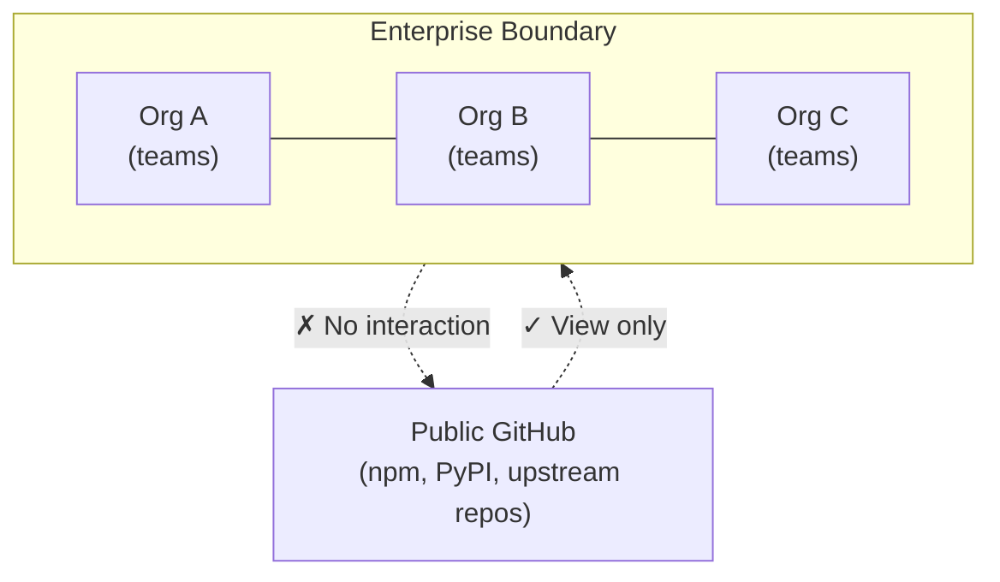
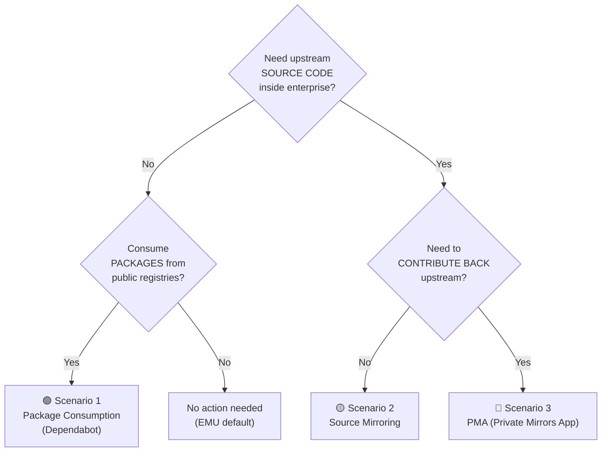
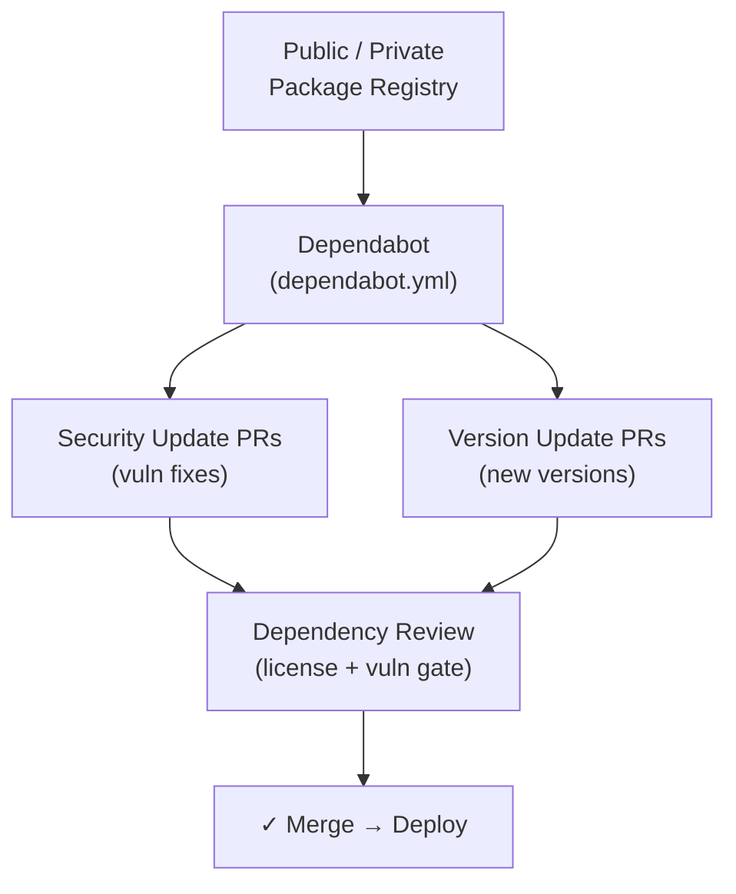
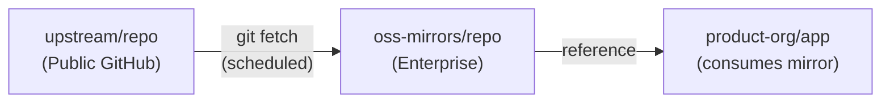
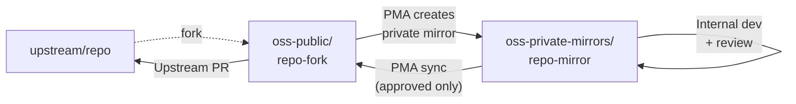

<!-- markdownlint-disable -->

# EMU + Open Source Consumption

## Approve · Mirror · Consume · Stay Updated

*Practical Patterns for Open Source Inside Enterprise Managed Users*

<!--
Welcome attendees. "Today we're covering the three key patterns for consuming open source inside an EMU environment. By the end, you'll have a clear plan for governed OSS intake that keeps developers productive while staying within your enterprise boundary."
-->

---
class: text-sm
---

# What We'll Cover Today

| Time | Topic |
|------|-------|
| 10 min | Opening & EMU Constraint Overview |
| 10 min | Enterprise Operating Model for OSS |
| 20 min | Scenario 1 — Package Consumption with Dependabot |
| 10 min | ☕ Break |
| 20 min | Scenario 2 — Source Mirroring |
| 15 min | Scenario 3 — Upstream Contributions with PMA |
| 10 min | Rollout Strategy & Wrap-Up |

<!--
"We'll alternate between slides and live demos. Each scenario covers the concepts, then I'll show you how to configure it. Ask questions anytime."
-->

---
layout: section
---

# EMU Constraint Overview

---
class: text-sm
---

# What Is EMU?

### Enterprise Managed Users

<v-clicks>

- GitHub Enterprise Cloud with **full identity control** via your IdP (Entra ID, Okta, etc.)
- User accounts are **provisioned and governed** by the enterprise — not self-registered
- All work stays **within the enterprise boundary** — by design
- The tradeoff: managed users **cannot interact** with repos outside the enterprise

</v-clicks>

<div class="gh-callout gh-callout-blue">

**Key insight**: EMU restrictions are a feature, not a bug. They ensure all code, collaboration, and intellectual property stays within enterprise governance boundaries.

</div>

<!--
"EMU gives you full identity control. Your IdP provisions accounts, you govern access, and everything stays inside the enterprise. The tradeoff is that managed users can't interact with anything outside that boundary — and that's intentional."
-->

---
class: text-sm
---

# EMU Interaction Restrictions

### What Managed Users Can and Cannot Do

| Action | Allowed? |
|--------|:--------:|
| View public repositories | ✓ |
| Star / Watch public repos | ✗ |
| Fork external repos | ✗ |
| Open issues / PRs on external repos | ✗ |
| Comment on external repos | ✗ |
| Push code to external repos | ✗ |
| Create repos inside enterprise orgs | ✓ |
| Fork repos within the enterprise | ✓ |

<div class="gh-callout gh-callout-purple">

**The challenge**: Enterprises still need to consume open source packages and source code. These restrictions mean we need intentional patterns for OSS intake.

</div>

<!--
"Here's the full picture. Your managed users can view public repos — that's useful for research and evaluation. But they can't star, fork, open issues, comment, or push to anything outside the enterprise. So the question becomes: how do we get OSS inside the enterprise boundary in a governed way?"
-->

---
class: text-sm
---

# The Enterprise Boundary

### Why This Design Exists



- **Inside boundary**: Full collaboration — PRs, issues, code review, everything
- **Outside boundary**: Read-only view — no forks, no PRs, no comments
- **Goal today**: Three patterns to bring OSS inside safely

<!--
"Think of EMU as a one-way mirror. Your developers can see public GitHub, but they can't reach through the glass. Today we'll cover three ways to bring what they need inside the boundary — governed and auditable."
-->

---
layout: section
---

# Enterprise Operating Model for OSS

---
class: text-sm
---

# Organization Layout

### Dedicated Orgs for OSS Governance

| Organization | Purpose |
|--------------|---------|
| **`oss-intake`** | Governance, approvals, policies, license allowlists |
| **`oss-mirrors`** | Internal mirrors of approved upstream repos |
| **`oss-public`** | *(Optional)* Public forks for upstream contributions via PMA |
| **`product-org-*`** | Product code — consumes from mirrors & registries |

<div class="gh-callout gh-callout-green">

**Separation of concerns**: OSS governance artifacts live in dedicated orgs, not mixed into product code. This makes auditing and policy enforcement straightforward.

</div>

<!--
"The recommended model uses dedicated organizations. oss-intake holds your governance artifacts — approval lists, policies, criteria. oss-mirrors holds the actual mirrored source code. And your product orgs consume from those governed sources. Clean separation."
-->

---
class: text-xs
---

# Approval Criteria

### Define Before You Consume

| Criterion | Threshold |
|-----------|-----------|
| **License** | Must be on approved allowlist (MIT, Apache 2.0, BSD, etc.) |
| **Maintenance** | Active commits within last 12 months |
| **Vulnerabilities** | No unpatched Critical/High CVEs |
| **Popularity** | Minimum star count or download threshold (context-dependent) |
| **Alternatives** | Evaluate internal solutions or approved alternatives first |

### Enforce with Automation

- **Dependency Review Action** — blocks PRs that add disallowed licenses or critical vulns
- **Dependabot alerts** — surfaces known vulnerabilities in existing dependencies
- **Repository rulesets** — require status checks to pass before merge

<!--
"Don't just publish criteria in a wiki — automate enforcement. The Dependency Review action can block PRs that add a dependency with a disallowed license. Dependabot alerts catch vulnerabilities in what you already have. And rulesets ensure those checks actually run."
-->

---
class: text-sm
---

# Three Patterns — Which One?

### Decision Guide



<!--
"Here's the decision tree. Most enterprises start with Scenario 1 — package consumption. If you need source code for vendoring or patching, add Scenario 2. And only if you need to contribute back upstream do you need Scenario 3 with PMA."
-->

---
layout: section
---

# Scenario 1 — Package Consumption

---
class: text-sm
---

# Package Consumption Overview

### The Most Common Pattern

<v-clicks>

- Most enterprise OSS consumption is through **packages** — npm, Maven, NuGet, PyPI, containers
- Dependabot provides three layers of protection:
  - **Alerts** — notify on known vulnerabilities
  - **Security updates** — automated PRs to fix vulnerable deps
  - **Version updates** — automated PRs for new package versions
- Works entirely within the enterprise boundary — no external interaction needed
- **Dependency Review** enforces license + vulnerability gates at PR time

</v-clicks>

<!--
"This is where most enterprises should start. If you consume npm packages, Maven artifacts, NuGet packages, or container images — Dependabot handles the lifecycle. It alerts on vulnerabilities, opens PRs to fix them, and can keep your versions current. All inside your enterprise."
-->

---
class: text-sm
---

# How It Works

### Package Consumption Flow



<div class="gh-callout gh-callout-blue">

**End-to-end automation**: From vulnerability detection to PR creation to merge gate — no manual steps required after initial configuration.

</div>

<!--
"The flow is fully automated. Dependabot monitors your manifests and lockfiles, creates PRs when vulnerabilities are found or new versions are available, and the Dependency Review action acts as the final gate before merge. Once configured, it runs on its own."
-->

---
class: text-xs
---

# Dependabot Configuration

### Basic Setup

```yaml
# .github/dependabot.yml
version: 2
updates:
  - package-ecosystem: "npm"
    directory: "/"
    schedule:
      interval: "weekly"
    open-pull-requests-limit: 10
```

### With Private Registry

```yaml
version: 2
registries:
  npm-internal:
    type: npm-registry
    url: https://npm.internal.example.com
    token: ${{secrets.INTERNAL_NPM_TOKEN}}
updates:
  - package-ecosystem: "npm"
    directory: "/"
    schedule:
      interval: "weekly"
    registries:
      - npm-internal
```

<!--
"The basic config is simple — specify the ecosystem, directory, and schedule. If you use a private registry or artifact proxy like Artifactory, add the registry configuration. Dependabot supports npm, Maven, NuGet, PyPI, Docker, and many more ecosystems."
-->

---
class: text-sm
---

# Dependency Review Gate

### Enforce Policy at PR Time

```yaml
name: Dependency Review
on: [pull_request]
permissions:
  contents: read
jobs:
  dependency-review:
    runs-on: ubuntu-latest
    steps:
      - uses: actions/checkout@v5
      - uses: actions/dependency-review-action@v4
        with:
          fail-on-severity: critical
          deny-licenses: LGPL-2.0, BSD-2-Clause
```

<div class="gh-callout gh-callout-green">

**Automated enforcement**: This action blocks PRs that introduce dependencies with critical vulnerabilities or disallowed licenses — no manual review needed for policy violations.

</div>

<!--
"This is your automated policy gate. It runs on every PR and checks: does this PR add a dependency with a critical vulnerability? Does it add a dependency with a disallowed license? If yes, the PR is blocked. No human review needed for those policy violations."
-->

---
class: text-sm
---

# Scenario 1 — Pros & Cons

### Package Consumption with Dependabot

| ✅ Pros | ✗ Cons |
|---------|--------|
| Automated PRs for vulnerable + outdated deps | Requires private registry strategy if proxying |
| EMU users stay inside enterprise boundary | Must resolve all deps in some ecosystems |
| Scales across repos with org-level enablement | Initial config effort per ecosystem |
| License + vulnerability enforcement via Dependency Review | Dependency Review requires GHAS for private repos |

### Best For

- Teams consuming **packages** (npm, Maven, NuGet, PyPI, containers)
- Organizations that want **automated, continuous** dependency management
- Environments with **private registries** already in place
- Start here — add an **artifact proxy** (Azure Artifacts, Artifactory) for download-time blocking when needed

<div class="gh-callout gh-callout-blue">

**Two governance levels**: **Option A — Merge-time governance** (this scenario): policy enforced at PR, no extra infrastructure. **Option B — Download-time governance**: add an artifact proxy (Azure Artifacts, Artifactory, Nexus, etc.) to block packages before download and enable offline caching. Start with Option A — add Option B when stricter control is needed.

</div>

<!--
"Bottom line: if your primary OSS consumption is packages, this is where you start. It's the lowest complexity, highest automation pattern. Most enterprises can go live in a week. If you later need to block packages before they're even downloaded — for regulated environments or air-gapped builds — add an artifact proxy like Azure Artifacts on top of this."
-->

---
layout: demo
---

# 🖥️ Demo: Dependabot Configuration

1. Organization → Settings → Code security and analysis
2. Enable Dependabot alerts + security updates
3. Walk through a `dependabot.yml` configuration
4. Review an open Dependabot PR (changelog, compatibility, diff)
5. Show Dependency Review action results on a flagged PR

<!--
DEMO: Navigate to the organization settings and show Dependabot enablement. Then open a test repo with dependabot.yml. Show an open Dependabot PR — point out the changelog, compatibility score, and the actual diff. If available, show a Dependency Review check that flagged a license violation.
-->

---
layout: section
---

# Scenario 2 — Source Mirroring

---
class: text-sm
---

# When You Need Source Code

### Why Mirror?

<v-clicks>

- Some use cases require the **source repo itself** — not just packages
  - **Vendoring** — bundling upstream code into your own repo
  - **Patching** — applying internal fixes to upstream libraries
  - **Building from source** — compiling upstream projects with custom flags
  - **Offline/air-gapped builds** — no external network access at build time
  - **Security scanning** — running GHAS on upstream source before adoption
- EMU prevents forking external repos → **mirror instead**

</v-clicks>

<!--
"Sometimes packages aren't enough. You need the actual source code inside your enterprise. Maybe you're vendoring a library, patching an upstream bug, building from source with custom compiler flags, or you're in an air-gapped environment. Since EMU blocks forking, we mirror instead."
-->

---
class: text-sm
---

# Mirror Architecture

### Fetch → Push → Consume



<div class="gh-callout gh-callout-purple">

**Pattern**: Bare clone from upstream → push mirror to enterprise → schedule periodic sync → consumers reference the internal mirror.

</div>

<!--
"The architecture is straightforward. A scheduled job fetches from upstream and pushes to your enterprise mirror. Your product repos reference the mirror as the source of truth. The mirror is inside the enterprise boundary, so EMU users can interact with it freely."
-->

---
class: text-sm
---

# Setting Up a Mirror

### Step-by-Step

```bash
# 1. Create a mirrored clone of the upstream repository
git clone --mirror https://github.com/UPSTREAM/REPO.git
cd REPO.git

# 2. Set the push URL to your enterprise mirror
git remote set-url --push origin \
  https://github.com/ENTERPRISE-ORG/REPO-MIRROR.git

# 3. Push the initial mirror
git push --mirror
```

### Automate the Sync

```bash
# Run on a schedule (cron, GitHub Actions, CI system)
cd REPO.git
git fetch -p origin
git push --mirror
```

<!--
"Three commands to create the initial mirror. Then two commands on a schedule to keep it updated. The key is the --mirror flag — it copies all branches, tags, and refs. No cherry-picking, no drift."
-->

---
class: text-xs
---

# Automated Sync Workflow

### GitHub Actions Example

```yaml
name: Mirror Sync
on:
  schedule:
    - cron: '0 2 * * 1'  # Weekly on Monday at 2 AM
  workflow_dispatch:

jobs:
  sync:
    runs-on: ubuntu-latest
    steps:
      - name: Sync mirror
        run: |
          git clone --mirror https://github.com/UPSTREAM/REPO.git
          cd REPO.git
          git remote set-url --push origin \
            https://github.com/${{ vars.ENTERPRISE_ORG }}/REPO-MIRROR.git
          git push --mirror
        env:
          GIT_TERMINAL_PROMPT: 0
```

<div class="gh-callout gh-callout-blue">

**Tip**: Use a **GitHub App** for authentication — it generates short-lived tokens and isn't tied to a user account. Use `workflow_dispatch` to trigger on-demand syncs when upstream releases a critical fix.

</div>

<!--
"Here's a working GitHub Actions workflow. Schedule it weekly, daily, or whatever cadence makes sense. The workflow_dispatch trigger lets you sync on-demand — useful when upstream releases a critical security fix and you can't wait for the next scheduled run."
-->

---
class: text-sm
---

# Scenario 2 — Pros & Cons

### Source Mirroring

| ✅ Pros | ✗ Cons |
|---------|--------|
| Full source code inside enterprise boundary | You own the sync automation and monitoring |
| Works cleanly with EMU fork restrictions | Mirrors can drift if sync jobs fail silently |
| Enables vendoring, patching, offline builds | Each mirrored repo needs setup + maintenance |
| Can apply GHAS scanning to mirrored source | Does not support contributing back upstream |

### Best For

- Teams that need **source code** for vendoring, patching, or building
- **Air-gapped or offline** build environments
- Organizations that want to **scan upstream code with GHAS** before adoption

<!--
"Mirroring is the right choice when you need the actual source code. The tradeoff is that you own the automation — if your sync job fails silently, your mirror drifts. Monitor it like you'd monitor any critical infrastructure."
-->

---
layout: demo
---

# 🖥️ Demo: Repository Mirroring

1. Show the `oss-mirrors` organization structure
2. Walk through `git clone --mirror` + `git push --mirror`
3. Show a GitHub Actions workflow automating the sync
4. Navigate to a mirrored repo — show Dependabot alerts

<!--
DEMO: Show the oss-mirrors org. Walk through the git commands (can run live or show pre-prepared). Open the GitHub Actions workflow file and explain the schedule/dispatch triggers. Navigate to a mirrored repo and show that Dependabot is scanning its dependencies.
-->

---
layout: section
---

# Scenario 3 — Upstream Contributions (PMA)

---
class: text-sm
---

# Contributing Back to Open Source

### The Challenge Under EMU

<v-clicks>

- Some enterprises want to contribute bug fixes, features, or docs to upstream projects
- EMU users **cannot** fork external repos, open PRs, or comment on public repos
- Standard fork-and-PR workflows are blocked by design
- **Solution**: GitHub Private Mirrors App (PMA) — an "airlock" pattern

</v-clicks>

<div class="gh-callout gh-callout-purple">

**PMA** is an open-source GitHub App that manages private mirrors of public repos, supports internal review, and syncs approved changes to a public fork for upstream PRs.

</div>

<!--
"What if your enterprise wants to give back to the open source projects you depend on? Under EMU, the standard fork-and-PR workflow doesn't work. That's where the Private Mirrors App comes in — it's an airlock between your private internal work and the public contribution."
-->

---
class: text-sm
---

# PMA Architecture

### Private First, Publish Approved Only



| Step | Action | Where |
|------|--------|-------|
| 1 | Fork upstream into org | `oss-public` org |
| 2 | PMA creates private mirror | `oss-private-mirrors` org |
| 3 | Internal development + review | Private mirror (internal PRs) |
| 4 | Approved changes synced to fork | PMA → public fork branch |
| 5 | Open PR to upstream | `oss-public/fork` → `upstream/repo` |

<!--
"The flow: fork upstream into your public org. PMA creates a private mirror of that fork. Your developers work in the private mirror — internal PRs, code review, security and legal gates. Only after approval does PMA sync the changes to the public fork for an upstream PR. Nothing goes public without sign-off."
-->

---
class: text-sm
---

# Internal Review Gates

### What Happens Before Code Goes Public

| Gate | Tool / Process |
|------|----------------|
| **Code review** | Standard PR review in private mirror |
| **Security scan** | GHAS code scanning + secret scanning |
| **License compliance** | Dependency Review action |
| **Legal / IP review** | Custom approval workflow (if required) |

<div class="gh-callout gh-callout-green">

**The airlock guarantee**: No code reaches the public fork without passing through your internal review gates. All contribution history stays auditable within the enterprise.

</div>

<!--
"This is the 'airlock' part. Before any code becomes public, it passes through your standard review process — code review, security scanning, license compliance, and whatever legal or IP review your organization requires. Everything is auditable."
-->

---
class: text-sm
---

# Scenario 3 — Pros & Cons

### Private Mirrors App (PMA)

| ✅ Pros | ✗ Cons |
|---------|--------|
| "Private first, publish approved only" workflow | Requires deploying + maintaining PMA (self-hosted) |
| Compliant upstream contributions under EMU | Additional org boundary + access management |
| Internal review gates before any public contribution | PMA is currently in public beta |
| Full audit trail within the enterprise | Requires dedicated admin for PMA lifecycle |

### Best For

- Enterprises that **actively contribute** to upstream open source projects
- Organizations with **legal/IP review** requirements before public contributions
- Teams that need a **governed contribution path** without bypassing EMU

<!--
"PMA is the highest-complexity pattern, but it's the only one that supports upstream contributions under EMU. If your enterprise policy allows or encourages open source contribution, this is how you do it compliantly."
-->

---
layout: demo
---

# 🖥️ Demo: Private Mirrors App

1. Show the PMA repo: `github-community-projects/private-mirrors`
2. Walk through PMA documentation + installation
3. Demonstrate the mirror creation flow (or docs screenshots)
4. Explain sync: private mirror → public fork → upstream PR

<!--
DEMO: Open the PMA repository on GitHub. Walk through the README and installation requirements. If you have PMA deployed, demonstrate creating a mirror. Otherwise, use the documentation and screenshots to walk through the workflow. Emphasize the "nothing goes public without approval" guarantee.
-->

---
layout: section
---

# Rollout Strategy & Wrap-Up

---
class: text-sm
---

# Recommended Rollout Phases

| Phase | Timeline | Pattern | Actions |
|-------|----------|---------|---------|
| **1** | Week 1–2 | Packages | Enable Dependabot alerts + security updates. Deploy Dependency Review |
| **2** | Week 3–4 | Packages (adv.) | Configure `dependabot.yml` for version updates. Private registry setup |
| **3** | Month 2 | Source Mirroring | Create `oss-mirrors` org. Mirror top 5–10 critical upstream repos |
| **4** | Month 3+ | PMA (if needed) | Evaluate PMA. Pilot with one upstream project |

<div class="gh-callout gh-callout-blue">

**Start simple**: Most enterprises only need Scenario 1. Layer on complexity only when there's a clear business requirement.

</div>

<!--
"Don't try to do everything at once. Start with Dependabot — it's the lowest effort, highest value. Add source mirroring only for repos where you genuinely need the source code. And PMA only if upstream contribution is a business requirement. Most enterprises never need Scenario 3."
-->

---
class: text-sm
---

# Communicating to Stakeholders

### Framing the "Why"

<v-clicks>

- EMU restrictions are a **feature, not a bug** — they prevent data leakage
- The standard pattern is **governed intake + internal mirroring**, not enabling public interactions
- This gives security and compliance teams **full auditability** over all OSS
- Developers still get what they need — through a **consistent, approved channel**

</v-clicks>

<div class="gh-callout gh-callout-green">

**The message**: "We're not restricting open source — we're governing it. Developers get the same packages and source code, through a process that's auditable, secure, and compliant."

</div>

<!--
"When you're explaining this to leadership or developers, lead with the positive: we're not blocking open source, we're governing it. Developers get the same packages and code they need, but through a channel that's auditable and compliant. That's a better story than 'EMU blocks things.'"
-->

---
class: text-sm
---

# Action Items

### What to Do After This Workshop

- [ ] Define OSS approval criteria (license allowlist, vuln thresholds, maintenance)
- [ ] Create the `oss-intake` organization for governance artifacts
- [ ] Enable Dependabot alerts + security updates across all orgs
- [ ] Deploy Dependency Review action on repos with external dependencies
- [ ] Identify top upstream repos that need source mirroring
- [ ] Create `oss-mirrors` org and set up initial mirrors with automated sync
- [ ] Evaluate whether upstream contribution (PMA) is a business requirement
- [ ] Document and communicate the OSS intake process to engineering teams

<!--
"Here's your to-do list. You can do items 1–4 this week. Items 5–6 in the next few weeks. And items 7–8 on a longer timeline. The key is to start with Dependabot — it delivers value immediately."
-->

---
layout: end
---

# Thank You

### Questions & Discussion

**Key Resources**

| Resource | URL |
|----------|-----|
| EMU Abilities & Restrictions | <https://docs.github.com/en/enterprise-cloud@latest/admin/managing-iam/understanding-iam-for-enterprises/abilities-and-restrictions-of-managed-user-accounts> |
| Private Mirrors App (PMA) | <https://github.com/github-community-projects/private-mirrors> |
| Dependabot Docs | <https://docs.github.com/en/code-security/dependabot> |
| Dependency Review Action | <https://docs.github.com/en/code-security/how-tos/secure-your-supply-chain/manage-your-dependency-security/configuring-the-dependency-review-action> |

<!--
"Thank you for your time. I'm happy to stay for questions or deep-dive into any of the three scenarios. The key URLs are on screen — these are your starting points for implementation."
-->

---
class: text-xs
---

# Appendix: Pattern Comparison Matrix

| Capability | Scenario 1: Packages | Scenario 2: Mirror | Scenario 3: PMA |
|------------|:--------------------:|:------------------:|:---------------:|
| Consumes packages | ✓ | | |
| Source code inside enterprise | | ✓ | ✓ |
| Automated vulnerability alerts | ✓ | ✓ | ✓ |
| Automated update PRs | ✓ | | |
| Upstream sync automation | | ✓ | ✓ |
| Upstream contribution | | | ✓ |
| Private internal review | | ✓ | ✓ |
| Setup complexity | 🟢 Low | 🟡 Medium | 🔴 High |
| Ongoing maintenance | 🟢 Low | 🟡 Medium | 🔴 High |

---
class: text-xs
---

# Appendix: Key URLs

| Resource | URL |
|----------|-----|
| EMU Abilities & Restrictions | <https://docs.github.com/en/enterprise-cloud@latest/admin/managing-iam/understanding-iam-for-enterprises/abilities-and-restrictions-of-managed-user-accounts> |
| Duplicating / Mirroring Repos | <https://docs.github.com/en/enterprise-cloud@latest/repositories/creating-and-managing-repositories/duplicating-a-repository> |
| Private Mirrors App (PMA) | <https://github.com/github-community-projects/private-mirrors> |
| PMA Announcement | <https://github.blog/changelog/2024-07-25-github-private-mirrors-app-public-beta/> |
| Dependabot Version Updates | <https://docs.github.com/en/enterprise-cloud@latest/code-security/concepts/supply-chain-security/about-dependabot-version-updates> |
| Dependabot Options Reference | <https://docs.github.com/enterprise-cloud@latest/code-security/dependabot/working-with-dependabot/dependabot-options-reference> |
| Dependency Review Action | <https://docs.github.com/en/code-security/how-tos/secure-your-supply-chain/manage-your-dependency-security/configuring-the-dependency-review-action> |

*Slide deck for GitHub Enterprise EMU + Open Source Consumption Workshop*
