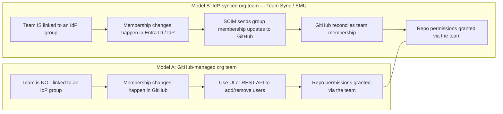
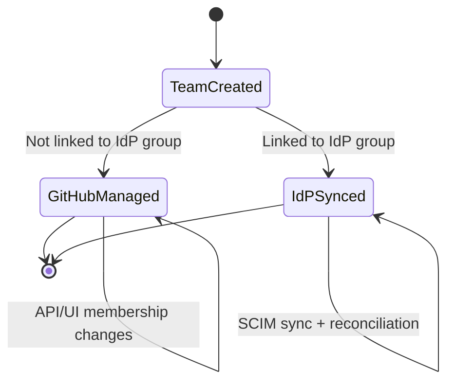
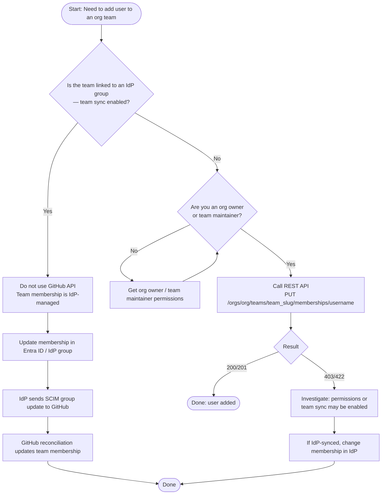
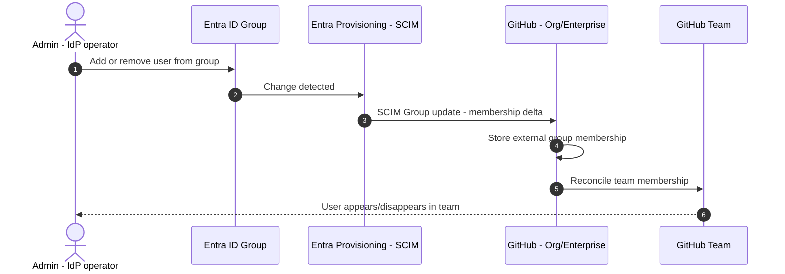
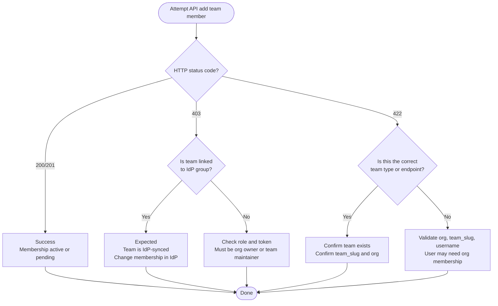
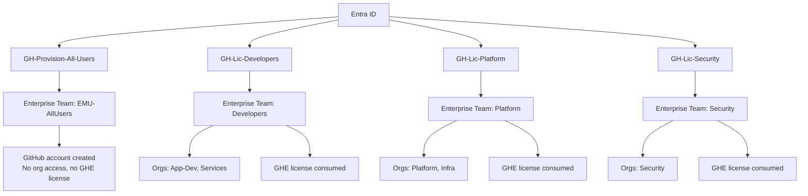
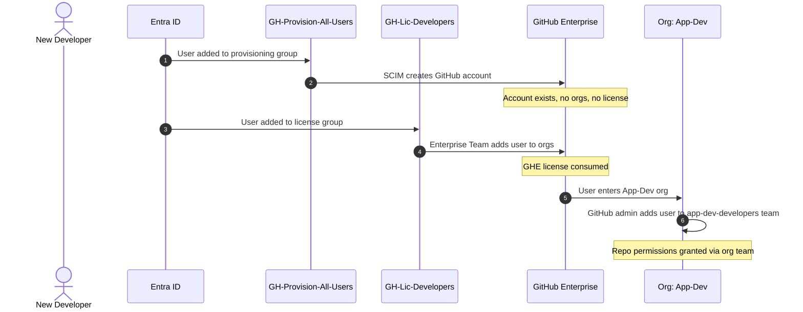

# Team Membership Management in GitHub Workshop Guide

**Duration**: 90 minutes
**Format**: Presentation + Discussion + Hands-On Labs
**Audience**: Enterprise admins, IAM/Entra admins, GitHub org owners, platform engineering

---

## Workshop Overview

This workshop clarifies when you can manage GitHub **organization team** membership via the **GitHub REST API**, when you **cannot** (because the team is **IdP-synced**), and how to design a scalable, least-privilege model that customers can operate confidently. Attendees leave with a clear decision tree, hands-on API experience, and practical design guidance for minimizing IdP groups without breaking governance.

### Learning Objectives

- Distinguish the two team membership models: GitHub-managed vs IdP-synced (Team Sync / EMU)
- Use the REST API to add and remove members on GitHub-managed teams
- Understand why API membership calls fail on IdP-synced teams and how to diagnose errors
- Trace the SCIM provisioning lifecycle from Entra ID group change to GitHub team update
- Design a minimal Entra group model that satisfies governance without group sprawl

---

## Session Agenda

| Section | Topic | Time |
|---------|-------|------|
| 1 | [Key Concepts & Operating Models](#1-key-concepts--operating-models-10-min) | 10 min |
| 2 | [Decision Tree Walkthrough](#2-decision-tree-walkthrough-10-min) | 10 min |
| 3 | [Hands-On: API-Managed Team Membership](#3-hands-on-api-managed-team-membership-20-min) | 20 min |
| 4 | [Hands-On: IdP-Synced Team Membership](#4-hands-on-idp-synced-team-membership-20-min) | 20 min |
| 5 | [Troubleshooting Common Failures](#5-troubleshooting-common-failures-15-min) | 15 min |
| 6 | [Design Guidance: Minimizing Groups](#6-design-guidance-minimizing-groups-15-min) | 15 min |

**Total: 90 minutes**

---

## 1. Key Concepts & Operating Models (10 min)

### GitHub organizations and teams

- A **GitHub organization** contains repositories, members, and teams.
- A **team** is a group of users inside an org; you grant the team repo permissions and the members inherit them.

### Two ways to manage team membership

There are **two supported operating models**:

1. **GitHub-managed team** — Membership is managed in GitHub (UI or API).
2. **IdP-synced team (Team Sync / EMU pattern)** — Membership is managed in the **identity provider (IdP)** (e.g., Entra ID group). GitHub receives membership via SCIM and keeps the GitHub team in sync. If team synchronization is set up, API attempts to change team membership will error.

### Operating models side by side



> **Note**: GitHub's EMU guidance explains that team membership can be managed via IdP groups, stored at the enterprise level and reconciled to teams.

### Membership ownership state diagram



### Discussion Points

- Which operating model does your organization currently use?
- Do you have teams that mix both models today — and what problems has that caused?
- How many IdP groups do you currently maintain for GitHub team membership?

---

## 2. Decision Tree Walkthrough (10 min)

Use this decision tree at the start of every customer conversation to determine whether the **GitHub API** is the right tool.



> **Important**: GitHub documents that if team synchronization is configured for a team, you will see an error if you attempt to change membership via the API.

### Discussion Points

- Walk through a recent team membership request — which branch of the tree does it follow?
- Has anyone hit a 403/422 error and not understood why?
- How do you currently determine whether a team is IdP-synced?

---

## 3. Hands-On: API-Managed Team Membership (20 min)

### Key Points

**The endpoint** — to add or update a user's membership in an **organization team**, use:

```text
PUT /orgs/{org}/teams/{team_slug}/memberships/{username}
```

**Who can call it** — an authenticated **organization owner** or **team maintainer** can add org members to the team.

**The IdP-sync caveat** — if the team is synchronized to an IdP group, this call will fail. You must change membership in the IdP instead.

### 🖥️ Demo: Adding a User via REST API

```bash
curl -L \
  -X PUT \
  -H "Accept: application/vnd.github+json" \
  -H "Authorization: Bearer <YOUR_TOKEN>" \
  -H "X-GitHub-Api-Version: 2026-03-10" \
  https://api.github.com/orgs/<org>/teams/<team_slug>/memberships/<username> \
  -d '{"role":"member"}'
```

Valid role values: `member` and `maintainer`.

### Lab 1: Add a user to a team via API

**Objective:** Prove that API membership updates work when a team is **not IdP-synced**.

**Steps:**

1. Create or select a team **not linked** to an IdP group.
2. Ensure your token is from an **org owner** or **team maintainer**.
3. Call the API endpoint:

```text
PUT /orgs/{org}/teams/{team_slug}/memberships/{username}
```

4. Verify membership via UI or GET membership endpoint.

### Success Criteria

- ✅ HTTP 200/201 returned
- ✅ Membership becomes **active** (or **pending** if user invitation is involved)
- ✅ User appears in team membership list in the GitHub UI

### Discussion Points

- What token scopes are required for this call?
- How would you automate this for onboarding workflows?
- What happens if the user is not yet an org member?

---

## 4. Hands-On: IdP-Synced Team Membership (20 min)

### Key Points

When you link a GitHub team to an IdP group, membership is driven by IdP group changes, which GitHub reconciles to team membership.

### SCIM provisioning lifecycle



> **Note**: GitHub's EMU docs describe storing IdP group membership and reconciling it to team membership, including periodic reconciliation.

### Lab 2: Change membership in Entra ID and observe sync

**Objective:** Demonstrate that once a team is linked to an IdP group, membership is **IdP-managed** and **API edits are blocked**.

**Steps:**

1. Link a GitHub team to an IdP group (Entra ID security group).
2. Attempt the same API call used in Lab 1.
3. Observe the failure (403/422 depending on scenario).
4. Add/remove a user in the Entra ID group instead.
5. Wait for provisioning cycle and/or reconciliation to update GitHub team membership.

### Success Criteria

- ✅ API call fails while team sync is enabled (as documented)
- ✅ GitHub team membership updates after IdP change and SCIM sync/reconciliation
- ✅ User appears/disappears in the GitHub team matching IdP group state

### Discussion Points

- How long does the SCIM sync typically take in your environment?
- What monitoring do you have for sync failures?
- How do you handle "break glass" scenarios where IdP is down but you need to grant access?

---

## 5. Troubleshooting Common Failures (15 min)

### API failure decision tree



### Common failure scenarios

| Symptom | Likely Cause | Resolution |
|---------|-------------|------------|
| 403 on PUT membership | Team is IdP-synced | Change membership in IdP group, not API |
| 403 on PUT membership | Insufficient permissions | Use org owner or team maintainer token |
| 422 on PUT membership | User not in org | Invite user to org first, then add to team |
| 422 on PUT membership | Invalid team_slug | Verify team exists and slug is correct |
| User not appearing after IdP change | SCIM sync delay | Wait for provisioning cycle; check Entra provisioning logs |

### Discussion Points

- What is your team's current process when an API call fails unexpectedly?
- Do you have alerting set up for SCIM provisioning failures?
- How do you audit team membership changes across both models?

---

## 6. Design Guidance: Minimizing Groups (15 min)

### Key Points

Customers often say: "We want fewer AD/Entra groups."

**Recommended approach:**

- Use **one provisioning group** (who gets an account) and a **small number of access groups** (meaningful permission differences)
- Avoid trying to replace IdP groups with GitHub API membership changes for IdP-synced teams — that approach will fail

### Pragmatic minimal group model

| Entra ID Group | Purpose | GitHub Team Mapping |
|---------------|---------|-------------------|
| `GH-EMU-All-Users` | Provision identities (SCIM) | All org members |
| `GH-Team-ReadOnly` | Read-only repo access | Read-permission teams |
| `GH-Team-Developers` | Write repo access | Write-permission teams |
| `GH-Team-Maintainers` | Maintain/admin repo access | Maintain-permission teams |

Map these to GitHub teams and grant repo permissions based on least privilege.

> **Note**: For a complete, production-tested implementation of this model — including Enterprise Team layering, org-level teams, and the end-to-end user flow — see the [Reference Architecture](#reference-architecture-emu-layered-team-model) in the Appendix.

### Discussion Points

- How many Entra groups do you currently maintain for GitHub? Could you consolidate?
- Where do you draw the line between "too few groups" (over-permissioned) and "too many" (operational burden)?
- How do you handle cross-team collaboration that doesn't fit your group model?

---

## Appendix

### Reference Architecture: EMU Layered Team Model

This reference architecture reflects a production EMU deployment. It separates **provisioning** (account creation) from **entitlement** (license + org access) and keeps repo permissions at the org team level.

#### Entra-to-GitHub mapping



**Key property**: Provisioning is separated from entitlement. Licenses are granted only by Enterprise Teams that add users to orgs. Users in multiple license teams still consume one GHE license.

#### What lives at each layer

| Layer | Responsibility | Examples |
|-------|---------------|----------|
| **Enterprise Teams** (Entra-synced) | License assignment, org entry, high-level role separation | `GH-Lic-Developers`, `GH-Lic-Platform`, `GH-Lic-Security` |
| **Organization Teams** (GitHub-managed) | Repo permissions only — no license impact, no IdP sync required | `app-dev-admins`, `app-dev-maintainers`, `app-dev-developers`, `app-dev-readers` |

> **Important**: Enterprise Teams should **not** control repo-level permissions. Organization Teams should **not** grant licenses. Keep the layers separate.

#### Recommended org team pattern

Inside each org, maintain a minimal, predictable set:

| Org Team | Permission Level |
|----------|----------------|
| `<org>-admins` | Admin |
| `<org>-maintainers` | Maintain |
| `<org>-developers` | Write |
| `<org>-readers` | Read |

These teams control repo permissions only, have no license impact, no IdP sync required, and are safe to refactor without billing risk.

#### End-to-end user flow



#### Why this layout works long-term

- **Clear ownership** — Identity team owns Entra groups; GitHub admins do not hand-edit user provisioning
- **Simple audits** — "Why does this person have a license?" → they are in `GH-Lic-X`. "Why do they have access to this repo?" → org team membership
- **Safe org creation** — New orgs only get users through selected Enterprise Teams; the provisioning group never auto-licenses anyone

### Key URLs

| Resource | URL |
|----------|-----|
| REST API: Team Members | <https://docs.github.com/en/rest/teams/members> |
| Managing team sync with IdP groups | <https://docs.github.com/en/organizations/organizing-members-into-teams/synchronizing-a-team-with-an-identity-provider-group> |
| EMU: Managing team memberships with IdP groups | <https://docs.github.com/en/enterprise-cloud@latest/admin/managing-iam/provisioning-user-accounts-with-scim/managing-team-memberships-with-identity-provider-groups> |

*Workshop guide for GitHub Enterprise Team Membership Management*
